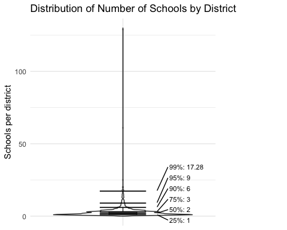

## Download data

``` r
schoolframe <- read.csv("https://raw.githubusercontent.com/ellenthickman/625sampling/refs/heads/main/MI_school_frame_head_counts.csv")
kable(schoolframe)
```


| BCODE|BNAME                                                | DCODE|District_Name                                     | Region| County_ID|County_Name    |Public.nonpublic | g7_totl| g8_totl| g9_totl| g10_totl| g11_totl| g12_totl|tot_all  |
|-----:|:----------------------------------------------------|-----:|:-------------------------------------------------|------:|---------:|:--------------|:----------------|-------:|-------:|-------:|--------:|--------:|--------:|:--------|
|   198|Baraga Area High School                              |  7020|Baraga Area Schools                               |      1|         7|Baraga         |Public           |      35|      46|      48|       38|       51|       47|265.00   |
|   497|Calumet High School                                  | 31030|Public Schools of Calumet                         |      1|        31|Houghton       |Public           |       0|       0|     110|       93|      131|       96|430.00   |
|   652|Chassell K-12 School                                 | 31050|Chassell Township School District                 |      1|        31|Houghton       |Public           |      15|      23|      18|       28|       21|       25|130.00   |
|   927|Dollar Bay High School                               | 31100|Dollar Bay-Tamarack City Area Schools             |      1|        31|Houghton       |Public           |      18|      21|      22|       29|       27|       19|136.00   |
|  1175|Ewen-Trout Creek Consolidated School                 | 66045|Ewen-Trout Creek Consolidated School District     |      1|        66|Ontonagon      |Public           |      30|      27|      24|       19|       23|       31|154.00   |
|  1555|Hancock Central High School                          | 31010|Hancock Public Schools                            |      1|        31|Houghton       |Public           |       0|       0|      55|       62|       61|       71|249.00   |
|  1766|Houghton Central High School                         | 31110|Houghton-Portage Township Schools                 |      1|        31|Houghton       |Public           |       0|       0|      92|      104|      112|      109|417.00   |
|  1893|Jeffers High School                                  | 31020|Adams Township School District                    |      1|        31|Houghton       |Public           |      34|      28|      49|       32|       32|       41|216.00   |
|  2083|Lake Linden-Hubbell High School                      | 31130|Lake Linden-Hubbell School District               |      1|        31|Houghton       |Public           |      37|      48|      34|       46|       43|       37|245.00   |
|  3334|SACRED HEART SCHOOL                                  | 26040|                                                  |      1|         7|Baraga         |nonpublic        |       7|       0|       0|        0|        0|        0|7.00     |
|  3822|Copper Country Learning Center                       | 31000|Copper Country ISD                                |      1|        31|Houghton       |Public           |       3|       6|      12|        3|        6|        7|37.00    |
|  4149|L'Anse High School                                   |  7040|L'Anse Area Schools                               |      1|         7|Baraga         |Public           |       0|       0|      69|       72|       69|       65|275.00   |
|  4357|Washington Middle School                             | 31030|Public Schools of Calumet                         |      1|        31|Houghton       |Public           |     126|      99|       0|        0|        0|        0|225.00   |
|  6170|Ontonagon Area Jr/Sr High School                     | 66050|Ontonagon Area Schools                            |      1|        66|Ontonagon      |Public           |      46|      48|      46|       37|       52|       41|270.00   |
|  6401|E.B. Holman Elementary School                        | 31140|Stanton Township Public Schools                   |      1|        31|Houghton       |Public           |      12|      12|       0|        0|        0|        0|24.00    |
|  8558|Houghton Middle School                               | 31110|Houghton-Portage Township Schools                 |      1|        31|Houghton       |Public           |      90|     100|       0|        0|        0|        0|190.00   |
|  8744|Hancock Middle School                                | 31010|Hancock Public Schools                            |      1|        31|Houghton       |Public           |      65|      60|       0|        0|        0|        0|125.00   |
|  8841|L'Anse Middle School                                 |  7040|L'Anse Area Schools                               |      1|         7|Baraga         |Public           |      64|      57|       0|        0|        0|        0|121.00   |
|  8902|Gogebic-Ontonagon ISD Special Education              | 27000|Gogebic-Ontonagon ISD                             |      1|        66|Ontonagon      |Public           |       1|       0|       0|        0|        0|        0|1.00     |
|  9566|CHS-Horizons School                                  | 31030|Public Schools of Calumet                         |      1|        31|Houghton       |Public           |       0|       0|       2|       10|       12|       20|44.00    |
|     3|A.D. Johnston Jr/Sr High School                      | 27010|Bessemer Area School District                     |      2|        27|Gogebic        |Public           |       6|       9|      44|       53|       41|       35|188.00   |
|   527|Carney-Nadeau School                                 | 55010|                                                  |      2|        55|Menominee      |Public           |      28|      16|      15|       20|       14|       23|116.00   |
|  1762|CONCORDIA LUTHERAN SOUTH                             | 82140|                                                  |      2|        22|Dickinson      |nonpublic        |       4|       5|       0|        0|        0|        0|9.00     |
|  1770|FELLOWSHIP BAPTIST ACADEMY                           | 59020|                                                  |      2|        22|Dickinson      |nonpublic        |       7|       9|       3|        5|        8|       13|45.00    |
|  1852|West Iron County High School                         | 36025|West Iron County Public Schools                   |      2|        36|Iron           |Public           |       0|       0|      81|       66|       78|       83|308.00   |
|  1978|Central Middle School                                | 22010|Iron Mountain Public Schools                      |      2|        22|Dickinson      |Public           |      79|     104|       0|        0|        0|        0|183.00   |
|  2039|Kingsford High School                                | 22030|Breitung Township Schools                         |      2|        22|Dickinson      |Public           |       0|       0|     147|      170|      176|      182|675.00   |
|  2040|Kingsford Middle School                              | 22030|Breitung Township Schools                         |      2|        22|Dickinson      |Public           |     111|     147|       0|        0|        0|        0|258.00   |
|  2282|Luther L. Wright High School                         | 27020|Ironwood Area Schools                             |      2|        27|Gogebic        |Public           |      67|      86|      68|       68|       96|       96|481.00   |
|  2514|Menominee Jr High School                             | 55100|Menominee Area Public Schools                     |      2|        55|Menominee      |Public           |     129|     132|       0|        0|        0|        0|261.00   |
|  2784|Norway High School                                   | 22025|Norway-Vulcan Area Schools                        |      2|        22|Dickinson      |Public           |       0|       0|      63|       87|       61|       71|282.00   |
|  3114|North Central Area Junior/Senior High School         | 55115|North Central Area Schools                        |      2|        55|Menominee      |Public           |      35|      27|      38|       35|       38|       35|208.00   |
|  3441|Iron Mountain High School                            | 22010|Iron Mountain Public Schools                      |      2|        22|Dickinson      |Public           |       0|       0|     113|      111|       94|      106|424.00   |
|  4065|Stephenson High School                               | 55120|Stephenson Area Public Schools                    |      2|        55|Menominee      |Public           |       0|       0|      58|       61|       54|       52|225.00   |
|  4329|Wakefield-Marenisco School                           | 27070|Wakefield-Marenisco School District               |      2|        27|Gogebic        |Public           |      20|      24|      15|       21|       14|       21|115.00   |
|  4360|Washington School                                    | 27010|Bessemer Area School District                     |      2|        27|Gogebic        |Public           |      53|       0|       0|        0|        0|        0|53.00    |
|  4397|Watersmeet Township School                           | 27080|Watersmeet Township School District               |      2|        27|Gogebic        |Public           |      17|      13|      20|       13|       18|       23|104.00   |
|  4636|AGAPE CHRISTIAN ACADEMY                              | 82160|                                                  |      2|        55|Menominee      |nonpublic        |      16|       8|       9|        8|       12|       10|63.00    |
|  5490|West Iron County Middle School                       | 36025|West Iron County Public Schools                   |      2|        36|Iron           |Public           |      85|      69|       0|        0|        0|        0|154.00   |
|  5695|Menominee High School                                | 55100|Menominee Area Public Schools                     |      2|        55|Menominee      |Public           |       0|       0|     141|      159|      134|      139|573.00   |
|  6194|North Dickinson School                               | 22045|North Dickinson County Schools                    |      2|        22|Dickinson      |Public           |      30|      21|      27|       44|       37|       33|192.00   |
|  8221|Nah Tah Wahsh Public School Academy                  | 55901|Nah Tah Wahsh Public School Academy               |      2|        55|Menominee      |Public           |       7|      12|      17|        6|       10|        7|59.00    |
|  8831|IM-K Community Education                             | 22010|Iron Mountain Public Schools                      |      2|        22|Dickinson      |Public           |       0|       0|       1|        9|       21|       66|97.00    |
|  8877|Dickinson-Iron Special Education                     | 22000|Dickinson-Iron ISD                                |      2|        22|Dickinson      |Public           |       3|       5|       8|        4|        4|        5|29.00    |
|  8944|Menominee ISD Special Education                      | 55000|Menominee ISD                                     |      2|        55|Menominee      |Public           |       1|       2|       0|        0|        1|        0|4.00     |
|  9008|Gogebic Co. Community Education                      | 27020|Ironwood Area Schools                             |      2|        27|Gogebic        |Public           |       0|       0|      18|       19|       10|        6|53.00    |
|  9599|Phoenix Alternative High School                      | 55115|North Central Area Schools                        |      2|        55|Menominee      |Public           |       0|       0|      11|        1|        2|       54|68.00    |
|  9667|Vulcan Middle School                                 | 22025|Norway-Vulcan Area Schools                        |      2|        22|Dickinson      |Public           |      57|      60|       0|        0|        0|        0|117.00   |
|  9819|Stephenson Middle School                             | 55120|Stephenson Area Public Schools                    |      2|        55|Menominee      |Public           |      52|      65|       0|        0|        0|        0|117.00   |
|  9851|The Better Alternative                               | 55120|Stephenson Area Public Schools                    |      2|        55|Menominee      |Public           |       0|       0|       1|        4|        3|        5|13.00    |
|   204|Bark River-Harris Jr/Sr High School                  | 21090|Bark River-Harris School District                 |      3|        21|Delta          |Public           |      54|      52|      56|       40|       44|       48|294.00   |
|   481|C.L. Phelps School                                   | 52180|Ishpeming Public School District                  |      3|        52|Marquette      |Public           |      89|      58|       0|        0|        0|        0|147.00   |
|   559|CATHOLIC CENTRAL HIGH SCHOOL                         | 41010|                                                  |      3|        52|Marquette      |nonpublic        |       0|       0|     175|      217|      196|      187|775.00   |
|   621|Negaunee Middle School                               | 52090|Negaunee Public Schools                           |      3|        52|Marquette      |Public           |     117|     100|       0|        0|        0|        0|217.00   |
|  1155|Escanaba Area Public High School                     | 21010|Escanaba Area Public Schools                      |      3|        21|Delta          |Public           |       0|       0|     217|      231|      245|      235|928.00   |
|  1156|Escanaba Middle School                               | 21010|Escanaba Area Public Schools                      |      3|        21|Delta          |Public           |     190|     182|       0|        0|        0|        0|372.00   |
|  1407|Gladstone Area Middle School                         | 21025|Gladstone Area Schools                            |      3|        21|Delta          |Public           |     122|      96|       0|        0|        0|        0|218.00   |
|  1410|Gladstone Area High School                           | 21025|Gladstone Area Schools                            |      3|        21|Delta          |Public           |       0|       0|     166|      118|      125|      130|539.00   |
|  1527|Gwinn High School                                    | 52040|Gwinn Area Community Schools                      |      3|        52|Marquette      |Public           |       0|       0|     107|      114|      111|       95|427.00   |
|  1744|HOLY TRINITY SCHOOL                                  | 41145|                                                  |      3|        21|Delta          |nonpublic        |      15|      13|       0|        0|        0|        0|28.00    |
|  1858|Ishpeming High School                                | 52180|Ishpeming Public School District                  |      3|        52|Marquette      |Public           |       0|       0|      73|       58|       69|       61|261.00   |
|  1928|Munising High and Middle School                      |  2070|Munising Public Schools                           |      3|         2|Alger          |Public           |      61|      47|      48|       53|       65|       75|349.00   |
|  2128|LANSING CHRISTIAN SCHOOL                             | 33070|                                                  |      3|        21|Delta          |nonpublic        |      44|      41|      46|       53|       47|       63|294.00   |
|  2389|Marquette Senior High School                         | 52170|Marquette Area Public Schools                     |      3|        52|Marquette      |Public           |       0|       0|     259|      277|      251|      280|1,067.00 |
|  2666|Negaunee High School                                 | 52090|Negaunee Public Schools                           |      3|        52|Marquette      |Public           |       0|       0|     115|      118|      126|      109|468.00   |
|  3151|Tri-Township School                                  | 21060|Rapid River Public Schools                        |      3|        21|Delta          |Public           |      31|      36|      35|       29|       31|       33|195.00   |
|  3182|Republic-Michigamme School                           | 52110|Republic-Michigamme Schools                       |      3|        52|Marquette      |Public           |       8|       1|       9|       14|       17|       10|59.00    |
|  3243|Mid Peninsula School                                 | 21135|Mid Peninsula School District                     |      3|        21|Delta          |Public           |      22|      25|      19|       20|       16|       19|121.00   |
|  3876|OAK HOLLOW CHRISTIAN SCHOOL                          | 63230|                                                  |      3|        52|Marquette      |nonpublic        |       1|       0|       0|        0|        0|        0|1.00     |
|  3937|ST MICHAEL LUTHERAN SCHOOL                           | 79110|                                                  |      3|        52|Marquette      |nonpublic        |      11|      14|       0|        0|        0|        0|25.00    |
|  4431|Wells Township School                                | 52160|Wells Township School District                    |      3|        52|Marquette      |Public           |       1|       2|       0|        0|        0|        0|3.00     |
|  4860|Superior Central School                              |  2080|Superior Central Schools                          |      3|         2|Alger          |Public           |      35|      34|      22|       38|       40|       28|197.00   |
|  4999|Burt Township School                                 |  2020|Burt Township School District                     |      3|         2|Alger          |Public           |       4|       8|       5|        8|        9|        7|41.00    |
|  5145|Gwinn Middle School                                  | 52040|Gwinn Area Community Schools                      |      3|        52|Marquette      |Public           |     105|     117|       0|        0|        0|        0|222.00   |
|  5362|Powell Twp. Elementary School                        | 52100|Powell Township Schools                           |      3|        52|Marquette      |Public           |       4|       2|       0|        0|        0|        0|6.00     |
|  6054|Westwood High School                                 | 52015|N.I.C.E. Community Schools                        |      3|        52|Marquette      |Public           |       0|       0|      95|       87|       92|       75|349.00   |
|  6166|Big Bay De Noc School                                | 21065|Big Bay De Noc School District                    |      3|        21|Delta          |Public           |      22|      22|      21|       32|       23|       30|150.00   |
|  6268|Bothwell Middle School                               | 52170|Marquette Area Public Schools                     |      3|        52|Marquette      |Public           |     230|     234|       0|        0|        0|        0|464.00   |
|  7755|Marquette Alternative Education                      | 52170|Marquette Area Public Schools                     |      3|        52|Marquette      |Public           |       0|       0|       1|        5|       15|       43|64.00    |
|  8476|North Star Academy                                   | 52901|North Star Academy                                |      3|        52|Marquette      |Public           |       3|      10|      16|       26|       25|       13|93.00    |
|  8500|Aspen Ridge Middle School                            | 52015|N.I.C.E. Community Schools                        |      3|        52|Marquette      |Public           |      88|      89|       0|        0|        0|        0|177.00   |
|  8859|Marquette-Alger Administrative Unit                  | 52000|Marquette-Alger RESA                              |      3|        52|Marquette      |Public           |       3|       2|       7|        9|        0|        0|21.00    |
|  8864|Ishpeming-Neguanee-NICE Comm. Ed. Division           | 52015|N.I.C.E. Community Schools                        |      3|        52|Marquette      |Public           |       0|       0|       1|       11|       10|       37|59.00    |
|   404|Brimley Jr./Sr. High                                 | 17140|Brimley Area Schools                              |      4|        17|Chippewa       |Public           |      42|      47|      43|       39|       39|       35|245.00   |
|   905|DeTour High School                                   | 17050|DeTour Area Schools                               |      4|        17|Chippewa       |Public           |      15|      13|      23|       14|       17|       15|97.00    |
|  1149|Engadine High School                                 | 49055|Engadine Consolidated Schools                     |      4|        49|Mackinac       |Public           |      27|      25|      25|       21|       20|       18|136.00   |
|  1509|Gros Cap School                                      | 49070|Moran Township School District                    |      4|        49|Mackinac       |Public           |       6|      11|       0|        0|        0|        0|17.00    |
|  1531|HACKETT CATHOLIC CENTRAL                             | 39010|                                                  |      4|        17|Chippewa       |nonpublic        |       0|       0|      94|       79|       98|       95|366.00   |
|  2135|LaSalle High School                                  | 49010|St. Ignace Area Schools                           |      4|        49|Mackinac       |Public           |       0|       0|      56|       65|       54|       62|237.00   |
|  2163|Cedarville High School                               | 49040|Les Cheneaux Community Schools                    |      4|        49|Mackinac       |Public           |       0|       0|      19|       37|       14|       36|106.00   |
|  2264|Sault Area Middle School                             | 17010|Sault Ste. Marie Area Schools                     |      4|        17|Chippewa       |Public           |     177|     231|       0|        0|        0|        0|408.00   |
|  2305|Mackinac Island School                               | 49110|Mackinac Island Public Schools                    |      4|        49|Mackinac       |Public           |       7|       7|       6|        5|        5|       11|41.00    |
|  2340|Manistique Middle and High School                    | 77010|Manistique Area Schools                           |      4|        77|Schoolcraft    |Public           |      79|      81|      85|      103|       77|       74|499.00   |
|  2692|Newberry High School                                 | 48040|Tahquamenon Area Schools                          |      4|        48|Luce           |Public           |       0|       0|      87|       82|       72|       82|323.00   |
|  3024|Pickford High School                                 | 17090|Pickford Public Schools                           |      4|        17|Chippewa       |Public           |       0|       0|      55|       38|       28|       31|152.00   |
|  3025|Pickford Elementary School                           | 17090|Pickford Public Schools                           |      4|        17|Chippewa       |Public           |      42|      35|       0|        0|        0|        0|77.00    |
|  3353|ST ISAAC JOGUES SCHOOL                               | 50130|                                                  |      4|        77|Schoolcraft    |nonpublic        |      44|      54|       0|        0|        0|        0|98.00    |
|  3998|ST ROBERT SCHOOL                                     | 25120|                                                  |      4|        17|Chippewa       |nonpublic        |      23|      24|       0|        0|        0|        0|47.00    |
|  4034|ST THOMAS SCHOOL                                     | 81010|                                                  |      4|        17|Chippewa       |nonpublic        |      22|      24|       0|        0|        0|        0|46.00    |
|  4506|Whitefish Township School                            | 17160|Whitefish Township Schools                        |      4|        17|Chippewa       |Public           |       2|       2|       3|        6|        2|        4|19.00    |
|  5049|Newberry Middle School                               | 48040|Tahquamenon Area Schools                          |      4|        48|Luce           |Public           |      79|      54|       0|        0|        0|        0|133.00   |
|  5631|Rudyard High School                                  | 17110|Rudyard Area Schools                              |      4|        17|Chippewa       |Public           |       0|       0|      89|       66|       61|       62|278.00   |
|  6068|Sault Area High School                               | 17010|Sault Ste. Marie Area Schools                     |      4|        17|Chippewa       |Public           |       0|       0|     240|      200|      238|      215|893.00   |
|  6812|Malcolm High School                                  | 17010|Sault Ste. Marie Area Schools                     |      4|        17|Chippewa       |Public           |       0|       0|       0|        9|       17|       38|64.00    |
|  7124|LAKE MICHIGAN ACADEMY                                | 41010|                                                  |      4|        77|Schoolcraft    |nonpublic        |       4|       2|       5|        2|        6|        1|20.00    |
|  7556|St. Ignace Middle School                             | 49010|St. Ignace Area Schools                           |      4|        49|Mackinac       |Public           |      44|      68|       0|        0|        0|        0|112.00   |
|  7718|St. Ignace Juvenile Detention Facility               | 49010|St. Ignace Area Schools                           |      4|        49|Mackinac       |Public           |       1|       1|       1|        3|        6|        0|12.00    |
|  7814|Rudyard Middle School                                | 17110|Rudyard Area Schools                              |      4|        17|Chippewa       |Public           |      65|      66|       0|        0|        0|        0|131.00   |
|  8063|Joseph K. Lumsden Bahweting Anishnabe Academy        | 17901|Joseph K. Lumsden Bahweting Anishnabe Academy     |      4|        17|Chippewa       |Public           |      31|      18|       0|        0|        0|        0|49.00    |
|  8446|Cedarville Middle School                             | 49040|Les Cheneaux Community Schools                    |      4|        49|Mackinac       |Public           |      23|      34|       0|        0|        0|        0|57.00    |
|  8521|Manistique Alternative Ed Center                     | 77010|Manistique Area Schools                           |      4|        77|Schoolcraft    |Public           |       0|       0|      11|        9|        7|        6|33.00    |
|  9119|Brimley Elementary School                            | 17140|Brimley Area Schools                              |      4|        17|Chippewa       |Public           |       0|       0|       1|        0|        0|        0|1.00     |
|  9308|Ojibwe Charter School                                | 17902|Ojibwe Charter School                             |      4|        17|Chippewa       |Public           |       6|      12|      10|        5|        7|        3|43.00    |
|  9417|Consolidated Community School Services               | 17090|Pickford Public Schools                           |      4|        17|Chippewa       |Public           |       0|       1|       2|       16|       14|       82|115.00   |
|    44|Alcona Community High School                         |  1010|Alcona Community Schools                          |      5|         1|Alcona         |Public           |       0|       0|      87|       77|       97|       76|337.00   |
|    75|Alpena High School                                   |  4010|Alpena Public Schools                             |      5|         4|Alpena         |Public           |       0|       0|     474|      378|      319|      329|1500.00  |
|   147|Au Gres-Sims Middle and High School                  |  6020|Au Gres-Sims School District                      |      5|         6|Arenac         |Public           |      33|      23|      29|       28|       34|       35|182.00   |
|   423|CALVARY BAPTIST CHURCH SCH                           | 50050|                                                  |      5|        35|Iosco          |nonpublic        |       1|       1|       2|        2|        1|        1|8.00     |
|   655|Cheboygan Area High School                           | 16015|Cheboygan Area Schools                            |      5|        16|Cheboygan      |Public           |       0|       0|     176|      214|      172|      175|737.00   |
|   909|WALDORF SCH ASSOC OF MICH                            | 82010|                                                  |      5|        65|Ogemaw         |nonpublic        |      10|      11|       0|        0|        0|        0|21.00    |
|  1194|Fairview High School                                 | 68030|Fairview Area School District                     |      5|        68|Oscoda         |Public           |      31|      20|      37|       38|       23|       23|172.00   |
|  1374|Gaylord Middle School                                | 69020|Gaylord Community Schools                         |      5|        69|Otsego         |Public           |     242|     244|       0|        0|        0|        0|486.00   |
|  1375|Gaylord High School/Voc. Bldg.                       | 69020|Gaylord Community Schools                         |      5|        69|Otsego         |Public           |       0|       0|     262|      290|      280|      258|1,090.00 |
|  1411|Gladwin Junior High School                           | 26040|Gladwin Community Schools                         |      5|        26|Gladwin        |Public           |     133|     151|       0|        0|        0|        0|284.00   |
|  1482|Grayling High School                                 | 20015|Crawford AuSable Schools                          |      5|        20|Crawford       |Public           |       0|       0|     154|      152|      142|      132|580.00   |
|  1517|GUARDIAN LUTHERAN SCHOOL                             | 82030|                                                  |      5|         4|Alpena         |nonpublic        |      14|      20|       0|        0|        0|        0|34.00    |
|  1535|Hale High School                                     | 35020|Hale Area Schools                                 |      5|        35|Iosco          |Public           |       0|       0|      49|       50|       58|       57|214.00   |
|  1684|Hillman Community Jr/Sr High School                  | 60020|Hillman Community Schools                         |      5|        60|Montmorency    |Public           |      40|      41|      48|       52|       37|       32|250.00   |
|  1769|Houghton Lake High School                            | 72020|Houghton Lake Community Schools                   |      5|        72|Roscommon      |Public           |       0|     147|     168|      125|      123|      133|696.00   |
|  1842|Inland Lakes High School                             | 16050|Inland Lakes Schools                              |      5|        16|Cheboygan      |Public           |       0|       0|      67|       75|       74|       82|298.00   |
|  1843|INTERLOCHEN ARTS ACADEMY                             | 28010|                                                  |      5|        35|Iosco          |nonpublic        |       0|       0|      32|       76|      150|      206|464.00   |
|  1935|Johannesburg-Lewiston High School                    | 69030|Johannesburg-Lewiston Area Schools                |      5|        69|Otsego         |Public           |       0|       0|      66|       57|       50|       44|217.00   |
|  2174|Lewiston Elementary-Middle School                    | 69030|Johannesburg-Lewiston Area Schools                |      5|        60|Montmorency    |Public           |      38|      40|       0|        0|        0|        0|78.00    |
|  2306|Mackinaw City K-12 School                            | 16070|Mackinaw City Public Schools                      |      5|        16|Cheboygan      |Public           |      14|      16|      16|       11|       19|       14|90.00    |
|  2581|Mio-AuSable High School                              | 68010|Mio-AuSable Schools                               |      5|        68|Oscoda         |Public           |      59|      53|      60|       57|       37|       51|317.00   |
|  2830|Onaway Senior High School                            | 71050|Onaway Area Community School District             |      5|        71|Presque Isle   |Public           |       0|       0|      57|       57|       49|       47|210.00   |
|  2856|Oscoda Area High School                              | 35010|Oscoda Area Schools                               |      5|        35|Iosco          |Public           |       0|       0|     109|      125|      112|      141|487.00   |
|  3252|Rogers City High School                              | 71080|Rogers City Area Schools                          |      5|        71|Presque Isle   |Public           |      49|      32|      60|       60|       65|       60|326.00   |
|  3767|Atlanta Community Schools                            | 60010|Atlanta Community Schools                         |      5|        60|Montmorency    |Public           |      30|      24|      32|       40|       35|       42|203.00   |
|  3789|Surline Middle School                                | 65045|West Branch-Rose City Area Schools                |      5|        65|Ogemaw         |Public           |     147|     132|       0|        0|        0|        0|279.00   |
|  4036|ST THOMAS THE APOSTLE SCHOOL                         | 41010|                                                  |      5|        71|Presque Isle   |nonpublic        |      31|      31|       0|        0|        0|        0|62.00    |
|  4050|Standish-Sterling Central High School                |  6050|Standish-Sterling Community Schools               |      5|         6|Arenac         |Public           |       0|       0|     149|      151|      147|      174|621.00   |
|  4133|Tawas Area High School                               | 35030|Tawas Area Schools                                |      5|        35|Iosco          |Public           |       0|       0|     132|      137|      156|      161|586.00   |
|  4212|TRINITY LUTHERAN SCHOOL                              | 28010|                                                  |      5|        71|Presque Isle   |nonpublic        |       8|       0|       0|        0|        0|        0|8.00     |
|  4262|UNIVERSITY OF DETROIT JESUIT                         | 82010|                                                  |      5|        72|Roscommon      |nonpublic        |      50|      53|     187|      192|      147|      163|792.00   |
|  4438|Ogemaw Heights High School                           | 65045|West Branch-Rose City Area Schools                |      5|        65|Ogemaw         |Public           |       0|      11|     191|      222|      200|      237|861.00   |
|  4516|Whittemore-Prescott Area H.S.                        | 35040|Whittemore-Prescott Area Schools                  |      5|        35|Iosco          |Public           |       0|       0|      93|       81|       84|       84|342.00   |
|  4631|ZION LUTHERAN SCHOOL                                 | 58010|                                                  |      5|        72|Roscommon      |nonpublic        |       6|       7|       0|        0|        0|        0|13.00    |
|  4655|Posen Consolidated High School                       | 71060|Posen Consolidated School District                |      5|        71|Presque Isle   |Public           |      23|      18|      19|       18|       26|       18|122.00   |
|  4826|Beaverton Middle School                              | 26010|Beaverton Rural Schools                           |      5|        26|Gladwin        |Public           |      89|     102|       0|        0|        0|        0|191.00   |
|  4842|ONAWAY SDA SCHOOL                                    | 71050|                                                  |      5|        71|Presque Isle   |nonpublic        |       0|       2|       0|        0|        0|        0|2.00     |
|  5098|FAIRHAVEN SDA SCHOOL                                 | 25240|                                                  |      5|        20|Crawford       |nonpublic        |       1|       0|       0|        0|        0|        0|1.00     |
|  5115|Roscommon High School                                | 72010|Gerrish-Higgins School District                   |      5|        72|Roscommon      |Public           |       0|       0|     203|      133|       95|      125|556.00   |
|  5507|Thunder Bay Junior High School                       |  4010|Alpena Public Schools                             |      5|         4|Alpena         |Public           |     332|     377|       0|        0|        0|        0|709.00   |
|  5545|WEST SIDE CHRISTIAN SCHOOL                           | 41010|                                                  |      5|         4|Alpena         |nonpublic        |      49|      39|       0|        0|        0|        0|88.00    |
|  5580|OWOSSO SDA SCHOOL                                    | 78110|                                                  |      5|        16|Cheboygan      |nonpublic        |       3|       1|       0|        0|        0|        0|4.00     |
|  5776|Cheboygan Middle School                              | 16015|Cheboygan Area Schools                            |      5|        16|Cheboygan      |Public           |     165|     189|       0|        0|        0|        0|354.00   |
|  5860|Wolverine Middle/High School                         | 16100|Wolverine Community Schools                       |      5|        16|Cheboygan      |Public           |      27|      20|      34|       28|       28|       25|162.00   |
|  5867|Johannesburg Elementary/Middle School                | 69030|Johannesburg-Lewiston Area Schools                |      5|        69|Otsego         |Public           |      29|      36|       0|        0|        0|        0|65.00    |
|  5868|Vanderbilt Area School                               | 69040|Vanderbilt Area Schools                           |      5|        69|Otsego         |Public           |       7|      13|      17|       19|       20|       22|98.00    |
|  6225|TRAVERSE CITY SDA SCHOOL                             | 28010|                                                  |      5|        65|Ogemaw         |nonpublic        |       1|       1|       0|        0|        0|        0|2.00     |
|  6355|Grayling Middle School                               | 20015|Crawford AuSable Schools                          |      5|        20|Crawford       |Public           |     150|     144|       0|        0|        0|        0|294.00   |
|  6369|Roscommon Middle School                              | 72010|Gerrish-Higgins School District                   |      5|        72|Roscommon      |Public           |     127|     132|       0|        0|        0|        0|259.00   |
|  6448|Tawas Area Junior High School                        | 35030|Tawas Area Schools                                |      5|        35|Iosco          |Public           |     120|     109|       0|        0|        0|        0|229.00   |
|  6761|Inland Lakes Middle School                           | 16050|Inland Lakes Schools                              |      5|        16|Cheboygan      |Public           |      71|      91|       0|        0|        0|        0|162.00   |
|  6930|Houghton Lake Middle School                          | 72020|Houghton Lake Community Schools                   |      5|        72|Roscommon      |Public           |     103|       0|       0|        0|        0|        0|103.00   |
|  6950|Arenac Eastern Middle/High School                    |  6010|Arenac Eastern School District                    |      5|         6|Arenac         |Public           |      28|      22|      31|       15|       25|       29|150.00   |
|  6963|HERITAGE CHRISTIAN SCHOOL                            | 63030|                                                  |      5|        20|Crawford       |nonpublic        |       1|       2|       0|        1|        1|        1|6.00     |
|  7249|Gladwin High School                                  | 26040|Gladwin Community Schools                         |      5|        26|Gladwin        |Public           |       0|       0|     179|      177|      150|      130|636.00   |
|  7361|OxBow ACES Academy/Alternative and Adult Ed          |  4010|Alpena Public Schools                             |      5|         4|Alpena         |Public           |       0|       2|      36|       47|       32|       30|147.00   |
|  7472|Alternative Ed. Center                               | 35040|Whittemore-Prescott Area Schools                  |      5|        35|Iosco          |Public           |       0|       0|       3|       13|       20|       19|55.00    |
|  7618|Whittemore-Prescott Area Middle School               | 35040|Whittemore-Prescott Area Schools                  |      5|        35|Iosco          |Public           |      90|      97|       0|        0|        0|        0|187.00   |
|  7898|Gladwin Community Alternative H.S.                   | 26040|Gladwin Community Schools                         |      5|        26|Gladwin        |Public           |       0|       0|      31|       12|       11|        4|58.00    |
|  7932|Cheboygan Adult Learning Center                      | 16015|Cheboygan Area Schools                            |      5|        16|Cheboygan      |Public           |       0|       1|      11|       11|       10|       25|58.00    |
|  8258|Houghton Lake Adult Education                        | 72020|Houghton Lake Community Schools                   |      5|        72|Roscommon      |Public           |       0|       0|      34|       26|       25|       29|114.00   |
|  8341|Creative Learning Academy of Science                 | 26901|Creative Learning Academy of Science              |      5|        26|Gladwin        |Public           |       4|       4|       0|        0|        0|        0|8.00     |
|  8343|Sunrise Education Center                             | 35901|Sunrise Education Center                          |      5|        35|Iosco          |Public           |       8|       1|       0|        0|        0|        0|9.00     |
|  8420|Richardson Middle School                             | 35010|Oscoda Area Schools                               |      5|        35|Iosco          |Public           |      97|     116|       0|        0|        0|        0|213.00   |
|  8481|Gaylord Alternative Program                          | 69020|Gaylord Community Schools                         |      5|        69|Otsego         |Public           |       1|       0|       6|        8|        3|       18|36.00    |
|  8531|MUSLIM AMERICAN YOUTH ACAD                           | 82030|                                                  |      5|        69|Otsego         |nonpublic        |      20|       8|       0|        0|        0|        0|28.00    |
|  8537|Second Chance Academy                                | 72020|Houghton Lake Community Schools                   |      5|        72|Roscommon      |Public           |       4|       3|       4|       10|        0|        0|21.00    |
|  8646|Onaway Middle School                                 | 71050|Onaway Area Community School District             |      5|        71|Presque Isle   |Public           |      62|      51|       0|        0|        0|        0|113.00   |
|  8672|Hale Area Middle School                              | 35020|Hale Area Schools                                 |      5|        35|Iosco          |Public           |      53|      47|       0|        0|        0|        0|100.00   |
|  8679|ANN ARBOR ACADEMY                                    | 81010|                                                  |      5|        26|Gladwin        |nonpublic        |       2|       5|       8|        7|        6|        9|37.00    |
|  8833|Alcona Middle School                                 |  1010|Alcona Community Schools                          |      5|         1|Alcona         |Public           |      87|      81|       0|        0|        0|        0|168.00   |
|  8867|Presque Isle Academy II                              | 71902|Presque Isle Academy II                           |      5|        71|Presque Isle   |Public           |       0|       1|       8|       10|       14|       28|61.00    |
|  8870|Iosco RESA Special Education                         | 35000|Iosco RESA                                        |      5|        35|Iosco          |Public           |       4|       1|       4|        1|        1|        5|16.00    |
|  8878|ROSA PARKS ACADEMY                                   | 82010|                                                  |      5|        35|Iosco          |nonpublic        |       0|       0|       2|        0|        0|        0|2.00     |
|  8886|Rose City Middle School                              | 65045|West Branch-Rose City Area Schools                |      5|        65|Ogemaw         |Public           |      43|      48|       0|        0|        0|        0|91.00    |
|  8901|Standish-Sterling Middle School                      |  6050|Standish-Sterling Community Schools               |      5|         6|Arenac         |Public           |     143|     136|       0|        0|        0|        0|279.00   |
|  9026|Russell House                                        | 16000|Cheb-Otsego-Presque Isle ESD                      |      5|        71|Presque Isle   |Public           |       0|       1|       4|        4|        3|        0|12.00    |
|  9597|OHHS Credit Recovery Program                         | 65045|West Branch-Rose City Area Schools                |      5|        65|Ogemaw         |Public           |       0|       0|       0|        1|        0|        1|2.00     |
|  9689|Inland Lakes Alternative Education                   | 16050|Inland Lakes Schools                              |      5|        16|Cheboygan      |Public           |       0|       1|       0|        0|        0|        4|5.00     |
|  9822|Frederic School                                      | 20015|Crawford AuSable Schools                          |      5|        20|Crawford       |Public           |       0|       0|      19|       11|        9|       10|49.00    |
|   181|Baldwin Senior High School                           | 43040|Baldwin Community Schools                         |      6|        43|Lake           |Public           |       0|       0|      55|       42|       36|       28|161.00   |
|   242|BEAVERDAM CHRISTIAN SCHOOL                           | 70350|                                                  |      6|        18|Clare          |nonpublic        |      10|       8|       0|        0|        0|        0|18.00    |
|   261|Bellaire Middle/High School                          |  5040|Bellaire Public Schools                           |      6|         5|Antrim         |Public           |      48|      36|      48|       47|       39|       36|254.00   |
|   287|Benzie Central Sr. High School                       | 10015|Benzie County Central Schools                     |      6|        10|Benzie         |Public           |       0|       0|     133|      167|      156|      147|603.00   |
|   371|Boyne City High School                               | 15020|Boyne City Public Schools                         |      6|        15|Charlevoix     |Public           |       0|       0|      82|       91|       85|      122|380.00   |
|   372|Boyne Falls Public School                            | 15030|Boyne Falls Public School District                |      6|        15|Charlevoix     |Public           |      31|      19|      17|       25|       16|       13|121.00   |
|   392|Brethren High School                                 | 51045|Kaleva Norman Dickson School District             |      6|        51|Manistee       |Public           |       0|       0|      57|       57|       48|       60|222.00   |
|   438|Buckley Community Schools                            | 28035|Buckley Community School District                 |      6|        28|Grand Traverse |Public           |      30|      36|      24|       31|       26|       27|174.00   |
|   487|Cadillac Junior High School                          | 83010|Cadillac Area Public Schools                      |      6|        83|Wexford        |Public           |       0|     253|     246|        0|        0|        0|499.00   |
|   488|Cadillac Senior High School                          | 83010|Cadillac Area Public Schools                      |      6|        83|Wexford        |Public           |       0|       0|       0|      247|      243|      226|716.00   |
|   554|Cass Technical High School                           | 82010|Traverse City Area Public Schools                 |      6|        28|Grand Traverse |Public           |       0|       0|     671|      506|      466|      435|2,078.00 |
|   609|Central Lake Public School                           |  5035|Central Lake Public Schools                       |      6|         5|Antrim         |Public           |      37|      36|      33|       36|       40|       30|212.00   |
|   646|Charlevoix High School                               | 15050|Charlevoix Public Schools                         |      6|        15|Charlevoix     |Public           |       0|       0|     116|       96|       90|      110|412.00   |
|   647|Charlevoix Middle School                             | 15050|Charlevoix Public Schools                         |      6|        15|Charlevoix     |Public           |      91|      93|       0|        0|        0|        0|184.00   |
|   662|Elk Rapids High School                               |  5060|Elk Rapids Schools                                |      6|         5|Antrim         |Public           |       0|       0|     128|      119|      121|      122|490.00   |
|   665|Cherryland Middle School                             |  5060|Elk Rapids Schools                                |      6|         5|Antrim         |Public           |     100|     131|       0|        0|        0|        0|231.00   |
|   697|Clare High School                                    | 18010|Clare Public Schools                              |      6|        18|Clare          |Public           |       0|       0|     127|      121|      108|      117|473.00   |
|  1018|East Jordan High School                              | 15060|East Jordan Public Schools                        |      6|        15|Charlevoix     |Public           |       0|       0|     109|       80|       93|       88|370.00   |
|  1045|Mason County Eastern Junior High/High School         | 53020|Mason County Eastern Schools                      |      6|        53|Mason          |Public           |      37|      46|      57|       52|       49|       48|289.00   |
|  1165|Evart High School                                    | 67020|Evart Public Schools                              |      6|        67|Osceola        |Public           |       0|       0|      94|       82|       99|       76|351.00   |
|  1210|Farwell High School                                  | 18020|Farwell Area Schools                              |      6|        18|Clare          |Public           |       0|       0|     127|      114|      117|      121|479.00   |
|  1299|Frankfort High School                                | 10025|Frankfort-Elberta Area Schools                    |      6|        10|Benzie         |Public           |      44|      41|      38|       46|       50|       42|261.00   |
|  1417|Maple City-Glen Lake Jr/Sr High School               | 45010|Glen Lake Community Schools                       |      6|        45|Leelanau       |Public           |      61|      74|      67|       70|       60|       66|398.00   |
|  1564|Harbor Springs High School                           | 24020|Harbor Springs School District                    |      6|        24|Emmet          |Public           |       0|       0|      79|       89|       86|       85|339.00   |
|  1583|Harrison Community High School                       | 18060|Harrison Community Schools                        |      6|        18|Clare          |Public           |       0|       0|     150|      122|      137|      113|522.00   |
|  1741|HOLY SPIRIT SCHOOL                                   | 41010|                                                  |      6|        57|Missaukee      |nonpublic        |      31|      41|       0|        0|        0|        0|72.00    |
|  1817|IMMACULATE HEART OF MARY SCH                         | 41010|                                                  |      6|        28|Grand Traverse |nonpublic        |      44|      47|       0|        0|        0|        0|91.00    |
|  1992|Kalkaska High School                                 | 40040|Kalkaska Public Schools                           |      6|        40|Kalkaska       |Public           |       0|       0|     128|      111|      122|      100|461.00   |
|  2041|Kingsley Area High School                            | 28090|Kingsley Area Schools                             |      6|        28|Grand Traverse |Public           |       0|       0|     130|      118|      136|      120|504.00   |
|  2155|Leland Public School                                 | 45020|Leland Public School District                     |      6|        45|Leelanau       |Public           |      35|      42|      36|       35|       43|       42|233.00   |
|  2241|Alanson Public School                                | 24030|Alanson Public Schools                            |      6|        24|Emmet          |Public           |      21|      21|      17|       27|       29|       18|133.00   |
|  2279|Ludington High School                                | 53040|Ludington Area School District                    |      6|        53|Mason          |Public           |       0|       0|     184|      187|      173|      250|794.00   |
|  2333|Mancelona High School                                |  5070|Mancelona Public Schools                          |      6|         5|Antrim         |Public           |       0|       0|      99|       85|       91|       80|355.00   |
|  2339|Manistee High School                                 | 51070|Manistee Area Schools                             |      6|        51|Manistee       |Public           |       0|       0|     146|      140|      135|      148|569.00   |
|  2343|Manton Consolidated High School                      | 83060|Manton Consolidated Schools                       |      6|        83|Wexford        |Public           |       0|       0|      98|      108|       76|       75|357.00   |
|  2373|MARIAN HIGH SCHOOL                                   | 63010|                                                  |      6|        28|Grand Traverse |nonpublic        |       0|       0|     160|      153|      146|      124|583.00   |
|  2378|Marion High School                                   | 67050|Marion Public Schools                             |      6|        67|Osceola        |Public           |      49|      48|      45|       51|       46|       60|299.00   |
|  2423|Mason County Central M.S.                            | 53010|Mason County Central Schools                      |      6|        53|Mason          |Public           |     126|     125|       0|        0|        0|        0|251.00   |
|  2424|Mason County Central H.S.                            | 53010|Mason County Central Schools                      |      6|        53|Mason          |Public           |       0|       0|     132|      148|      111|      118|509.00   |
|  2468|McBain High School                                   | 57030|McBain Rural Agricultural Schools                 |      6|        57|Missaukee      |Public           |       0|       0|      96|       75|       87|       87|345.00   |
|  2764|Northport Public School                              | 45040|Northport Public School District                  |      6|        45|Leelanau       |Public           |       9|      12|      13|       13|        9|       17|73.00    |
|  2792|O.J. DeJonge Middle School                           | 53040|Ludington Area School District                    |      6|        53|Mason          |Public           |     152|     165|       0|        0|        0|        0|317.00   |
|  2816|HASTINGS SDA SCHOOL                                  |  8030|                                                  |      6|        28|Grand Traverse |nonpublic        |       2|       1|       0|        0|        0|        0|3.00     |
|  2881|OUR LADY OF LA SALETTE SCH                           | 63050|                                                  |      6|        53|Mason          |nonpublic        |      14|      27|       0|        0|        0|        0|41.00    |
|  2994|Pellston Middle/High School                          | 24040|Pellston Public Schools                           |      6|        24|Emmet          |Public           |      62|      67|      81|       49|       50|       51|360.00   |
|  3017|Petoskey High School                                 | 24070|Public Schools of Petoskey                        |      6|        24|Emmet          |Public           |       0|       0|     249|      238|      263|      281|1,031.00 |
|  3018|Petoskey Middle School                               | 24070|Public Schools of Petoskey                        |      6|        24|Emmet          |Public           |     232|     247|       0|        0|        0|        0|479.00   |
|  3047|Pine River High School                               | 67055|Pine River Area Schools                           |      6|        67|Osceola        |Public           |       0|       0|     100|      121|      117|      108|446.00   |
|  3171|Reed City High School                                | 67060|Reed City Area Public Schools                     |      6|        67|Osceola        |Public           |       0|       0|     159|      138|      126|      163|586.00   |
|  3172|Reed City Middle School                              | 67060|Reed City Area Public Schools                     |      6|        67|Osceola        |Public           |     116|     121|       0|        0|        0|        0|237.00   |
|  3325|SACRED HEART OF JESUS SCHOOL                         | 41010|                                                  |      6|        28|Grand Traverse |nonpublic        |      13|      13|       0|        0|        0|        0|26.00    |
|  3504|South Boardman Elementary School                     | 40020|Forest Area Community Schools                     |      6|        40|Kalkaska       |Public           |       1|       4|       0|        0|        0|        0|5.00     |
|  3568|SPRING VALE ACADEMY                                  | 78110|                                                  |      6|        83|Wexford        |nonpublic        |       0|       0|       7|       14|       13|       17|51.00    |
|  3678|ST DENNIS SCHOOL                                     | 63040|                                                  |      6|        51|Manistee       |nonpublic        |      16|      23|       0|        0|        0|        0|39.00    |
|  3777|ST JOHNS LUTHERAN SCHOOL                             | 56010|                                                  |      6|        24|Emmet          |nonpublic        |      12|      10|       0|        0|        0|        0|22.00    |
|  3870|ST MARY SCHOOL                                       | 63040|                                                  |      6|        15|Charlevoix     |nonpublic        |      18|      23|       0|        0|        0|        0|41.00    |
|  3990|ST PIUS SCHOOL                                       | 82405|                                                  |      6|        28|Grand Traverse |nonpublic        |      21|      37|       0|        0|        0|        0|58.00    |
|  4006|ST SEBASTIAN SCHOOL                                  | 82040|                                                  |      6|        53|Mason          |nonpublic        |      18|      20|       0|        0|        0|        0|38.00    |
|  4108|Suttons Bay Senior High School                       | 45050|Suttons Bay Public Schools                        |      6|        45|Leelanau       |Public           |       0|       0|      64|       95|       99|      111|369.00   |
|  4199|West Middle School                                   | 28010|Traverse City Area Public Schools                 |      6|        28|Grand Traverse |Public           |     396|     416|       2|        0|        0|        0|814.00   |
|  4200|Central High School                                  | 28010|Traverse City Area Public Schools                 |      6|        28|Grand Traverse |Public           |       0|       0|     385|      387|      409|      421|1,602.00 |
|  4839|HOLY GHOST LUTHERAN SCHOOL                           | 58010|                                                  |      6|        45|Leelanau       |nonpublic        |       5|       5|       0|        0|        0|        0|10.00    |
|  5086|EMANUEL EV LUTHERAN SCHOOL                           | 35030|                                                  |      6|        18|Clare          |nonpublic        |       2|       4|       0|        0|        0|        0|6.00     |
|  5356|PLYMOUTH CHRISTIAN HIGH SCH                          | 41010|                                                  |      6|        28|Grand Traverse |nonpublic        |      29|      36|      31|       25|       32|       32|185.00   |
|  5465|ST MARK LUTHERAN SCHOOL                              | 25110|                                                  |      6|        67|Osceola        |nonpublic        |       5|       8|       0|        0|        0|        0|13.00    |
|  5565|Baldwin Junior High School                           | 43040|Baldwin Community Schools                         |      6|        43|Lake           |Public           |      38|      40|       0|        0|        0|        0|78.00    |
|  5803|Kalkaska Middle School                               | 40040|Kalkaska Public Schools                           |      6|        40|Kalkaska       |Public           |     118|     114|       0|        0|        0|        0|232.00   |
|  5811|Harrison Middle School                               | 18060|Harrison Community Schools                        |      6|        18|Clare          |Public           |     139|     125|       0|        0|        0|        0|264.00   |
|  5855|Onekama  Middle/High School                          | 51060|Onekama Consolidated Schools                      |      6|        51|Manistee       |Public           |      30|      28|      34|       29|       30|       29|180.00   |
|  5859|Ellsworth Community School                           |  5065|Ellsworth Community School                        |      6|         5|Antrim         |Public           |      13|      19|      19|       18|       16|       17|102.00   |
|  5866|Mesick Consolidated High School                      | 83070|Mesick Consolidated Schools                       |      6|        83|Wexford        |Public           |       0|       0|      78|       67|       68|       49|262.00   |
|  5909|Free Soil Community Elem. School                     | 53030|Free Soil Community Schools                       |      6|        53|Mason          |Public           |       5|       7|       0|        0|        0|        0|12.00    |
|  5941|TRINITY LUTHERAN SCHOOL                              | 38010|                                                  |      6|        28|Grand Traverse |nonpublic        |       9|       9|       0|        0|        0|        0|18.00    |
|  6258|Farwell Middle School                                | 18020|Farwell Area Schools                              |      6|        18|Clare          |Public           |     137|     120|       6|        0|        0|        0|263.00   |
|  6394|Clare Middle School                                  | 18010|Clare Public Schools                              |      6|        18|Clare          |Public           |     113|     115|       0|        0|        0|        0|228.00   |
|  6486|Boyne City Middle School                             | 15020|Boyne City Public Schools                         |      6|        15|Charlevoix     |Public           |      88|      85|       0|        0|        0|        0|173.00   |
|  6599|Mancelona Middle School                              |  5070|Mancelona Public Schools                          |      6|         5|Antrim         |Public           |      83|      71|       0|        0|        0|        0|154.00   |
|  6632|Forest Area High School                              | 40020|Forest Area Community Schools                     |      6|        40|Kalkaska       |Public           |       0|       0|      58|       85|       60|       65|268.00   |
|  6743|Manistee Middle School                               | 51070|Manistee Area Schools                             |      6|        51|Manistee       |Public           |     118|     121|       0|        0|        0|        0|239.00   |
|  6938|Alba School                                          |  5010|Alba Public Schools                               |      6|         5|Antrim         |Public           |      16|      20|      22|       17|       20|       16|111.00   |
|  6952|Benzie Central Middle School                         | 10015|Benzie County Central Schools                     |      6|        10|Benzie         |Public           |     138|     121|       0|        0|        0|        0|259.00   |
|  7052|Char-Em Programs                                     | 15000|Charlevoix-Emmet ISD                              |      6|        15|Charlevoix     |Public           |      10|      10|       5|        9|        7|       11|52.00    |
|  7133|New Campus Center                                    | 28000|Traverse Bay Area ISD                             |      6|        28|Grand Traverse |Public           |       5|       8|       8|        1|       16|        4|42.00    |
|  7271|Cooley School                                        | 83010|Cadillac Area Public Schools                      |      6|        83|Wexford        |Public           |       0|       0|       6|       19|       16|       72|113.00   |
|  7429|East Jordan Middle School                            | 15060|East Jordan Public Schools                        |      6|        15|Charlevoix     |Public           |      97|      85|       0|        0|        0|        0|182.00   |
|  7453|Kingsley Area Middle School                          | 28090|Kingsley Area Schools                             |      6|        28|Grand Traverse |Public           |     130|     124|       0|        0|        0|        0|254.00   |
|  7483|Lake City High School                                | 57020|Lake City Area School District                    |      6|        57|Missaukee      |Public           |       0|       0|     113|       96|       95|       82|386.00   |
|  7484|Lake City Middle School                              | 57020|Lake City Area School District                    |      6|        57|Missaukee      |Public           |      83|      81|       0|        0|        0|        0|164.00   |
|  7492|Adult Work Center                                    | 28000|Traverse Bay Area ISD                             |      6|        28|Grand Traverse |Public           |       0|       3|       5|        1|        4|        7|20.00    |
|  7547|Harbor Springs Middle School                         | 24020|Harbor Springs School District                    |      6|        24|Emmet          |Public           |      84|      77|       0|        0|        0|        0|161.00   |
|  7625|EVEREST ACADEMY                                      | 63190|                                                  |      6|        28|Grand Traverse |nonpublic        |      44|      60|      21|        0|        0|        0|125.00   |
|  7673|Genesis High School                                  | 67020|Evart Public Schools                              |      6|        67|Osceola        |Public           |       0|       0|       1|        9|       17|       32|59.00    |
|  7707|Reed City Alt. Ed. Program                           | 67060|Reed City Area Public Schools                     |      6|        67|Osceola        |Public           |       0|       0|       6|       11|       13|        4|34.00    |
|  7724|East Middle School                                   | 28010|Traverse City Area Public Schools                 |      6|        28|Grand Traverse |Public           |     298|     350|       1|        0|        0|        0|649.00   |
|  7754|Pioneer High and Clare Adult Ed.                     | 18010|Clare Public Schools                              |      6|        18|Clare          |Public           |       0|       0|      23|       55|       24|       11|113.00   |
|  7812|Harrison Alternative Education                       | 18060|Harrison Community Schools                        |      6|        18|Clare          |Public           |       0|       0|       1|        6|       13|       11|31.00    |
|  7881|Forest Area Middle School                            | 40020|Forest Area Community Schools                     |      6|        40|Kalkaska       |Public           |      58|      63|       1|        0|        0|        0|122.00   |
|  8060|HAVENWYCK SCHOOL                                     | 63030|                                                  |      6|        51|Manistee       |nonpublic        |       5|       4|      22|        9|        8|        3|51.00    |
|  8210|Concord Academy-Petoskey                             | 24901|Concord Academy - Petoskey                        |      6|        24|Emmet          |Public           |      23|      34|      23|       21|       17|        7|125.00   |
|  8243|TRAVERSE CITY CHRISTIAN SCH                          | 28010|                                                  |      6|        83|Wexford        |nonpublic        |      22|      22|      29|       25|       21|       30|149.00   |
|  8257|Great Lakes Academic Center                          | 15020|Boyne City Public Schools                         |      6|        15|Charlevoix     |Public           |       0|       1|       1|        7|       10|        4|23.00    |
|  8290|Concord Academy:Boyne                                | 15901|Concord Academy:Boyne                             |      6|        15|Charlevoix     |Public           |      19|      15|       9|       20|       18|        6|87.00    |
|  8301|Manton Consolidated Middle School                    | 83060|Manton Consolidated Schools                       |      6|        83|Wexford        |Public           |      78|      80|       0|        0|        0|        0|158.00   |
|  8340|Northwest Academy                                    | 15902|Northwest Academy                                 |      6|        15|Charlevoix     |Public           |       5|       6|      13|        6|        9|       23|62.00    |
|  8342|Woodland School                                      | 28901|Woodland School                                   |      6|        28|Grand Traverse |Public           |      22|      19|       0|        0|        0|        0|41.00    |
|  8354|Suttons Bay Middle School                            | 45050|Suttons Bay Public Schools                        |      6|        45|Leelanau       |Public           |      54|      63|       0|        0|        0|        0|117.00   |
|  8391|PINE MOUNTAIN CHRISTIAN SCH                          | 22030|                                                  |      6|        28|Grand Traverse |nonpublic        |       6|       3|       0|        0|        0|        0|9.00     |
|  8428|McBain Middle School                                 | 57030|McBain Rural Agricultural Schools                 |      6|        57|Missaukee      |Public           |      73|     103|       0|        0|        0|        0|176.00   |
|  8470|West Senior High                                     | 28010|Traverse City Area Public Schools                 |      6|        28|Grand Traverse |Public           |       0|       0|     446|      435|      487|      491|1,859.00 |
|  8477|Casman Alternative Academy                           | 51903|Casman Alternative Academy                        |      6|        51|Manistee       |Public           |       3|      10|      21|       23|       15|       12|84.00    |
|  8496|Evart Middle School                                  | 67020|Evart Public Schools                              |      6|        67|Osceola        |Public           |      70|      91|       0|        0|        0|        0|161.00   |
|  8545|Boyne City Alt. Ed. Boyne Valley Campus              | 15020|Boyne City Public Schools                         |      6|        15|Charlevoix     |Public           |       0|       0|       0|        3|        5|       21|29.00    |
|  8597|Northside Educational Center                         | 40040|Kalkaska Public Schools                           |      6|        40|Kalkaska       |Public           |       0|       0|      21|       16|       19|       20|76.00    |
|  8614|Mesick Middle School                                 | 83070|Mesick Consolidated Schools                       |      6|        83|Wexford        |Public           |      65|      58|       0|        0|        0|        0|123.00   |
|  8626|Concord Montessori and Community School              |  5901|Concord Montessori and Community School           |      6|         5|Antrim         |Public           |      18|      18|      12|       11|        7|        8|74.00    |
|  8628|Mackinaw Trail Middle School                         | 83010|Cadillac Area Public Schools                      |      6|        83|Wexford        |Public           |     249|       0|       0|        0|        0|        0|249.00   |
|  8703|Grand Traverse Academy                               | 28902|Grand Traverse Academy                            |      6|        28|Grand Traverse |Public           |      81|      68|      59|       39|       24|       20|291.00   |
|  8746|Brethren Middle School                               | 51045|Kaleva Norman Dickson School District             |      6|        51|Manistee       |Public           |      76|      70|       0|        0|        0|        0|146.00   |
|  8810|Traverse City High School                            | 28010|Traverse City Area Public Schools                 |      6|        28|Grand Traverse |Public           |       0|       0|       1|       14|       41|       95|151.00   |
|  8873|Wexford-Missaukee ISD Special Education              | 83000|Wexford-Missaukee ISD                             |      6|        83|Wexford        |Public           |       3|       4|       0|        0|        0|        0|7.00     |
|  8936|Beaver Island Lighthouse Program                     | 15050|Charlevoix Public Schools                         |      6|        15|Charlevoix     |Public           |       0|       0|      11|       15|        7|        0|33.00    |
|  8976|IMMANUEL-ST JAMES LUTH SCH                           | 41010|                                                  |      6|         5|Antrim         |nonpublic        |       9|       1|       0|        0|        0|        0|10.00    |
|  8993|FRANKEL JEWISH ACADEMY                               | 63290|                                                  |      6|        45|Leelanau       |nonpublic        |       0|       0|      55|       67|       59|       45|226.00   |
|  9039|Ashmun School @ Eagle Village                        | 54000|Mecosta-Osceola ISD                               |      6|        67|Osceola        |Public           |      11|      17|      11|       20|        5|        2|66.00    |
|  9040|Pineview Homes                                       | 54000|Mecosta-Osceola ISD                               |      6|        67|Osceola        |Public           |       3|       2|       7|        7|        4|        1|24.00    |
|  9041|Muskegon River Youth Home                            | 54000|Mecosta-Osceola ISD                               |      6|        67|Osceola        |Public           |       3|       3|      10|       10|        9|        3|38.00    |
|  9070|Pine River Middle School                             | 67055|Pine River Area Schools                           |      6|        67|Osceola        |Public           |      97|     113|       0|        0|        0|        0|210.00   |
|  9114|ST MICHAELS LUTHERAN SCHOOL                          | 39140|                                                  |      6|        28|Grand Traverse |nonpublic        |       4|       0|       0|        0|        0|        0|4.00     |
|  9424|Journey Junior/Senior High School                    | 53040|Ludington Area School District                    |      6|        53|Mason          |Public           |       3|       9|      14|       23|       30|       51|130.00   |
|  9518|Farwell Timberland Alternative High School           | 18020|Farwell Area Schools                              |      6|        18|Clare          |Public           |       0|       0|       0|       11|       16|       21|48.00    |
|  9748|TBA ISD Oak Park Special Education                   | 28000|Traverse Bay Area ISD                             |      6|        28|Grand Traverse |Public           |       0|       0|       1|        0|        0|        0|1.00     |
|  9783|TBA ISD Traverse Heights                             | 28000|Traverse Bay Area ISD                             |      6|        28|Grand Traverse |Public           |       7|       0|       1|        2|        0|        0|10.00    |
|  9821|Traverse City College Preparatory Academy            | 28903|Traverse City College Preparatory Academy         |      6|        28|Grand Traverse |Public           |       0|       0|      15|       43|       19|       13|90.00    |
|    10|GOOD SHEPHERD EV LUTH SCHOOL                         | 56010|                                                  |      7|        34|Ionia          |nonpublic        |       7|       3|       0|        0|        0|        0|10.00    |
|    59|L.E. White Middle School                             |  3030|Allegan Public Schools                            |      7|         3|Allegan        |Public           |     215|     222|       0|        0|        0|        0|437.00   |
|    62|Allegan High School                                  |  3030|Allegan Public Schools                            |      7|         3|Allegan        |Public           |       0|       0|     227|      227|      182|      166|802.00   |
|   102|IMMANUEL LUTHERAN SCHOOL                             | 17010|                                                  |      7|        41|Kent           |nonpublic        |       2|       3|       0|        0|        0|        0|5.00     |
|   108|ST JOSEPH SCHOOL                                     | 58090|                                                  |      7|         8|Barry          |nonpublic        |      19|      12|       0|        0|        0|        0|31.00    |
|   136|Athens High School                                   | 13050|Athens Area Schools                               |      7|        13|Calhoun        |Public           |       0|       0|      46|       63|       48|       62|219.00   |
|   137|Athens Middle School                                 | 13050|Athens Area Schools                               |      7|        13|Calhoun        |Public           |      56|      54|       0|        0|        0|        0|110.00   |
|   189|Bangor High School                                   | 80020|Bangor Public Schools                             |      7|        80|Van Buren      |Public           |       0|       7|     149|      112|       94|      108|470.00   |
|   201|Barclay Hills Education Center                       | 39130|Parchment School District                         |      7|        39|Kalamazoo      |Public           |       1|       3|       6|       26|       57|       62|155.00   |
|   222|BATTLE CREEK CHRISTIAN SCH                           | 13120|                                                  |      7|        41|Kent           |nonpublic        |       4|       2|       0|        0|        0|        0|6.00     |
|   223|Battle Creek Central High School                     | 13020|Battle Creek Public Schools                       |      7|        13|Calhoun        |Public           |       0|       0|     371|      370|      397|      245|1,383.00 |
|   241|Beaver Island Community School                       | 15010|Benton Harbor Area Schools                        |      7|        11|Berrien        |Public           |       4|       2|      12|        5|        8|        5|36.00    |
|   286|Benton Harbor High School                            | 11010|Benton Harbor Area Schools                        |      7|        11|Berrien        |Public           |       0|       0|      56|      229|      256|      207|748.00   |
|   296|Berrien Springs Middle School                        | 11240|Berrien Springs Public Schools                    |      7|        11|Berrien        |Public           |     154|     138|       0|        0|        0|        0|292.00   |
|   297|Berrien Springs High School                          | 11240|Berrien Springs Public Schools                    |      7|        11|Berrien        |Public           |       0|       0|     133|      142|      146|      120|541.00   |
|   321|Big Rapids Middle School                             | 54010|Big Rapids Public Schools                         |      7|        54|Mecosta        |Public           |     159|     152|       0|        0|        0|        0|311.00   |
|   322|Big Rapids High School                               | 54010|Big Rapids Public Schools                         |      7|        54|Mecosta        |Public           |       0|       0|     179|      162|      157|      156|654.00   |
|   357|Bloomingdale High School                             | 80090|Bloomingdale Public School District               |      7|        80|Van Buren      |Public           |       0|       0|     111|       98|       99|       79|387.00   |
|   387|Brandywine Senior High School                        | 11210|Brandywine Community Schools                      |      7|        11|Berrien        |Public           |       0|       0|      94|      118|      116|      100|428.00   |
|   401|Bridgman High School                                 | 11340|Bridgman Public Schools                           |      7|        11|Berrien        |Public           |       0|       0|      98|       85|       81|       65|329.00   |
|   408|Bronson Jr/Sr High School                            | 12020|Bronson Community School District                 |      7|        12|Branch         |Public           |     103|     101|      98|      108|       99|      127|636.00   |
|   420|BROTHER RICE HIGH SCHOOL                             | 63010|                                                  |      7|         3|Allegan        |nonpublic        |       0|       0|     170|      190|      173|      169|702.00   |
|   426|Doris Klaussen Dev. Center                           | 13000|Calhoun ISD                                       |      7|        13|Calhoun        |Public           |       4|       5|       4|        3|        1|        1|18.00    |
|   435|Buchanan High School                                 | 11310|Buchanan Community Schools                        |      7|        11|Berrien        |Public           |       0|       0|     136|      130|      133|      101|500.00   |
|   459|Burr Oak High School                                 | 75020|Burr Oak Community School District                |      7|        75|St. Joseph     |Public           |      15|      16|      20|       28|       21|       25|125.00   |
|   467|Burton Middle School                                 | 41010|Grand Rapids Public Schools                       |      7|        41|Kent           |Public           |     135|     146|       0|        0|        0|        0|281.00   |
|   475|Byron Center High School                             | 41040|Byron Center Public Schools                       |      7|        41|Kent           |Public           |       0|       0|     243|      263|      273|      225|1004.00  |
|   491|Caledonia High School                                | 41050|Caledonia Community Schools                       |      7|        41|Kent           |Public           |       0|       0|     331|      381|      306|      286|1304.00  |
|   493|Lee Middle School                                    | 41120|                                                  |      7|        41|Kent           |Public           |      99|     112|       0|        0|        0|        0|211.00   |
|   495|Kraft Meadows Middle School                          | 41050|Caledonia Community Schools                       |      7|        41|Kent           |Public           |     131|     150|       0|        0|        0|        0|281.00   |
|   501|CALVIN CHRISTIAN HIGH SCHOOL                         | 41130|                                                  |      7|         3|Allegan        |nonpublic        |       0|       0|     104|       99|      121|      130|454.00   |
|   539|Carson City-Crystal High School                      | 59020|Carson City-Crystal Area Schools                  |      7|        59|Montcalm       |Public           |       0|       0|     104|       96|      104|       85|389.00   |
|   568|Cedar Springs Middle School                          | 41070|Cedar Springs Public Schools                      |      7|        41|Kent           |Public           |     252|     257|       0|        0|        0|        0|509.00   |
|   570|Cedar Springs High School                            | 41070|Cedar Springs Public Schools                      |      7|        41|Kent           |Public           |       0|       0|     265|      260|      239|      267|1,031.00 |
|   576|Quest Alternative School                             | 62040|Fremont Public School District                    |      7|        62|Newaygo        |Public           |       0|       0|       0|        6|       19|       51|76.00    |
|   600|Belding High School                                  | 34080|Belding Area School District                      |      7|        34|Ionia          |Public           |       0|       0|     176|      147|      159|      161|643.00   |
|   601|Central High School                                  | 41010|Grand Rapids Public Schools                       |      7|        41|Kent           |Public           |       0|       0|     294|      229|      141|      149|813.00   |
|   602|Transition Services                                  | 39010|Kalamazoo Public School District                  |      7|        39|Kalamazoo      |Public           |       0|       0|       0|        0|        0|        1|1.00     |
|   604|Sturgis Middle School                                | 75010|Sturgis Public Schools                            |      7|        75|St. Joseph     |Public           |     223|     256|       0|        0|        0|        0|479.00   |
|   608|Dowagiac Middle School                               | 14020|Dowagiac Union School District                    |      7|        14|Cass           |Public           |     210|     198|       0|        0|        0|        0|408.00   |
|   610|Central Montcalm High School                         | 59125|Central Montcalm Public Schools                   |      7|        59|Montcalm       |Public           |       0|       0|     153|      164|      121|      160|598.00   |
|   620|Central High School                                  | 70010|Grand Haven Area Public Schools                   |      7|        70|Ottawa         |Public           |       0|       0|      13|       21|       25|       45|104.00   |
|   626|Centreville Middle School                            | 75030|Centreville Public Schools                        |      7|        75|St. Joseph     |Public           |      80|      75|       0|        0|        0|        0|155.00   |
|   627|Centreville High School                              | 75030|Centreville Public Schools                        |      7|        75|St. Joseph     |Public           |       0|       0|      85|       88|       70|       72|315.00   |
|   671|Waalkes Juvenile Center School                       | 41010|Grand Rapids Public Schools                       |      7|        41|Kent           |Public           |       4|       8|      17|       13|        4|        1|47.00    |
|   685|CHRIST THE KING SCHOOL                               | 82010|                                                  |      7|        39|Kalamazoo      |nonpublic        |      18|      24|       0|        0|        0|        0|42.00    |
|   722|Freedom Acres School                                 | 34000|Ionia ISD                                         |      7|        34|Ionia          |Public           |       3|       1|       1|        2|        2|        1|10.00    |
|   723|Climax-Scotts High School                            | 39020|Climax-Scotts Community Schools                   |      7|        39|Kalamazoo      |Public           |      50|      41|      90|       58|       55|       83|377.00   |
|   744|Coldwater High School                                | 12010|Coldwater Community Schools                       |      7|        12|Branch         |Public           |       0|       0|     261|      224|      235|      230|950.00   |
|   753|Coloma High School                                   | 11330|Coloma Community Schools                          |      7|        11|Berrien        |Public           |       0|       0|       0|      180|      177|      126|483.00   |
|   754|Coloma Junior High School                            | 11330|Coloma Community Schools                          |      7|        11|Berrien        |Public           |       0|     143|     158|        0|        0|        0|301.00   |
|   765|Comstock High School                                 | 39030|Comstock Public Schools                           |      7|        39|Kalamazoo      |Public           |       0|       0|     165|      195|      171|      174|705.00   |
|   766|Comstock Park High School                            | 41080|Comstock Park Public Schools                      |      7|        41|Kent           |Public           |       0|       0|     170|      234|      177|      162|743.00   |
|   775|Constantine High School                              | 75050|Constantine Public School District                |      7|        75|St. Joseph     |Public           |       0|       0|     116|      129|      106|       91|442.00   |
|   776|Constantine Middle School                            | 75050|Constantine Public School District                |      7|        75|St. Joseph     |Public           |      96|     119|       0|        0|        0|        0|215.00   |
|   794|Coopersville High School                             | 70120|                                                  |      7|        70|Ottawa         |Public           |       0|       0|     211|      235|      216|      196|858.00   |
|   817|Covert High School                                   | 80040|Covert Public Schools                             |      7|        80|Van Buren      |Public           |       0|       0|      66|       49|       48|       38|201.00   |
|   823|CRANBROOK SCHOOL                                     | 63080|                                                  |      7|        61|Muskegon       |nonpublic        |     112|     116|     172|      207|      197|      199|1,003.00 |
|   830|Creston High School                                  | 41010|                                                  |      7|        41|Kent           |Public           |       0|       0|     343|      213|      192|      136|884.00   |
|   882|DELASALLE COLLEGIATE HIGH                            | 50240|                                                  |      7|        12|Branch         |nonpublic        |       0|       0|     206|      222|      213|      190|831.00   |
|   888|Decatur High School                                  | 80050|Decatur Public Schools                            |      7|        80|Van Buren      |Public           |       0|       0|      89|       86|       77|       70|322.00   |
|   900|Delton-Kellogg High School                           |  8010|Delton-Kellogg School District                    |      7|         8|Barry          |Public           |       0|       0|     127|      129|      131|      128|515.00   |
|   907|DETROIT COUNTRY DAY UPPER                            | 63010|                                                  |      7|        59|Montcalm       |nonpublic        |       0|       0|     161|      189|      164|      149|663.00   |
|   921|DIVINE CHILD ELEMENTARY SCH                          | 82030|                                                  |      7|        41|Kent           |nonpublic        |      93|      98|       0|        0|        0|        0|191.00   |
|   976|DUTTON CHRISTIAN SCHOOL                              | 41050|                                                  |      7|        11|Berrien        |nonpublic        |      50|      47|       0|        0|        0|        0|97.00    |
|  1012|East Grand Rapids Middle School                      | 41090|East Grand Rapids Public Schools                  |      7|        41|Kent           |Public           |     252|     211|       0|        0|        0|        0|463.00   |
|  1013|East Grand Rapids High School                        | 41090|East Grand Rapids Public Schools                  |      7|        41|Kent           |Public           |       0|       0|     235|      224|      230|      243|932.00   |
|  1031|Vicksburg Middle School                              | 39170|Vicksburg Community Schools                       |      7|        39|Kalamazoo      |Public           |     204|     185|       0|        0|        0|        0|389.00   |
|  1061|Eau Claire High School                               | 11250|Eau Claire Public Schools                         |      7|        11|Berrien        |Public           |      40|      47|      68|       61|       59|       51|326.00   |
|  1091|Montabella Junior/Senior High                        | 59045|Montabella Community Schools                      |      7|        59|Montcalm       |Public           |      71|      64|      69|       78|       61|       81|424.00   |
|  1095|Edwardsburg Middle School                            | 14030|Edwardsburg Public Schools                        |      7|        14|Cass           |Public           |     216|     212|       0|        0|        0|        0|428.00   |
|  1096|Edwardsburg High School                              | 14030|Edwardsburg Public Schools                        |      7|        14|Cass           |Public           |       0|       0|     226|      216|      203|      138|783.00   |
|  1104|Harker Middle School                                 | 34120|Saranac Community Schools                         |      7|        34|Ionia          |Public           |      93|     106|       0|        0|        0|        0|199.00   |
|  1200|FAITH LUTHERAN SCHOOL                                |  9030|                                                  |      7|        41|Kent           |nonpublic        |      15|      14|       0|        0|        0|        0|29.00    |
|  1217|Fennville Public High School                         |  3050|Fennville Public Schools                          |      7|         3|Allegan        |Public           |       0|       0|     155|      121|       99|       97|472.00   |
|  1233|Craig EI                                             | 61010|Muskegon City School District                     |      7|        61|Muskegon       |Public           |       2|       6|       9|        9|       13|        5|44.00    |
|  1264|Central Middle School                                | 41110|Forest Hills Public Schools                       |      7|        41|Kent           |Public           |     328|     317|       0|        0|        0|        0|645.00   |
|  1265|Central High School                                  | 41110|Forest Hills Public Schools                       |      7|        41|Kent           |Public           |       0|       0|     318|      345|      359|      346|1,368.00 |
|  1305|Franklin High School                                 | 12010|Coldwater Community Schools                       |      7|        12|Branch         |Public           |       0|       0|      26|       38|       40|       27|131.00   |
|  1324|Fremont High School                                  | 62040|Fremont Public School District                    |      7|        62|Newaygo        |Public           |       0|       0|     184|      197|      203|      190|774.00   |
|  1336|Fruitport High School                                | 61080|Fruitport Community Schools                       |      7|        61|Muskegon       |Public           |       0|       0|     272|      240|      225|      225|962.00   |
|  1348|GABRIEL RICHARD HIGH SCHOOL                          | 82400|                                                  |      7|         3|Allegan        |nonpublic        |       0|       0|      96|      116|      115|      116|443.00   |
|  1352|Galesburg-Augusta High School                        | 39050|Galesburg-Augusta Community Schools               |      7|        39|Kalamazoo      |Public           |       0|       0|     110|      101|       81|       92|384.00   |
|  1398|GESU ELEMENTARY SCHOOL                               | 82010|                                                  |      7|        41|Kent           |nonpublic        |      20|      22|       0|        0|        0|        0|42.00    |
|  1430|Gobles High School                                   | 80110|Gobles Public School District                     |      7|        80|Van Buren      |Public           |      71|      80|      71|       92|       88|       75|477.00   |
|  1434|Godwin Heights Senior High School                    | 41020|Godwin Heights Public Schools                     |      7|        41|Kent           |Public           |       0|       0|     162|      135|      122|      127|546.00   |
|  1448|Croyden Avenue School                                | 39000|Kalamazoo RESA                                    |      7|        39|Kalamazoo      |Public           |      11|       9|      12|       17|       11|        9|69.00    |
|  1454|White Pines Middle School                            | 70010|Grand Haven Area Public Schools                   |      7|        70|Ottawa         |Public           |     244|     240|       0|        0|        0|        0|484.00   |
|  1455|Grand Haven High School                              | 70010|Grand Haven Area Public Schools                   |      7|        70|Ottawa         |Public           |       0|       0|     518|      473|      433|      416|1,840.00 |
|  1462|Grandville Middle School                             | 41130|Grandville Public Schools                         |      7|        41|Kent           |Public           |     429|     439|       0|        0|        0|        0|868.00   |
|  1463|Grandville High School                               | 41130|Grandville Public Schools                         |      7|        41|Kent           |Public           |       0|       0|     462|      459|      457|      452|1,830.00 |
|  1474|Grant Middle School                                  | 62050|Grant Public School District                      |      7|        62|Newaygo        |Public           |     167|     151|       0|        0|        0|        0|318.00   |
|  1475|Grant High School                                    | 62050|Grant Public School District                      |      7|        62|Newaygo        |Public           |       0|       0|     188|      168|      154|      166|676.00   |
|  1497|Greenville Middle School                             | 59070|Greenville Public Schools                         |      7|        59|Montcalm       |Public           |     299|     313|       0|        0|        0|        0|612.00   |
|  1498|Greenville Senior High School                        | 59070|Greenville Public Schools                         |      7|        59|Montcalm       |Public           |       0|       0|     306|      294|      296|      316|1,212.00 |
|  1516|GUARDIAN ANGELS SCHOOL                               | 63270|                                                  |      7|        54|Mecosta        |nonpublic        |      30|      30|       0|        0|        0|        0|60.00    |
|  1519|Gull Lake Middle School                              | 39065|Gull Lake Community Schools                       |      7|        39|Kalamazoo      |Public           |     251|     202|       0|        3|        1|        0|457.00   |
|  1520|Gull Lake High School                                | 39065|Gull Lake Community Schools                       |      7|        39|Kalamazoo      |Public           |       0|       0|     270|      241|      224|      238|973.00   |
|  1547|Hamilton High School                                 |  3100|Hamilton Community Schools                        |      7|         3|Allegan        |Public           |       0|       0|     207|      201|      177|      187|772.00   |
|  1575|Harper Creek Middle School                           | 13070|Harper Creek Community Schools                    |      7|        13|Calhoun        |Public           |     212|     223|       0|        0|        0|        0|435.00   |
|  1576|Harper Creek High School                             | 13070|Harper Creek Community Schools                    |      7|        13|Calhoun        |Public           |       0|       0|     202|      246|      232|      206|886.00   |
|  1596|Hart High School                                     | 64040|Hart Public School District                       |      7|        64|Oceana         |Public           |       0|       0|     103|      107|       97|       99|406.00   |
|  1597|Hart Middle School                                   | 64040|Hart Public School District                       |      7|        64|Oceana         |Public           |      85|     109|       0|        0|        0|        0|194.00   |
|  1598|Hartford High School                                 | 80120|Hartford Public School District                   |      7|        80|Van Buren      |Public           |       1|       2|     130|      212|       99|       71|515.00   |
|  1607|Hastings Middle School                               |  8030|Hastings Area School District                     |      7|         8|Barry          |Public           |     231|     248|       0|        0|        0|        0|479.00   |
|  1630|Martin Luther King Leadership Academy                | 41010|Grand Rapids Public Schools                       |      7|        41|Kent           |Public           |      46|      35|       0|        0|        0|        0|81.00    |
|  1655|Hesperia High School                                 | 62060|Hesperia Community Schools                        |      7|        62|Newaygo        |Public           |       0|       0|      94|       86|       82|       67|329.00   |
|  1687|Hillside Middle School                               | 39010|Kalamazoo Public School District                  |      7|        39|Kalamazoo      |Public           |     266|     300|       0|        0|        0|        0|566.00   |
|  1697|Holland High School                                  | 70020|Holland City School District                      |      7|        70|Ottawa         |Public           |       0|       0|     437|      321|      274|      285|1,317.00 |
|  1713|Holton High School                                   | 61120|Holton Public Schools                             |      7|        61|Muskegon       |Public           |       0|       0|     100|       89|      108|       70|367.00   |
|  1726|FISH CREEK SCHOOL                                    | 59020|                                                  |      7|         3|Allegan        |nonpublic        |       5|       3|       4|        6|        3|        2|23.00    |
|  1731|HOLY NAME SCHOOL                                     | 63010|                                                  |      7|        41|Kent           |nonpublic        |      42|      27|       0|        0|        0|        0|69.00    |
|  1735|HOLY REDEEMER GRADE SCHOOL                           | 82010|                                                  |      7|        11|Berrien        |nonpublic        |      23|      24|       0|        0|        0|        0|47.00    |
|  1743|HOLY TRINITY EV LUTH SCHOOL                          | 41026|                                                  |      7|        41|Kent           |nonpublic        |       3|       3|       0|        0|        0|        0|6.00     |
|  1748|Homer Community High School                          | 13080|Homer Community Schools                           |      7|        13|Calhoun        |Public           |       0|       0|      86|       69|       57|       75|287.00   |
|  1757|Hopkins High School                                  |  3070|Hopkins Public Schools                            |      7|         3|Allegan        |Public           |       0|       0|     133|      150|      124|      143|550.00   |
|  1784|Hudsonville Freshman Campus                          | 70190|Hudsonville Public School District                |      7|        70|Ottawa         |Public           |       0|       0|     409|        0|        0|        0|409.00   |
|  1785|Hudsonville High School                              | 70190|Hudsonville Public School District                |      7|        70|Ottawa         |Public           |       0|       0|       0|      380|      382|      376|1,138.00 |
|  1792|Hull Middle School                                   | 11010|Benton Harbor Area Schools                        |      7|        11|Berrien        |Public           |     133|     116|       0|        0|        0|        0|249.00   |
|  1823|IMMACULATE CONCEP UKRAINIAN                          | 50230|                                                  |      7|         8|Barry          |nonpublic        |       9|      11|       0|        0|        0|        0|20.00    |
|  1829|IMMANUEL LUTHERAN SCHOOL                             | 73190|                                                  |      7|        41|Kent           |nonpublic        |      12|       7|       0|        0|        0|        0|19.00    |
|  1845|Tri County Middle School                             | 59080|Tri County Area Schools                           |      7|        59|Montcalm       |Public           |     168|     199|       0|        0|        0|        0|367.00   |
|  1848|Ionia High School                                    | 34010|Ionia Public Schools                              |      7|        34|Ionia          |Public           |       0|       0|     246|      270|      241|      260|1,017.00 |
|  1850|COUNTRYSIDE CHRISTIAN SCHOOL                         | 29050|                                                  |      7|        12|Branch         |nonpublic        |       1|      12|       0|        0|        0|        0|13.00    |
|  1872|Jackson Park Middle School                           | 41026|Wyoming Public Schools                            |      7|        41|Kent           |Public           |     172|     167|       0|        0|        0|        0|339.00   |
|  1918|JENISON CHRISTIAN SCHOOL                             | 70175|                                                  |      7|        41|Kent           |nonpublic        |      36|      44|       0|        0|        0|        0|80.00    |
|  1920|Jenison Junior High School                           | 70175|Jenison Public Schools                            |      7|        70|Ottawa         |Public           |     361|     349|       0|        0|        0|        0|710.00   |
|  1977|Fremont Middle School                                | 62040|Fremont Public School District                    |      7|        62|Newaygo        |Public           |     191|     175|       1|        0|        0|        0|367.00   |
|  2004|Kelloggsville Middle School                          | 41140|Kelloggsville Public Schools                      |      7|        41|Kent           |Public           |     161|     152|       0|        0|        0|        0|313.00   |
|  2005|Kelloggsville High School                            | 41140|Kelloggsville Public Schools                      |      7|        41|Kent           |Public           |       0|       0|     174|      154|      127|      121|576.00   |
|  2017|Kenowa Hills High School                             | 41145|Kenowa Hills Public Schools                       |      7|        41|Kent           |Public           |       0|       0|     323|      303|      293|      315|1,234.00 |
|  2019|Kent City High School                                | 41150|Kent City Community Schools                       |      7|        41|Kent           |Public           |       0|       4|     119|      143|      113|       89|468.00   |
|  2022|Crestwood Middle School                              | 41160|Kentwood Public Schools                           |      7|        41|Kent           |Public           |     222|     213|       0|        0|        0|        0|435.00   |
|  2095|Lakeshore High School                                | 11030|Lakeshore School District (Berrien)               |      7|        11|Berrien        |Public           |       0|       0|     236|      226|      222|      245|929.00   |
|  2097|Lakeshore Middle School                              | 11030|Lakeshore School District (Berrien)               |      7|        11|Berrien        |Public           |     218|     230|       0|        0|        0|        0|448.00   |
|  2102|Reeths-Puffer Middle School                          | 61220|Reeths-Puffer Schools                             |      7|        61|Muskegon       |Public           |     297|     290|       0|        0|        0|        0|587.00   |
|  2103|Lakeview Middle School                               | 59090|Lakeview Community Schools (Montcalm)             |      7|        59|Montcalm       |Public           |     118|     141|       0|        0|        0|        0|259.00   |
|  2106|Lakeview High School                                 | 13090|Lakeview Sch. District (Calhoun)                  |      7|        13|Calhoun        |Public           |       0|       0|     377|      371|      317|      294|1,359.00 |
|  2113|Lakewood High School                                 | 34090|Lakewood Public Schools                           |      7|        34|Ionia          |Public           |       0|       0|     159|      182|      158|      183|682.00   |
|  2140|Lawrence Jr/Sr High School                           | 80130|Lawrence Public School District                   |      7|        80|Van Buren      |Public           |      58|      48|      69|       61|       58|       54|348.00   |
|  2142|Lawton High School                                   | 80140|Lawton Community School District                  |      7|        80|Van Buren      |Public           |       0|       0|      98|      105|       61|       94|358.00   |
|  2148|Lee High School                                      | 41120|Godfrey-Lee Public Schools                        |      7|        41|Kent           |Public           |       0|       0|      98|       88|       81|       75|342.00   |
|  2193|Pathfinders Alternative Ed                           | 14020|Dowagiac Union School District                    |      7|        14|Cass           |Public           |       0|       0|      35|       23|       10|        6|74.00    |
|  2223|Lincoln School                                       | 41010|Grand Rapids Public Schools                       |      7|        41|Kent           |Public           |      17|      11|       7|       11|       11|       97|154.00   |
|  2272|Lowell Senior High School                            | 41170|Lowell Area Schools                               |      7|        41|Kent           |Public           |       0|       0|     318|      342|      331|      324|1,315.00 |
|  2275|Loy Norrix High School                               | 39010|Kalamazoo Public School District                  |      7|        39|Kalamazoo      |Public           |       0|       0|     471|      300|      224|      265|1,260.00 |
|  2285|HOLY FAMILY REGIONAL SCHOOL                          | 63260|                                                  |      7|        41|Kent           |nonpublic        |     131|     129|       0|        0|        0|        0|260.00   |
|  2318|Marshall Middle School                               | 13110|Marshall Public Schools                           |      7|        13|Calhoun        |Public           |     159|     171|       0|        0|        0|        0|330.00   |
|  2366|Mar Lee School                                       | 13095|Mar Lee School District                           |      7|        13|Calhoun        |Public           |      23|      30|       0|        0|        0|        0|53.00    |
|  2402|Martin High School                                   |  3060|Martin Public Schools                             |      7|         3|Allegan        |Public           |      39|      36|      43|       47|       54|       52|271.00   |
|  2439|Mattawan High School                                 | 80150|Mattawan Consolidated School                      |      7|        80|Van Buren      |Public           |       0|       0|     291|      306|      288|      255|1,140.00 |
|  2511|Mendon Middle/High School                            | 75060|Mendon Community School District                  |      7|        75|St. Joseph     |Public           |      66|      59|      59|       61|       75|       58|378.00   |
|  2541|Paw Paw Middle School                                | 80160|Paw Paw Public School District                    |      7|        80|Van Buren      |Public           |     151|     179|       0|        0|        0|        0|330.00   |
|  2561|Portage Community High School                        | 39140|Portage Public Schools                            |      7|        39|Kalamazoo      |Public           |       2|       3|      89|       60|       24|       55|233.00   |
|  2575|Milwood Middle School                                | 39010|Kalamazoo Public School District                  |      7|        39|Kalamazoo      |Public           |     239|     233|       0|        0|        0|        0|472.00   |
|  2577|Berrien County Juvenile Center                       | 11000|Berrien RESA                                      |      7|        11|Berrien        |Public           |       6|       7|      18|       13|        2|        0|46.00    |
|  2585|MOLINE CHRISTIAN SCHOOL                              |  3040|                                                  |      7|        41|Kent           |nonpublic        |      31|      28|       0|        0|        0|        0|59.00    |
|  2587|Mona Shores High School                              | 61060|Mona Shores Public School District                |      7|        61|Muskegon       |Public           |       0|       0|     334|      331|      332|      329|1,326.00 |
|  2596|Montague High School                                 | 61180|Montague Area Public Schools                      |      7|        61|Muskegon       |Public           |       0|       0|     119|      118|      105|      116|458.00   |
|  2613|Morley Stanwood High School                          | 54040|Morley Stanwood Community Schools                 |      7|        54|Mecosta        |Public           |       0|       0|     131|      123|      123|       94|471.00   |
|  2651|Muskegon Heights High School                         | 61020|Muskegon Heights School District                  |      7|        61|Muskegon       |Public           |       0|       0|     126|      139|      117|      102|484.00   |
|  2652|Muskegon High School                                 | 61010|Muskegon City School District                     |      7|        61|Muskegon       |Public           |       0|       0|     377|      395|      324|      277|1,373.00 |
|  2653|Muskegon Heights Middle School                       | 61020|Muskegon Heights School District                  |      7|        61|Muskegon       |Public           |     127|     106|       0|        0|        0|        0|233.00   |
|  2673|Nellie B. Chisholm Middle School                     | 61180|Montague Area Public Schools                      |      7|        61|Muskegon       |Public           |     109|      96|       0|        0|        0|        0|205.00   |
|  2677|New Buffalo Senior High School                       | 11200|New Buffalo Area Schools                          |      7|        11|Berrien        |Public           |       0|       0|      66|       76|       77|       57|276.00   |
|  2680|NEW ERA CHRISTIAN SCHOOL                             | 64080|                                                  |      7|        61|Muskegon       |nonpublic        |       6|      11|       0|        0|        0|        0|17.00    |
|  2688|Newaygo High School                                  | 62070|Newaygo Public School District                    |      7|        62|Newaygo        |Public           |       0|       0|     134|      141|      142|      146|563.00   |
|  2695|Newhall Middle School                                | 41026|Wyoming Public Schools                            |      7|        41|Kent           |Public           |     196|     208|       0|        0|        0|        0|404.00   |
|  2704|Niles Senior High School                             | 11300|Niles Community School District                   |      7|        11|Berrien        |Public           |       0|       0|     305|      281|      226|      225|1,037.00 |
|  2740|North Muskegon High School                           | 61230|North Muskegon Public Schools                     |      7|        61|Muskegon       |Public           |       0|       0|      78|       71|       56|       66|271.00   |
|  2768|Northview High School                                | 41025|Northview Public School District                  |      7|        41|Kent           |Public           |       0|       0|     291|      293|      266|      315|1,165.00 |
|  2769|Crossroads Middle School                             | 41025|Northview Public School District                  |      7|        41|Kent           |Public           |     233|     260|       0|        0|        0|        0|493.00   |
|  2776|Northwestern Middle School                           | 13020|Battle Creek Public Schools                       |      7|        13|Calhoun        |Public           |      89|     103|       0|        0|        0|        0|192.00   |
|  2787|Nottawa Community School                             | 75100|Nottawa Community School                          |      7|        75|St. Joseph     |Public           |      20|       6|       0|        0|        0|        0|26.00    |
|  2814|Oakridge High School                                 | 61065|Oakridge Public Schools                           |      7|        61|Muskegon       |Public           |       0|       0|     154|      149|      162|      135|600.00   |
|  2815|Oakridge Middle School                               | 61065|Oakridge Public Schools                           |      7|        61|Muskegon       |Public           |     146|     131|       1|        0|        0|        3|281.00   |
|  2845|Orchard View Middle School                           | 61190|Orchard View Schools                              |      7|        61|Muskegon       |Public           |     199|     197|       0|        0|        0|        0|396.00   |
|  2847|Orchard View High School                             | 61190|Orchard View Schools                              |      7|        61|Muskegon       |Public           |       0|       0|     223|      195|      190|      180|788.00   |
|  2863|Otsego Middle School                                 |  3020|Otsego Public Schools                             |      7|         3|Allegan        |Public           |     171|     198|       0|        0|        0|        0|369.00   |
|  2865|Otsego High School                                   |  3020|Otsego Public Schools                             |      7|         3|Allegan        |Public           |       0|       0|     175|      187|      163|      168|693.00   |
|  2887|MERCY HIGH SCHOOL                                    | 63200|                                                  |      7|        41|Kent           |nonpublic        |       0|       0|     176|      206|      184|      177|743.00   |
|  2901|OUR LADY OF THE LAKE SCHOOL                          | 72020|                                                  |      7|        62|Newaygo        |nonpublic        |       7|       4|       0|        0|        0|        0|11.00    |
|  2904|OUR LADY OF MT CARMEL ELEM                           | 82170|                                                  |      7|        41|Kent           |nonpublic        |      14|      12|       0|        0|        0|        0|26.00    |
|  2916|OUR SAVIOR LUTHERAN SCHOOL                           | 23060|                                                  |      7|        62|Newaygo        |nonpublic        |      11|      17|       0|        0|        0|        0|28.00    |
|  2938|Parchment High School                                | 39130|Parchment School District                         |      7|        39|Kalamazoo      |Public           |       0|       0|     125|      116|      120|      130|491.00   |
|  2939|Parchment Middle School                              | 39130|Parchment School District                         |      7|        39|Kalamazoo      |Public           |     145|     143|       0|        0|        0|        0|288.00   |
|  2980|Paw Paw High School                                  | 80160|Paw Paw Public School District                    |      7|        80|Van Buren      |Public           |       0|       0|     174|      183|      181|      159|697.00   |
|  2997|Pennfield Middle School                              | 13120|Pennfield Schools                                 |      7|        13|Calhoun        |Public           |     165|     171|       0|        0|        0|        0|336.00   |
|  3001|Pennfield Senior High School                         | 13120|Pennfield Schools                                 |      7|        13|Calhoun        |Public           |       0|       0|     226|      188|      143|      142|699.00   |
|  3004|Pentwater Public School                              | 64070|Pentwater Public School District                  |      7|        64|Oceana         |Public           |      25|      20|      21|       25|       18|       30|139.00   |
|  3005|FREEDOM BAPTIST SCHOOLS                              | 70190|                                                  |      7|        41|Kent           |nonpublic        |      28|      29|      42|       34|       39|       37|209.00   |
|  3065|Plainwell High School                                |  3010|Plainwell Community Schools                       |      7|         3|Allegan        |Public           |       0|       0|     246|      221|      216|      215|898.00   |
|  3094|Portage Central Middle School                        | 39140|Portage Public Schools                            |      7|        39|Kalamazoo      |Public           |     249|     215|       0|        0|        0|        0|464.00   |
|  3095|Portage Central High School                          | 39140|Portage Public Schools                            |      7|        39|Kalamazoo      |Public           |       0|       0|     345|      334|      368|      365|1,412.00 |
|  3096|Portage North Middle School                          | 39140|Portage Public Schools                            |      7|        39|Kalamazoo      |Public           |     205|     190|       0|        0|        0|        0|395.00   |
|  3097|Portage Northern High School                         | 39140|Portage Public Schools                            |      7|        39|Kalamazoo      |Public           |       0|       0|     351|      335|      291|      327|1,304.00 |
|  3098|Portland High School                                 | 34110|Portland Public School District                   |      7|        34|Ionia          |Public           |       0|       0|     159|      194|      157|      178|688.00   |
|  3099|Shawnee Park Oral-Deaf Center                        | 41010|Grand Rapids Public Schools                       |      7|        41|Kent           |Public           |       0|       2|       3|        4|        0|        0|9.00     |
|  3113|ALGOMA CHRISTIAN SCHOOL                              | 41150|                                                  |      7|        11|Berrien        |nonpublic        |      21|      19|      21|       20|       12|       14|107.00   |
|  3135|Quincy High School                                   | 12040|Quincy Community School District                  |      7|        12|Branch         |Public           |       0|       0|     111|      105|      109|      105|430.00   |
|  3155|Ravenna High School                                  | 61210|Ravenna Public Schools                            |      7|        61|Muskegon       |Public           |       0|       0|      69|       83|      102|       76|330.00   |
|  3175|Reeths-Puffer High School                            | 61220|Reeths-Puffer Schools                             |      7|        61|Muskegon       |Public           |       0|       0|     344|      353|      299|      330|1,326.00 |
|  3178|REGINA HIGH SCHOOL                                   | 50230|                                                  |      7|        41|Kent           |nonpublic        |       0|       0|     135|      153|      101|      111|500.00   |
|  3185|RESURRECTION SCHOOL                                  | 33020|                                                  |      7|        13|Calhoun        |nonpublic        |      14|      22|       0|        0|        0|        0|36.00    |
|  3197|Ottawa Hills High School                             | 41010|Grand Rapids Public Schools                       |      7|        41|Kent           |Public           |       0|       0|     297|      258|      177|      142|874.00   |
|  3204|Ring Lardner Middle School                           | 11300|Niles Community School District                   |      7|        11|Berrien        |Public           |     272|     294|       0|        0|        0|        0|566.00   |
|  3209|River Valley Middle School                           | 11033|River Valley School District                      |      7|        11|Berrien        |Public           |      71|      57|       0|        0|        0|        0|128.00   |
|  3217|Riverside School                                     | 11670|Hagar Township S/D #6                             |      7|        11|Berrien        |Public           |       3|       6|       0|        0|        0|        0|9.00     |
|  3218|Riverside Middle School                              | 41010|Grand Rapids Public Schools                       |      7|        41|Kent           |Public           |     172|     169|       0|        0|        0|        0|341.00   |
|  3246|Rockford High School                                 | 41210|Rockford Public Schools                           |      7|        41|Kent           |Public           |       0|       0|       0|      654|      643|      653|1,950.00 |
|  3253|Rogers High School                                   | 41026|Wyoming Public Schools                            |      7|        41|Kent           |Public           |       0|       0|     277|      249|      202|      218|946.00   |
|  3288|Tekonsha Senior High School                          | 13130|Tekonsha Community Schools                        |      7|        13|Calhoun        |Public           |       0|       0|      35|       22|       24|       30|111.00   |
|  3308|Discovery Alternative H.S.                           | 41140|Kelloggsville Public Schools                      |      7|        41|Kent           |Public           |       0|       0|      84|       58|       63|       29|234.00   |
|  3311|SACRED HEART SCHOOL                                  | 46080|                                                  |      7|        41|Kent           |nonpublic        |       4|       0|       0|        0|        0|        0|4.00     |
|  3357|ST JOSEPH SCHOOL                                     | 65045|                                                  |      7|        41|Kent           |nonpublic        |      20|      16|       0|        0|        0|        0|36.00    |
|  3360|ST LINUS SCHOOL                                      | 82230|                                                  |      7|        41|Kent           |nonpublic        |      14|      16|       0|        0|        0|        0|30.00    |
|  3362|ST MARY PARISH SCHOOL                                | 58010|                                                  |      7|         3|Allegan        |nonpublic        |      31|      26|       0|        0|        0|        0|57.00    |
|  3406|Saranac High School                                  | 34120|Saranac Community Schools                         |      7|        34|Ionia          |Public           |       0|       0|      79|       78|       78|       91|326.00   |
|  3409|Saugatuck High School                                |  3080|Saugatuck Public Schools                          |      7|         3|Allegan        |Public           |       0|       0|      57|       50|       71|       83|261.00   |
|  3417|Schoolcraft High School                              | 39160|Schoolcraft Community Schools                     |      7|        39|Kalamazoo      |Public           |       0|       0|      97|       93|      113|      100|403.00   |
|  3440|Tri County Senior High School                        | 59080|Tri County Area Schools                           |      7|        59|Montcalm       |Public           |       0|       0|     174|      179|      187|      203|743.00   |
|  3454|Shelby High School                                   | 64080|Shelby Public Schools                             |      7|        64|Oceana         |Public           |       0|       0|     138|      121|      152|      121|532.00   |
|  3455|Shelby Middle School                                 | 64080|Shelby Public Schools                             |      7|        64|Oceana         |Public           |     101|     117|       0|        0|        0|        0|218.00   |
|  3461|Central Montcalm Middle School                       | 59125|Central Montcalm Public Schools                   |      7|        59|Montcalm       |Public           |     133|     147|       0|        0|        0|        0|280.00   |
|  3506|KALAMAZOO CHRISTIAN MIDDLE                           | 39010|                                                  |      7|        12|Branch         |nonpublic        |      66|      77|       0|        0|        0|        0|143.00   |
|  3515|South Haven High School                              | 80010|South Haven Public Schools                        |      7|        80|Van Buren      |Public           |       0|       0|     238|      175|      184|      138|735.00   |
|  3518|Maple Street Magnet School for the Arts              | 39010|Kalamazoo Public School District                  |      7|        39|Kalamazoo      |Public           |     332|     290|       0|        0|        0|        0|622.00   |
|  3526|SOUTH OLIVE CHRISTIAN SCHOOL                         | 70070|                                                  |      7|        39|Kalamazoo      |nonpublic        |       2|       5|       0|        0|        0|        0|7.00     |
|  3535|Allegan Alternative High School                      |  3030|Allegan Public Schools                            |      7|         3|Allegan        |Public           |       0|       0|      15|       56|       16|       66|153.00   |
|  3546|Southside Special Educ School                        | 11300|Niles Community School District                   |      7|        11|Berrien        |Public           |       2|       6|       7|       12|       12|       33|72.00    |
|  3560|Sparta Senior High School                            | 41240|Sparta Area Schools                               |      7|        41|Kent           |Public           |       0|       0|     238|      222|      196|      195|851.00   |
|  3562|Sparta Middle School                                 | 41240|Sparta Area Schools                               |      7|        41|Kent           |Public           |     201|     221|       0|        0|        0|        0|422.00   |
|  3567|Spring Lake High School                              | 70300|Spring Lake Public Schools                        |      7|        70|Ottawa         |Public           |       0|       0|     217|      224|      216|      176|833.00   |
|  3570|Springfield Middle School                            | 13020|Battle Creek Public Schools                       |      7|        13|Calhoun        |Public           |     121|     105|       0|        0|        0|        0|226.00   |
|  3624|ST AUGUSTINE CATHEDRAL SCH                           | 39010|                                                  |      7|        70|Ottawa         |nonpublic        |      25|      36|       0|        0|        0|        0|61.00    |
|  3629|ST BARTHOLOMEW SCHOOL                                | 82010|                                                  |      7|        41|Kent           |nonpublic        |      11|      11|       0|        0|        0|        0|22.00    |
|  3656|SAINT CHARLES SCHOOL                                 | 58080|                                                  |      7|        59|Montcalm       |nonpublic        |      20|      15|       0|        0|        0|        0|35.00    |
|  3680|ST DUNSTAN SCHOOL                                    | 82050|                                                  |      7|        11|Berrien        |nonpublic        |       4|      17|       0|        0|        0|        0|21.00    |
|  3681|ST EDITH SCHOOL                                      | 82095|                                                  |      7|        64|Oceana         |nonpublic        |      31|      31|       0|        0|        0|        0|62.00    |
|  3699|CORPUS CHRISTI CATHOLIC SCH                          | 70070|                                                  |      7|        41|Kent           |nonpublic        |      16|      21|       0|        0|        0|        0|37.00    |
|  3711|ST GERARD SCHOOL                                     | 33215|                                                  |      7|        14|Cass           |nonpublic        |      60|      58|       0|        0|        0|        0|118.00   |
|  3713|ST GERMAINE ELEMENTARY SCH                           | 50130|                                                  |      7|        41|Kent           |nonpublic        |      26|      20|       0|        0|        0|        0|46.00    |
|  3732|ST IGNATIUS CATHOLIC SCHOOL                          | 71080|                                                  |      7|        41|Kent           |nonpublic        |      16|       7|       0|        0|        0|        0|23.00    |
|  3740|River Valley High School                             | 11033|River Valley School District                      |      7|        11|Berrien        |Public           |       0|       0|      59|       49|       54|       81|243.00   |
|  3746|ST JOAN OF ARC SCHOOL                                | 50200|                                                  |      7|        70|Ottawa         |nonpublic        |      46|      47|       0|        0|        0|        0|93.00    |
|  3763|ST JOHN THE EVANGELIST SCH                           | 25100|                                                  |      7|        61|Muskegon       |nonpublic        |      56|      50|       0|        0|        0|        0|106.00   |
|  3778|ST JOHN LUTHERAN SCHOOL                              | 50100|                                                  |      7|        41|Kent           |nonpublic        |      17|      14|       0|        0|        0|        0|31.00    |
|  3779|ST JOHN'S LUTHERAN SCHOOL                            | 32130|                                                  |      7|        41|Kent           |nonpublic        |       6|       5|       0|        0|        0|        0|11.00    |
|  3783|ST JOHNS LUTHERAN SCHOOL                             | 82150|                                                  |      7|        39|Kalamazoo      |nonpublic        |       3|       2|       0|        0|        0|        0|5.00     |
|  3791|LAKE MICHIGAN CATHOLIC MS/HS                         | 11020|                                                  |      7|        41|Kent           |nonpublic        |      42|      43|      46|       37|       47|       39|254.00   |
|  3793|St. Joseph High School                               | 11020|St. Joseph Public Schools                         |      7|        11|Berrien        |Public           |       0|       0|     239|      239|      242|      272|992.00   |
|  3812|ST JOSEPH SCHOOL                                     | 63230|                                                  |      7|        11|Berrien        |nonpublic        |      34|      33|       0|        0|        0|        0|67.00    |
|  3820|ST JOSEPH SCHOOL                                     | 82155|                                                  |      7|        70|Ottawa         |nonpublic        |      20|      20|       0|        0|        0|        0|40.00    |
|  3850|ST MARGARET SCHOOL                                   |  3020|                                                  |      7|        41|Kent           |nonpublic        |       9|       4|       0|        0|        0|        0|13.00    |
|  3854|ST WILLIAM SCHOOL                                    | 63290|                                                  |      7|        61|Muskegon       |nonpublic        |      20|      23|       0|        0|        0|        0|43.00    |
|  3881|ST MARY OF THE LAKE SCHOOL                           | 11200|                                                  |      7|        13|Calhoun        |nonpublic        |      11|      21|       0|        0|        0|        0|32.00    |
|  3885|ST MARY SCHOOL                                       | 82290|                                                  |      7|        41|Kent           |nonpublic        |      12|      17|       0|        0|        0|        0|29.00    |
|  3909|ST MARY SCHOOL                                       | 45020|                                                  |      7|        11|Berrien        |nonpublic        |      16|       9|      19|       22|       25|       24|115.00   |
|  3945|ST PATRICK SCHOOL                                    | 41170|                                                  |      7|        41|Kent           |nonpublic        |       9|       8|       0|        0|        0|        0|17.00    |
|  3959|ST PAUL LUTHERAN SCHOOL                              | 50210|                                                  |      7|        41|Kent           |nonpublic        |       5|       5|       0|        0|        0|        0|10.00    |
|  3963|ST PAUL THE APOSTLE SCHOOL                           | 41010|                                                  |      7|         8|Barry          |nonpublic        |      23|      23|       0|        0|        0|        0|46.00    |
|  3974|ST PETER LUTHERAN SCHOOL                             | 19140|                                                  |      7|        41|Kent           |nonpublic        |       4|       3|       0|        0|        0|        0|7.00     |
|  3994|ST REGIS SCHOOL                                      | 63010|                                                  |      7|        41|Kent           |nonpublic        |      60|      65|       0|        0|        0|        0|125.00   |
|  4002|ST SABINA SCHOOL                                     | 82230|                                                  |      7|        59|Montcalm       |nonpublic        |      16|      20|       0|        0|        0|        0|36.00    |
|  4004|Godwin Heights Middle School                         | 41020|Godwin Heights Public Schools                     |      7|        41|Kent           |Public           |     153|     141|       0|        0|        0|        0|294.00   |
|  4014|ST STANISLAUS SCHOOL                                 |  3070|                                                  |      7|        41|Kent           |nonpublic        |      11|      12|       0|        0|        0|        0|23.00    |
|  4020|ST STEPHEN SCHOOL                                    | 82340|                                                  |      7|        41|Kent           |nonpublic        |      12|      25|       0|        0|        0|        0|37.00    |
|  4022|ST STEPHEN LUTHERAN SCHOOL                           | 46010|                                                  |      7|        39|Kalamazoo      |nonpublic        |       7|       6|       0|        0|        0|        0|13.00    |
|  4032|ST THOMAS AQUINAS SCHOOL                             | 33010|                                                  |      7|        11|Berrien        |nonpublic        |      27|      34|       0|        0|        0|        0|61.00    |
|  4035|FR GABRIEL RICHARD HIGH SCH                          | 81010|                                                  |      7|        41|Kent           |nonpublic        |       0|       0|     127|      123|      117|      134|501.00   |
|  4095|Sturgis High School                                  | 75010|Sturgis Public Schools                            |      7|        75|St. Joseph     |Public           |       0|       0|     251|      260|      238|      241|990.00   |
|  4176|Thornapple Kellogg High School                       |  8050|Thornapple Kellogg School District                |      7|         8|Barry          |Public           |       0|       0|     244|      209|      227|      234|914.00   |
|  4181|Three Rivers High School                             | 75080|Three Rivers Community Schools                    |      7|        75|St. Joseph     |Public           |       0|       0|     216|      211|      208|      153|788.00   |
|  4208|TRINITY LUTHERAN SCHOOL                              | 74010|                                                  |      7|        54|Mecosta        |nonpublic        |       8|       8|       0|        0|        0|        0|16.00    |
|  4209|TRINITY EV LUTHERAN SCHOOL                           |  9010|                                                  |      7|        75|St. Joseph     |nonpublic        |       9|       9|       0|        0|        0|        0|18.00    |
|  4214|TRINITY LUTHERAN SCHOOL                              | 50140|                                                  |      7|        39|Kalamazoo      |nonpublic        |      24|      21|       0|        0|        0|        0|45.00    |
|  4246|Union City Middle School                             | 13135|Union City Community Schools                      |      7|        13|Calhoun        |Public           |      81|      94|       0|        0|        0|        0|175.00   |
|  4247|Union City High School                               | 13135|Union City Community Schools                      |      7|        13|Calhoun        |Public           |       0|       0|     100|       82|       97|       96|375.00   |
|  4251|Union High School                                    | 41010|Grand Rapids Public Schools                       |      7|        41|Kent           |Public           |       0|       0|     249|      284|      206|      166|905.00   |
|  4253|Union High School                                    | 14020|Dowagiac Union School District                    |      7|        14|Cass           |Public           |       0|       0|     206|      150|      152|      151|659.00   |
|  4296|Vestaburg Community High School                      | 59150|Vestaburg Community Schools                       |      7|        59|Montcalm       |Public           |       0|       0|      72|       57|       55|       60|244.00   |
|  4299|Vicksburg High School                                | 39170|Vicksburg Community Schools                       |      7|        39|Kalamazoo      |Public           |       0|       0|     204|      238|      223|      206|871.00   |
|  4312|Volinia Outcome Base School                          | 14050|Marcellus Community Schools                       |      7|        14|Cass           |Public           |       4|       6|      11|       15|       24|       35|95.00    |
|  4320|W.K. Kellogg Middle School                           | 13020|Battle Creek Public Schools                       |      7|        13|Calhoun        |Public           |     142|     190|       0|        0|        0|        0|332.00   |
|  4332|OAKWOOD ACADEMY                                      | 82150|                                                  |      7|        41|Kent           |nonpublic        |       4|       0|       0|        0|        0|        0|4.00     |
|  4336|Walkerville Middle/High School                       | 64090|Walkerville Public Schools                        |      7|        64|Oceana         |Public           |      21|      24|      32|       31|       22|       22|152.00   |
|  4345|Steele Middle School                                 | 61010|Muskegon City School District                     |      7|        61|Muskegon       |Public           |     169|     130|       0|        0|        0|        0|299.00   |
|  4366|Washington Gardner Middle School                     | 13010|Albion Public Schools                             |      7|        13|Calhoun        |Public           |      71|      90|       0|        0|        0|        0|161.00   |
|  4398|Watervliet Senior High School                        | 11320|Watervliet School District                        |      7|        11|Berrien        |Public           |       0|       0|      94|       89|      102|       87|372.00   |
|  4404|Wayland High School                                  |  3040|Wayland Union Schools                             |      7|         3|Allegan        |Public           |       0|       0|     235|      262|      243|      267|1,007.00 |
|  4462|West Ottawa High School Campus                       | 70070|West Ottawa Public School District                |      7|        70|Ottawa         |Public           |       0|       0|     684|      606|      551|      458|2,299.00 |
|  4489|Westwood Middle School                               | 41010|Grand Rapids Public Schools                       |      7|        41|Kent           |Public           |     121|     133|       0|        0|        0|        0|254.00   |
|  4499|White Cloud High School                              | 62090|White Cloud Public Schools                        |      7|        62|Newaygo        |Public           |       0|       0|     130|       76|       75|       83|364.00   |
|  4502|White Pigeon Jr/Sr High School                       | 75070|White Pigeon Community Schools                    |      7|        75|St. Joseph     |Public           |      53|      82|      67|       72|       53|       64|391.00   |
|  4509|Whitehall Middle School                              | 61240|Whitehall District Schools                        |      7|        61|Muskegon       |Public           |     163|     158|       0|        0|        0|        0|321.00   |
|  4510|Whitehall Senior High School                         | 61240|Whitehall District Schools                        |      7|        61|Muskegon       |Public           |       0|       0|     183|      170|      189|      171|713.00   |
|  4576|Oakridge Lower Elementary School                     | 61065|Oakridge Public Schools                           |      7|        61|Muskegon       |Public           |       2|       0|       0|        0|        0|        0|2.00     |
|  4586|Lakeview Middle School                               | 13090|Lakeview Sch. District (Calhoun)                  |      7|        13|Calhoun        |Public           |     283|     330|       0|        0|        0|        0|613.00   |
|  4610|Wyoming Park High School                             | 41026|Wyoming Public Schools                            |      7|        41|Kent           |Public           |       0|       0|     238|      253|      182|      164|837.00   |
|  4622|Creekside Middle School                              | 70350|Zeeland Public Schools                            |      7|        70|Ottawa         |Public           |     152|     128|       0|        0|        0|        0|280.00   |
|  4623|Zeeland East High School                             | 70350|Zeeland Public Schools                            |      7|        70|Ottawa         |Public           |       0|       0|     265|      273|      260|      246|1,044.00 |
|  4629|ZION LUTHERAN BEAVER SCHOOL                          |  9010|                                                  |      7|        39|Kalamazoo      |nonpublic        |       4|       8|       0|        0|        0|        0|12.00    |
|  4651|LUMEN CHRISTI HIGH SCHOOL                            | 38170|                                                  |      7|        39|Kalamazoo      |nonpublic        |       0|       0|     139|      124|      138|      134|535.00   |
|  4652|Fruitport Middle School                              | 61080|Fruitport Community Schools                       |      7|        61|Muskegon       |Public           |     253|     257|       0|        0|        0|        0|510.00   |
|  4691|ZION EVANGELICAL LUTHERAN                            | 73110|                                                  |      7|        70|Ottawa         |nonpublic        |       3|       1|       0|        0|        0|        0|4.00     |
|  4703|LAKE AREA CHRISTIAN SCHOOL                           | 75030|                                                  |      7|        34|Ionia          |nonpublic        |       3|       2|       3|        2|        2|        1|13.00    |
|  4733|Coloma Middle School                                 | 11330|Coloma Community Schools                          |      7|        11|Berrien        |Public           |     158|       0|       0|        0|        0|        0|158.00   |
|  4737|Phoenix Alternative High School                      | 39010|Kalamazoo Public School District                  |      7|        39|Kalamazoo      |Public           |       0|       0|       9|       22|       30|       33|94.00    |
|  4740|MACOMB CHRISTIAN SCHOOLS                             | 50230|                                                  |      7|        70|Ottawa         |nonpublic        |       9|      14|      14|       18|       18|       19|92.00    |
|  4750|CORNERSTONE CHRISTIAN SCHOOL                         | 16015|                                                  |      7|        41|Kent           |nonpublic        |       2|       1|       0|        0|        0|        0|3.00     |
|  4756|FAITH CHRISTIAN SCHOOL                               | 34090|                                                  |      7|        54|Mecosta        |nonpublic        |       4|       4|       3|        3|        1|        1|16.00    |
|  4787|Englishville School                                  | 41240|Sparta Area Schools                               |      7|        41|Kent           |Public           |       0|       0|       4|       21|       11|       24|60.00    |
|  4802|Coopersville Junior High School                      | 70120|Coopersville Area Public School District          |      7|        70|Ottawa         |Public           |     167|     191|       0|        0|        0|        0|358.00   |
|  4850|COVENANT CHRISTIAN HIGH SCH                          | 41130|                                                  |      7|        70|Ottawa         |nonpublic        |       0|       0|       0|       74|       82|       85|241.00   |
|  4906|Byron Center West Middle School                      | 41040|Byron Center Public Schools                       |      7|        41|Kent           |Public           |     254|     255|       0|        0|        0|        0|509.00   |
|  4915|HOLLAND CHRISTIAN HIGH SCH                           | 70020|                                                  |      7|        62|Newaygo        |nonpublic        |       0|       0|     205|      210|      206|      215|836.00   |
|  4929|ADAMS CHRISTIAN SCHOOL                               | 41130|                                                  |      7|        12|Branch         |nonpublic        |      14|      14|      11|        0|        0|        0|39.00    |
|  4936|Albion Senior High School                            | 13010|Albion Public Schools                             |      7|        13|Calhoun        |Public           |       0|       0|      93|       96|       98|      125|412.00   |
|  4961|Bangor Middle School                                 | 80020|Bangor Public Schools                             |      7|        80|Van Buren      |Public           |     105|      91|      10|        0|        0|        0|206.00   |
|  4966|Chippewa Hills Intermediate School                   | 54025|Chippewa Hills School District                    |      7|        54|Mecosta        |Public           |     165|     165|       0|        0|        0|        0|330.00   |
|  4967|BATTLE CREEK ACADEMY                                 | 13020|                                                  |      7|        41|Kent           |nonpublic        |       7|      10|      10|       12|       12|       17|68.00    |
|  5013|GREAT LAKES ADVENTIST ACAD                           | 59045|                                                  |      7|         3|Allegan        |nonpublic        |       0|       0|      29|       45|       76|       79|229.00   |
|  5036|Colon High School                                    | 75040|Colon Community School District                   |      7|        75|St. Joseph     |Public           |      52|      52|      48|       47|       62|       52|313.00   |
|  5038|Comstock Alternative H.S.                            | 39030|Comstock Public Schools                           |      7|        39|Kalamazoo      |Public           |       0|       0|      26|       47|       40|       70|183.00   |
|  5041|Coon School                                          | 34140|Berlin Township S/D #3                            |      7|        34|Ionia          |Public           |       3|       0|       0|        0|        0|        0|3.00     |
|  5056|Decatur Middle School                                | 80050|Decatur Public Schools                            |      7|        80|Van Buren      |Public           |      83|      90|       0|        0|        0|        0|173.00   |
|  5106|FREMONT CHRISTIAN SCHOOL P-8                         | 62040|                                                  |      7|         3|Allegan        |nonpublic        |      14|      17|       0|        0|        0|        0|31.00    |
|  5136|ITHACA SDA SCHOOL                                    | 29060|                                                  |      7|        70|Ottawa         |nonpublic        |       0|       4|       3|        0|        0|        0|7.00     |
|  5156|City Middle/High School                              | 41010|Grand Rapids Public Schools                       |      7|        41|Kent           |Public           |     112|      93|     119|      116|       80|       95|615.00   |
|  5169|HOLLAND SDA SCHOOL                                   | 70020|                                                  |      7|        41|Kent           |nonpublic        |       4|       3|       0|        0|        0|        0|7.00     |
|  5187|IONIA SDA SCHOOL                                     | 34360|                                                  |      7|        41|Kent           |nonpublic        |       0|       2|       0|        0|        0|        0|2.00     |
|  5220|Lakeview High School                                 | 59090|Lakeview Community Schools (Montcalm)             |      7|        59|Montcalm       |Public           |       0|       0|     111|      132|      149|      136|528.00   |
|  5229|Legg Middle School                                   | 12010|Coldwater Community Schools                       |      7|        12|Branch         |Public           |     243|     242|       0|        0|        0|        0|485.00   |
|  5231|Leonidas School                                      | 75040|Colon Community School District                   |      7|        75|St. Joseph     |Public           |       6|       2|       0|        0|        0|        0|8.00     |
|  5257|Marcellus High School                                | 14050|Marcellus Community Schools                       |      7|        14|Cass           |Public           |       0|       0|      76|       63|       70|       61|270.00   |
|  5291|MUSKEGON SDA SCHOOL                                  | 61190|                                                  |      7|        70|Ottawa         |nonpublic        |       1|       0|       0|        0|        0|        0|1.00     |
|  5297|NILES SDA SCHOOL                                     | 11300|                                                  |      7|        59|Montcalm       |nonpublic        |       6|       3|       0|        0|        0|        0|9.00     |
|  5307|NORTHVIEW JUNIOR ACADEMY                             | 83010|                                                  |      7|        11|Berrien        |nonpublic        |       0|       2|       0|        0|        0|        0|2.00     |
|  5327|OUR LADY PERPETUAL HELP ELEM                         | 73110|                                                  |      7|        11|Berrien        |nonpublic        |       4|       5|       0|        0|        0|        0|9.00     |
|  5342|PEACE LUTHERAN SCHOOL                                | 50210|                                                  |      7|        70|Ottawa         |nonpublic        |      12|      14|       0|        0|        0|        0|26.00    |
|  5368|Ravenna Middle School                                | 61210|Ravenna Public Schools                            |      7|        61|Muskegon       |Public           |      76|      73|       0|        0|        0|        0|149.00   |
|  5387|Unity Alternative School                             | 41170|Lowell Area Schools                               |      7|        41|Kent           |Public           |       0|       0|       0|        0|       10|       19|29.00    |
|  5402|GRAND RAPIDS ADVENTIST ACADEMY                       | 41010|                                                  |      7|        70|Ottawa         |nonpublic        |      20|      17|      19|       14|       18|       14|102.00   |
|  5428|ST ALFRED ELEMENTARY SCHOOL                          | 82150|                                                  |      7|        70|Ottawa         |nonpublic        |      23|      19|       0|        0|        0|        0|42.00    |
|  5440|ST FRANCIS HIGH SCHOOL                               | 28010|                                                  |      7|        41|Kent           |nonpublic        |       0|       0|      76|       77|       72|       87|312.00   |
|  5455|ST JOHN LUTHERAN SCHOOL                              | 82340|                                                  |      7|        61|Muskegon       |nonpublic        |       8|       7|       0|        0|        0|        0|15.00    |
|  5458|ST JOHNS LUTHERAN SCHOOL                             | 73210|                                                  |      7|        41|Kent           |nonpublic        |       2|       1|       0|        0|        0|        0|3.00     |
|  5470|ST MARY SCHOOL                                       | 25040|                                                  |      7|        34|Ionia          |nonpublic        |      15|      10|       0|        0|        0|        0|25.00    |
|  5474|ST MARY PREPARATORY SCHOOL                           | 63160|                                                  |      7|        11|Berrien        |nonpublic        |       0|       0|     112|      121|      143|      126|502.00   |
|  5480|ST PAUL LUTHERAN SCHOOL                              | 82095|                                                  |      7|        41|Kent           |nonpublic        |      12|      13|       0|        0|        0|        0|25.00    |
|  5487|ST STEPHEN PARISH SCHOOL                             | 73010|                                                  |      7|        13|Calhoun        |nonpublic        |      32|      32|       0|        0|        0|        0|64.00    |
|  5491|Starr Commonwealth for Boys                          | 13000|Calhoun ISD                                       |      7|        13|Calhoun        |Public           |       2|      14|      21|       43|       35|       15|130.00   |
|  5523|Valleywood Middle School                             | 41160|Kentwood Public Schools                           |      7|        41|Kent           |Public           |     169|     147|       0|        0|        0|        0|316.00   |
|  5529|Kenowa Hills Middle School                           | 41145|Kenowa Hills Public Schools                       |      7|        41|Kent           |Public           |     263|     300|       0|        0|        0|        0|563.00   |
|  5562|Marcellus Middle School                              | 14050|Marcellus Community Schools                       |      7|        14|Cass           |Public           |      52|      65|       0|        0|        0|        0|117.00   |
|  5619|MIDLAND CHRISTIAN SCHOOL                             | 56010|                                                  |      7|        41|Kent           |nonpublic        |       3|       9|       7|        5|       10|       13|47.00    |
|  5678|Mattawan Middle School                               | 80150|Mattawan Consolidated School                      |      7|        80|Van Buren      |Public           |     293|     286|       0|        0|        0|        0|579.00   |
|  5790|Pearl Alternative/Adult Education School             |  3050|Fennville Public Schools                          |      7|         3|Allegan        |Public           |       0|       0|      17|       29|        9|        5|60.00    |
|  5793|Upton Middle School                                  | 11020|St. Joseph Public Schools                         |      7|        11|Berrien        |Public           |     253|     198|       0|        0|        0|        0|451.00   |
|  5794|Lighthouse Education Center                          | 11000|Berrien RESA                                      |      7|        11|Berrien        |Public           |       6|       5|      10|       12|       11|        7|51.00    |
|  5799|Schoolcraft Middle School                            | 39160|Schoolcraft Community Schools                     |      7|        39|Kalamazoo      |Public           |      82|      92|       0|        0|        0|        0|174.00   |
|  5806|Thornapple Kellogg Middle School                     |  8050|Thornapple Kellogg School District                |      7|         8|Barry          |Public           |     205|     223|       0|        0|        0|        0|428.00   |
|  5815|Mona Shores Middle School                            | 61060|Mona Shores Public School District                |      7|        61|Muskegon       |Public           |     312|     340|       0|        0|        0|        0|652.00   |
|  5822|Quincy Middle School                                 | 12040|Quincy Community School District                  |      7|        12|Branch         |Public           |     113|     108|       0|        0|        0|        0|221.00   |
|  5827|Ionia Middle School                                  | 34010|Ionia Public Schools                              |      7|        34|Ionia          |Public           |     199|     240|       0|        0|        0|        0|439.00   |
|  5839|Park School                                          | 41010|Grand Rapids Public Schools                       |      7|        41|Kent           |Public           |       0|       0|       8|       19|       18|       12|57.00    |
|  5841|River School                                         | 11830|Sodus Township S/D #5                             |      7|        11|Berrien        |Public           |       6|       5|       0|        0|        0|        0|11.00    |
|  5882|Hastings High School                                 |  8030|Hastings Area School District                     |      7|         8|Barry          |Public           |       0|       0|     239|      248|      238|      248|973.00   |
|  5886|Sherwood Global Studies Academy                      | 41010|Grand Rapids Public Schools                       |      7|        41|Kent           |Public           |      57|      61|       0|        0|        0|        0|118.00   |
|  5889|Allendale High School                                | 70040|Allendale Public School District                  |      7|        70|Ottawa         |Public           |       0|       0|     144|      153|      155|      155|607.00   |
|  5927|Wedgwood Campus                                      | 41160|Kentwood Public Schools                           |      7|        41|Kent           |Public           |      11|      11|      26|       31|       26|        8|113.00   |
|  5936|ST MARY CATHOLIC CENTRAL HI                          | 58010|                                                  |      7|        54|Mecosta        |nonpublic        |       0|       0|     120|      100|       92|      115|427.00   |
|  5940|ST MATTHEW LUTHERAN SCHOOL                           | 82160|                                                  |      7|        70|Ottawa         |nonpublic        |      16|      12|       0|        0|        0|        0|28.00    |
|  5974|East Kentwood High School                            | 41160|Kentwood Public Schools                           |      7|        41|Kent           |Public           |       0|       0|       0|      692|      608|      549|1,849.00 |
|  5995|Ross Beatty High School                              | 14010|Cassopolis Public Schools                         |      7|        14|Cass           |Public           |      92|     102|     104|       92|       69|       89|548.00   |
|  6000|Plainwell Middle School                              |  3010|Plainwell Community Schools                       |      7|         3|Allegan        |Public           |     205|     230|       0|        0|        0|        0|435.00   |
|  6012|MICHIGAN LUTHERAN HIGH SCH                           | 11020|                                                  |      7|        11|Berrien        |nonpublic        |       0|       0|      33|       27|       34|       31|125.00   |
|  6017|BETHANY CHRISTIAN SCHOOL                             | 63150|                                                  |      7|        39|Kalamazoo      |nonpublic        |      20|      24|      27|       22|       20|       24|137.00   |
|  6018|SOUTHFIELD CHRISTIAN SCHOOL                          | 63060|                                                  |      7|        61|Muskegon       |nonpublic        |      50|      53|      39|       52|       59|       64|317.00   |
|  6020|WARREN SDA JUNIOR ACADEMY                            | 50230|                                                  |      7|        41|Kent           |nonpublic        |       1|       1|       0|        0|        0|        0|2.00     |
|  6022|POWERS CATHOLIC HIGH SCHOOL                          | 25010|                                                  |      7|        62|Newaygo        |nonpublic        |       0|       0|     156|      141|      178|      165|640.00   |
|  6031|CLONLARA SCHOOL                                      | 81010|                                                  |      7|        41|Kent           |nonpublic        |       0|       4|       3|        6|        3|        6|22.00    |
|  6042|INTER CITY BAPTIST SCHOOL                            | 82045|                                                  |      7|        41|Kent           |nonpublic        |      27|      27|      22|       27|       22|       17|142.00   |
|  6045|UNIVERSITY-LIGGETT SCHOOL                            | 82055|                                                  |      7|        39|Kalamazoo      |nonpublic        |      46|      36|      77|       45|       58|       51|313.00   |
|  6048|TROY ADVENTIST ACADEMY                               | 63150|                                                  |      7|        41|Kent           |nonpublic        |       1|       1|       0|        0|        0|        0|2.00     |
|  6086|ACADEMY OF SACRED HEART  K12                         | 63080|                                                  |      7|        41|Kent           |nonpublic        |      50|      41|      33|       40|       36|       39|239.00   |
|  6111|Marshall High School                                 | 13110|Marshall Public Schools                           |      7|        13|Calhoun        |Public           |       0|       0|     196|      202|      209|      188|795.00   |
|  6117|Kalamazoo Central High School                        | 39010|Kalamazoo Public School District                  |      7|        39|Kalamazoo      |Public           |       0|       0|     642|      393|      321|      242|1,598.00 |
|  6127|Jenison High School                                  | 70175|Jenison Public Schools                            |      7|        70|Ottawa         |Public           |       0|       1|     363|      394|      422|      398|1,578.00 |
|  6133|YESHIVA BETH YEHUDAH SCHOOL                          | 63060|                                                  |      7|        70|Ottawa         |nonpublic        |      23|      22|       0|        0|        0|        0|45.00    |
|  6159|Mecosta-Osceola Education Center                     | 54000|Mecosta-Osceola ISD                               |      7|        54|Mecosta        |Public           |       5|       5|       0|        0|        0|        0|10.00    |
|  6178|Chippewa Hills High School                           | 54025|Chippewa Hills School District                    |      7|        54|Mecosta        |Public           |       0|       0|     190|      184|      166|      148|688.00   |
|  6196|F.C. Reed Middle School                              | 11340|Bridgman Public Schools                           |      7|        11|Berrien        |Public           |      76|      87|       0|        0|        0|        0|163.00   |
|  6215|Brookside Learning Center                            | 14000|Lewis Cass ISD                                    |      7|        14|Cass           |Public           |       6|       9|       5|        9|        4|        7|40.00    |
|  6247|MCEC                                                 | 61010|Muskegon City School District                     |      7|        61|Muskegon       |Public           |       0|       0|       0|       17|       73|      219|309.00   |
|  6272|Three Rivers Middle School                           | 75080|Three Rivers Community Schools                    |      7|        75|St. Joseph     |Public           |     197|     239|       0|        0|        0|        0|436.00   |
|  6289|NORTHPOINTE CHRISTIAN SCHOOL                         | 41010|                                                  |      7|        11|Berrien        |nonpublic        |      52|      54|      91|       89|       78|      102|466.00   |
|  6294|Northern High School                                 | 41110|Forest Hills Public Schools                       |      7|        41|Kent           |Public           |       0|       0|     248|      260|      201|      257|966.00   |
|  6296|Macatawa Bay Middle School                           | 70070|West Ottawa Public School District                |      7|        70|Ottawa         |Public           |     242|     245|       0|        0|        0|        0|487.00   |
|  6306|North Rockford Middle School                         | 41210|Rockford Public Schools                           |      7|        41|Kent           |Public           |     288|     304|       0|        0|        0|        0|592.00   |
|  6310|Portland Middle School                               | 34110|Portland Public School District                   |      7|        34|Ionia          |Public           |     156|     150|       0|        0|        0|        0|306.00   |
|  6322|CALVARY CHRISTIAN ACADEMY                            | 81020|                                                  |      7|        39|Kalamazoo      |nonpublic        |       9|      13|      11|        9|       13|       15|70.00    |
|  6331|JACKSON CHRISTIAN SCHOOL                             | 38170|                                                  |      7|        13|Calhoun        |nonpublic        |      27|      26|      36|       32|       34|       38|193.00   |
|  6332|EAU CLAIRE SDA SCHOOL                                | 11250|                                                  |      7|        70|Ottawa         |nonpublic        |       1|       4|       0|        0|        0|        0|5.00     |
|  6343|Hartford Middle School                               | 80120|Hartford Public School District                   |      7|        80|Van Buren      |Public           |     102|     117|       0|        0|        0|        0|219.00   |
|  6357|Lowell Middle School                                 | 41170|Lowell Area Schools                               |      7|        41|Kent           |Public           |     274|     285|       0|        0|        0|        0|559.00   |
|  6363|Newaygo Middle School                                | 62070|Newaygo Public School District                    |      7|        62|Newaygo        |Public           |     128|     141|       0|        0|        0|        0|269.00   |
|  6370|Lawton Middle School                                 | 80140|Lawton Community School District                  |      7|        80|Van Buren      |Public           |      83|      93|       0|        0|        0|        0|176.00   |
|  6391|Northeast Middle School                              | 39030|Comstock Public Schools                           |      7|        39|Kalamazoo      |Public           |     180|     167|       0|        0|        0|        0|347.00   |
|  6396|Portage West Middle School                           | 39140|Portage Public Schools                            |      7|        39|Kalamazoo      |Public           |     229|     253|       0|        0|        0|        0|482.00   |
|  6412|Rockford H.S. Freshman Center                        | 41210|Rockford Public Schools                           |      7|        41|Kent           |Public           |       0|       0|     654|        0|        0|        0|654.00   |
|  6422|Delton-Kellogg Middle School                         |  8010|Delton-Kellogg School District                    |      7|         8|Barry          |Public           |     126|     132|       0|        0|        0|        0|258.00   |
|  6426|Belding Middle School                                | 34080|Belding Area School District                      |      7|        34|Ionia          |Public           |     191|     166|       0|        0|        0|        0|357.00   |
|  6427|Hesperia Middle School                               | 62060|Hesperia Community Schools                        |      7|        62|Newaygo        |Public           |      81|      76|       0|        0|        0|        0|157.00   |
|  6434|Kent Education Center--Mayfield                      | 41010|Grand Rapids Public Schools                       |      7|        41|Kent           |Public           |      22|      15|       4|        0|        0|        0|41.00    |
|  6444|Buchanan Middle School                               | 11310|Buchanan Community Schools                        |      7|        11|Berrien        |Public           |     116|     135|       0|        0|        0|        0|251.00   |
|  6451|WOODLAND SDA SCHOOL                                  | 12010|                                                  |      7|        11|Berrien        |nonpublic        |       5|       2|       3|        1|        0|        0|11.00    |
|  6461|MT PLEASANT SDA SCHOOL                               | 37010|                                                  |      7|        13|Calhoun        |nonpublic        |       0|       1|       0|        0|        0|        0|1.00     |
|  6473|GOLDEN RULE SCHOOL                                   | 12020|                                                  |      7|        41|Kent           |nonpublic        |       3|       0|       0|        0|        0|        0|3.00     |
|  6524|WEST HIGHLAND CHRISTIAN ACAD                         | 63220|                                                  |      7|        64|Oceana         |nonpublic        |       1|       9|       2|        7|        5|        2|26.00    |
|  6530|PARKWAY CHRISTIAN SCHOOL                             | 50210|                                                  |      7|        34|Ionia          |nonpublic        |      45|      38|      38|       49|       44|       42|256.00   |
|  6602|GRAYLING SDA SCHOOL                                  | 20015|                                                  |      7|        59|Montcalm       |nonpublic        |       0|       1|       0|        0|        0|        0|1.00     |
|  6608|BETH HAVEN BAPTIST ACADEMY                           | 59125|                                                  |      7|        39|Kalamazoo      |nonpublic        |       3|       8|      14|        8|        6|        5|44.00    |
|  6621|HURON VALLEY LUTHERAN HIGH                           | 82160|                                                  |      7|        70|Ottawa         |nonpublic        |       0|       0|      15|       21|       30|       21|87.00    |
|  6635|Cedar Lane School                                    | 11300|Niles Community School District                   |      7|        11|Berrien        |Public           |       0|       0|       5|       30|        4|       48|87.00    |
|  6711|MEMORIAL LUTHERAN SCHOOL                             | 33230|                                                  |      7|        80|Van Buren      |nonpublic        |       3|       5|       0|        0|        0|        0|8.00     |
|  6730|Hillside Learning & Behavior Center                  |  3000|Allegan Area Educational Service Agency           |      7|         3|Allegan        |Public           |       7|      10|       7|        6|        6|       13|49.00    |
|  6741|Lincoln Developmental Center                         | 41010|Grand Rapids Public Schools                       |      7|        41|Kent           |Public           |       6|       9|       6|        1|        3|       42|67.00    |
|  6750|PLYMOUTH CHRISTIAN ACADEMY                           | 82100|                                                  |      7|        70|Ottawa         |nonpublic        |      35|      49|      48|       39|       38|       49|258.00   |
|  6762|Northern Hills Middle School                         | 41110|Forest Hills Public Schools                       |      7|        41|Kent           |Public           |     243|     228|       0|        0|        0|        0|471.00   |
|  6811|Homer Middle School                                  | 13080|Homer Community Schools                           |      7|        13|Calhoun        |Public           |      88|      78|       0|        0|        0|        0|166.00   |
|  6908|Bert Goens Learning Center                           | 80000|Van Buren ISD                                     |      7|        80|Van Buren      |Public           |       1|       0|       1|        0|        0|        0|2.00     |
|  6934|Galien Township Middle School                        | 11160|Galien Township School District                   |      7|        11|Berrien        |Public           |       7|       6|       0|        0|        0|        0|13.00    |
|  6953|Galesburg-Augusta Middle School                      | 39050|Galesburg-Augusta Community Schools               |      7|        39|Kalamazoo      |Public           |      85|      86|       0|        0|        0|        0|171.00   |
|  6970|West Middle School                                   | 70020|Holland City School District                      |      7|        70|Ottawa         |Public           |     227|     226|       0|        0|        0|        0|453.00   |
|  6976|PRAIRIE BAPTIST SCHOOL                               | 39020|                                                  |      7|        13|Calhoun        |nonpublic        |       3|       4|       0|        2|        2|        0|11.00    |
|  6978|CARDINAL MOONEY CATHOLIC SCH                         | 74050|                                                  |      7|        70|Ottawa         |nonpublic        |       0|       0|      48|       47|       47|       47|189.00   |
|  6992|CALVARY  SCHOOLS OF HOLLAND                          | 70020|                                                  |      7|        62|Newaygo        |nonpublic        |      17|      22|      17|       26|       12|       17|111.00   |
|  7005|BROCKWAY CHRISTIAN ACADEMY                           | 59090|                                                  |      7|        41|Kent           |nonpublic        |       3|       4|       3|        7|        0|        4|21.00    |
|  7029|FAITH BAPTIST SCHOOL                                 | 25140|                                                  |      7|        70|Ottawa         |nonpublic        |      32|      25|      30|       22|       23|       29|161.00   |
|  7061|North Kent High School                               | 41080|Comstock Park Public Schools                      |      7|        41|Kent           |Public           |       0|       0|      25|       20|       17|       49|111.00   |
|  7062|Grandville Orion High School                         | 41130|Grandville Public Schools                         |      7|        41|Kent           |Public           |       0|       0|      12|       16|       42|       62|132.00   |
|  7143|Fair Plain Renaissance MIddle School                 | 11010|Benton Harbor Area Schools                        |      7|        11|Berrien        |Public           |     132|     118|       0|        0|        0|        0|250.00   |
|  7144|TRI-UNITY CHRISTIAN HIGH SCH                         | 41130|                                                  |      7|        13|Calhoun        |nonpublic        |      28|      31|      35|       29|       35|       24|182.00   |
|  7177|GRACE CHRISTIAN SCHOOL                               | 11320|                                                  |      7|        11|Berrien        |nonpublic        |      19|      18|      21|       10|       16|       11|95.00    |
|  7210|Vision Quest Alternative H.S.                        | 41120|Godfrey-Lee Public Schools                        |      7|        41|Kent           |Public           |       0|       0|      37|       78|       38|       33|186.00   |
|  7215|Oceana High School                                   | 64080|Shelby Public Schools                             |      7|        64|Oceana         |Public           |       0|       1|       6|       14|       18|       58|97.00    |
|  7218|Bunker Middle School                                 | 61010|Muskegon City School District                     |      7|        61|Muskegon       |Public           |     198|     195|       0|        0|        0|        0|393.00   |
|  7237|Covert Middle School                                 | 80040|Covert Public Schools                             |      7|        80|Van Buren      |Public           |      44|      62|       0|        0|        0|        0|106.00   |
|  7256|Tekonsha Middle School                               | 13130|Tekonsha Community Schools                        |      7|        13|Calhoun        |Public           |      17|      32|       0|        0|        0|        0|49.00    |
|  7267|Coopersville Community Services                      | 70120|Coopersville Area Public School District          |      7|        70|Ottawa         |Public           |       0|       0|       2|        0|        0|        0|2.00     |
|  7288|Young Adult Program                                  | 39000|Kalamazoo RESA                                    |      7|        39|Kalamazoo      |Public           |       0|       0|       0|        0|        0|        1|1.00     |
|  7289|Valley Center School                                 | 39000|Kalamazoo RESA                                    |      7|        39|Kalamazoo      |Public           |       5|      10|       6|       14|       10|        2|47.00    |
|  7290|Youth Center School                                  | 39000|Kalamazoo RESA                                    |      7|        39|Kalamazoo      |Public           |       0|       1|      45|       14|        3|       14|77.00    |
|  7293|New Options Alternative High School                  | 70040|Allendale Public School District                  |      7|        70|Ottawa         |Public           |       0|       0|       6|        7|       12|       13|38.00    |
|  7294|Sheldon Pines School                                 | 70000|Ottawa Area ISD                                   |      7|        70|Ottawa         |Public           |       1|       4|       3|        3|        4|        1|16.00    |
|  7303|Kalamazoo Area Math and Science Center               | 39010|Kalamazoo Public School District                  |      7|        39|Kalamazoo      |Public           |       0|       0|      55|       43|       49|       43|190.00   |
|  7311|Fennville Middle School                              |  3050|Fennville Public Schools                          |      7|         3|Allegan        |Public           |     106|     114|       0|        0|        0|        0|220.00   |
|  7389|OHOLEI YOSEF YITZCHAK LUBAVI                         | 63250|                                                  |      7|        34|Ionia          |nonpublic        |      15|       8|       8|       14|       11|        0|56.00    |
|  7391|GREATER LANSING ADVEN SCHOOL                         | 33215|                                                  |      7|        59|Montcalm       |nonpublic        |       8|       5|       9|        6|        0|        0|28.00    |
|  7397|YESHIVAS DARCHEI TORAH                               | 63060|                                                  |      7|        80|Van Buren      |nonpublic        |      26|      36|      16|       12|       15|        9|114.00   |
|  7404|DIVINE GRACE LUTHERAN SCH                            | 63230|                                                  |      7|        41|Kent           |nonpublic        |       5|       7|       0|        0|        0|        0|12.00    |
|  7562|Pinewood Middle School                               | 41160|Kentwood Public Schools                           |      7|        41|Kent           |Public           |     271|     310|       0|        0|        0|        0|581.00   |
|  7570|Belding Comm., Adult and Alternative Ed.             | 34080|Belding Area School District                      |      7|        34|Ionia          |Public           |       0|       0|       4|       13|       28|       35|80.00    |
|  7572|Battle Creek Math-Sci Center                         | 13020|Battle Creek Public Schools                       |      7|        13|Calhoun        |Public           |       0|       0|      75|       64|       50|       61|250.00   |
|  7577|East K-8                                             | 70020|Holland City School District                      |      7|        70|Ottawa         |Public           |      65|      69|       0|        0|        0|        0|134.00   |
|  7617|ST LUKE'S LUTHERAN SCHOOL                            | 79150|                                                  |      7|        75|St. Joseph     |nonpublic        |       9|       4|       0|        0|        0|        0|13.00    |
|  7637|NEW LIFE CHRISTIAN ACADEMY                           | 74010|                                                  |      7|        13|Calhoun        |nonpublic        |      15|      12|      15|       16|       23|       18|99.00    |
|  7666|Operation GRAD                                       | 13020|Battle Creek Public Schools                       |      7|        13|Calhoun        |Public           |       0|       0|      56|       62|       24|       32|174.00   |
|  7684|Kalamazoo Adult High School                          | 39010|Kalamazoo Public School District                  |      7|        39|Kalamazoo      |Public           |       0|       0|       0|        0|        0|       26|26.00    |
|  7692|Muskegon Heights Adult/Comm. Ed.                     | 61020|Muskegon Heights School District                  |      7|        61|Muskegon       |Public           |       0|       0|      20|       38|       47|       30|135.00   |
|  7694|Northview Alternative High School                    | 41025|Northview Public School District                  |      7|        41|Kent           |Public           |       0|       0|      14|       32|       60|       48|154.00   |
|  7698|Barrows Adult Education                              | 75080|Three Rivers Community Schools                    |      7|        75|St. Joseph     |Public           |       0|       0|       7|        9|       20|       50|86.00    |
|  7704|White Lake Area Community Ed.                        | 61240|Whitehall District Schools                        |      7|        61|Muskegon       |Public           |       0|       0|      25|       35|       28|       65|153.00   |
|  7750|Michigan Avenue Academy                              | 80160|Paw Paw Public School District                    |      7|        80|Van Buren      |Public           |       4|       3|      27|       17|       31|       92|174.00   |
|  7756|White Cloud Junior High School                       | 62090|White Cloud Public Schools                        |      7|        62|Newaygo        |Public           |      86|      81|       0|        0|        0|        0|167.00   |
|  7761|Delton-Kellogg Alternative H.S.                      |  8010|Delton-Kellogg School District                    |      7|         8|Barry          |Public           |       0|       0|       0|        8|       28|       63|99.00    |
|  7764|Mosaic School                                        | 54025|Chippewa Hills School District                    |      7|        54|Mecosta        |Public           |       6|       7|      21|       13|        7|        8|62.00    |
|  7765|Homer Comm. Alt. Education                           | 13080|Homer Community Schools                           |      7|        13|Calhoun        |Public           |       0|       1|       3|       12|       17|       14|47.00    |
|  7769|Baseline Middle School                               | 80010|South Haven Public Schools                        |      7|        80|Van Buren      |Public           |     156|     154|       0|        0|        0|        0|310.00   |
|  7783|DETROIT COUNTRY DAY MIDDLE                           | 63010|                                                  |      7|        75|St. Joseph     |nonpublic        |     136|     135|       0|        0|        0|        0|271.00   |
|  7784|Bethany Based School                                 | 41010|Grand Rapids Public Schools                       |      7|        41|Kent           |Public           |       0|       3|      10|        7|        1|        0|21.00    |
|  7836|Lakewood Middle School                               | 34090|Lakewood Public Schools                           |      7|        34|Ionia          |Public           |     190|     177|       0|        0|        0|        0|367.00   |
|  7841|TRINITY LUTHERAN SCHOOL                              | 80160|                                                  |      7|        80|Van Buren      |nonpublic        |       8|       3|       0|        0|        0|        0|11.00    |
|  7865|Cassopolis Alternative Ed.                           | 14010|Cassopolis Public Schools                         |      7|        14|Cass           |Public           |       0|       0|       1|       99|       12|        9|121.00   |
|  7884|Sparta Adult Education                               | 41240|Sparta Area Schools                               |      7|        41|Kent           |Public           |       0|       0|       0|       83|        0|        0|83.00    |
|  7890|Adult and Community Ed. Building                     | 39170|Vicksburg Community Schools                       |      7|        39|Kalamazoo      |Public           |       0|       0|       0|        0|        0|       11|11.00    |
|  7892|Carson City-Crystal Middle School                    | 59020|Carson City-Crystal Area Schools                  |      7|        59|Montcalm       |Public           |      91|      84|       0|        0|        0|        0|175.00   |
|  7900|SHRINE ACADEMY                                       | 63040|                                                  |      7|        11|Berrien        |nonpublic        |      76|      75|       0|        0|        0|        0|151.00   |
|  7917|Hesperia Community Education                         | 62060|Hesperia Community Schools                        |      7|        62|Newaygo        |Public           |       0|       0|       4|       10|        6|       17|37.00    |
|  7919|Learning Center East                                 | 62070|Newaygo Public School District                    |      7|        62|Newaygo        |Public           |       4|       2|      21|       57|       20|       44|148.00   |
|  7935|Lakewood Learning Center (LEAP)                      | 34090|Lakewood Public Schools                           |      7|        34|Ionia          |Public           |       0|       0|       1|        3|        7|       18|29.00    |
|  7943|New Directions High School                           | 54010|Big Rapids Public Schools                         |      7|        54|Mecosta        |Public           |       0|       0|       0|        4|        9|       34|47.00    |
|  7994|East Kentwood Freshman Campus                        | 41160|Kentwood Public Schools                           |      7|        41|Kent           |Public           |       0|       0|     769|        0|        0|        0|769.00   |
|  8007|REFORMED HERITAGE CHRISTIAN                          | 39010|                                                  |      7|        11|Berrien        |nonpublic        |       7|       3|       4|        3|        3|        4|24.00    |
|  8016|Renaissance High School                              |  3010|Plainwell Community Schools                       |      7|         3|Allegan        |Public           |       0|       0|      30|       21|       22|       13|86.00    |
|  8033|New Beginnings Alternative High School               | 41070|Cedar Springs Public Schools                      |      7|        41|Kent           |Public           |       0|       0|       0|       23|       28|       34|85.00    |
|  8052|West MI Academy of Environmental Science             | 41904|West MI Academy of Environmental Science          |      7|        41|Kent           |Public           |      41|      35|      65|       38|       19|       13|211.00   |
|  8059|Mill Creek Middle School                             | 41080|Comstock Park Public Schools                      |      7|        41|Kent           |Public           |     184|     176|       0|        0|        0|        0|360.00   |
|  8161|Bell Education Center                                | 11210|Brandywine Community Schools                      |      7|        11|Berrien        |Public           |       0|       0|       1|        7|       21|       34|63.00    |
|  8164|Allendale Middle School                              | 70040|Allendale Public School District                  |      7|        70|Ottawa         |Public           |     163|     159|       0|        0|        0|        0|322.00   |
|  8165|Allegan County Youth Home                            |  3000|Allegan Area Educational Service Agency           |      7|         3|Allegan        |Public           |       1|       3|       6|        8|        7|        0|25.00    |
|  8172|Crossroads Alternative High School                   | 41160|Kentwood Public Schools                           |      7|        41|Kent           |Public           |       0|       0|      67|       90|       49|       31|237.00   |
|  8179|Alternative Education                                |  8050|Thornapple Kellogg School District                |      7|         8|Barry          |Public           |       0|       0|       0|        0|        0|        2|2.00     |
|  8193|Orchard View Community Education                     | 61190|Orchard View Schools                              |      7|        61|Muskegon       |Public           |       0|       0|       0|       85|       24|       47|156.00   |
|  8212|Walden Green Montessori                              | 70901|Walden Green Montessori                           |      7|        70|Ottawa         |Public           |      16|       9|       0|        0|        0|        0|25.00    |
|  8227|CBOT School                                          | 41010|Grand Rapids Public Schools                       |      7|        41|Kent           |Public           |       0|       0|       0|        0|        0|       44|44.00    |
|  8229|Kent Vocational Options                              | 41010|Grand Rapids Public Schools                       |      7|        41|Kent           |Public           |       0|       0|       0|        0|        0|      178|178.00   |
|  8231|Day Treatment                                        | 41010|Grand Rapids Public Schools                       |      7|        41|Kent           |Public           |       2|       1|       4|        4|        2|        0|13.00    |
|  8236|Ottawa Community School                              | 41010|Grand Rapids Public Schools                       |      7|        41|Kent           |Public           |       0|       0|       0|        2|        3|        0|5.00     |
|  8239|Creston Community School                             | 41010|Grand Rapids Public Schools                       |      7|        41|Kent           |Public           |       0|       0|       1|        4|        7|        9|21.00    |
|  8246|Excel Charter Academy                                | 41905|Excel Charter Academy                             |      7|        41|Kent           |Public           |      74|      68|       0|        0|        0|        0|142.00   |
|  8250|Pansophia Academy                                    | 12901|Pansophia Academy                                 |      7|        12|Branch         |Public           |       9|      15|      14|       12|       13|       27|90.00    |
|  8321|Discovery Elementary School                          |  3901|Discovery Elementary School                       |      7|         3|Allegan        |Public           |       8|       3|       0|        0|        0|        0|11.00    |
|  8326|Byron Center Charter School                          | 41908|Byron Center Charter School                       |      7|        41|Kent           |Public           |      19|      19|      20|       15|       18|       14|105.00   |
|  8331|Black River Public School                            | 70904|Black River Public School                         |      7|        70|Ottawa         |Public           |      85|      84|      89|       79|       62|       50|449.00   |
|  8332|W. Mich Academy of Arts and Academics                | 70902|West MI Academy of Arts and Academics             |      7|        70|Ottawa         |Public           |      42|      37|       0|        0|        0|        0|79.00    |
|  8350|Cityside Middle School                               | 70350|Zeeland Public Schools                            |      7|        70|Ottawa         |Public           |     244|     249|       0|        0|        0|        0|493.00   |
|  8361|Grand Rapids Montessori Public School                | 41010|Grand Rapids Public Schools                       |      7|        41|Kent           |Public           |      26|      25|      13|        8|        2|        3|77.00    |
|  8362|Adelante High School                                 | 41010|Grand Rapids Public Schools                       |      7|        41|Kent           |Public           |       0|       0|      30|       47|       44|       18|139.00   |
|  8366|Southeast Career Pathways                            | 41010|Grand Rapids Public Schools                       |      7|        41|Kent           |Public           |       0|       2|      23|       81|       56|       43|205.00   |
|  8367|Central Community School                             | 41010|Grand Rapids Public Schools                       |      7|        41|Kent           |Public           |       0|       0|       0|        9|        1|        6|16.00    |
|  8370|Vista Charter Academy                                | 41909|Vista Charter Academy                             |      7|        41|Kent           |Public           |      74|      70|       0|        0|        0|        0|144.00   |
|  8371|Vanguard Charter Academy                             | 41910|Vanguard Charter Academy                          |      7|        41|Kent           |Public           |      75|      65|       0|        0|        0|        0|140.00   |
|  8372|Vanderbilt Charter Academy                           | 70905|Vanderbilt Charter Academy                        |      7|        70|Ottawa         |Public           |      37|      38|       0|        0|        0|        0|75.00    |
|  8384|Baldwin Street Middle School                         | 70190|Hudsonville Public School District                |      7|        70|Ottawa         |Public           |     270|     256|       0|        0|        0|        0|526.00   |
|  8410|Covered Bridge School                                | 75030|Centreville Public Schools                        |      7|        75|St. Joseph     |Public           |       0|       0|      17|        7|       14|        4|42.00    |
|  8421|Wayland Union Middle School                          |  3040|Wayland Union Schools                             |      7|         3|Allegan        |Public           |     223|     201|       0|        0|        0|        0|424.00   |
|  8423|Godwin Heights Learning Center                       | 41020|Godwin Heights Public Schools                     |      7|        41|Kent           |Public           |       0|       0|       0|       12|      127|      221|360.00   |
|  8441|Kent Education Center--Beltline                      | 41010|Grand Rapids Public Schools                       |      7|        41|Kent           |Public           |       0|       0|      32|       18|       14|       44|108.00   |
|  8442|Kent Co. Sheriffs Honor Camp                         | 41010|Grand Rapids Public Schools                       |      7|        41|Kent           |Public           |       0|       0|       3|        3|        4|        7|17.00    |
|  8450|Countryside Academy-High School                      | 11901|Countryside Academy                               |      7|        11|Berrien        |Public           |      26|      35|      40|       25|       23|       28|177.00   |
|  8457|Lakeshore Middle School                              | 70010|Grand Haven Area Public Schools                   |      7|        70|Ottawa         |Public           |     211|     172|       0|        0|        0|        0|383.00   |
|  8484|Knapp Charter Academy                                | 41914|Knapp Charter Academy                             |      7|        41|Kent           |Public           |      71|      67|       0|        0|        0|        0|138.00   |
|  8485|Walker Charter Academy                               | 41915|Walker Charter Academy                            |      7|        41|Kent           |Public           |      69|      61|       0|        0|        0|        0|130.00   |
|  8490|Timberland Academy                                   | 61902|Timberland Academy                                |      7|        61|Muskegon       |Public           |      44|      40|       0|        0|        0|        0|84.00    |
|  8494|Morley Stanwood Middle School                        | 54040|Morley Stanwood Community Schools                 |      7|        54|Mecosta        |Public           |      89|     117|       0|        0|        0|        0|206.00   |
|  8503|New Buffalo Middle School                            | 11200|New Buffalo Area Schools                          |      7|        11|Berrien        |Public           |      49|      48|       0|        0|        0|        0|97.00    |
|  8515|Cross Creek Charter Academy                          | 41916|Cross Creek Charter Academy                       |      7|        41|Kent           |Public           |      75|      71|       0|        0|        0|        0|146.00   |
|  8516|Eagle Crest Charter Academy                          | 70906|Eagle Crest Charter Academy                       |      7|        70|Ottawa         |Public           |      76|      61|       0|        0|        0|        0|137.00   |
|  8530|Orchard View Alternative School                      | 61190|Orchard View Schools                              |      7|        61|Muskegon       |Public           |       0|       0|      12|       18|       11|       16|57.00    |
|  8539|EASTSIDE CHRISTIAN SCHOOL                            | 41010|                                                  |      7|        41|Kent           |nonpublic        |       7|       2|       4|        0|        0|        0|13.00    |
|  8544|Grant Learning Center                                | 62050|Grant Public School District                      |      7|        62|Newaygo        |Public           |       0|       0|       8|      140|        9|        9|166.00   |
|  8556|Kent Co. Correction Facility                         | 41010|Grand Rapids Public Schools                       |      7|        41|Kent           |Public           |       0|       0|       2|       10|        7|        8|27.00    |
|  8574|South Hill Academy                                   | 13020|Battle Creek Public Schools                       |      7|        13|Calhoun        |Public           |       0|       0|      39|      123|      103|       65|330.00   |
|  8576|River Valley Academy                                 | 41210|Rockford Public Schools                           |      7|        41|Kent           |Public           |       0|       0|       2|        3|       10|       46|61.00    |
|  8583|Central Montcalm Public Schools Alternative          | 59125|Central Montcalm Public Schools                   |      7|        59|Montcalm       |Public           |       0|       0|       3|        3|        3|       11|20.00    |
|  8613|Harbor Lights Middle School                          | 70070|West Ottawa Public School District                |      7|        70|Ottawa         |Public           |     323|     333|       0|        0|        0|        0|656.00   |
|  8622|Watervliet Middle School                             | 11320|Watervliet School District                        |      7|        11|Berrien        |Public           |      97|     106|       0|        0|        0|        0|203.00   |
|  8633|Creative Technologies Academy                        | 41918|Creative Technologies Academy                     |      7|        41|Kent           |Public           |      23|      25|      25|       31|       28|       35|167.00   |
|  8642|Paramount Charter Academy                            | 39905|Paramount Charter Academy                         |      7|        39|Kalamazoo      |Public           |      96|      88|       0|        0|        0|        0|184.00   |
|  8643|Endeavor Charter Academy                             | 13902|Endeavor Charter Academy                          |      7|        13|Calhoun        |Public           |      50|      58|       0|        0|        0|        0|108.00   |
|  8648|North Muskegon Middle School                         | 61230|North Muskegon Public Schools                     |      7|        61|Muskegon       |Public           |      74|      72|       0|        0|        0|        0|146.00   |
|  8652|Ridge Park Charter Academy                           | 41919|Ridge Park Charter Academy                        |      7|        41|Kent           |Public           |      45|      45|       0|        0|        0|        0|90.00    |
|  8661|Vestaburg Community Middle School                    | 59150|Vestaburg Community Schools                       |      7|        59|Montcalm       |Public           |      66|      57|       0|        0|        0|        0|123.00   |
|  8666|CHRISTIAN MONTESSORI SCHOOL                          | 81010|                                                  |      7|        75|St. Joseph     |nonpublic        |       5|       4|       2|        0|        0|        0|11.00    |
|  8706|Benton Harbor Charter School                         | 11903|Benton Harbor Charter School                      |      7|        11|Berrien        |Public           |      50|      36|       0|        0|        0|        0|86.00    |
|  8719|Chandler Woods Charter Academy                       | 41920|Chandler Woods Charter Academy                    |      7|        41|Kent           |Public           |      66|      64|       0|        0|        0|        0|130.00   |
|  8758|KGA CHRISTIAN INC                                    | 50190|                                                  |      7|        70|Ottawa         |nonpublic        |       6|       3|       0|        0|        0|        0|9.00     |
|  8781|FAITH COMM CHRISTIAN ACADEMY                         | 50130|                                                  |      7|        41|Kent           |nonpublic        |       1|       1|       3|        1|        2|        4|12.00    |
|  8789|Michigan Youth Challenge Academy                     | 13020|Battle Creek Public Schools                       |      7|        13|Calhoun        |Public           |       0|       0|      17|       77|        0|       27|121.00   |
|  8800|WayPoint Academy                                     | 61903|WayPoint Academy                                  |      7|        61|Muskegon       |Public           |      27|      26|      51|       41|       32|       18|195.00   |
|  8802|East Rockford Middle School                          | 41210|Rockford Public Schools                           |      7|        41|Kent           |Public           |     312|     300|       0|        0|        0|        0|612.00   |
|  8805|Riley Street Middle School                           | 70190|Hudsonville Public School District                |      7|        70|Ottawa         |Public           |     173|     155|       0|        0|        0|        0|328.00   |
|  8807|Hopkins Middle School                                |  3070|Hopkins Public Schools                            |      7|         3|Allegan        |Public           |     131|     129|       0|        0|        0|        0|260.00   |
|  8817|Marshall Academy                                     | 13903|Marshall Academy                                  |      7|        13|Calhoun        |Public           |      24|      14|      17|       14|        5|        0|74.00    |
|  8824|Spring Lake Middle School                            | 70300|Spring Lake Public Schools                        |      7|        70|Ottawa         |Public           |     169|     149|       0|        0|        0|        0|318.00   |
|  8837|WATERFORD GEN BAPTIST ACAD                           | 63300|                                                  |      7|        61|Muskegon       |nonpublic        |       1|       0|       0|        1|        2|        2|6.00     |
|  8845|Brandywine Middle School                             | 11210|Brandywine Community Schools                      |      7|        11|Berrien        |Public           |     117|     100|       0|        0|        0|        0|217.00   |
|  8854|Battle Creek Area Learning Center                    | 13904|Battle Creek Area Learning Center                 |      7|        13|Calhoun        |Public           |       0|       0|       0|       21|       54|       74|149.00   |
|  8860|Shared Time                                          | 41010|Grand Rapids Public Schools                       |      7|        41|Kent           |Public           |       0|       0|       5|        0|        1|        0|6.00     |
|  8881|Barry ISD Special Education                          |  8000|Barry ISD                                         |      7|         8|Barry          |Public           |       2|       0|       2|        2|        3|       14|23.00    |
|  8883|Saranac Community Education                          | 34120|Saranac Community Schools                         |      7|        34|Ionia          |Public           |       0|       0|       1|        0|        0|        0|1.00     |
|  8889|Saugatuck Middle School                              |  3080|Saugatuck Public Schools                          |      7|         3|Allegan        |Public           |      65|      62|       0|        0|        0|        0|127.00   |
|  8890|Hamilton Middle School                               |  3100|Hamilton Community Schools                        |      7|         3|Allegan        |Public           |     189|     215|       0|        0|        0|        0|404.00   |
|  8900|The Haven                                            | 41010|Grand Rapids Public Schools                       |      7|        41|Kent           |Public           |       1|       2|       5|        9|        0|        0|17.00    |
|  8910|Holton Middle School                                 | 61120|Holton Public Schools                             |      7|        61|Muskegon       |Public           |      63|      65|       0|        0|        0|        0|128.00   |
|  8919|Sturgis Schools Adult Education Center               | 75010|Sturgis Public Schools                            |      7|        75|St. Joseph     |Public           |       0|       0|       1|       12|       15|       30|58.00    |
|  8923|Union Community School                               | 41010|Grand Rapids Public Schools                       |      7|        41|Kent           |Public           |       0|       0|       0|        7|       19|       15|41.00    |
|  8948|Niles Comm. Schools Adult Education                  | 11300|Niles Community School District                   |      7|        11|Berrien        |Public           |       0|       0|      14|       18|       31|        0|63.00    |
|  8949|Northwest Career Pathways                            | 41010|Grand Rapids Public Schools                       |      7|        41|Kent           |Public           |       0|       0|      10|       80|       56|       72|218.00   |
|  8955|Fremont Education and Activity Center                | 62000|Newaygo County RESA                               |      7|        62|Newaygo        |Public           |       0|       0|       0|        0|        1|        0|1.00     |
|  8967|Douglas R. Welch Community Education Center          | 34010|Ionia Public Schools                              |      7|        34|Ionia          |Public           |       2|       1|       2|       18|       20|       31|74.00    |
|  8973|Glenmor High School                                  | 41050|Caledonia Community Schools                       |      7|        41|Kent           |Public           |       0|       0|       2|        6|        9|        5|22.00    |
|  8994|Zeeland Adult Education Center                       | 70350|Zeeland Public Schools                            |      7|        70|Ottawa         |Public           |       1|       1|       1|        8|        8|        0|19.00    |
|  9002|Shelby Adult Education                               | 64080|Shelby Public Schools                             |      7|        64|Oceana         |Public           |       0|       0|       3|        4|        3|       27|37.00    |
|  9057|Zeeland West High School                             | 70350|Zeeland Public Schools                            |      7|        70|Ottawa         |Public           |       0|       0|     194|      181|      182|      196|753.00   |
|  9068|Spring Lake Alternative Education                    | 70300|Spring Lake Public Schools                        |      7|        70|Ottawa         |Public           |       0|       0|       0|        5|        5|       14|24.00    |
|  9075|Wayland Young Adult Program                          |  3000|Allegan Area Educational Service Agency           |      7|         3|Allegan        |Public           |       0|       0|       0|        0|        0|        4|4.00     |
|  9076|Plainwell Young Adult Program                        |  3000|Allegan Area Educational Service Agency           |      7|         3|Allegan        |Public           |       0|       0|       0|        0|        0|        4|4.00     |
|  9085|Outlook Academy                                      |  3902|Outlook Academy                                   |      7|         3|Allegan        |Public           |       2|       1|       3|        3|        1|        0|10.00    |
|  9086|Berrien Springs Alternative Education Center         | 11240|Berrien Springs Public Schools                    |      7|        11|Berrien        |Public           |       0|       0|       6|       30|       37|       63|136.00   |
|  9107|Home Education Site                                  | 41010|Grand Rapids Public Schools                       |      7|        41|Kent           |Public           |       1|       1|       6|        6|        2|        3|19.00    |
|  9129|Summit School                                        | 70350|Zeeland Public Schools                            |      7|        70|Ottawa         |Public           |       0|       0|       5|        9|        8|        6|28.00    |
|  9149|OUR LADY OF GUADALUPE MIDDLE                         | 82010|                                                  |      7|        70|Ottawa         |nonpublic        |      14|      15|       0|        0|        0|        0|29.00    |
|  9176|Dorothy Legg Learning Center                         | 12000|Branch ISD                                        |      7|        12|Branch         |Public           |       3|       2|       2|        3|        0|        1|11.00    |
|  9187|Crossroads Charter Academy (7-12)                    | 54901|Crossroads Charter Academy                        |      7|        54|Mecosta        |Public           |      62|      32|      39|       40|       41|       52|266.00   |
|  9244|Shearman School EC Programs and Marshall AHS         | 13110|Marshall Public Schools                           |      7|        13|Calhoun        |Public           |       0|       0|       0|       19|       34|       29|82.00    |
|  9281|CA Frost Environmental Science Academy               | 41010|Grand Rapids Public Schools                       |      7|        41|Kent           |Public           |      65|      50|       0|        0|        0|        0|115.00   |
|  9285|Harrison Middle School                               | 41010|Grand Rapids Public Schools                       |      7|        41|Kent           |Public           |      88|     113|       0|        0|        0|        0|201.00   |
|  9290|Southwest Community Campus School                    | 41010|Grand Rapids Public Schools                       |      7|        41|Kent           |Public           |      64|      55|       0|        0|        0|        0|119.00   |
|  9302|Grattan Academy - Middle/High School                 | 41911|Grattan Academy                                   |      7|        59|Montcalm       |Public           |      15|      18|      17|       22|       23|       15|110.00   |
|  9304|Three Oaks Public School Academy                     | 61904|Three Oaks Public School Academy                  |      7|        61|Muskegon       |Public           |      19|      16|       0|        0|        0|        0|35.00    |
|  9309|LUTHERAN HIGH SCHOOL SOUTH                           | 58020|                                                  |      7|        41|Kent           |nonpublic        |       0|       0|      22|        8|       15|        4|49.00    |
|  9315|Eastern Middle School                                | 41110|Forest Hills Public Schools                       |      7|        41|Kent           |Public           |     190|     233|       0|        0|        0|        0|423.00   |
|  9316|Eastern High School                                  | 41110|Forest Hills Public Schools                       |      7|        41|Kent           |Public           |       0|       0|     217|      236|      263|      212|928.00   |
|  9329|MAPLEWOOD BAPTIST ACADEMY                            | 17110|                                                  |      7|        41|Kent           |nonpublic        |       8|       4|       4|        3|        5|        5|29.00    |
|  9367|Bloomingdale Middle School                           | 80090|Bloomingdale Public School District               |      7|        80|Van Buren      |Public           |      93|     108|       0|        0|        0|        0|201.00   |
|  9369|AGNUS DEI ACADEMY                                    | 81140|                                                  |      7|        12|Branch         |nonpublic        |       4|       0|       0|        0|        0|        0|4.00     |
|  9384|Kent City Middle School                              | 41150|Kent City Community Schools                       |      7|        41|Kent           |Public           |      94|      88|       0|        0|        0|        0|182.00   |
|  9394|Rockford Community Services                          | 41210|Rockford Public Schools                           |      7|        41|Kent           |Public           |       0|       0|       0|        0|        0|        8|8.00     |
|  9403|Duncan Lake Middle School                            | 41050|Caledonia Community Schools                       |      7|        41|Kent           |Public           |     122|     170|       0|        0|        0|        0|292.00   |
|  9410|RFC Alternative Education                            | 41210|Rockford Public Schools                           |      7|        41|Kent           |Public           |       0|       0|       9|        0|        0|        0|9.00     |
|  9471|Fruitport Alternative High School                    | 61080|Fruitport Community Schools                       |      7|        61|Muskegon       |Public           |       0|       0|       1|       10|        9|       14|34.00    |
|  9523|Cedar Springs Elementary                             | 41070|Cedar Springs Public Schools                      |      7|        41|Kent           |Public           |       0|       1|       0|        0|        0|        0|1.00     |
|  9525|Otsego Alternative High School                       |  3020|Otsego Public Schools                             |      7|         3|Allegan        |Public           |       0|       0|       0|        6|       13|       21|40.00    |
|  9531|Fruitport Adult Education                            | 61080|Fruitport Community Schools                       |      7|        61|Muskegon       |Public           |       0|       0|       1|        2|        8|       34|45.00    |
|  9535|Galien Alternative Education School                  | 11160|Galien Township School District                   |      7|        11|Berrien        |Public           |       2|       0|       8|       21|       29|       30|90.00    |
|  9538|Alger Middle School                                  | 41010|Grand Rapids Public Schools                       |      7|        41|Kent           |Public           |     183|     172|       0|        0|        0|        0|355.00   |
|  9539|Gerald R. Ford Middle School                         | 41010|Grand Rapids Public Schools                       |      7|        41|Kent           |Public           |     135|     133|       0|        0|        0|        0|268.00   |
|  9542|School of Construction                               | 41010|Grand Rapids Public Schools                       |      7|        41|Kent           |Public           |       0|       0|       0|       13|       11|        7|31.00    |
|  9555|MLK Freshman Academy                                 | 11010|Benton Harbor Area Schools                        |      7|        11|Berrien        |Public           |       0|       0|     216|        0|        0|        0|216.00   |
|  9556|Fair Plain Northwest Learning Academy                | 11010|Benton Harbor Area Schools                        |      7|        11|Berrien        |Public           |       0|       2|      61|       28|       10|        5|106.00   |
|  9562|Morley Stanwood Alternative School                   | 54040|Morley Stanwood Community Schools                 |      7|        54|Mecosta        |Public           |       0|       0|       2|       10|       18|       20|50.00    |
|  9598|Muskegon County Youth Home                           | 61240|Whitehall District Schools                        |      7|        61|Muskegon       |Public           |       0|       1|       9|        6|        4|        0|20.00    |
|  9635|Alternative and Adult Education                      | 80140|Lawton Community School District                  |      7|        80|Van Buren      |Public           |       0|       0|       4|        9|        6|        2|21.00    |
|  9640|Juvenile Services Center                             | 70000|Ottawa Area ISD                                   |      7|        70|Ottawa         |Public           |       1|       1|       8|        8|        5|        1|24.00    |
|  9699|New Options High School                              | 70120|Coopersville Area Public School District          |      7|        70|Ottawa         |Public           |       0|       0|       9|        8|       12|        6|35.00    |
|  9700|Wavecrest Career Academy                             | 70907|Wavecrest Career Academy                          |      7|        70|Ottawa         |Public           |       0|       0|      38|       38|       50|       38|164.00   |
|  9712|Forest Hills Transition Center                       | 41110|Forest Hills Public Schools                       |      7|        41|Kent           |Public           |       0|       0|       0|        0|        0|        2|2.00     |
|  9743|R1TS                                                 | 41070|Cedar Springs Public Schools                      |      7|        41|Kent           |Public           |       0|       0|       0|        0|        0|       15|15.00    |
|  9757|Calhoun County Juvenile Home                         | 13000|Calhoun ISD                                       |      7|        13|Calhoun        |Public           |       0|       3|       6|       21|        8|        0|38.00    |
|  9764|Behavioral Education Center                          | 80000|Van Buren ISD                                     |      7|        80|Van Buren      |Public           |       1|       4|       6|        3|        3|        2|19.00    |
|  9766|North East Education Center                          | 61210|Ravenna Public Schools                            |      7|        61|Muskegon       |Public           |       3|       2|       4|        1|        3|        6|19.00    |
|  9768|Young Adults Program                                 | 80000|Van Buren ISD                                     |      7|        80|Van Buren      |Public           |       0|       4|       1|        0|        1|        0|6.00     |
|  9777|Lakeside Academy                                     | 39000|Kalamazoo RESA                                    |      7|        39|Kalamazoo      |Public           |       3|       6|      21|       34|        8|        6|78.00    |
|  9885|Innovations Academy                                  | 41026|Wyoming Public Schools                            |      7|        41|Kent           |Public           |       0|      12|      69|       65|       65|      118|329.00   |
|  9898|Grand Rapids University Preparatory Academy          | 41010|Grand Rapids Public Schools                       |      7|        41|Kent           |Public           |      58|       0|       0|        0|        0|        0|58.00    |
|  9903|Alpha House                                          | 64080|Shelby Public Schools                             |      7|        64|Oceana         |Public           |       3|       2|       2|        3|        0|        0|10.00    |
|  9911|Excel Charter Academy-Grand River Prep School        | 41905|Excel Charter Academy                             |      7|        41|Kent           |Public           |       0|       0|      90|        0|        0|        0|90.00    |
|  9912|Dream Academy                                        | 11905|Dream Academy                                     |      7|        11|Berrien        |Public           |       1|       1|      89|       43|        8|        0|142.00   |
|  9913|Youth Advancement Academy                            | 39906|Youth Advancement Academy                         |      7|        39|Kalamazoo      |Public           |       0|       0|       8|       26|       22|       18|74.00    |
|  9922|Constantine Alternative Education                    | 75050|Constantine Public School District                |      7|        75|St. Joseph     |Public           |       0|       0|       1|        1|       15|       44|61.00    |
|  9924|Lighthouse Academy                                   | 41922|Lighthouse Academy                                |      7|        41|Kent           |Public           |       4|      10|      54|       18|        0|        0|86.00    |
|    12|OUR SAVIOR EVANGELICAL LUTHERAN SCH                  | 47060|                                                  |      8|        33|Ingham         |nonpublic        |       9|       7|       0|        0|        0|        0|16.00    |
|    23|Addison High School                                  | 46020|Adrian City School District                       |      8|        46|Lenawee        |Public           |       0|       0|      80|       81|      100|       88|349.00   |
|    27|Adrian High School                                   | 46010|Adrian City School District                       |      8|        46|Lenawee        |Public           |       0|       0|     269|      265|      287|      290|1111.00  |
|    31|Carman-Ainsworth Middle School                       | 25080|Carman-Ainsworth Community Schools                |      8|        25|Genesee        |Public           |     419|     389|       0|        0|        0|        0|808.00   |
|    68|ALLENDALE CHRISTIAN SCHOOL                           | 70040|                                                  |      8|        37|Isabella       |nonpublic        |      32|      14|       0|        0|        0|        0|46.00    |
|   125|Arthur Hill High School                              | 73010|Saginaw City School District                      |      8|        73|Saginaw        |Public           |       0|       0|     580|      334|      239|      255|1,408.00 |
|   131|Ashley High School                                   | 29020|Ashley Community Schools                          |      8|        29|Gratiot        |Public           |      23|      31|      38|       41|       38|       26|197.00   |
|   138|Atherton High School                                 | 25130|Atherton Community Schools                        |      8|        25|Genesee        |Public           |       0|       0|      86|       88|       69|       75|318.00   |
|   139|Atherton Middle School                               | 25130|Atherton Community Schools                        |      8|        25|Genesee        |Public           |      78|      76|       0|        0|        0|        0|154.00   |
|   163|Ann Arbor Open at Mack School                        | 81010|Ann Arbor Public Schools                          |      8|        81|Washtenaw      |Public           |      50|      50|       0|        0|        0|        0|100.00   |
|   190|Christa McAuliffe Middle School                      |  9030|Bangor Township Schools                           |      8|         9|Bay            |Public           |     209|     190|       0|        0|        0|        0|399.00   |
|   218|Bath High School                                     | 19100|Bath Community Schools                            |      8|        19|Clinton        |Public           |       0|       0|      64|       85|       80|       89|318.00   |
|   227|Bay City Central High School                         |  9010|Bay City School District                          |      8|         9|Bay            |Public           |       0|       0|     445|      415|      380|      289|1,529.00 |
|   235|Beal City High School                                | 37040|Beal City Public Schools                          |      8|        37|Isabella       |Public           |      52|      51|      55|       72|       51|       44|325.00   |
|   244|Beaverton High School                                | 26010|Chesaning Union Schools                           |      8|        73|Saginaw        |Public           |       0|       0|     111|      144|       95|      127|477.00   |
|   253|Beecher High School                                  | 25240|Beecher Community School District                 |      8|        25|Genesee        |Public           |       0|       0|     208|      131|       78|       62|479.00   |
|   267|Bellevue High School                                 | 23010|Bellevue Community Schools                        |      8|        23|Eaton          |Public           |      54|      54|      44|       74|       62|       57|345.00   |
|   270|Bendle High School                                   | 25060|Bendle Public Schools                             |      8|        25|Genesee        |Public           |       0|       0|      80|      101|      104|       95|380.00   |
|   283|Bentley Junior High School                           | 25230|Bentley Community Schools                         |      8|        25|Genesee        |Public           |      64|      72|       0|        0|        0|        0|136.00   |
|   284|Bentley Senior High School                           | 25230|Bentley Community Schools                         |      8|        25|Genesee        |Public           |       0|       0|      95|       81|       94|       81|351.00   |
|   310|BETHEL LUTHERAN SCHOOL                               |  9010|                                                  |      8|        47|Livingston     |nonpublic        |       6|       3|       0|        0|        0|        0|9.00     |
|   327|Birch Run High School                                | 73170|Birch Run Area School District                    |      8|        73|Saginaw        |Public           |       0|       0|     166|      144|      120|      147|577.00   |
|   337|BISHOP FOLEY CATHOLIC HIGH                           | 63280|                                                  |      8|         9|Bay            |nonpublic        |       0|       0|     106|      104|       97|       88|395.00   |
|   339|BISHOP KELLEY MEMORIAL SCH                           | 44010|                                                  |      8|        29|Gratiot        |nonpublic        |      16|      14|       0|        0|        0|        0|30.00    |
|   353|Blissfield High School                               | 46040|Blissfield Community Schools                      |      8|        46|Lenawee        |Public           |       0|       0|      97|      118|       97|      107|419.00   |
|   360|THE PATHFINDER SCHOOL, INC                           | 28010|                                                  |      8|         9|Bay            |nonpublic        |      11|       9|       0|        0|        0|        0|20.00    |
|   388|Breckenridge High School                             | 29040|Breckenridge Community Schools                    |      8|        29|Gratiot        |Public           |       0|       0|      69|       64|       65|       51|249.00   |
|   398|Bridgeport High School                               | 73180|Bridgeport-Spaulding Community School District    |      8|        73|Saginaw        |Public           |       0|       0|     183|      124|      107|      105|519.00   |
|   402|Brighton High School                                 | 47010|Brighton Area Schools                             |      8|        47|Livingston     |Public           |       0|       0|     551|      582|      519|      591|2,243.00 |
|   403|Scranton Middle School                               | 47010|Brighton Area Schools                             |      8|        47|Livingston     |Public           |     216|     252|       0|        0|        0|        0|468.00   |
|   407|Britton-Macon Area School                            | 46050|Britton-Macon Area School District                |      8|        46|Lenawee        |Public           |      40|      47|      43|       36|       53|       41|260.00   |
|   440|Buena Vista High School                              | 73080|Buena Vista School District                       |      8|        73|Saginaw        |Public           |       0|       0|     123|       91|       86|       59|359.00   |
|   443|Bullock Creek High School                            | 56020|Bullock Creek School District                     |      8|        56|Midland        |Public           |       0|       0|     186|      151|      181|      135|653.00   |
|   472|Byron Area High School                               | 78020|Byron Area Schools                                |      8|        78|Shiawassee     |Public           |       0|       0|      87|      107|      101|       99|394.00   |
|   484|C.W. Otto Middle School                              | 33020|Lansing Public School District                    |      8|        33|Ingham         |Public           |     212|     222|       0|        0|        0|        0|434.00   |
|   485|CABRINI HIGH SCHOOL                                  | 82020|                                                  |      8|        81|Washtenaw      |nonpublic        |       0|       0|     121|      121|       92|       97|431.00   |
|   504|Camden-Frontier High School                          | 30010|Camden-Frontier Schools                           |      8|        30|Hillsdale      |Public           |       0|       0|      47|       41|       28|       40|156.00   |
|   536|Carrollton High School                               | 73030|Carrollton School District                        |      8|        73|Saginaw        |Public           |       0|       0|     184|      127|      110|       83|504.00   |
|   551|Caseville High School                                | 32030|Chelsea School District                           |      8|        81|Washtenaw      |Public           |       0|       0|      25|       22|       17|       21|85.00    |
|   558|MUSKEGON CATH CEN HIGH SCH                           | 61010|                                                  |      8|        25|Genesee        |nonpublic        |       0|       0|      46|       45|       62|       63|216.00   |
|   565|Milton C. Porter Ed. Center                          | 46000|Lenawee ISD                                       |      8|        46|Lenawee        |Public           |       9|      12|      24|       17|       20|        8|90.00    |
|   577|Columbia Middle School                               | 38040|Columbia School District                          |      8|        38|Jackson        |Public           |     127|     126|       0|        0|        0|        0|253.00   |
|   603|Central Middle School                                | 56010|Midland Public Schools                            |      8|        56|Midland        |Public           |     141|     150|       0|        0|        0|        0|291.00   |
|   606|Central Middle School                                | 73010|Saginaw City School District                      |      8|        73|Saginaw        |Public           |     100|     121|       0|        0|        0|        0|221.00   |
|   607|Blissfield Middle School                             | 46040|Blissfield Community Schools                      |      8|        46|Lenawee        |Public           |      89|      99|       0|        0|        0|        0|188.00   |
|   618|Central High School                                  | 25010|Flint City School District                        |      8|        25|Genesee        |Public           |       0|       0|     335|      227|      205|      161|928.00   |
|   648|Charlotte Senior High School                         | 23030|Charlotte Public Schools                          |      8|        23|Eaton          |Public           |       0|       0|     285|      240|      231|      196|952.00   |
|   649|Charlotte Middle School                              | 23030|Charlotte Public Schools                          |      8|        23|Eaton          |Public           |     264|     211|       0|        0|        0|        0|475.00   |
|   656|Chelsea High School                                  | 81040|Chelsea School District                           |      8|        81|Washtenaw      |Public           |       0|       0|     234|      235|      231|      250|950.00   |
|   657|Beach Middle School                                  | 81040|Chelsea School District                           |      8|        81|Washtenaw      |Public           |     176|     221|       0|        0|        0|        0|397.00   |
|   666|Chesaning Union High School                          | 73110|Chesaning Union Schools                           |      8|        73|Saginaw        |Public           |       0|       0|     133|      178|      155|      146|612.00   |
|   725|Clinton Middle School                                | 46060|Clinton Community Schools                         |      8|        46|Lenawee        |Public           |      90|      91|       0|        0|        0|        0|181.00   |
|   732|Clio Area High School                                | 25150|Clio Area School District                         |      8|        25|Genesee        |Public           |       0|       0|     306|      260|      222|      258|1,046.00 |
|   733|Clio Community Education                             | 25150|Clio Area School District                         |      8|        25|Genesee        |Public           |       0|       0|       8|       44|       17|       29|98.00    |
|   737|Greenfield School                                    | 30000|Hillsdale ISD                                     |      8|        30|Hillsdale      |Public           |       1|       0|       1|        0|        0|        0|2.00     |
|   746|Coleman High School                                  | 56030|Coleman Community School District                 |      8|        56|Midland        |Public           |      60|      60|      73|       86|       73|       83|435.00   |
|   768|Concord High School                                  | 38080|Concord Community Schools                         |      8|        38|Jackson        |Public           |       0|       0|      90|       75|       69|       70|304.00   |
|   806|Corunna Middle School                                | 78100|Corunna Public School District                    |      8|        78|Shiawassee     |Public           |     214|     194|       0|        0|        0|        0|408.00   |
|   871|Dansville High School                                | 33040|Dansville Schools                                 |      8|        33|Ingham         |Public           |       0|       0|      79|       75|       76|       78|308.00   |
|   876|Davis Middle School                                  | 30020|Hillsdale Community Schools                       |      8|        30|Hillsdale      |Public           |     121|     108|       0|        0|        0|        0|229.00   |
|   878|Davison High School                                  | 25140|Davison Community Schools                         |      8|        25|Genesee        |Public           |       0|       0|     415|      399|      391|      331|1536.00  |
|   879|Davison Middle School                                | 25140|Davison Community Schools                         |      8|        25|Genesee        |Public           |     410|     441|       0|        0|        0|        0|851.00   |
|   912|DeWitt High School                                   | 19010|DeWitt Public Schools                             |      8|        19|Clinton        |Public           |       0|       0|     220|      248|      226|      222|916.00   |
|   913|Dexter High School                                   | 81050|Dexter Community School District                  |      8|        81|Washtenaw      |Public           |       0|       0|     322|      288|      290|      271|1,171.00 |
|   942|White Pine Middle School                             | 73040|Saginaw Township Community Schools                |      8|        73|Saginaw        |Public           |     366|     439|       0|        0|        0|        0|805.00   |
|   972|Durand Area High School                              | 78030|Durand Area Schools                               |      8|        78|Shiawassee     |Public           |       0|       0|     143|      152|      150|      151|596.00   |
|   973|Durand Middle School                                 | 78030|Durand Area Schools                               |      8|        78|Shiawassee     |Public           |     130|     148|       0|        0|        0|        0|278.00   |
|  1016|East Jackson Middle School                           | 38090|East Jackson Community Schools                    |      8|        38|Jackson        |Public           |     102|     109|       0|        0|        0|        0|211.00   |
|  1017|East Jackson High School                             | 38090|East Jackson Community Schools                    |      8|        38|Jackson        |Public           |       0|       0|      92|      102|      118|      123|435.00   |
|  1019|East Middle School                                   | 81020|School District of Ypsilanti                      |      8|        81|Washtenaw      |Public           |     133|     129|       0|        0|        0|        0|262.00   |
|  1025|East Lansing High School                             | 33010|East Lansing School District                      |      8|        33|Ingham         |Public           |       0|       0|     297|      310|      249|      275|1,131.00 |
|  1039|Wilson Center                                        | 19140|St. Johns Public Schools                          |      8|        19|Clinton        |Public           |       2|       8|       9|       13|       12|       35|79.00    |
|  1044|Eastern High School                                  | 33020|Lansing Public School District                    |      8|        33|Ingham         |Public           |       0|       0|     526|      374|      292|      215|1,407.00 |
|  1058|Kenneth T. Beagle Middle School                      | 23060|Grand Ledge Public Schools                        |      8|        23|Eaton          |Public           |     175|     170|       0|        0|        0|        0|345.00   |
|  1060|Eaton Rapids Senior High School                      | 23050|Eaton Rapids Public Schools                       |      8|        23|Eaton          |Public           |       0|       0|     238|      261|      243|      225|967.00   |
|  1166|Everett High School                                  | 33020|Lansing Public School District                    |      8|        33|Ingham         |Public           |       0|       0|     548|      424|      347|      304|1,623.00 |
|  1219|Andrew G. Schmidt Middle School                      | 25100|Fenton Area Public Schools                        |      8|        25|Genesee        |Public           |     279|     266|       0|        0|        0|        0|545.00   |
|  1256|Flushing High School                                 | 25120|Flushing Community Schools                        |      8|        25|Genesee        |Public           |       0|       0|     361|      395|      380|      401|1,537.00 |
|  1257|Flushing Middle School                               | 25120|Flushing Community Schools                        |      8|        25|Genesee        |Public           |     297|     354|       0|        0|        0|        0|651.00   |
|  1271|Forsythe Middle School                               | 81010|Ann Arbor Public Schools                          |      8|        81|Washtenaw      |Public           |     231|     212|       0|        0|        0|        0|443.00   |
|  1283|Waldron Elementary and Middle School                 | 19070|Fowler Public Schools                             |      8|        19|Clinton        |Public           |      26|      29|       0|        0|        0|        0|55.00    |
|  1284|Fowler High School                                   | 19070|Fowler Public Schools                             |      8|        19|Clinton        |Public           |       0|       0|      37|       46|       47|       51|181.00   |
|  1286|Fowlerville High School                              | 47030|Fowlerville Community Schools                     |      8|        47|Livingston     |Public           |       0|       0|     253|      268|      217|      246|984.00   |
|  1297|Frankenmuth High School                              | 73190|Frankenmuth School District                       |      8|        73|Saginaw        |Public           |       0|       0|     145|      144|      144|      140|573.00   |
|  1319|Freeland Middle School/High School                   | 73200|Freeland Community School District                |      8|        73|Saginaw        |Public           |     128|     161|     116|      162|      154|      149|870.00   |
|  1342|Fulton High School                                   | 29050|Fulton Schools                                    |      8|        29|Gratiot        |Public           |       0|       0|      63|       56|       53|       64|236.00   |
|  1358|Garber High School                                   |  9050|Essexville-Hampton Public Schools                 |      8|         9|Bay            |Public           |       0|       0|     191|      163|      168|      119|641.00   |
|  1378|Genesee High School                                  | 25070|Genesee School District                           |      8|        25|Genesee        |Public           |      81|      80|      79|       68|       85|       51|444.00   |
|  1391|George R. Carter Middle School                       | 25150|Clio Area School District                         |      8|        25|Genesee        |Public           |     261|     265|       0|        0|        0|        0|526.00   |
|  1441|Goodrich High School                                 | 25050|Goodrich Area Schools                             |      8|        25|Genesee        |Public           |       0|       0|     177|      199|      171|      203|750.00   |
|  1449|GRACE LUTHERAN SCHOOL                                |  9010|                                                  |      8|         9|Bay            |nonpublic        |       5|       9|       0|        0|        0|        0|14.00    |
|  1453|Grand Blanc Community High School                    | 25030|Grand Blanc Community Schools                     |      8|        25|Genesee        |Public           |       0|       0|     684|      700|      625|      553|2,562.00 |
|  1457|Grand Ledge High School                              | 23060|Grand Ledge Public Schools                        |      8|        23|Eaton          |Public           |       0|       0|     425|      412|      441|      447|1,725.00 |
|  1478|Grass Lake High School                               | 38050|Grass Lake Community Schools                      |      8|        38|Jackson        |Public           |       0|       0|     104|      101|       73|       94|372.00   |
|  1543|Hamady Middle School                                 | 25210|Westwood Heights Schools                          |      8|        25|Genesee        |Public           |     102|     104|       0|        0|        0|        0|206.00   |
|  1561|Hanover-Horton High School                           | 38100|Hanover-Horton Schools                            |      8|        38|Jackson        |Public           |       0|       0|     132|      103|      118|      100|453.00   |
|  1601|Hartland High School                                 | 47060|Hartland Consolidated Schools                     |      8|        47|Livingston     |Public           |       0|       0|     440|      464|      442|      458|1,804.00 |
|  1604|Haslett Middle School                                | 33060|Haslett Public Schools                            |      8|        33|Ingham         |Public           |     224|     210|       0|        0|        0|        0|434.00   |
|  1625|Hemlock High School                                  | 73210|Hemlock Public School District                    |      8|        73|Saginaw        |Public           |       0|       0|     124|      136|      133|      134|527.00   |
|  1641|Pattengill Middle School                             | 33020|Lansing Public School District                    |      8|        33|Ingham         |Public           |     239|     209|       0|        0|        0|        0|448.00   |
|  1671|Hill-McCloy High School                              | 25260|Montrose Community Schools                        |      8|        25|Genesee        |Public           |       0|       0|     124|      140|      123|      113|500.00   |
|  1685|Hillsdale High School                                | 30020|Hillsdale Community Schools                       |      8|        30|Hillsdale      |Public           |       0|       0|     131|      144|      108|      110|493.00   |
|  1710|Holt 9th Grade Campus                                | 33070|Holt Public Schools                               |      8|        33|Ingham         |Public           |       0|       0|     480|        0|        0|        0|480.00   |
|  1711|Holt Senior High School                              | 33070|Holt Public Schools                               |      8|        33|Ingham         |Public           |       0|       0|       3|      482|      453|      453|1,391.00 |
|  1724|HOLY FAMILY SCHOOL                                   | 25030|                                                  |      8|         9|Bay            |nonpublic        |      49|      45|       0|        0|        0|        0|94.00    |
|  1730|HOLY NAME SCHOOL                                     | 41120|                                                  |      8|        25|Genesee        |nonpublic        |      11|       4|       0|        0|        0|        0|15.00    |
|  1775|Three Fires Middle School                            | 47070|Howell Public Schools                             |      8|        47|Livingston     |Public           |     345|     328|       0|        0|        0|        0|673.00   |
|  1782|Hudson Area High School                              | 46080|Hudson Area Schools                               |      8|        46|Lenawee        |Public           |       0|       0|      68|       84|       94|      100|346.00   |
|  1816|IMMAC HEART OF MARY-ST CAS                           | 33020|                                                  |      8|        33|Ingham         |nonpublic        |      16|      22|       0|        0|        0|        0|38.00    |
|  1827|IMMANUEL LUTHERAN SCHOOL                             | 50080|                                                  |      8|        38|Jackson        |nonpublic        |      42|      25|       0|        0|        0|        0|67.00    |
|  1830|IMMANUEL LUTHERAN SCHOOL                             |  9010|                                                  |      8|        38|Jackson        |nonpublic        |      19|      11|       0|        0|        0|        0|30.00    |
|  1831|IMMANUEL LUTHERAN SCHOOL                             |  4010|                                                  |      8|        78|Shiawassee     |nonpublic        |       6|       9|       0|        0|        0|        0|15.00    |
|  1846|Leslie Middle School                                 | 33100|Leslie Public Schools                             |      8|        33|Ingham         |Public           |     109|     109|       0|        0|        0|        0|218.00   |
|  1859|Ithaca High School                                   | 29060|Ithaca Public Schools                             |      8|        29|Gratiot        |Public           |     107|     111|     109|      117|      111|       98|653.00   |
|  1861|HILLEL DAY SCHOOL                                    | 63200|                                                  |      8|        47|Livingston     |nonpublic        |      60|      62|       0|        0|        0|        0|122.00   |
|  1865|J.W. Sexton High School                              | 33020|Lansing Public School District                    |      8|        33|Ingham         |Public           |       0|       0|     310|      233|      193|      162|898.00   |
|  1870|Jackson High School                                  | 38170|Jackson Public Schools                            |      8|        38|Jackson        |Public           |       0|       0|     512|      390|      405|      425|1,732.00 |
|  1902|Jefferson Middle School                              | 56010|Midland Public Schools                            |      8|        56|Midland        |Public           |     284|     287|       0|        0|        0|        0|571.00   |
|  1951|John Glenn High School                               |  9030|Bangor Township Schools                           |      8|         9|Bay            |Public           |       0|       0|     216|      253|      214|      241|924.00   |
|  1973|Jonesville High School                               | 30030|Jonesville Community Schools                      |      8|        30|Hillsdale      |Public           |       0|       0|     101|       88|      101|       76|366.00   |
|  1993|Kearsley High School                                 | 25110|Kearsley Community Schools                        |      8|        25|Genesee        |Public           |       0|       9|     294|      291|      285|      284|1,163.00 |
|  2052|Beecher Adult/Alternative Education Center           | 25240|Beecher Community School District                 |      8|        25|Genesee        |Public           |       0|       0|      40|       36|       19|       64|159.00   |
|  2071|Laingsburg High School                               | 78040|Laingsburg Community School District              |      8|        78|Shiawassee     |Public           |       0|       0|     107|      122|      100|      126|455.00   |
|  2082|Lake Fenton High School                              | 25200|Lake Fenton Community Schools                     |      8|        25|Genesee        |Public           |       0|       0|     117|      132|      127|      139|515.00   |
|  2111|LakeVille High School                                | 25280|LakeVille Community Schools                       |      8|        25|Genesee        |Public           |       0|       0|     147|      175|      131|      140|593.00   |
|  2121|LAMONT CHRISTIAN SCHOOL                              | 70120|                                                  |      8|        78|Shiawassee     |nonpublic        |       6|      14|       0|        0|        0|        0|20.00    |
|  2164|Leslie High School                                   | 33100|Leslie Public Schools                             |      8|        33|Ingham         |Public           |       0|       0|     132|       97|       92|      124|445.00   |
|  2187|Lincoln Senior High School                           | 81070|Lincoln Consolidated School District              |      8|        81|Washtenaw      |Public           |       0|       0|     410|      472|      354|      313|1,549.00 |
|  2231|Linden High School                                   | 25250|Linden Community Schools                          |      8|        25|Genesee        |Public           |       0|       0|     204|      233|      241|      220|898.00   |
|  2232|Linden Middle School                                 | 25250|Linden Community Schools                          |      8|        25|Genesee        |Public           |     245|     241|       0|        0|        0|        0|486.00   |
|  2237|Litchfield High School                               | 30040|Litchfield Community Schools                      |      8|        30|Hillsdale      |Public           |      22|      36|      31|       40|       36|       28|193.00   |
|  2284|DETROIT URBAN LUTHERAN SCH                           | 82010|                                                  |      8|        81|Washtenaw      |nonpublic        |      17|      18|      24|       30|       29|       18|136.00   |
|  2316|Madison High School                                  | 46090|Madison School District (Lenawee)                 |      8|        46|Lenawee        |Public           |       0|       0|      98|       88|       97|       91|374.00   |
|  2334|Manchester Middle School                             | 81080|Manchester Community Schools                      |      8|        81|Washtenaw      |Public           |      92|     105|       0|        0|        0|        0|197.00   |
|  2335|Manchester High School                               | 81080|Manchester Community Schools                      |      8|        81|Washtenaw      |Public           |       0|       0|     105|      119|       99|      101|424.00   |
|  2337|Hudson Middle School                                 | 46080|Hudson Area Schools                               |      8|        46|Lenawee        |Public           |      69|      66|       0|        0|        0|        0|135.00   |
|  2354|Maple Valley Jr/Sr High School                       | 23065|Maple Valley Schools                              |      8|        23|Eaton          |Public           |     115|     119|     109|      116|      105|      126|690.00   |
|  2426|Mason High School                                    | 33130|Mason Public Schools (Ingham)                     |      8|        33|Ingham         |Public           |       0|       0|     263|      271|      274|      274|1,082.00 |
|  2436|Howell High School                                   | 47070|Howell Public Schools                             |      8|        47|Livingston     |Public           |       0|       1|     678|      633|      636|      632|2,580.00 |
|  2467|Western Middle School                                |  9010|Bay City School District                          |      8|         9|Bay            |Public           |     274|     267|       0|        0|        0|        0|541.00   |
|  2516|Meridian Junior High School                          | 56050|Meridian Public Schools                           |      8|        56|Midland        |Public           |     101|     113|       0|        0|        0|        0|214.00   |
|  2519|Merrill High School                                  | 73230|Merrill Community Schools                         |      8|        73|Saginaw        |Public           |       0|       0|      53|       71|       72|       74|270.00   |
|  2544|Michigan Center Jr/Sr High School                    | 38120|Michigan Center School District                   |      8|        38|Jackson        |Public           |     117|      95|     111|      132|      135|      120|710.00   |
|  2555|Midland High School                                  | 56010|Midland Public Schools                            |      8|        56|Midland        |Public           |       0|       0|     409|      466|      384|      374|1,633.00 |
|  2558|Milan High School                                    | 81100|Milan Area Schools                                |      8|        81|Washtenaw      |Public           |       0|       0|     280|      254|      230|      205|969.00   |
|  2606|Morenci Area Middle School                           | 46100|Morenci Area Schools                              |      8|        46|Lenawee        |Public           |      59|      74|       0|        0|        0|        0|133.00   |
|  2615|Morrice Area High School                             | 78060|Morrice Area Schools                              |      8|        78|Shiawassee     |Public           |      40|      47|      38|       45|       48|       41|259.00   |
|  2626|LANSING CATHOLIC CENTRAL HI                          | 33020|                                                  |      8|         9|Bay            |nonpublic        |       0|       0|     124|      123|      151|      120|518.00   |
|  2633|Mt. Morris Junior High School                        | 25040|Mt. Morris Consolidated Schools                   |      8|        25|Genesee        |Public           |     211|     208|       0|        0|        0|        0|419.00   |
|  2635|West Intermediate School                             | 37010|Mt. Pleasant City School District                 |      8|        37|Isabella       |Public           |     279|     249|       0|        0|        0|        0|528.00   |
|  2636|Mt. Pleasant Senior High School                      | 37010|Mt. Pleasant City School District                 |      8|        37|Isabella       |Public           |       0|       0|     307|      267|      274|      271|1,119.00 |
|  2660|Napoleon High School                                 | 38130|Napoleon Community Schools                        |      8|        38|Jackson        |Public           |       0|       0|     122|      124|      115|      107|468.00   |
|  2661|Napoleon Middle School                               | 38130|Napoleon Community Schools                        |      8|        38|Jackson        |Public           |     130|     121|       0|        0|        0|        0|251.00   |
|  2685|New Lothrop High School                              | 78070|New Lothrop Area Public Schools                   |      8|        78|Shiawassee     |Public           |      56|      71|      65|       53|       59|       57|361.00   |
|  2714|North Adams High School                              | 30050|North Adams-Jerome Schools                        |      8|        30|Hillsdale      |Public           |      46|      32|      55|       31|       39|       28|231.00   |
|  2750|Northeast Middle School                              | 56010|Midland Public Schools                            |      8|        56|Midland        |Public           |     288|     277|       0|        0|        0|        0|565.00   |
|  2774|R.W. Kidder Middle School                            | 38140|Northwest Community Schools                       |      8|        38|Jackson        |Public           |     227|     268|       0|        0|        0|        0|495.00   |
|  2777|Northwestern High School                             | 25010|Flint City School District                        |      8|        25|Genesee        |Public           |       0|       0|     384|      195|      213|      122|914.00   |
|  2822|Okemos High School                                   | 33170|Okemos Public Schools                             |      8|        33|Ingham         |Public           |       0|       0|     347|      358|      350|      349|1,404.00 |
|  2828|Olivet High School                                   | 23080|Olivet Community Schools                          |      8|        23|Eaton          |Public           |       0|       0|     136|      111|      124|      102|473.00   |
|  2832|Onsted Community High School                         | 46110|Onsted Community Schools                          |      8|        46|Lenawee        |Public           |       0|       0|     144|      153|      142|      147|586.00   |
|  2862|LakeVille Middle School                              | 25280|LakeVille Community Schools                       |      8|        25|Genesee        |Public           |     138|     125|       0|        0|        0|        0|263.00   |
|  2878|OUR LADY OF GOOD COUNSEL SCH                         | 82100|                                                  |      8|        37|Isabella       |nonpublic        |      70|      65|       0|        0|        0|        0|135.00   |
|  2891|OUR LADY OF REFUGE SCHOOL                            | 63160|                                                  |      8|        25|Genesee        |nonpublic        |      38|      38|       0|        0|        0|        0|76.00    |
|  2893|OUR LADY OF THE LAKES SCHOOL                         | 63300|                                                  |      8|        25|Genesee        |nonpublic        |      50|      49|      35|       56|       49|       48|287.00   |
|  2897|OUR LADY OF VICTORY SCHOOL                           | 82390|                                                  |      8|        73|Saginaw        |nonpublic        |      49|      46|       0|        0|        0|        0|95.00    |
|  2900|ST MARY SCHOOL                                       | 74050|                                                  |      8|         9|Bay            |nonpublic        |      15|      29|       0|        0|        0|        0|44.00    |
|  2910|OUR LADY QUEEN OF MARTYRS                            | 63010|                                                  |      8|        56|Midland        |nonpublic        |      27|      51|       0|        0|        0|        0|78.00    |
|  2919|Ovid-Elsie Middle School                             | 19120|Ovid-Elsie Area Schools                           |      8|        19|Clinton        |Public           |     139|     141|       0|        0|        0|        0|280.00   |
|  2920|Owosso Middle School                                 | 78110|Owosso Public Schools                             |      8|        78|Shiawassee     |Public           |     254|     278|       0|        0|        0|        0|532.00   |
|  2924|Owosso High School                                   | 78110|Owosso Public Schools                             |      8|        78|Shiawassee     |Public           |       0|       0|     317|      277|      254|      240|1,088.00 |
|  2957|Middle School at Parkside                            | 38170|Jackson Public Schools                            |      8|        38|Jackson        |Public           |     432|     415|       0|        0|        0|        0|847.00   |
|  3013|Perry High School                                    | 78080|Perry Public School District                      |      8|        78|Shiawassee     |Public           |       0|       0|     140|      166|      132|      140|578.00   |
|  3021|Pewamo-Westphalia Senior High School                 | 19125|Pewamo-Westphalia Community Schools               |      8|        19|Clinton        |Public           |       0|       0|      89|       78|       55|       75|297.00   |
|  3038|Pinckney High School                                 | 47080|Pinckney Community Schools                        |      8|        47|Livingston     |Public           |       0|       0|     379|      373|      412|      359|1,523.00 |
|  3040|Pinconning High School                               |  9090|Pinconning Area Schools                           |      8|         9|Bay            |Public           |       0|       0|     181|      140|      151|      126|598.00   |
|  3061|Pittsford Area High School                           | 30060|Pittsford Area Schools                            |      8|        30|Hillsdale      |Public           |      50|      55|      53|       58|       68|       56|340.00   |
|  3062|Pittsford Area Elem. School                          | 30060|Pittsford Area Schools                            |      8|        30|Hillsdale      |Public           |       4|       0|       0|        0|        0|        0|4.00     |
|  3072|Pleasant View Magnet School                          | 33020|Lansing Public School District                    |      8|        33|Ingham         |Public           |      50|      44|       0|        0|        0|        0|94.00    |
|  3112|Potterville High School                              | 23090|Potterville Public Schools                        |      8|        23|Eaton          |Public           |       0|       0|      64|       59|       67|       51|241.00   |
|  3159|Reading High School                                  | 30070|Reading Community Schools                         |      8|        30|Hillsdale      |Public           |      56|      76|      98|       85|       62|       83|460.00   |
|  3196|Ricker Middle School                                 | 73080|Buena Vista School District                       |      8|        73|Saginaw        |Public           |      50|      69|       0|        0|        0|        0|119.00   |
|  3249|St. Johns Middle School                              | 19140|St. Johns Public Schools                          |      8|        19|Clinton        |Public           |     286|     263|       0|        0|        0|        0|549.00   |
|  3319|SACRED HEART ACADEMY                                 | 37010|                                                  |      8|        25|Genesee        |nonpublic        |      29|      32|      39|       36|       40|       35|211.00   |
|  3336|Saginaw High School                                  | 73010|Saginaw City School District                      |      8|        73|Saginaw        |Public           |       0|       0|     354|      266|      169|      162|951.00   |
|  3349|ST FABIAN SCHOOL                                     | 63200|                                                  |      8|        73|Saginaw        |nonpublic        |      60|      55|       0|        0|        0|        0|115.00   |
|  3359|WYANDOTTE CATH CONS SCHOOL                           | 82170|                                                  |      8|        73|Saginaw        |nonpublic        |      10|      10|       0|        0|        0|        0|20.00    |
|  3375|ST THOMAS AQUINAS SCHOOL                             | 73040|                                                  |      8|        73|Saginaw        |nonpublic        |      43|      51|       0|        0|        0|        0|94.00    |
|  3385|Saline Middle School                                 | 81120|Saline Area Schools                               |      8|        81|Washtenaw      |Public           |     438|     469|       0|        0|        0|        0|907.00   |
|  3393|Sand Creek High School                               | 46130|Sand Creek Community Schools                      |      8|        46|Lenawee        |Public           |      63|      78|      69|       89|       74|       74|447.00   |
|  3460|Shepherd  High School                                | 37060|Shepherd Public School District                   |      8|        37|Isabella       |Public           |       0|       0|     118|      124|      143|      116|501.00   |
|  3472|SHRINE HIGH SCHOOL                                   | 63040|                                                  |      8|        33|Ingham         |nonpublic        |       0|       0|      74|       66|       71|       95|306.00   |
|  3488|Slauson Middle School                                | 81010|Ann Arbor Public Schools                          |      8|        81|Washtenaw      |Public           |     214|     245|       0|        0|        0|        0|459.00   |
|  3532|Thompson Middle School                               | 73010|Saginaw City School District                      |      8|        73|Saginaw        |Public           |     295|     295|       0|        0|        0|        0|590.00   |
|  3554|Southwestern Academy                                 | 25010|Flint City School District                        |      8|        25|Genesee        |Public           |      83|      51|      92|      215|      234|      170|845.00   |
|  3574|Springport High School                               | 38150|Springport Public Schools                         |      8|        38|Jackson        |Public           |       0|       0|      79|       89|       74|       81|323.00   |
|  3577|ST MARY SCHOOL                                       | 82160|                                                  |      8|        25|Genesee        |nonpublic        |      21|      20|       0|        0|        0|        0|41.00    |
|  3603|ST ANN SCHOOL                                        | 83010|                                                  |      8|        73|Saginaw        |nonpublic        |       6|       0|       0|        0|        0|        0|6.00     |
|  3611|ST ANSELM SCHOOL                                     | 82030|                                                  |      8|        23|Eaton          |nonpublic        |      27|      12|       0|        0|        0|        0|39.00    |
|  3659|St. Charles Community High School                    | 73240|St. Charles Community Schools                     |      8|        73|Saginaw        |Public           |       0|       0|     101|      106|       93|       79|379.00   |
|  3666|ST CLARE OF MONTEFALCO SCH                           | 82055|                                                  |      8|        33|Ingham         |nonpublic        |      30|      30|       0|        0|        0|        0|60.00    |
|  3694|ST FRANCIS OF ASSISI SCHOOL                          | 81010|                                                  |      8|        73|Saginaw        |nonpublic        |      26|      49|       0|        0|        0|        0|75.00    |
|  3727|ST HUGO OF THE HILLS SCHOOL                          | 63080|                                                  |      8|        81|Washtenaw      |nonpublic        |      90|      89|       0|        0|        0|        0|179.00   |
|  3759|ST JOHN LUTHERAN SCHOOL                              | 63260|                                                  |      8|        33|Ingham         |nonpublic        |      24|      24|       0|        0|        0|        0|48.00    |
|  3764|ST JOHN CATHOLIC SCHOOL                              | 58010|                                                  |      8|        81|Washtenaw      |nonpublic        |      22|      21|       0|        0|        0|        0|43.00    |
|  3772|ST JOHN VIANNEY SCHOOL                               | 41140|                                                  |      8|         9|Bay            |nonpublic        |      43|      50|       0|        0|        0|        0|93.00    |
|  3788|ST JOSEPH ACADEMY                                    | 46010|                                                  |      8|        25|Genesee        |nonpublic        |       8|       6|       0|        0|        0|        0|14.00    |
|  3842|St. Louis High School                                | 29100|St. Louis Public Schools                          |      8|        29|Gratiot        |Public           |       0|       0|      81|      101|       80|       90|352.00   |
|  3846|ST LUKE LUTHERAN SCHOOL                              | 50070|                                                  |      8|        46|Lenawee        |nonpublic        |      11|      19|       0|        0|        0|        0|30.00    |
|  3913|ST MARY SCHOOL                                       | 70300|                                                  |      8|        81|Washtenaw      |nonpublic        |      10|      14|       0|        0|        0|        0|24.00    |
|  3920|ST MATTHEW LUTHERAN SCHOOL                           | 63290|                                                  |      8|        38|Jackson        |nonpublic        |      28|      17|       0|        0|        0|        0|45.00    |
|  3935|ST MICHAEL SCHOOL                                    | 82095|                                                  |      8|        19|Clinton        |nonpublic        |      86|      96|       0|        0|        0|        0|182.00   |
|  3947|ST PATRICK SCHOOL                                    | 58020|                                                  |      8|        56|Midland        |nonpublic        |      18|      12|       0|        0|        0|        0|30.00    |
|  3949|ST PATRICK SCHOOL                                    | 63290|                                                  |      8|         9|Bay            |nonpublic        |      46|      50|       0|        0|        0|        0|96.00    |
|  3953|ST PAUL SCHOOL                                       | 78110|                                                  |      8|         9|Bay            |nonpublic        |      19|      18|       0|        0|        0|        0|37.00    |
|  3956|ST PAUL LUTHERAN SCHOOL                              | 25010|                                                  |      8|        46|Lenawee        |nonpublic        |      13|      18|       0|        0|        0|        0|31.00    |
|  3960|ST PAUL LUTHERAN SCHOOL                              | 63040|                                                  |      8|         9|Bay            |nonpublic        |       5|       6|       0|        0|        0|        0|11.00    |
|  3961|ST PAUL'S LUTHERAN SCHOOL                            | 11030|                                                  |      8|        33|Ingham         |nonpublic        |      11|       7|       0|        0|        0|        0|18.00    |
|  3965|ST PAUL'S LUTHERAN SCHOOL                            | 82390|                                                  |      8|        81|Washtenaw      |nonpublic        |       4|       0|       0|        0|        0|        0|4.00     |
|  3976|STS PETER & PAUL SCHOOL                              | 41010|                                                  |      8|        19|Clinton        |nonpublic        |       9|       8|       0|        0|        0|        0|17.00    |
|  3978|ST PETER LUTHERAN SCHOOL                             | 50020|                                                  |      8|        33|Ingham         |nonpublic        |      18|      11|       0|        0|        0|        0|29.00    |
|  3979|ST PETER LUTHERAN DAY SCHOOL                         | 82100|                                                  |      8|        38|Jackson        |nonpublic        |       5|       5|       0|        0|        0|        0|10.00    |
|  3982|ST JOSEPH MIDDLE SCHOOL                              | 13090|                                                  |      8|        33|Ingham         |nonpublic        |      44|      42|       0|        0|        0|        0|86.00    |
|  3989|HURON VALLEY CATHOLIC SCHOOL                         | 81020|                                                  |      8|        81|Washtenaw      |nonpublic        |      19|      20|       0|        0|        0|        0|39.00    |
|  3991|ST PIUS X SCHOOL                                     | 25080|                                                  |      8|        37|Isabella       |nonpublic        |      12|      16|       0|        0|        0|        0|28.00    |
|  4018|ST STEPHEN SCHOOL                                    | 41090|                                                  |      8|        25|Genesee        |nonpublic        |      15|      16|       0|        0|        0|        0|31.00    |
|  4027|ST THERESE SCHOOL                                    | 33020|                                                  |      8|        29|Gratiot        |nonpublic        |      16|      15|       0|        0|        0|        0|31.00    |
|  4029|ST THOMAS LUTHERAN SCHOOL                            | 50020|                                                  |      8|        25|Genesee        |nonpublic        |      13|      22|       0|        0|        0|        0|35.00    |
|  4074|Woodland Park Academy                                | 25902|Woodland Park Academy                             |      8|        25|Genesee        |Public           |      45|      21|       0|        0|        0|        0|66.00    |
|  4077|Stockbridge Middle School                            | 33200|Stockbridge Community Schools                     |      8|        33|Ingham         |Public           |     133|     132|       2|        3|        1|        1|272.00   |
|  4078|Stockbridge High School                              | 33200|Stockbridge Community Schools                     |      8|        33|Ingham         |Public           |       0|       0|     131|      154|      126|      145|556.00   |
|  4110|Swartz Creek Middle School                           | 25180|Swartz Creek Community Schools                    |      8|        25|Genesee        |Public           |     319|     337|       0|        0|        0|        0|656.00   |
|  4111|Swartz Creek High School                             | 25180|Swartz Creek Community Schools                    |      8|        25|Genesee        |Public           |       0|       0|     304|      308|      307|      286|1,205.00 |
|  4123|Handy Middle School                                  |  9010|Bay City School District                          |      8|         9|Bay            |Public           |     380|     388|       0|        0|        0|        0|768.00   |
|  4124|Bendle Middle School                                 | 25060|Bendle Public Schools                             |      8|        25|Genesee        |Public           |      96|      94|       0|        0|        0|        0|190.00   |
|  4131|Tappan Middle School                                 | 81010|Ann Arbor Public Schools                          |      8|        81|Washtenaw      |Public           |     243|     272|       0|        0|        0|        0|515.00   |
|  4143|Tecumseh High School                                 | 46140|Tecumseh Public Schools                           |      8|        46|Lenawee        |Public           |       0|       0|     228|      244|      246|      257|975.00   |
|  4144|Tecumseh Middle School                               | 46140|Tecumseh Public Schools                           |      8|        46|Lenawee        |Public           |     272|     250|       0|        0|        1|        0|523.00   |
|  4187|TA Wilson School                                     | 38170|Jackson Public Schools                            |      8|        38|Jackson        |Public           |       0|       0|     106|       68|       47|       51|272.00   |
|  4190|METROPOLITAN SDA JR ACADEMY                          | 82100|                                                  |      8|        30|Hillsdale      |nonpublic        |       4|       6|       2|        4|        0|        0|16.00    |
|  4206|TRINITY LUTHERAN SCHOOL                              | 51070|                                                  |      8|        46|Lenawee        |nonpublic        |       5|       3|       0|        0|        0|        0|8.00     |
|  4207|TRINITY LUTHERAN SCHOOL                              | 79110|                                                  |      8|         9|Bay            |nonpublic        |       6|       7|       0|        0|        0|        0|13.00    |
|  4261|ST MICHAEL LUTHERAN SCHOOL                           | 82160|                                                  |      8|        33|Ingham         |nonpublic        |       8|       7|       0|        0|        0|        0|15.00    |
|  4284|Vandercook Lake High School                          | 38020|Vandercook Lake Public Schools                    |      8|        38|Jackson        |Public           |     112|     107|      91|      115|       99|       92|616.00   |
|  4331|Waldron High School                                  | 30080|Waldron Area Schools                              |      8|        30|Hillsdale      |Public           |       0|       0|      31|       36|       41|       31|139.00   |
|  4372|NORTHVILLE CHRISTIAN SCHOOL                          | 82390|                                                  |      8|        33|Ingham         |nonpublic        |      34|      33|       0|        0|        0|        0|67.00    |
|  4378|HIDDEN SPRINGS CHRISTIAN SCH                         | 47070|                                                  |      8|         9|Bay            |nonpublic        |       8|       1|       0|        0|        0|        0|9.00     |
|  4391|Washtenaw County Youth Center - Educational Programs | 81000|Washtenaw ISD                                     |      8|        81|Washtenaw      |Public           |       1|       1|       1|       11|        4|        0|18.00    |
|  4403|Waverly Senior High School                           | 33215|Waverly Community Schools                         |      8|        23|Eaton          |Public           |       0|       0|     266|      286|      259|      250|1,061.00 |
|  4415|Webber K-8                                           | 73010|Saginaw City School District                      |      8|        73|Saginaw        |Public           |      63|      64|       0|        0|        0|        0|127.00   |
|  4417|Webberville High School                              | 33220|Webberville Community Schools                     |      8|        33|Ingham         |Public           |       0|       0|      45|       59|       55|       56|215.00   |
|  4443|WEST CATHOLIC HIGH SCHOOL                            | 41010|                                                  |      8|        46|Lenawee        |nonpublic        |       0|       0|     180|      156|      150|      158|644.00   |
|  4455|West Middle School                                   | 81020|School District of Ypsilanti                      |      8|        81|Washtenaw      |Public           |     136|     151|       0|        0|        0|        0|287.00   |
|  4456|Education Options                                    | 33020|Lansing Public School District                    |      8|        33|Ingham         |Public           |       0|       0|      10|       33|       35|       36|114.00   |
|  4476|Western High School                                  | 38010|Western School District                           |      8|        38|Jackson        |Public           |       0|       0|     254|      237|      175|      184|850.00   |
|  4479|WESTERN MICH CHRISTIAN HIGH                          | 61060|                                                  |      8|        47|Livingston     |nonpublic        |       0|       0|      54|       43|       65|       47|209.00   |
|  4480|Pewamo-Westphalia Junior High School                 | 19125|Pewamo-Westphalia Community Schools               |      8|        19|Clinton        |Public           |      61|      63|       0|        0|        0|        0|124.00   |
|  4515|Whitmore Lake High School                            | 81140|Whitmore Lake Public Schools                      |      8|        81|Washtenaw      |Public           |       0|       0|     118|       97|      104|       66|385.00   |
|  4520|Classical Academy                                    | 25010|Flint City School District                        |      8|        25|Genesee        |Public           |      66|      67|      68|       28|       14|        0|243.00   |
|  4546|Williamston Middle School                            | 33230|Williamston Community Schools                     |      8|        33|Ingham         |Public           |     145|     159|       0|        0|        0|        0|304.00   |
|  4550|Willow Run High School                               | 81150|Willow Run Community Schools                      |      8|        81|Washtenaw      |Public           |       0|       0|     140|      149|      125|      140|554.00   |
|  4561|Windover High School                                 | 56901|Windover High School                              |      8|        56|Midland        |Public           |       0|       0|      29|       45|       21|       15|110.00   |
|  4598|Western Middle School                                | 38010|Western School District                           |      8|        38|Jackson        |Public           |     212|     232|       0|        0|        0|        0|444.00   |
|  4624|Zilwaukee K-8 School                                 | 73010|Saginaw City School District                      |      8|        73|Saginaw        |Public           |      36|      40|       0|        0|        0|        0|76.00    |
|  4650|Wexford Montessori Magnet School                     | 33020|Lansing Public School District                    |      8|        33|Ingham         |Public           |       0|       0|       0|        0|        0|        1|1.00     |
|  4696|Jonesville Alternative H.S.                          | 30030|Jonesville Community Schools                      |      8|        30|Hillsdale      |Public           |       0|       0|       9|       19|       27|       40|95.00    |
|  4699|CEDAR CREEK CHRISTIAN SCHOOL                         |  8010|                                                  |      8|        47|Livingston     |nonpublic        |       9|       2|       2|        3|        1|        4|21.00    |
|  4707|DEARBORN HTS MONTESSORI CTR                          | 82160|                                                  |      8|         9|Bay            |nonpublic        |      18|      11|       0|        0|        0|        0|29.00    |
|  4717|ST MARY SCHOOL                                       | 47080|                                                  |      8|        33|Ingham         |nonpublic        |      15|      22|       0|        0|        0|        0|37.00    |
|  4880|Bath Middle School                                   | 19100|Bath Community Schools                            |      8|        19|Clinton        |Public           |      76|      82|       0|        0|        0|        0|158.00   |
|  4881|Kinawa Middle School                                 | 33170|Okemos Public Schools                             |      8|        33|Ingham         |Public           |     148|     149|       0|        0|        0|        0|297.00   |
|  4882|Pioneer High School                                  | 81010|Ann Arbor Public Schools                          |      8|        81|Washtenaw      |Public           |       0|       0|     416|      686|      721|      665|2,488.00 |
|  4956|The Franklin Center                                  | 56010|Midland Public Schools                            |      8|        56|Midland        |Public           |       0|      19|       9|        8|        0|        0|36.00    |
|  4960|CEDAR CREST ACADEMY                                  | 63190|                                                  |      8|        23|Eaton          |nonpublic        |      12|       5|       0|        0|        0|        0|17.00    |
|  4974|LENAWEE SDA SCHOOL                                   | 46140|                                                  |      8|        38|Jackson        |nonpublic        |       2|       1|       0|        0|        0|        0|3.00     |
|  4981|COVENANT HIGH & ACADEMY                              | 82140|                                                  |      8|         9|Bay            |nonpublic        |       0|       0|       6|       10|       10|       15|41.00    |
|  5009|Carman-Ainsworth High School                         | 25080|Carman-Ainsworth Community Schools                |      8|        25|Genesee        |Public           |       0|       0|     451|      432|      426|      333|1,642.00 |
|  5012|DETROIT CATHOLIC CENTRAL HI                          | 63100|                                                  |      8|         9|Bay            |nonpublic        |       0|       0|     296|      278|      284|      194|1,052.00 |
|  5068|Dwight Rich Middle School                            | 33020|Lansing Public School District                    |      8|        33|Ingham         |Public           |     198|     212|       1|        0|        0|        0|411.00   |
|  5138|GREENHILLS SCHOOL                                    | 81010|                                                  |      8|        81|Washtenaw      |nonpublic        |      64|      71|      84|       83|       85|       88|475.00   |
|  5148|Hill Center                                          | 33020|Lansing Public School District                    |      8|        33|Ingham         |Public           |       4|       3|       7|       88|       60|       32|194.00   |
|  5150|Alternative Education                                | 47060|Hartland Consolidated Schools                     |      8|        47|Livingston     |Public           |       0|       0|       6|       15|       33|       43|97.00    |
|  5152|Hemlock Middle School                                | 73210|Hemlock Public School District                    |      8|        73|Saginaw        |Public           |     112|      83|       0|        0|        0|        0|195.00   |
|  5157|H.H. Dow High School                                 | 56010|Midland Public Schools                            |      8|        56|Midland        |Public           |       0|       0|     334|      374|      374|      349|1,431.00 |
|  5158|Heritage High School                                 | 73040|Saginaw Township Community Schools                |      8|        73|Saginaw        |Public           |       0|       0|     530|      492|      349|      408|1,779.00 |
|  5166|Lincoln Middle School                                | 81070|Lincoln Consolidated School District              |      8|        81|Washtenaw      |Public           |     367|     375|       0|        0|        0|        0|742.00   |
|  5252|E.F. Rittmueller Middle School                       | 73190|Frankenmuth School District                       |      8|        73|Saginaw        |Public           |      90|      79|       0|        0|        0|        0|169.00   |
|  5317|OAKLAND CHRISTIAN SCHOOL                             | 63030|                                                  |      8|        33|Ingham         |nonpublic        |      56|      43|      67|       50|       41|       55|312.00   |
|  5333|Ovid-Elsie High School                               | 19120|Ovid-Elsie Area Schools                           |      8|        19|Clinton        |Public           |       0|       0|     150|      142|      141|      152|585.00   |
|  5391|ST BASIL SCHOOL                                      | 80010|                                                  |      8|        81|Washtenaw      |nonpublic        |      13|       8|       0|        0|        0|        0|21.00    |
|  5434|ST AUGUSTINE SCHOOL                                  | 50180|                                                  |      8|        47|Livingston     |nonpublic        |      16|      13|       0|        0|        0|        0|29.00    |
|  5439|ST ELIZABETH CATHOLIC SCHOOL                         | 79110|                                                  |      8|         9|Bay            |nonpublic        |       6|       9|       0|        0|        0|        0|15.00    |
|  5453|Bay-Arenac Community High School                     |  9901|Bay-Arenac Community High School                  |      8|         9|Bay            |Public           |       0|       0|      40|       61|       27|       17|145.00   |
|  5479|ST PATRICK'S SCHOOL                                  | 34110|                                                  |      8|         9|Bay            |nonpublic        |      19|      28|      25|       21|       18|       21|132.00   |
|  5482|ST PAUL LUTHERAN SCHOOL                              |  9010|                                                  |      8|        73|Saginaw        |nonpublic        |      11|      11|       0|        0|        0|        0|22.00    |
|  5542|Breckenridge Middle School                           | 29040|Breckenridge Community Schools                    |      8|        29|Gratiot        |Public           |      71|      57|       0|        0|        0|        0|128.00   |
|  5556|WILSON SDA SCHOOL                                    | 55010|                                                  |      8|        73|Saginaw        |nonpublic        |       3|       1|       0|        1|        0|        0|5.00     |
|  5567|ZION LUTHERAN SCHOOL                                 | 32060|                                                  |      8|        25|Genesee        |nonpublic        |       7|       8|       0|        0|        0|        0|15.00    |
|  5598|Columbia Alternative Education                       | 38040|Columbia School District                          |      8|        38|Jackson        |Public           |       0|       1|       5|       15|       28|       30|79.00    |
|  5625|Northwest High School                                | 38140|Northwest Community Schools                       |      8|        38|Jackson        |Public           |       0|       0|     276|      249|      250|      204|979.00   |
|  5629|NOTRE DAME PREPARATORY                               | 63030|                                                  |      8|        33|Ingham         |nonpublic        |       0|       0|     170|      179|      166|      190|705.00   |
|  5641|Scarlett Middle School                               | 81010|Ann Arbor Public Schools                          |      8|        81|Washtenaw      |Public           |     168|     197|       0|        0|        0|        0|365.00   |
|  5671|Huron High School                                    | 81010|Ann Arbor Public Schools                          |      8|        81|Washtenaw      |Public           |       0|       0|     416|      474|      538|      518|1,946.00 |
|  5685|Waverly Middle School                                | 33215|Waverly Community Schools                         |      8|        23|Eaton          |Public           |     256|     235|       0|        0|        0|        0|491.00   |
|  5687|Beecher Middle School Academy                        | 25240|Beecher Community School District                 |      8|        25|Genesee        |Public           |     121|     122|       0|        0|        0|        0|243.00   |
|  5689|T.S. Nurnberger Middle School                        | 29100|St. Louis Public Schools                          |      8|        29|Gratiot        |Public           |      89|      94|       0|        0|        0|        0|183.00   |
|  5690|Fenton Senior High School                            | 25100|Fenton Area Public Schools                        |      8|        25|Genesee        |Public           |       0|       0|     344|      327|      282|      248|1,201.00 |
|  5691|Milan Middle School                                  | 81100|Milan Area Schools                                |      8|        81|Washtenaw      |Public           |     180|     212|       0|        0|        0|        0|392.00   |
|  5693|Anna M. Thurston Middle School                       | 73240|St. Charles Community Schools                     |      8|        73|Saginaw        |Public           |      85|      91|       0|        0|        0|        0|176.00   |
|  5696|Gardner Middle School                                | 33020|Lansing Public School District                    |      8|        33|Ingham         |Public           |     266|     279|       0|        0|        0|        0|545.00   |
|  5708|St. Johns High School                                | 19140|St. Johns Public Schools                          |      8|        19|Clinton        |Public           |       0|       0|     286|      261|      286|      277|1,110.00 |
|  5745|Community High School                                | 81010|Ann Arbor Public Schools                          |      8|        81|Washtenaw      |Public           |       0|       0|     110|      115|      119|      118|462.00   |
|  5763|E.A. Johnson Memorial H.S.                           | 25040|Mt. Morris Consolidated Schools                   |      8|        25|Genesee        |Public           |       0|       0|     265|      158|      157|      185|765.00   |
|  5774|Alma Senior High School                              | 29010|Alma Public Schools                               |      8|        29|Gratiot        |Public           |       0|       0|     180|      179|      168|      174|701.00   |
|  5798|MacDonald Middle School                              | 33010|East Lansing School District                      |      8|        33|Ingham         |Public           |     269|     272|       0|        0|        0|        0|541.00   |
|  5801|Alma Middle School                                   | 29010|Alma Public Schools                               |      8|        29|Gratiot        |Public           |     160|     159|       0|        0|        0|        0|319.00   |
|  5808|MEADOW MONTESSORI SCHOOL                             | 58070|                                                  |      8|        23|Eaton          |nonpublic        |      11|      13|       4|        4|        3|        3|38.00    |
|  5814|Meridian High School                                 | 56050|Meridian Public Schools                           |      8|        56|Midland        |Public           |       0|       0|     119|      120|      123|      115|477.00   |
|  5818|Leon W. Hayes Middle School                          | 23060|Grand Ledge Public Schools                        |      8|        23|Eaton          |Public           |     224|     236|       0|        0|        0|        0|460.00   |
|  5856|Swan Valley Middle School                            | 73255|Swan Valley School District                       |      8|        73|Saginaw        |Public           |     135|     151|       0|        0|        0|        0|286.00   |
|  5876|Deerfield Public Schools                             | 46070|Deerfield Public Schools                          |      8|        46|Lenawee        |Public           |      39|      30|      19|       21|       29|       33|171.00   |
|  5883|Mason Middle School                                  | 33130|Mason Public Schools (Ingham)                     |      8|        33|Ingham         |Public           |     258|     237|       0|        0|        0|        0|495.00   |
|  5884|Columbia Central High School                         | 38040|Columbia School District                          |      8|        38|Jackson        |Public           |       0|       0|     131|      143|      141|      142|557.00   |
|  5950|Zimmerman Center                                     | 25010|Flint City School District                        |      8|        25|Genesee        |Public           |       0|       0|     171|      118|      141|       74|504.00   |
|  5966|Cramer Junior High School                            |  9050|Essexville-Hampton Public Schools                 |      8|         9|Bay            |Public           |     163|     174|       0|        0|        0|        0|337.00   |
|  5973|Concord Middle School                                | 38080|Concord Community Schools                         |      8|        38|Jackson        |Public           |      61|      67|       0|        0|        0|        0|128.00   |
|  5984|Lyle A. Torrant Center                               | 38000|Jackson ISD                                       |      8|        38|Jackson        |Public           |       0|       1|       2|        1|        7|        4|15.00    |
|  5993|DeWitt Junior High School                            | 19010|DeWitt Public Schools                             |      8|        19|Clinton        |Public           |     268|     229|       0|        0|        0|        0|497.00   |
|  5994|Goodrich Middle School                               | 25050|Goodrich Area Schools                             |      8|        25|Genesee        |Public           |     167|     167|       0|        0|        0|        0|334.00   |
|  6013|CALVIN CENTER SDA SCHOOL                             | 14010|                                                  |      8|        29|Gratiot        |nonpublic        |       0|       3|       0|        1|        0|        0|4.00     |
|  6015|Schools of Choice                                    | 25010|Flint City School District                        |      8|        25|Genesee        |Public           |       6|      16|      90|      120|      118|       47|397.00   |
|  6024|CALVARY CHRISTIAN SCHOOL                             | 63040|                                                  |      8|        25|Genesee        |nonpublic        |       8|       5|       0|        0|        0|        0|13.00    |
|  6029|Perry Middle School                                  | 78080|Perry Public School District                      |      8|        78|Shiawassee     |Public           |     130|     135|       0|        0|        0|        0|265.00   |
|  6078|Morenci Area High School                             | 46100|Morenci Area Schools                              |      8|        46|Lenawee        |Public           |       0|       0|      62|       46|       66|       68|242.00   |
|  6118|Highlander Way Middle School                         | 47070|Howell Public Schools                             |      8|        47|Livingston     |Public           |     369|     386|       0|        0|        0|        0|755.00   |
|  6184|Clinton High School                                  | 46060|Clinton Community Schools                         |      8|        46|Lenawee        |Public           |       0|       0|     109|       96|      101|       95|401.00   |
|  6199|Northern High School                                 | 25010|Flint City School District                        |      8|        25|Genesee        |Public           |       0|       0|     297|      240|      203|      175|915.00   |
|  6202|Eaton Rapids Middle School                           | 23050|Eaton Rapids Public Schools                       |      8|        23|Eaton          |Public           |     238|     240|       0|        0|        0|        0|478.00   |
|  6203|Saline High School                                   | 81120|Saline Area Schools                               |      8|        81|Washtenaw      |Public           |       0|       0|     466|      431|      468|      407|1,772.00 |
|  6207|Haslett High School                                  | 33060|Haslett Public Schools                            |      8|        33|Ingham         |Public           |       0|       0|     219|      207|      248|      228|902.00   |
|  6218|CALVIN CHRISTIAN MIDDLE SCH                          | 41130|                                                  |      8|        73|Saginaw        |nonpublic        |      73|      78|       0|        0|        0|        0|151.00   |
|  6220|UPLAND HILLS SCHOOL                                  | 63230|                                                  |      8|        47|Livingston     |nonpublic        |       6|       8|       0|        0|        0|        0|14.00    |
|  6222|Merrill Middle School                                | 73230|Merrill Community Schools                         |      8|        73|Saginaw        |Public           |      64|      67|       0|        0|        0|        0|131.00   |
|  6233|Swan Valley High School                              | 73255|Swan Valley School District                       |      8|        73|Saginaw        |Public           |       0|       0|     178|      179|      138|      136|631.00   |
|  6235|Hamady Community High School                         | 25210|Westwood Heights Schools                          |      8|        25|Genesee        |Public           |       0|       0|     128|      112|       82|       86|408.00   |
|  6246|Career Opportunities Center                          | 73010|Saginaw City School District                      |      8|        73|Saginaw        |Public           |       0|       0|       0|       18|      148|      169|335.00   |
|  6253|Maltby Middle School                                 | 47010|Brighton Area Schools                             |      8|        47|Livingston     |Public           |     281|     261|       0|        0|        0|        0|542.00   |
|  6257|Bay City Western High School                         |  9010|Bay City School District                          |      8|         9|Bay            |Public           |       0|       0|     372|      371|      333|      290|1,366.00 |
|  6273|Ypsilanti High School                                | 81020|School District of Ypsilanti                      |      8|        81|Washtenaw      |Public           |       0|       0|     347|      328|      287|      248|1,210.00 |
|  6282|Armstrong Middle School                              | 25110|Kearsley Community Schools                        |      8|        25|Genesee        |Public           |     263|     306|       0|        0|        0|        0|569.00   |
|  6287|ROCHESTER HILLS CHRISTIAN                            | 63070|                                                  |      8|        81|Washtenaw      |nonpublic        |      24|      18|      17|       27|        9|       18|113.00   |
|  6295|Bullock Creek Middle School                          | 56020|Bullock Creek School District                     |      8|        56|Midland        |Public           |     154|     152|       0|        0|        0|        0|306.00   |
|  6301|Adrian Middle School 7/8 Building                    | 46010|Adrian City School District                       |      8|        46|Lenawee        |Public           |     226|     284|       0|        0|        0|        0|510.00   |
|  6302|Laingsburg Middle School                             | 78040|Laingsburg Community School District              |      8|        78|Shiawassee     |Public           |      93|     104|       0|        0|        0|        0|197.00   |
|  6304|Clague Middle School                                 | 81010|Ann Arbor Public Schools                          |      8|        81|Washtenaw      |Public           |     245|     239|       0|        0|        0|        0|484.00   |
|  6326|BARRY COUNTY CHRISTIAN SCH                           |  8030|                                                  |      8|        81|Washtenaw      |nonpublic        |       7|       6|       9|        7|       12|        9|50.00    |
|  6354|Olivet Middle School                                 | 23080|Olivet Community Schools                          |      8|        23|Eaton          |Public           |     123|     120|       0|        0|        0|        0|243.00   |
|  6358|Onsted Middle School                                 | 46110|Onsted Community Schools                          |      8|        46|Lenawee        |Public           |     134|     133|       0|        0|        0|        0|267.00   |
|  6402|Byron Area Middle School                             | 78020|Byron Area Schools                                |      8|        78|Shiawassee     |Public           |      99|     100|       0|        0|        0|        0|199.00   |
|  6415|Hillier Educational Center                           | 73010|Saginaw City School District                      |      8|        73|Saginaw        |Public           |       0|       1|      12|       10|        1|        8|32.00    |
|  6417|Amy Firth Middle School                              | 38170|Jackson Public Schools                            |      8|        38|Jackson        |Public           |      18|      40|      53|        8|        2|        6|127.00   |
|  6435|Youth Home--Jackson ISD                              | 38000|Jackson ISD                                       |      8|        38|Jackson        |Public           |       1|       2|       0|        6|        0|        0|9.00     |
|  6492|Dansville Middle School                              | 33040|Dansville Schools                                 |      8|        33|Ingham         |Public           |      71|      76|       0|        0|        0|        0|147.00   |
|  6528|EMERSON SCHOOL                                       | 81010|                                                  |      8|        56|Midland        |nonpublic        |      47|      50|       0|        0|        0|        0|97.00    |
|  6539|BAPTIST PARK SCHOOL                                  | 82150|                                                  |      8|        19|Clinton        |nonpublic        |      18|      17|      22|       31|       26|       25|139.00   |
|  6542|Roberto Clemente Center                              | 81010|Ann Arbor Public Schools                          |      8|        81|Washtenaw      |Public           |       0|      10|      15|       34|       29|       13|101.00   |
|  6585|Bridgeport-Spaulding Middle School-Schrah            | 73180|Bridgeport-Spaulding Community School District    |      8|        73|Saginaw        |Public           |     139|     138|       0|        0|        0|        0|277.00   |
|  6603|FIRST FLINT SDA SCHOOL                               | 25080|                                                  |      8|        25|Genesee        |nonpublic        |       1|       0|       0|        0|        0|        0|1.00     |
|  6606|BEREAN BAPTIST ACADEMY                               | 46010|                                                  |      8|        33|Ingham         |nonpublic        |       8|      10|       8|        8|        4|       10|48.00    |
|  6656|Pinconning Middle School                             |  9090|Pinconning Area Schools                           |      8|         9|Bay            |Public           |     126|     137|       0|        0|        0|        0|263.00   |
|  6673|Corunna High School                                  | 78100|Corunna Public School District                    |      8|        78|Shiawassee     |Public           |       0|       0|     226|      181|      210|      200|817.00   |
|  6708|Hanover-Horton Middle School                         | 38100|Hanover-Horton Schools                            |      8|        38|Jackson        |Public           |     111|     112|       0|        0|        0|        0|223.00   |
|  6734|WESLEYAN CHRISTIAN ACADEMY                           | 44090|                                                  |      8|        73|Saginaw        |nonpublic        |       8|       4|       6|        0|        3|        0|21.00    |
|  6736|SHERIDAN ROAD BAPTIST SCHOOL                         | 73180|                                                  |      8|        25|Genesee        |nonpublic        |       5|       2|       3|        2|        5|        3|20.00    |
|  6764|Addison Middle School                                | 46020|Addison Community Schools                         |      8|        46|Lenawee        |Public           |      80|      84|       0|        0|        0|        0|164.00   |
|  6774|Chesaning Middle School                              | 73110|Chesaning Union Schools                           |      8|        73|Saginaw        |Public           |     122|     145|       0|        0|        0|        0|267.00   |
|  6883|RESD Isabella County                                 | 29000|Gratiot-Isabella RESD                             |      8|        37|Isabella       |Public           |       7|       8|       0|        0|        0|        0|15.00    |
|  6889|Clinton County Education Center                      | 19000|Clinton County RESA                               |      8|        19|Clinton        |Public           |      11|       3|       8|        7|        6|        7|42.00    |
|  6921|BETHEL BAPTIST CHRISTIAN SCH                         | 77010|                                                  |      8|        38|Jackson        |nonpublic        |       1|       1|       0|        0|        2|        0|4.00     |
|  6942|Marshall Greene Middle School                        | 73170|Birch Run Area School District                    |      8|        73|Saginaw        |Public           |     145|     158|       0|        0|        0|        0|303.00   |
|  6944|Shepherd Middle School                               | 37060|Shepherd Public School District                   |      8|        37|Isabella       |Public           |     113|     113|       0|        0|        0|        0|226.00   |
|  6956|Kuehn-Haven Middle School                            | 25260|Montrose Community Schools                        |      8|        25|Genesee        |Public           |     120|     126|       0|        0|        0|        0|246.00   |
|  7000|LUTHERAN HIGH SCHOOL-NW                              | 63070|                                                  |      8|        25|Genesee        |nonpublic        |       0|       0|      76|       77|       71|       85|309.00   |
|  7016|Saginaw County Juvenile Center                       | 73000|Saginaw ISD                                       |      8|        73|Saginaw        |Public           |       1|       3|      11|        5|        1|        0|21.00    |
|  7055|Paro Educational Center                              | 25110|Kearsley Community Schools                        |      8|        25|Genesee        |Public           |       0|       0|      13|       29|       50|       98|190.00   |
|  7059|Springport Middle School                             | 38150|Springport Public Schools                         |      8|        38|Jackson        |Public           |      83|      97|       0|        0|        0|        0|180.00   |
|  7092|MUNISING SDA ELEM SCHOOL                             |  2070|                                                  |      8|        33|Ingham         |nonpublic        |       3|       1|       0|        0|        0|        0|4.00     |
|  7156|ST PAUL LUTHERAN SCHOOL                              | 44010|                                                  |      8|        81|Washtenaw      |nonpublic        |      18|      16|       0|        0|        0|        0|34.00    |
|  7169|LUTHERAN HIGH SCH-WESTLAND                           | 82160|                                                  |      8|        73|Saginaw        |nonpublic        |       0|       0|      59|       48|       49|       52|208.00   |
|  7198|GO LIKE THE WIND SCHOOL                              | 81010|                                                  |      8|        73|Saginaw        |nonpublic        |       7|       5|       0|        0|        0|        0|12.00    |
|  7242|Alma Adult/Alternative Education                     | 29010|Alma Public Schools                               |      8|        29|Gratiot        |Public           |       0|       1|      19|       41|       11|       31|103.00   |
|  7261|Woodville Community Center                           | 38010|Western School District                           |      8|        38|Jackson        |Public           |       0|       0|       0|       78|       42|       39|159.00   |
|  7262|Madison Middle School                                | 46090|Madison School District (Lenawee)                 |      8|        46|Lenawee        |Public           |     112|      96|       0|        0|        0|        0|208.00   |
|  7410|OAKLAND STEINER SCHOOL                               | 63070|                                                  |      8|        25|Genesee        |nonpublic        |      11|      10|       0|        0|        0|        0|21.00    |
|  7412|A.I.M.                                               | 29040|Breckenridge Community Schools                    |      8|        29|Gratiot        |Public           |       0|       0|       4|        6|       12|       18|40.00    |
|  7431|Adrian Adult Education                               | 46010|Adrian City School District                       |      8|        46|Lenawee        |Public           |       0|       0|       0|        0|       13|       78|91.00    |
|  7465|Swartz Creek Academy                                 | 25180|Swartz Creek Community Schools                    |      8|        25|Genesee        |Public           |       0|       0|       5|       22|       30|       61|118.00   |
|  7496|Oasis Alternative Ed. School                         | 37010|Mt. Pleasant City School District                 |      8|        37|Isabella       |Public           |       0|       0|      55|       38|       65|       43|201.00   |
|  7502|RESD Gratiot County                                  | 29000|Gratiot-Isabella RESD                             |      8|        29|Gratiot        |Public           |       5|       5|       6|        2|        2|        3|23.00    |
|  7526|Williamston High School                              | 33230|Williamston Community Schools                     |      8|        33|Ingham         |Public           |       0|       0|     154|      164|      190|      145|653.00   |
|  7576|Mott Middle College High School                      | 25010|Flint City School District                        |      8|        25|Genesee        |Public           |       0|       0|     134|      103|       89|       67|393.00   |
|  7579|Whitmore Lake Middle School                          | 81140|Whitmore Lake Public Schools                      |      8|        81|Washtenaw      |Public           |      89|      94|       0|        0|        0|        0|183.00   |
|  7585|ANN ARBOR CHRISTIAN SCHOOL                           | 81010|                                                  |      8|        25|Genesee        |nonpublic        |      15|      23|       0|        0|        0|        0|38.00    |
|  7621|Holt Central High School                             | 33070|Holt Public Schools                               |      8|        33|Ingham         |Public           |       0|       0|      12|       13|       39|      104|168.00   |
|  7631|Odyssey Middle/High School                           | 37060|Shepherd Public School District                   |      8|        37|Isabella       |Public           |       2|       4|       4|       14|       21|       17|62.00    |
|  7672|Greyhound Central                                    | 23050|Eaton Rapids Public Schools                       |      8|        23|Eaton          |Public           |       0|       0|       2|        5|       25|       67|99.00    |
|  7691|Mt. Morris Alternative Ed.                           | 25040|Mt. Morris Consolidated Schools                   |      8|        25|Genesee        |Public           |       7|      13|     141|      383|       83|       70|697.00   |
|  7710|Bendle/Carman-Ainsworth Alternative Education        | 25060|Bendle Public Schools                             |      8|        25|Genesee        |Public           |       0|       2|      39|       94|      108|      243|486.00   |
|  7712|Choices Alternative Ed                               | 47030|Fowlerville Community Schools                     |      8|        47|Livingston     |Public           |       0|       0|       2|       10|       15|       71|98.00    |
|  7726|Ovid-Elsie Comm. Ed./Alt. H.S.                       | 19120|Ovid-Elsie Area Schools                           |      8|        19|Clinton        |Public           |       0|       0|       1|        9|       16|       35|61.00    |
|  7742|Malcolm Williams School                              | 33000|Ingham ISD                                        |      8|        33|Ingham         |Public           |       2|       2|       7|        9|        6|        3|29.00    |
|  7743|SLC/Evergreen                                        | 33000|Ingham ISD                                        |      8|        33|Ingham         |Public           |       0|       4|       5|       11|       10|        7|37.00    |
|  7757|Charlotte Alternative Education                      | 23030|Charlotte Public Schools                          |      8|        23|Eaton          |Public           |       3|       5|      45|       27|       30|       30|140.00   |
|  7770|Davison Alternative Education                        | 25140|Davison Community Schools                         |      8|        25|Genesee        |Public           |       0|       0|      47|       54|       25|       46|172.00   |
|  7776|Kellogg Education Center                             | 23065|Maple Valley Schools                              |      8|        23|Eaton          |Public           |       0|       0|       3|       26|       45|       21|95.00    |
|  7801|Mission Creek Community Education                    | 37010|Mt. Pleasant City School District                 |      8|        37|Isabella       |Public           |       1|       6|       1|        5|        4|       26|43.00    |
|  7810|St. Charles Alternative Education                    | 73240|St. Charles Community Schools                     |      8|        73|Saginaw        |Public           |       0|       0|       3|        9|        8|        4|24.00    |
|  7848|BIBLE BAPTIST CHURCH SCHOOL                          | 65045|                                                  |      8|        73|Saginaw        |nonpublic        |       1|       1|       3|        1|        2|        0|8.00     |
|  7871|Forest School                                        | 81020|School District of Ypsilanti                      |      8|        81|Washtenaw      |Public           |       1|       6|      11|        6|        0|        0|24.00    |
|  7882|SAINT MARTHA SCHOOL                                  | 33170|                                                  |      8|        73|Saginaw        |nonpublic        |       9|      19|       0|        0|        0|        0|28.00    |
|  7894|CAP Adult and Alternative Education                  | 23090|Potterville Public Schools                        |      8|        23|Eaton          |Public           |       0|       0|      18|       18|       13|        6|55.00    |
|  7973|Ackerson Lake Community Education                    | 38130|Napoleon Community Schools                        |      8|        38|Jackson        |Public           |       0|       0|       0|        6|       20|       27|53.00    |
|  8039|Mill Creek Middle School                             | 81050|Dexter Community School District                  |      8|        81|Washtenaw      |Public           |     282|     311|       0|        0|        0|        0|593.00   |
|  8049|Academy for Technology and Enterprise                | 73903|Academy for Technology and Enterprise             |      8|        73|Saginaw        |Public           |       0|       0|       0|       14|      146|      158|318.00   |
|  8058|LakeVille Alternative High School                    | 25280|LakeVille Community Schools                       |      8|        25|Genesee        |Public           |       0|       0|       4|       11|       23|       28|66.00    |
|  8061|LOYOLA HIGH SCHOOL                                   | 82010|                                                  |      8|        78|Shiawassee     |nonpublic        |       0|       0|      43|       43|       42|       31|159.00   |
|  8178|Mackinaw Academy                                     | 73040|Saginaw Township Community Schools                |      8|        73|Saginaw        |Public           |       0|       0|      59|       82|       44|       77|262.00   |
|  8214|Chippewa Middle School                               | 33170|Okemos Public Schools                             |      8|        33|Ingham         |Public           |     188|     168|       0|        0|        0|        0|356.00   |
|  8216|WESTLAND CHRISTIAN ACADEMY                           | 82160|                                                  |      8|         9|Bay            |nonpublic        |       3|       3|       4|        1|        3|        4|18.00    |
|  8220|Meridian High School                                 | 33060|Haslett Public Schools                            |      8|        33|Ingham         |Public           |       0|       0|       2|       21|       18|       40|81.00    |
|  8241|Honey Creek Community School                         | 81901|Honey Creek Community School                      |      8|        81|Washtenaw      |Public           |      19|      20|       0|        0|        0|        0|39.00    |
|  8244|Da Vinci Institute (9-12)                            | 38901|Da Vinci Institute                                |      8|        38|Jackson        |Public           |       0|       0|      43|       32|       29|       29|133.00   |
|  8248|Kensington Woods High School                         | 47901|Kensington Woods High School                      |      8|        47|Livingston     |Public           |       0|       0|      42|       73|       61|      121|297.00   |
|  8281|Fulton Middle School                                 | 29050|Fulton Schools                                    |      8|        29|Gratiot        |Public           |      55|      53|       0|        0|        0|        0|108.00   |
|  8284|Saginaw County Transition Academy                    | 73905|Saginaw County Transition Academy                 |      8|        73|Saginaw        |Public           |       6|      14|      77|       29|        0|        0|126.00   |
|  8295|WALNUT CORNER SCHOOL                                 | 23065|                                                  |      8|        33|Ingham         |nonpublic        |       2|       4|       0|        0|        0|        0|6.00     |
|  8314|Renaissance Public School Academy                    | 37901|Renaissance Public School Academy                 |      8|        37|Isabella       |Public           |      27|      12|       0|        0|        0|        0|39.00    |
|  8322|Island City Academy                                  | 23901|Island City Academy                               |      8|        23|Eaton          |Public           |      19|      15|       1|        0|        0|        0|35.00    |
|  8323|Mid-Michigan Leadership Academy                      | 33904|Mid-Michigan Leadership Academy                   |      8|        33|Ingham         |Public           |      18|      20|       0|        0|        0|        0|38.00    |
|  8327|Charyl Stockwell Academy                             | 47902|Charyl Stockwell Academy                          |      8|        47|Livingston     |Public           |      53|      47|      32|        0|        0|        0|132.00   |
|  8333|Central Academy (1-12)                               | 81902|Central Academy                                   |      8|        81|Washtenaw      |Public           |      36|      44|      27|       21|       21|       21|170.00   |
|  8356|ST MARK LUTHERAN SCHOOL                              | 41160|                                                  |      8|        56|Midland        |nonpublic        |       8|       4|       0|        0|        0|        0|12.00    |
|  8409|Carrollton Middle School                             | 73030|Carrollton School District                        |      8|        73|Saginaw        |Public           |     118|     118|       0|        0|        0|        0|236.00   |
|  8431|Midland Academy of Advanced and Creative Studies     | 56902|Midland Academy of Advanced and Creative Studies  |      8|        56|Midland        |Public           |      16|      14|      22|       12|        9|        9|82.00    |
|  8482|Hillsdale Preparatory School                         | 30901|Hillsdale Preparatory School                      |      8|        30|Hillsdale      |Public           |       1|       6|       0|        0|        0|        0|7.00     |
|  8483|Washtenaw Technical Middle College                   | 81903|Washtenaw Technical Middle College                |      8|        81|Washtenaw      |Public           |       0|       0|       0|      152|      121|       92|365.00   |
|  8493|Concord School of Opportunity                        | 38080|Concord Community Schools                         |      8|        38|Jackson        |Public           |       0|       0|       1|        5|        4|        4|14.00    |
|  8498|Camden-Frontier Middle School                        | 30010|Camden-Frontier Schools                           |      8|        30|Hillsdale      |Public           |      39|      38|       0|        0|        0|        0|77.00    |
|  8507|Morey Charter School                                 | 37902|Morey Charter School                              |      8|        37|Isabella       |Public           |      22|      15|      12|       17|       10|       11|87.00    |
|  8519|Saginaw Preparatory Academy                          | 73908|Saginaw Preparatory Academy                       |      8|        73|Saginaw        |Public           |      17|       8|       0|        0|        0|        0|25.00    |
|  8548|Tecumseh Options Institute                           | 46140|Tecumseh Public Schools                           |      8|        46|Lenawee        |Public           |       0|       0|       1|        7|       16|        5|29.00    |
|  8570|ROCKFORD CHRISTIAN SCHOOL                            | 41210|                                                  |      8|        81|Washtenaw      |nonpublic        |      27|      10|       0|        0|        0|        0|37.00    |
|  8571|Northwest Alternative High School                    | 38140|Northwest Community Schools                       |      8|        38|Jackson        |Public           |       0|       0|       0|        8|       27|       34|69.00    |
|  8573|Wenona Center Home of Wenona High/Middle School      |  9010|Bay City School District                          |      8|         9|Bay            |Public           |       0|       0|       2|       97|       32|       27|158.00   |
|  8580|Onsted Alternative Ed. Program                       | 46110|Onsted Community Schools                          |      8|        46|Lenawee        |Public           |       0|       0|       0|        4|        4|       16|24.00    |
|  8590|Beal City Alternative/Adult Education Program        | 37040|Beal City Public Schools                          |      8|        37|Isabella       |Public           |       0|       0|       1|        2|        5|       17|25.00    |
|  8601|Will Carleton Charter School Academy                 | 30902|Will Carleton Charter School Academy              |      8|        30|Hillsdale      |Public           |      19|      20|      16|       11|       11|       20|97.00    |
|  8606|Hartland M.S. at Ore Creek                           | 47060|Hartland Consolidated Schools                     |      8|        47|Livingston     |Public           |     433|     453|       0|        0|        0|        0|886.00   |
|  8644|Paragon Charter Academy                              | 38902|Paragon Charter Academy                           |      8|        38|Jackson        |Public           |      53|      44|       0|        0|        0|        0|97.00    |
|  8653|Francis Reh PSA                                      | 73909|Francis Reh PSA                                   |      8|        73|Saginaw        |Public           |      22|      23|       0|        0|        0|        0|45.00    |
|  8655|Ann Arbor Learning Community                         | 81904|Ann Arbor Learning Community                      |      8|        81|Washtenaw      |Public           |      15|      18|       0|        0|        0|        0|33.00    |
|  8659|Da Vinci Institute (K-8)                             | 38901|Da Vinci Institute                                |      8|        38|Jackson        |Public           |      15|      20|       0|        0|        0|        0|35.00    |
|  8664|GTB LIFE LONG LEARNING CTR                           | 28010|                                                  |      8|        73|Saginaw        |nonpublic        |       0|       0|       1|       10|        4|        9|24.00    |
|  8680|Stone High School                                    | 81010|Ann Arbor Public Schools                          |      8|        81|Washtenaw      |Public           |       0|       0|       4|       40|       53|       74|171.00   |
|  8688|COVENANT CHRISTIAN SCHOOL                            | 53010|                                                  |      8|        47|Livingston     |nonpublic        |       9|       9|       0|        0|        0|        0|18.00    |
|  8693|Wolverine Secure Treatment Center                    | 73080|Buena Vista School District                       |      8|        73|Saginaw        |Public           |       0|       0|      53|       25|        8|        4|90.00    |
|  8698|LOUISIANA HOMES SCHOOL                               | 82010|                                                  |      8|        73|Saginaw        |nonpublic        |       0|       0|       0|        0|        2|        0|2.00     |
|  8700|White Pine Academy                                   | 33906|White Pine Academy                                |      8|        33|Ingham         |Public           |      12|       0|       0|        0|        0|        0|12.00    |
|  8705|Grand Blanc Academy                                  | 25903|Grand Blanc Academy                               |      8|        25|Genesee        |Public           |      41|      43|       0|        0|        0|        0|84.00    |
|  8712|Fowlerville Junior High School                       | 47030|Fowlerville Community Schools                     |      8|        47|Livingston     |Public           |     231|     250|       0|        0|        0|        0|481.00   |
|  8715|Pathfinder School                                    | 47080|Pinckney Community Schools                        |      8|        47|Livingston     |Public           |     347|     381|       0|        0|        0|        0|728.00   |
|  8716|Capital Area Academy                                 | 33907|Capital Area Academy                              |      8|        33|Ingham         |Public           |      22|      22|       0|        0|        0|        0|44.00    |
|  8720|Windemere Park Charter Academy                       | 33909|Windemere Park Charter Academy                    |      8|        33|Ingham         |Public           |      76|      65|       0|        0|        0|        0|141.00   |
|  8721|Northridge Academy                                   | 25904|Northridge Academy                                |      8|        25|Genesee        |Public           |      25|      23|       0|        0|        0|        0|48.00    |
|  8727|New City Academy                                     | 33908|New City Academy                                  |      8|        33|Ingham         |Public           |      17|      16|       0|        0|        0|        0|33.00    |
|  8731|Center Academy                                       | 25906|Center Academy                                    |      8|        25|Genesee        |Public           |      34|      40|       0|        0|        0|        0|74.00    |
|  8732|International Academy of Flint (K-12)                | 25905|International Academy of Flint                    |      8|        25|Genesee        |Public           |      90|      73|     132|       66|       23|       21|405.00   |
|  8738|Academy of Flint                                     | 25908|Academy of Flint                                  |      8|        25|Genesee        |Public           |      58|      71|       0|        0|        0|        0|129.00   |
|  8739|Linden Charter Academy                               | 25907|Linden Charter Academy                            |      8|        25|Genesee        |Public           |      86|      72|       0|        0|        0|        0|158.00   |
|  8740|North Saginaw Charter Academy                        | 73910|North Saginaw Charter Academy                     |      8|        73|Saginaw        |Public           |      43|      49|       0|        0|        0|        0|92.00    |
|  8741|South Arbor Charter Academy                          | 81905|South Arbor Charter Academy                       |      8|        81|Washtenaw      |Public           |      85|      71|       0|        0|        0|        0|156.00   |
|  8753|Saginaw Arts and Sciences Academy                    | 73010|Saginaw City School District                      |      8|        73|Saginaw        |Public           |      95|      93|      91|       70|       45|       44|438.00   |
|  8755|St. Vincent Home                                     | 33000|Ingham ISD                                        |      8|        33|Ingham         |Public           |       4|       2|       2|        5|        1|        1|15.00    |
|  8766|Burton Glen Charter Academy                          | 25909|Burton Glen Charter Academy                       |      8|        25|Genesee        |Public           |      83|      78|       0|        0|        0|        0|161.00   |
|  8771|ZION CHRISTIAN SCHOOL                                | 41040|                                                  |      8|        81|Washtenaw      |nonpublic        |      11|      14|      20|       18|       22|       17|102.00   |
|  8777|Michael J McGivney                                   | 73000|Saginaw ISD                                       |      8|        73|Saginaw        |Public           |       3|       5|      17|       18|       13|        6|62.00    |
|  8792|KOBY INTERNATIONAL ACADEMY                           | 63100|                                                  |      8|        73|Saginaw        |nonpublic        |       0|       1|       4|        0|        0|        0|5.00     |
|  8826|Waldron Middle School                                | 30080|Waldron Area Schools                              |      8|        30|Hillsdale      |Public           |      22|      29|       0|        0|        0|        0|51.00    |
|  8827|Pinconning Advancement Academy                       |  9090|Pinconning Area Schools                           |      8|         9|Bay            |Public           |       0|       0|       0|        0|        5|        1|6.00     |
|  8857|MCESA and Sugnet School Classroom Programs           | 56000|Midland County Educational Service Agency         |      8|        56|Midland        |Public           |       8|      11|       2|        5|        1|       11|38.00    |
|  8862|County Day Treatment                                 | 81000|Washtenaw ISD                                     |      8|        81|Washtenaw      |Public           |       0|       0|       2|        5|        1|        1|9.00     |
|  8863|Holy Cross Children's Services (Boysville)           | 46000|Lenawee ISD                                       |      8|        46|Lenawee        |Public           |       4|       6|      21|       46|       26|       10|113.00   |
|  8885|Jonesville Middle School                             | 30030|Jonesville Community Schools                      |      8|        30|Hillsdale      |Public           |     104|      97|       0|        0|        0|        0|201.00   |
|  8914|Bay City Adult Education/CTP                         |  9010|Bay City School District                          |      8|         9|Bay            |Public           |       0|       0|      27|       27|       14|        9|77.00    |
|  8979|Sawdon High School                                   | 23060|Grand Ledge Public Schools                        |      8|        23|Eaton          |Public           |       0|       0|       0|        8|       20|       74|102.00   |
|  9005|Fulton Adult/Alternative Education                   | 29050|Fulton Schools                                    |      8|        29|Gratiot        |Public           |       0|       0|       0|       93|       16|      135|244.00   |
|  9073|Potterville Middle School                            | 23090|Potterville Public Schools                        |      8|        23|Eaton          |Public           |      77|      66|       0|        0|        0|        0|143.00   |
|  9083|Horizons                                             | 29100|St. Louis Public Schools                          |      8|        29|Gratiot        |Public           |       0|       0|       6|       11|       10|        9|36.00    |
|  9101|Arthur Eddy K-8 Academy                              | 73010|Saginaw City School District                      |      8|        73|Saginaw        |Public           |      39|      39|       0|        0|        0|        0|78.00    |
|  9152|CROSS OF GLORY LUTHERAN SCH                          | 50190|                                                  |      8|        81|Washtenaw      |nonpublic        |       3|       3|       0|        0|        0|        0|6.00     |
|  9169|The Manor                                            | 30000|Hillsdale ISD                                     |      8|        30|Hillsdale      |Public           |       7|      10|      34|       29|       29|       10|119.00   |
|  9236|Meadowview Offsite -CLC                              | 23000|Eaton ISD                                         |      8|        23|Eaton          |Public           |       0|       0|       0|        0|        1|        0|1.00     |
|  9242|Omni Adult and Alternative Education                 | 73030|Carrollton School District                        |      8|        73|Saginaw        |Public           |       0|       0|      27|       18|       23|       20|88.00    |
|  9296|Grass Lake Middle School                             | 38050|Grass Lake Community Schools                      |      8|        38|Jackson        |Public           |     104|     106|       0|        0|        0|        0|210.00   |
|  9301|Holt Junior High School                              | 33070|Holt Public Schools                               |      8|        33|Ingham         |Public           |     451|     482|       0|        0|        0|        0|933.00   |
|  9305|Richfield Public School Academy                      | 25910|Richfield Public School Academy                   |      8|        25|Genesee        |Public           |      50|      46|       0|        0|        0|        0|96.00    |
|  9317|Cassidy Lake Technical School                        | 81040|Chelsea School District                           |      8|        81|Washtenaw      |Public           |       0|       0|       0|        7|       26|       12|45.00    |
|  9349|Ruben Daniels Community School-Saginaw High          | 73010|Saginaw City School District                      |      8|        73|Saginaw        |Public           |       0|       4|       5|       27|       13|       17|66.00    |
|  9374|Stockbridge Alternative High School                  | 33200|Stockbridge Community Schools                     |      8|        33|Ingham         |Public           |       0|       1|       5|       11|        2|        1|20.00    |
|  9375|Post Secondary Transition                            | 73030|Carrollton School District                        |      8|        73|Saginaw        |Public           |       0|       0|       0|        0|        0|      215|215.00   |
|  9382|Grand Blanc Middle School East                       | 25030|Grand Blanc Community Schools                     |      8|        25|Genesee        |Public           |     309|     340|       0|        0|        0|        0|649.00   |
|  9383|Grand Blanc Middle School West                       | 25030|Grand Blanc Community Schools                     |      8|        25|Genesee        |Public           |     321|     311|       0|        0|        0|        0|632.00   |
|  9404|Willow Run Middle School                             | 81150|Willow Run Community Schools                      |      8|        81|Washtenaw      |Public           |     120|     136|       0|        0|        0|        0|256.00   |
|  9422|GRAND RAPIDS CHRISTIAN M.S.                          | 41010|                                                  |      8|        38|Jackson        |nonpublic        |     140|     129|       0|        0|        0|        0|269.00   |
|  9446|Eastern Washtenaw Multicultural Academy              | 81908|Eastern Washtenaw Multicultural Academy           |      8|        81|Washtenaw      |Public           |      20|      12|      14|        9|        5|        5|65.00    |
|  9447|Fortis Academy                                       | 81906|Fortis Academy                                    |      8|        81|Washtenaw      |Public           |      71|      54|       0|        0|        0|        0|125.00   |
|  9450|Madison Academy                                      | 25911|Madison Academy                                   |      8|        25|Genesee        |Public           |      26|      22|      61|        0|        0|        0|109.00   |
|  9478|Morenci Area Schools Alternative Education           | 46100|Morenci Area Schools                              |      8|        46|Lenawee        |Public           |       0|       0|       0|        1|       11|        2|14.00    |
|  9484|Swan Valley Adult and Alternative Education          | 73255|Swan Valley School District                       |      8|        73|Saginaw        |Public           |       0|       0|      12|        4|        4|        6|26.00    |
|  9494|Montrose Alternative Education Center                | 25260|Montrose Community Schools                        |      8|        25|Genesee        |Public           |       0|       0|      17|       31|       19|       10|77.00    |
|  9543|Lincoln Alternative High School                      | 78110|Owosso Public Schools                             |      8|        78|Shiawassee     |Public           |       0|       0|      50|       55|       39|       41|185.00   |
|  9550|Lake Fenton Middle School                            | 25200|Lake Fenton Community Schools                     |      8|        25|Genesee        |Public           |     144|     150|       0|        0|        0|        0|294.00   |
|  9553|Brucker - BASE                                       | 73180|Bridgeport-Spaulding Community School District    |      8|        73|Saginaw        |Public           |       0|       0|      37|       32|       29|       17|115.00   |
|  9601|Saginaw Learn to Earn Academy                        | 73911|Saginaw Learn to Earn Academy                     |      8|        73|Saginaw        |Public           |       0|       0|       0|      110|        4|        4|118.00   |
|  9658|EAGLE CREEK EDUCATION FUND                           | 63260|                                                  |      8|        73|Saginaw        |nonpublic        |       7|       5|       0|        0|        0|        0|12.00    |
|  9668|Hemlock Alternative/Adult Education                  | 73210|Hemlock Public School District                    |      8|        73|Saginaw        |Public           |       0|       0|       0|        8|        0|        6|14.00    |
|  9696|Academic and Career Education Academy                | 56903|Academic and Career Education Academy             |      8|        56|Midland        |Public           |       0|       0|       0|       76|       27|       32|135.00   |
|  9711|CALHOUN CHRISTIAN SCHOOL                             | 13090|                                                  |      8|        78|Shiawassee     |nonpublic        |       9|       8|       7|        9|       10|        8|51.00    |
|  9724|AMBLESIDE COMMUNITY SCHOOL                           | 82010|                                                  |      8|        33|Ingham         |nonpublic        |       1|       2|       0|        0|        0|        0|3.00     |
|  9725|Special Services - North                             | 25000|Genesee ISD                                       |      8|        25|Genesee        |Public           |       4|       3|       1|        3|        2|        0|13.00    |
|  9726|Webberville Middle School                            | 33220|Webberville Community Schools                     |      8|        33|Ingham         |Public           |      53|      45|       0|        0|        0|        0|98.00    |
|  9737|Ruben Daniels Alt. Middle School - Central Middle    | 73010|Saginaw City School District                      |      8|        73|Saginaw        |Public           |       3|       5|       0|        0|        0|        0|8.00     |
|  9747|Adult Education (Administration Building)            | 78080|Perry Public School District                      |      8|        78|Shiawassee     |Public           |       0|       0|       8|        6|        2|       17|33.00    |
|  9750|Isabella Day Treatment                               | 37010|Mt. Pleasant City School District                 |      8|        37|Isabella       |Public           |       1|       0|       7|        3|        0|        0|11.00    |
|  9752|Turning Point Youth Center                           | 19000|Clinton County RESA                               |      8|        19|Clinton        |Public           |       3|      10|      11|       21|        4|        7|56.00    |
|  9774|Genesee Early College                                | 25010|Flint City School District                        |      8|        25|Genesee        |Public           |       0|       0|       0|       21|       50|       47|118.00   |
|  9779|Birch Run Alternative High School                    | 73170|Birch Run Area School District                    |      8|        73|Saginaw        |Public           |       0|       0|       0|        5|       15|       19|39.00    |
|  9820|Horizon Alternative School                           | 30020|Hillsdale Community Schools                       |      8|        30|Hillsdale      |Public           |       0|       0|       7|       10|       24|       55|96.00    |
|  9832|Early College Alliance - Whitmore Lake               | 81140|Whitmore Lake Public Schools                      |      8|        81|Washtenaw      |Public           |       0|       0|       3|        4|        4|        1|12.00    |
|  9833|Early College Alliance-Ypsilanti                     | 81020|School District of Ypsilanti                      |      8|        81|Washtenaw      |Public           |       0|       0|       0|       10|       29|       12|51.00    |
|  9840|Skyline High School                                  | 81010|Ann Arbor Public Schools                          |      8|        81|Washtenaw      |Public           |       0|       0|     420|        0|        0|        0|420.00   |
|  9849|Early College Alliance - Milan                       | 81100|Milan Area Schools                                |      8|        81|Washtenaw      |Public           |       0|       0|       0|       13|       13|        0|26.00    |
|  9891|Holmes Foundation                                    | 25010|Flint City School District                        |      8|        25|Genesee        |Public           |     383|     478|       0|        0|        0|        0|861.00   |
|  9892|McKinley Foundation                                  | 25010|Flint City School District                        |      8|        25|Genesee        |Public           |     349|     339|       0|        0|        0|        0|688.00   |
|  9897|Saline Alternative High School                       | 81120|Saline Area Schools                               |      8|        81|Washtenaw      |Public           |       0|       0|       9|       10|       16|       18|53.00    |
|  9915|DETROIT CRISTO REY HIGH SCHOOL                       | 82010|                                                  |      8|        73|Saginaw        |nonpublic        |       0|       0|      80|        0|        0|        0|80.00    |
|  9918|Juvenile Care Center                                 | 56010|Midland Public Schools                            |      8|        56|Midland        |Public           |       2|       2|       4|       14|        5|        0|27.00    |
|  9920|Brighton Alternative Education                       | 47010|Brighton Area Schools                             |      8|        47|Livingston     |Public           |       0|       0|      18|       42|       38|       25|123.00   |
|  9923|Washtenaw County Drop Back In Academy                | 81020|School District of Ypsilanti                      |      8|        81|Washtenaw      |Public           |       0|       0|      14|       14|        9|        1|38.00    |
|     5|Holmes, A.L.  Elementary School                      | 82010|Detroit City School District                      |      9|        82|Wayne          |Public           |      66|      51|       0|        0|        0|        0|117.00   |
|    13|ADA CHRISTIAN SCHOOL                                 | 41110|                                                  |      9|        63|Oakland        |nonpublic        |      70|      63|       0|        0|        0|        0|133.00   |
|    17|Adams Middle School                                  | 82160|                                                  |      9|        82|Wayne          |Public           |     204|     204|       0|        0|        0|        0|408.00   |
|    25|Stevenson High School                                | 82095|                                                  |      9|        82|Wayne          |Public           |       0|       0|     490|      539|      555|      520|2104.00  |
|    29|Davis Aerospace High School                          | 82010|Detroit City School District                      |      9|        82|Wayne          |Public           |       0|       0|      69|       54|       41|       39|203.00   |
|    34|Akron-Fairgrove Jr/Sr High School                    | 79010|                                                  |      9|        79|Tuscola        |Public           |      23|      20|      23|       34|       26|       42|168.00   |
|    54|Algonac High School                                  | 74030|Algonac Community School District                 |      9|        74|St. Clair      |Public           |       0|       0|     207|      181|      159|      181|728.00   |
|    58|KALAMAZOO COUNTRY DAY                                | 39140|                                                  |      9|        63|Oakland        |nonpublic        |      14|      15|       0|        0|        0|        0|29.00    |
|    65|Allen Park High School                               | 82020|Allen Park Public Schools                         |      9|        82|Wayne          |Public           |       0|       0|     317|      327|      271|      291|1206.00  |
|    72|Waterford Alternative High School - Manley Campus    | 63300|Waterford School District                         |      9|        63|Oakland        |Public           |       0|       0|      52|       64|       48|       33|197.00   |
|    73|Almont High School                                   | 44020|Almont Community Schools                          |      9|        44|Lapeer         |Public           |       0|       0|     157|      170|      152|      143|622.00   |
|    82|Earhart Middle School                                | 82010|Detroit City School District                      |      9|        82|Wayne          |Public           |     213|     238|       0|        0|        0|        0|451.00   |
|    87|IMMACULATE CONCEPTION SCHOOL                         | 50040|                                                  |      9|        74|St. Clair      |nonpublic        |      17|      22|       0|        0|        0|        0|39.00    |
|    88|Anchor Bay Middle School North                       | 50040|Anchor Bay School District                        |      9|        50|Macomb         |Public           |     280|     285|       0|        0|        0|        0|565.00   |
|    89|Anchor Bay High School                               | 50040|Anchor Bay School District                        |      9|        50|Macomb         |Public           |       0|       0|     494|      481|      502|      453|1930.00  |
|    93|Anderson Middle School                               | 63050|                                                  |      9|        63|Oakland        |Public           |     189|     179|       0|        0|        0|        0|368.00   |
|   103|Ann Arbor Trail Magnet Middle School                 | 82010|Detroit City School District                      |      9|        82|Wayne          |Public           |      69|      66|       0|        0|        0|        0|135.00   |
|   119|Armada Area High School                              | 50050|Armada Area Schools                               |      9|        50|Macomb         |Public           |       0|       0|     159|      172|      152|      148|631.00   |
|   135|ASSUMPTION BVM                                       | 41210|                                                  |      9|        63|Oakland        |nonpublic        |      18|      18|       0|        0|        0|        0|36.00    |
|   161|Avondale Academy                                     | 63070|Avondale School District                          |      9|        63|Oakland        |Public           |       0|       0|      42|       62|       48|       40|192.00   |
|   165|Bad Axe High School                                  | 32010|Bad Axe Public Schools                            |      9|        32|Huron          |Public           |       0|       0|     102|       96|      131|      114|443.00   |
|   166|Bad Axe Junior High School                           | 32010|Bad Axe Public Schools                            |      9|        32|Huron          |Public           |      94|     107|       0|        0|        0|        0|201.00   |
|   174|Baker Middle School                                  | 63150|Troy School District                              |      9|        63|Oakland        |Public           |     215|     200|       0|        0|        0|        0|415.00   |
|   176|Golightly Education Center                           | 82010|Detroit City School District                      |      9|        82|Wayne          |Public           |      89|      98|       0|        0|        0|        0|187.00   |
|   197|TRINITY LUTHERAN SCHOOL                              | 75010|                                                  |      9|        79|Tuscola        |nonpublic        |      13|       6|       0|        0|        0|        0|19.00    |
|   200|Barbour Magnet Middle School                         | 82010|Detroit City School District                      |      9|        82|Wayne          |Public           |     120|     151|       0|        0|        0|        0|271.00   |
|   250|Bedford Senior High School                           | 58030|Bedford Public Schools                            |      9|        58|Monroe         |Public           |       0|       0|     390|      447|      401|      475|1,713.00 |
|   263|South Middle School                                  | 82430|Van Buren Public Schools                          |      9|        82|Wayne          |Public           |     194|     186|       0|        0|        0|        0|380.00   |
|   264|Belleville High School                               | 82430|Van Buren Public Schools                          |      9|        82|Wayne          |Public           |       0|       0|     431|      500|      399|      401|1,731.00 |
|   273|Benjamin Franklin Middle School                      | 82160|Wayne-Westland Community School District          |      9|        82|Wayne          |Public           |     247|     202|       0|        0|        0|        0|449.00   |
|   291|Berkley High School                                  | 63050|Berkley School District                           |      9|        63|Oakland        |Public           |       0|       0|     314|      339|      308|      289|1,250.00 |
|   292|Berkshire Middle School                              | 63010|Birmingham City School District                   |      9|        63|Oakland        |Public           |     299|     261|       0|        0|        0|        0|560.00   |
|   309|BETHANY LUTHERAN SCHOOL                              | 82010|                                                  |      9|        32|Huron          |nonpublic        |       5|       8|       0|        0|        0|        0|13.00    |
|   311|BETHLEHEM LUTHERAN SCHOOL                            | 73030|                                                  |      9|        82|Wayne          |nonpublic        |      16|      25|       0|        0|        0|        0|41.00    |
|   319|Big Burning School                                   | 32260|Colfax Township S/D #1F                           |      9|        32|Huron          |Public           |       0|       4|       0|        0|        0|        0|4.00     |
|   361|BORCULO CHRISTIAN SCHOOL                             | 70350|                                                  |      9|        63|Oakland        |nonpublic        |       8|      10|       0|        0|        0|        0|18.00    |
|   374|Boynton Elementary-Middle School                     | 82010|Detroit City School District                      |      9|        82|Wayne          |Public           |      33|      43|       0|        0|        0|        0|76.00    |
|   385|Brandon High School                                  | 63180|Brandon School District                           |      9|        63|Oakland        |Public           |       0|       0|     297|      313|      318|      305|1,233.00 |
|   421|Brown City High School                               | 76060|Brown City Community Schools                      |      9|        76|Sanilac        |Public           |      90|      74|      66|       83|       84|       91|488.00   |
|   424|Brownell Middle School                               | 82055|Grosse Pointe Public Schools                      |      9|        82|Wayne          |Public           |     223|     216|       0|        0|        0|        0|439.00   |
|   432|Bryant Middle School                                 | 82030|Dearborn City School District                     |      9|        82|Wayne          |Public           |     249|     228|       0|        0|        0|        0|477.00   |
|   456|Burns Elementary School                              | 82010|Detroit City School District                      |      9|        82|Wayne          |Public           |      91|      81|       0|        0|        0|        0|172.00   |
|   468|Burton International School                          | 82010|Detroit City School District                      |      9|        82|Wayne          |Public           |      88|      89|       0|        0|        0|        0|177.00   |
|   471|Butzel Elementary/Middle School                      | 82010|Detroit City School District                      |      9|        82|Wayne          |Public           |      56|      47|       0|        0|        0|        0|103.00   |
|   515|UNIVERSITY SCH-ANDREWS ACAD                          | 11240|                                                  |      9|        50|Macomb         |nonpublic        |       0|       0|      69|       71|       63|       77|280.00   |
|   519|Capac High School                                    | 74040|Capac Community School District                   |      9|        74|St. Clair      |Public           |       0|     117|     123|      143|      149|      136|668.00   |
|   521|Capac Middle School                                  | 74040|Capac Community School District                   |      9|        74|St. Clair      |Public           |     140|       0|       0|        0|        0|        0|140.00   |
|   525|Oscar A. Carlson High School                         | 82290|                                                  |      9|        82|Wayne          |Public           |       0|       0|     311|      268|      273|      261|1113.00  |
|   529|Caro High School                                     | 79020|Caro Community Schools                            |      9|        79|Tuscola        |Public           |       0|       0|     139|      156|      175|      171|641.00   |
|   541|Carsonville-Port Sanilac H.S.                        | 76070|Carsonville-Port Sanilac School District          |      9|        76|Sanilac        |Public           |      58|      44|      43|       53|       44|       45|287.00   |
|   546|Carver Elementary School                             | 82010|Detroit City School District                      |      9|        82|Wayne          |Public           |      56|      49|       0|        0|        0|        0|105.00   |
|   552|Cass City High School                                | 79030|Wayne-Westland Community School District          |      9|        82|Wayne          |Public           |       0|       0|     142|      112|      103|      104|461.00   |
|   580|Center Line High School                              | 50010|Center Line Public Schools                        |      9|        50|Macomb         |Public           |       0|       0|     249|      291|      169|      210|919.00   |
|   617|Central High School                                  | 82010|Detroit City School District                      |      9|        82|Wayne          |Public           |       0|       0|     358|      268|      194|       94|914.00   |
|   630|Cerveny Middle School                                | 82010|Detroit City School District                      |      9|        82|Wayne          |Public           |     140|     164|       0|        0|        0|        0|304.00   |
|   631|Chadsey High School                                  | 82010|Detroit City School District                      |      9|        82|Wayne          |Public           |     112|     128|     310|      192|      107|      111|960.00   |
|   645|Warren Mott High School                              | 50230|Warren Consolidated Schools                       |      9|        50|Macomb         |Public           |       0|       0|     481|      477|      422|      429|1,809.00 |
|   660|Tinkham Alternative Education                        | 82160|Wayne-Westland Community School District          |      9|        82|Wayne          |Public           |       0|       0|      38|       17|       13|        4|72.00    |
|   676|Chippewa Middle School                               | 74010|Port Huron Area School District                   |      9|        74|St. Clair      |Public           |     184|     216|       0|        0|        0|        0|400.00   |
|   677|Jefferson Middle School                              | 50130|Lakeview Public Schools (Macomb)                  |      9|        50|Macomb         |Public           |     264|     248|       0|        0|        0|        0|512.00   |
|   679|Chippewa Valley High School                          | 50080|Chippewa Valley Schools                           |      9|        50|Macomb         |Public           |       0|       0|     594|      565|      501|      521|2,181.00 |
|   684|CHRIST THE GOOD SHEPHERD SCH                         | 82090|                                                  |      9|        63|Oakland        |nonpublic        |      19|      34|       0|        0|        0|        0|53.00    |
|   690|Church School                                        | 32040|Church School District                            |      9|        32|Huron          |Public           |       5|       2|       0|        0|        0|        0|7.00     |
|   699|Clarenceville Middle School                          | 63090|Clarenceville School District                     |      9|        63|Oakland        |Public           |     131|     133|       0|        0|        0|        0|264.00   |
|   700|Clarenceville High School                            | 63090|Clarenceville School District                     |      9|        63|Oakland        |Public           |       0|       0|     164|      148|      138|      155|605.00   |
|   705|Clarkston Junior High School                         | 63190|Clarkston Community School District               |      9|        63|Oakland        |Public           |       0|     601|     645|        0|        0|        0|1,246.00 |
|   706|Clarkston High School                                | 63190|Clarkston Community School District               |      9|        63|Oakland        |Public           |       0|       0|       0|      626|      616|      623|1,865.00 |
|   710|Clawson High School                                  | 63270|Clawson Public Schools                            |      9|        63|Oakland        |Public           |       0|       0|     140|      150|      124|      119|533.00   |
|   711|Clawson Middle School                                | 63270|Clawson Public Schools                            |      9|        63|Oakland        |Public           |     118|     107|       0|        0|        0|        0|225.00   |
|   717|Cleveland Middle School                              | 82010|Detroit City School District                      |      9|        82|Wayne          |Public           |     123|     162|     165|      132|       58|       50|690.00   |
|   721|Clifford H. Smart Middle School                      | 63290|Walled Lake Consolidated Schools                  |      9|        63|Oakland        |Public           |     337|     348|       0|        0|        0|        0|685.00   |
|   729|Wyandot Middle School                                | 50080|Chippewa Valley Schools                           |      9|        50|Macomb         |Public           |     340|     305|       0|        0|        0|        0|645.00   |
|   731|Clintondale High School                              | 50070|Clintondale Community Schools                     |      9|        50|Macomb         |Public           |       0|       0|     205|      198|      220|      175|798.00   |
|   735|Cloverdale Dvlpmntl Training Ctr.                    | 63200|Farmington Public School District                 |      9|        63|Oakland        |Public           |       9|       4|       7|        1|        3|       25|49.00    |
|   739|Cody High School                                     | 82010|Detroit City School District                      |      9|        82|Wayne          |Public           |       0|       0|     180|      376|      313|      210|1,079.00 |
|   741|Coffey Elementary/Middle School                      | 82010|Detroit City School District                      |      9|        82|Wayne          |Public           |      94|     106|       0|        0|        0|        0|200.00   |
|   785|Cooley High School                                   | 82010|Detroit City School District                      |      9|        82|Wayne          |Public           |       0|       0|     490|      345|      221|      120|1,176.00 |
|   812|Courtis Elementary School                            | 82010|Detroit City School District                      |      9|        82|Wayne          |Public           |      40|      48|       0|        0|        0|        0|88.00    |
|   814|Cousino Senior High School                           | 50230|                                                  |      9|        50|Macomb         |Public           |       0|       0|     472|      489|      475|      424|1860.00  |
|   818|Birmingham Covington School                          | 63010|Birmingham City School District                   |      9|        63|Oakland        |Public           |     109|     112|       0|        0|        0|        0|221.00   |
|   833|Crestwood High School                                | 82230|                                                  |      9|        82|Wayne          |Public           |       0|       0|     353|      303|      305|      230|1191.00  |
|   837|CROSS LUTHERAN SCHOOL                                | 32050|                                                  |      9|        82|Wayne          |nonpublic        |       4|       6|       0|        0|        0|        0|10.00    |
|   841|Croswell-Lexington High School                       | 76080|Croswell-Lexington Community Schools              |      9|        76|Sanilac        |Public           |       0|       0|     174|      194|      184|      203|755.00   |
|   875|Davidson Middle School                               | 82405|                                                  |      9|        82|Wayne          |Public           |       0|     390|     437|        0|        0|        0|827.00   |
|   885|DEARBORN CHRISTIAN SCHOOL                            | 82030|                                                  |      9|        82|Wayne          |nonpublic        |       7|       7|       0|        0|        0|        0|14.00    |
|   886|Dearborn High School                                 | 82030|Dearborn City School District                     |      9|        82|Wayne          |Public           |       0|       0|     519|      410|      401|      408|1,738.00 |
|   891|Deckerville Community High School                    | 76090|Deckerville Community School District             |      9|        76|Sanilac        |Public           |      42|      48|      56|       61|       58|       48|313.00   |
|   902|Denby High School                                    | 82010|Detroit City School District                      |      9|        82|Wayne          |Public           |       0|       0|     400|      280|      219|      210|1,109.00 |
|   904|Derby Middle School                                  | 63010|Birmingham City School District                   |      9|        63|Oakland        |Public           |     265|     249|       0|        0|        0|        0|514.00   |
|   920|DIVINE CHILD HIGH SCHOOL                             | 82030|                                                  |      9|        82|Wayne          |nonpublic        |       0|       0|     226|      246|      190|      225|887.00   |
|   925|Dixon Elementary School                              | 82010|Detroit City School District                      |      9|        82|Wayne          |Public           |      59|      80|       0|        0|        0|        0|139.00   |
|   959|Dryden High School                                   | 44050|Dryden Community Schools                          |      9|        44|Lapeer         |Public           |      54|      58|      77|       54|       41|       65|349.00   |
|   964|Harbor High School                                   | 63220|Huron Valley Schools                              |      9|        63|Oakland        |Public           |       0|       0|       1|        0|       18|       51|70.00    |
|   966|Duffield Elementary School                           | 82010|Detroit City School District                      |      9|        82|Wayne          |Public           |      68|      68|       0|        0|        0|        0|136.00   |
|   968|Dundee Community High School                         | 58050|Dundee Community Schools                          |      9|        58|Monroe         |Public           |       0|       0|     135|      130|      114|       93|472.00   |
|   975|Durfee Elementary School                             | 82010|Detroit City School District                      |      9|        82|Wayne          |Public           |      87|      81|       0|        0|        0|        0|168.00   |
|   986|E.F. Siefert Elementary School                       | 50170|New Haven Community Schools                       |      9|        50|Macomb         |Public           |      91|      90|       0|        0|        0|        0|181.00   |
|  1001|GRAND RAPIDS CHRISTIAN HS                            | 41010|                                                  |      9|        82|Wayne          |nonpublic        |       0|       0|     238|      231|      270|      257|996.00   |
|  1003|East Detroit High School                             | 50020|East Detroit Public Schools                       |      9|        50|Macomb         |Public           |       0|       0|     407|      416|      373|      347|1,543.00 |
|  1022|East Middle School                                   | 63200|Farmington Public School District                 |      9|        63|Oakland        |Public           |     258|     283|       0|        0|        0|        0|541.00   |
|  1043|King High School                                     | 82010|Detroit City School District                      |      9|        82|Wayne          |Public           |       0|       0|     544|      502|      315|      309|1,670.00 |
|  1050|Eastland Junior High School                          | 50030|Roseville Community Schools                       |      9|        50|Macomb         |Public           |     169|     192|     199|        0|        0|        0|560.00   |
|  1053|Algonquin Middle School                              | 74030|Algonac Community School District                 |      9|        74|St. Clair      |Public           |     161|     167|       0|        0|        0|        0|328.00   |
|  1063|EBENEZER CHRISTIAN SCHOOL                            |  5065|                                                  |      9|        63|Oakland        |nonpublic        |       2|       1|       0|        0|        0|        0|3.00     |
|  1066|Eccles School                                        | 32620|Sigel Township S/D #4F                            |      9|        32|Huron          |Public           |       3|       4|       0|        0|        0|        0|7.00     |
|  1069|Ecorse Community High School                         | 82250|Ecorse Public School District                     |      9|        82|Wayne          |Public           |       0|      50|      76|      112|      118|       93|449.00   |
|  1070|Guest Community Ed. Center                           | 50030|Roseville Community Schools                       |      9|        50|Macomb         |Public           |       2|       4|      11|       26|       39|       25|107.00   |
|  1086|Airport Senior High School                           | 58020|Airport Community School District                 |      9|        58|Monroe         |Public           |       0|       0|     276|      261|      245|      275|1,057.00 |
|  1092|Edsel Ford High School                               | 82030|Dearborn City School District                     |      9|        82|Wayne          |Public           |       0|       0|     360|      507|      328|      310|1,505.00 |
|  1109|Laker High School                                    | 32050|Elkton-Pigeon-Bay Port Laker Schools              |      9|        32|Huron          |Public           |       0|       0|      95|       82|      106|      105|388.00   |
|  1116|William E. Miller School                             | 63200|Farmington Public School District                 |      9|        63|Oakland        |Public           |       1|       6|       6|       13|       12|        9|47.00    |
|  1137|Emerson Middle School                                | 82095|Livonia Public Schools                            |      9|        82|Wayne          |Public           |     381|     428|       0|        0|        0|        0|809.00   |
|  1145|EMMANUEL LUTHERAN SCHOOL                             | 82030|                                                  |      9|        50|Macomb         |nonpublic        |       2|       5|       0|        0|        0|        0|7.00     |
|  1152|Eppler Junior High School                            | 50210|Utica Community Schools                           |      9|        50|Macomb         |Public           |     222|     226|     232|        0|        0|        0|680.00   |
|  1154|Ernest W. Seaholm High School                        | 63010|Birmingham City School District                   |      9|        63|Oakland        |Public           |       0|       0|     298|      302|      307|      317|1,224.00 |
|  1203|Visions Unlimited                                    | 63200|Farmington Public School District                 |      9|        63|Oakland        |Public           |       0|       0|       0|        0|        0|       90|90.00    |
|  1204|Farmington High School                               | 63200|Farmington Public School District                 |      9|        63|Oakland        |Public           |       0|       0|     328|      371|      320|      321|1,340.00 |
|  1211|Farwell Middle School                                | 82010|Detroit City School District                      |      9|        82|Wayne          |Public           |     150|     133|       0|        0|        0|        0|283.00   |
|  1216|Blanchette Middle School                             | 82080|School District of the City of Inkster            |      9|        82|Wayne          |Public           |     187|     171|       0|        0|        0|        0|358.00   |
|  1222|Ferndale High School                                 | 63020|Ferndale Public Schools                           |      9|        63|Oakland        |Public           |       0|       0|     242|      269|      270|      275|1,056.00 |
|  1236|Finney High School                                   | 82010|Detroit City School District                      |      9|        82|Wayne          |Public           |       0|       0|     355|      175|      186|       93|809.00   |
|  1242|Fitzgerald Senior High School                        | 50090|Fitzgerald Public Schools                         |      9|        50|Macomb         |Public           |       0|       0|     279|      294|      248|      224|1,045.00 |
|  1244|Fitzgerald Elementary School                         | 82010|Detroit City School District                      |      9|        82|Wayne          |Public           |      85|      70|       0|        0|        0|        0|155.00   |
|  1246|Flat Rock Community High School                      | 82180|Flat Rock Community Schools                       |      9|        82|Wayne          |Public           |       0|       0|     130|      161|      148|      127|566.00   |
|  1249|Titan Alternative High School                        | 82150|Taylor School District                            |      9|        82|Wayne          |Public           |       0|      22|      13|       22|       24|       18|99.00    |
|  1261|Fordson High School                                  | 82030|Dearborn City School District                     |      9|        82|Wayne          |Public           |       0|       0|     723|      559|      536|      562|2,380.00 |
|  1272|Fort Gratiot Middle School                           | 74010|Port Huron Area School District                   |      9|        74|St. Clair      |Public           |     236|     219|       0|        0|        0|        0|455.00   |
|  1302|Franklin High School                                 | 82095|Livonia Public Schools                            |      9|        82|Wayne          |Public           |       0|       0|     515|      412|      475|      377|1,779.00 |
|  1308|Fraser High School                                   | 50100|Fraser Public Schools                             |      9|        50|Macomb         |Public           |       0|       0|     421|      371|      431|      387|1,610.00 |
|  1330|Rockwell School                                      | 50000|Macomb ISD                                        |      9|        50|Macomb         |Public           |      20|      31|      27|        0|        0|        0|78.00    |
|  1333|Roosevelt Middle School                              | 63250|Oak Park City School District                     |      9|        63|Oakland        |Public           |     226|       0|       0|        0|        0|        0|226.00   |
|  1346|Glen H. Peters School                                | 50000|Macomb ISD                                        |      9|        50|Macomb         |Public           |      20|      14|      17|       13|       13|       16|93.00    |
|  1359|Garden City High School                              | 82050|Garden City School District                       |      9|        82|Wayne          |Public           |       0|       0|     500|      356|      326|      293|1,475.00 |
|  1363|Keith Bovenschen School                              | 50000|Macomb ISD                                        |      9|        50|Macomb         |Public           |      16|      20|      16|       15|       16|       32|115.00   |
|  1376|Neil E. Reid High School                             | 50000|Macomb ISD                                        |      9|        50|Macomb         |Public           |       0|       0|      12|       38|       31|       38|119.00   |
|  1425|Glenn W. Levey Middle School                         | 63060|Southfield Public School District                 |      9|        63|Oakland        |Public           |     182|     168|       0|        0|        0|        0|350.00   |
|  1456|GRAND HAVEN CHRISTIAN SCHOOL                         | 70010|                                                  |      9|        50|Macomb         |nonpublic        |      25|      31|       0|        0|        0|        0|56.00    |
|  1467|GRANT CHRISTIAN SCHOOL                               | 62050|                                                  |      9|        50|Macomb         |nonpublic        |       7|       6|       0|        0|        0|        0|13.00    |
|  1493|Greenfield Union Elementary School                   | 82010|Detroit City School District                      |      9|        82|Wayne          |Public           |      55|      61|       0|        0|        0|        0|116.00   |
|  1510|Grosse Ile Middle School                             | 82300|Grosse Ile Township Schools                       |      9|        82|Wayne          |Public           |     164|     151|       0|        0|        0|        0|315.00   |
|  1511|Grosse Ile High School                               | 82300|Grosse Ile Township Schools                       |      9|        82|Wayne          |Public           |       0|       0|     170|      169|      151|      155|645.00   |
|  1512|Grosse Pointe South High School                      | 82055|Grosse Pointe Public Schools                      |      9|        82|Wayne          |Public           |       0|       0|     405|      422|      415|      399|1,641.00 |
|  1518|Bethune Academy                                      | 82010|Detroit City School District                      |      9|        82|Wayne          |Public           |      80|      90|       0|        0|        0|        0|170.00   |
|  1552|Barbara Jordan Elementary                            | 82010|Detroit City School District                      |      9|        82|Wayne          |Public           |     187|     153|       0|        0|        0|        0|340.00   |
|  1554|Hamtramck High School                                | 82060|Hamtramck Public Schools                          |      9|        82|Wayne          |Public           |       0|       0|     282|      238|      200|      161|881.00   |
|  1563|Harbor Beach Community High School                   | 32060|Harbor Beach Community Schools                    |      9|        32|Huron          |Public           |       0|       0|      62|       72|       82|       71|287.00   |
|  1578|Harper Woods High School                             | 82320|City of Harper Woods Schools                      |      9|        82|Wayne          |Public           |       0|       0|     122|      121|      103|       88|434.00   |
|  1590|OCEANA CHRISTIAN SCHOOL                              | 64040|                                                  |      9|        50|Macomb         |nonpublic        |       4|       4|       0|        0|        0|        0|8.00     |
|  1616|Hazel Park High School                               | 63130|Hazel Park City School District                   |      9|        63|Oakland        |Public           |       0|       0|     327|      279|      266|      210|1,082.00 |
|  1633|Ford Acad. for Comm/Perf Arts                        | 82070|Highland Park City Schools                        |      9|        82|Wayne          |Public           |      66|      70|       0|        0|        0|        0|136.00   |
|  1634|Ford High School                                     | 82010|Detroit City School District                      |      9|        82|Wayne          |Public           |       0|       0|     563|      412|      314|      198|1,487.00 |
|  1646|VALLEY CHRISTIAN ACADEMY                             | 25130|                                                  |      9|        63|Oakland        |nonpublic        |      11|       5|       7|        9|       11|       11|54.00    |
|  1662|HOWARDSVILLE CHRISTIAN SCH                           | 75080|                                                  |      9|        63|Oakland        |nonpublic        |      12|      15|      17|       16|       15|       14|89.00    |
|  1666|Highland Park Community H.S.                         | 82070|Highland Park City Schools                        |      9|        82|Wayne          |Public           |       0|       0|     235|      423|      106|      162|926.00   |
|  1698|Holly High School                                    | 63210|Holly Area School District                        |      9|        63|Oakland        |Public           |       0|       0|     407|      309|      325|      291|1,332.00 |
|  1706|Holmes Middle School                                 | 82095|Livonia Public Schools                            |      9|        82|Wayne          |Public           |     427|     480|       0|        0|        0|        0|907.00   |
|  1717|HOLY CROSS CATHOLIC SCHOOL                           | 74050|                                                  |      9|        63|Oakland        |nonpublic        |      26|      24|       0|        0|        0|        0|50.00    |
|  1727|HOLY NAME SCHOOL                                     | 21010|                                                  |      9|        82|Wayne          |nonpublic        |      16|      26|       0|        0|        0|        0|42.00    |
|  1733|HOLY REDEEMER CATHOLIC SCH                           | 25080|                                                  |      9|        82|Wayne          |nonpublic        |      10|      12|       0|        0|        0|        0|22.00    |
|  1737|HOLY ROSARY SCHOOL                                   | 25110|                                                  |      9|        32|Huron          |nonpublic        |       8|       9|       0|        0|        0|        0|17.00    |
|  1742|HOLY SPIRIT CENTRAL SCHOOL                           | 22025|                                                  |      9|        63|Oakland        |nonpublic        |       2|       2|       0|        0|        0|        0|4.00     |
|  1754|HOPE PROT REF CHRISTIAN SCH                          | 41130|                                                  |      9|        82|Wayne          |nonpublic        |      30|      28|      22|        0|        0|        0|80.00    |
|  1786|HUDSONVILLE CHRISTIAN SCHOOL                         | 70190|                                                  |      9|        63|Oakland        |nonpublic        |     120|      85|       0|        0|        0|        0|205.00   |
|  1799|Huron High School                                    | 82340|Huron School District                             |      9|        82|Wayne          |Public           |       0|       0|     235|      242|      185|      225|887.00   |
|  1801|Milford High School                                  | 63220|Huron Valley Schools                              |      9|        63|Oakland        |Public           |       0|       0|     399|      475|      400|      417|1,691.00 |
|  1802|Hutchins Elementary School                           | 82010|Detroit City School District                      |      9|        82|Wayne          |Public           |      97|      80|       0|        0|        0|        0|177.00   |
|  1807|Ida High School                                      | 58070|Ida Public School District                        |      9|        58|Monroe         |Public           |       0|       0|     149|      142|      141|      129|561.00   |
|  1808|Ida Middle School                                    | 58070|Ida Public School District                        |      9|        58|Monroe         |Public           |     135|     136|       0|        0|        0|        0|271.00   |
|  1809|IMLAY CITY CHRISTIAN SCHOOL                          | 44060|                                                  |      9|        63|Oakland        |nonpublic        |       4|       2|       0|        0|        0|        0|6.00     |
|  1811|Imlay City High School                               | 44060|Imlay City Community Schools                      |      9|        44|Lapeer         |Public           |       0|       0|     172|      181|      153|      163|669.00   |
|  1825|CHRIST THE KING LUTH-SEBEWAI                         | 79145|                                                  |      9|        74|St. Clair      |nonpublic        |      18|      16|       0|        0|        0|        0|34.00    |
|  1840|Inkster High School                                  | 82080|School District of the City of Inkster            |      9|        82|Wayne          |Public           |       0|       4|     449|      446|      385|      309|1,593.00 |
|  1857|Crary Middle School                                  | 63300|Waterford School District                         |      9|        63|Oakland        |Public           |     223|     237|       0|        0|        0|        0|460.00   |
|  1871|McNair Middle School                                 | 82010|Detroit City School District                      |      9|        82|Wayne          |Public           |     142|     177|       0|        0|        0|        0|319.00   |
|  1880|Madison Middle School                                | 63030|Pontiac City School District                      |      9|        63|Oakland        |Public           |     220|     251|       0|        0|        0|        0|471.00   |
|  1901|Jefferson High School                                | 58080|Jefferson Schools (Monroe)                        |      9|        58|Monroe         |Public           |       0|       0|     205|      193|      176|      160|734.00   |
|  1904|Jefferson Middle School                              | 63030|Pontiac City School District                      |      9|        63|Oakland        |Public           |     142|     157|       0|        0|        0|        0|299.00   |
|  1905|Jefferson Middle School                              | 58080|Jefferson Schools (Monroe)                        |      9|        58|Monroe         |Public           |     158|     174|       0|        0|        0|        0|332.00   |
|  1940|Pierce Middle School                                 | 63300|Waterford School District                         |      9|        63|Oakland        |Public           |     352|     323|       0|        0|        0|        0|675.00   |
|  1941|John D. Pierce Middle School                         | 82140|South Redford School District                     |      9|        82|Wayne          |Public           |     240|     278|       0|        0|        0|        0|518.00   |
|  1944|John F. Kennedy High School                          | 82150|Taylor School District                            |      9|        82|Wayne          |Public           |       0|       0|     287|      343|      328|      353|1,311.00 |
|  1950|John Glenn High School                               | 82160|Wayne-Westland Community School District          |      9|        82|Wayne          |Public           |       0|       0|     680|      534|      449|      456|2,119.00 |
|  1956|John Marshall Middle School                          | 82160|Wayne-Westland Community School District          |      9|        82|Wayne          |Public           |     256|     292|       0|        0|        0|        0|548.00   |
|  1959|Norup International School                           | 63050|Berkley School District                           |      9|        63|Oakland        |Public           |     127|     124|       0|        0|        0|        0|251.00   |
|  1960|Page Middle School                                   | 63280|Lamphere Public Schools                           |      9|        63|Oakland        |Public           |     204|     210|       0|        0|        0|        0|414.00   |
|  1979|Julian O. Strong Middle School                       | 82045|Melvindale-North Allen Park Schools               |      9|        82|Wayne          |Public           |     215|     226|       0|        0|        0|        0|441.00   |
|  1988|KALAMAZOO CHRISTIAN HIGH SCH                         | 39010|                                                  |      9|        63|Oakland        |nonpublic        |       0|       0|      71|       88|       92|       98|349.00   |
|  1997|Highland Pines School                                | 79000|Tuscola ISD                                       |      9|        79|Tuscola        |Public           |       0|       1|       0|        0|        1|        1|3.00     |
|  1998|ETON ACADEMY                                         | 63010|                                                  |      9|        50|Macomb         |nonpublic        |      23|      24|      21|       14|       17|       10|109.00   |
|  2009|Kelly Middle School                                  | 50020|East Detroit Public Schools                       |      9|        50|Macomb         |Public           |     204|     174|       0|        0|        0|        0|378.00   |
|  2030|Kettering High School                                | 82010|Detroit City School District                      |      9|        82|Wayne          |Public           |       1|       0|     409|      313|      192|      152|1,067.00 |
|  2034|Royal Oak High School                                | 63040|School District of the City of Royal Oak          |      9|        63|Oakland        |Public           |       0|       0|     423|      475|      433|      401|1,732.00 |
|  2038|KINGSBURY SCHOOL                                     | 63110|                                                  |      9|        82|Wayne          |nonpublic        |       7|       7|       0|        0|        0|        0|14.00    |
|  2042|Kingston High School                                 | 79080|Kingston Community School District                |      9|        79|Tuscola        |Public           |      58|      55|      48|       41|       53|       53|308.00   |
|  2045|ST STEPHEN LUTHERAN SCHOOL                           | 63300|                                                  |      9|        82|Wayne          |nonpublic        |      11|      15|       0|        0|        0|        0|26.00    |
|  2050|Kipper School                                        | 32630|Sigel Township S/D #6                             |      9|        32|Huron          |Public           |       0|       1|       0|        0|        0|        0|1.00     |
|  2055|Kosciuszko School                                    | 82060|Hamtramck Public Schools                          |      9|        82|Wayne          |Public           |     238|     186|       0|        0|        0|        0|424.00   |
|  2058|Blackwell Institute                                  | 82010|Detroit City School District                      |      9|        82|Wayne          |Public           |     116|     105|       0|        0|        0|        0|221.00   |
|  2060|L'Anse Creuse Middle School - North                  | 50140|L'Anse Creuse Public Schools                      |      9|        50|Macomb         |Public           |     210|     235|       0|        0|        0|        0|445.00   |
|  2067|LADYWOOD HIGH SCHOOL-DETROIT                         | 82095|                                                  |      9|        63|Oakland        |nonpublic        |       0|       0|     121|       94|      101|       94|410.00   |
|  2085|Community Ed. Resource Center                        | 63230|Lake Orion Community Schools                      |      9|        63|Oakland        |Public           |       0|       0|       0|        0|        3|       50|53.00    |
|  2086|Scripps Middle School                                | 63230|Lake Orion Community Schools                      |      9|        63|Oakland        |Public           |     228|     247|       0|        0|        0|        0|475.00   |
|  2088|Lake Orion Community High School                     | 63230|Lake Orion Community Schools                      |      9|        63|Oakland        |Public           |       0|       0|     626|      620|      614|      566|2,426.00 |
|  2089|Lake Shore High School                               | 50120|Lake Shore Public Schools (Macomb)                |      9|        50|Macomb         |Public           |       0|       0|     275|      288|      300|      289|1,152.00 |
|  2093|Laker Junior High School                             | 32050|Elkton-Pigeon-Bay Port Laker Schools              |      9|        32|Huron          |Public           |      64|      65|       0|        0|        0|        0|129.00   |
|  2105|Lakeview High School                                 | 50130|Lakeview Public Schools (Macomb)                  |      9|        50|Macomb         |Public           |       0|       0|     323|      297|      270|      264|1,154.00 |
|  2119|L'Anse Creuse Middle School - South                  | 50140|L'Anse Creuse Public Schools                      |      9|        50|Macomb         |Public           |     206|     206|       0|        0|        0|        0|412.00   |
|  2123|Lamphere High School                                 | 63280|Lamphere Public Schools                           |      9|        63|Oakland        |Public           |       0|       0|     194|      213|      194|      186|787.00   |
|  2124|L'Anse Creuse High School                            | 50140|L'Anse Creuse Public Schools                      |      9|        50|Macomb         |Public           |       0|       0|     570|      441|      389|      326|1,726.00 |
|  2125|L'Anse Creuse Middle School - Central                | 50140|L'Anse Creuse Public Schools                      |      9|        50|Macomb         |Public           |     234|     230|       0|        0|        0|        0|464.00   |
|  2130|Lapeer West Senior High School                       | 44010|Lapeer Community Schools                          |      9|        44|Lapeer         |Public           |       0|     258|     303|      287|      263|      274|1,385.00 |
|  2146|Brace-Lederle K-8 School                             | 63060|Southfield Public School District                 |      9|        63|Oakland        |Public           |      86|      95|       0|        0|        0|        0|181.00   |
|  2149|Lee M. Thurston High School                          | 82140|South Redford School District                     |      9|        82|Wayne          |Public           |       0|       0|     328|      291|      289|      267|1,175.00 |
|  2152|LEELANAU SCHOOL                                      | 45010|                                                  |      9|        79|Tuscola        |nonpublic        |       0|       0|       9|       15|       24|       33|81.00    |
|  2167|Lessenger Elementary-Middle School                   | 82010|Detroit City School District                      |      9|        82|Wayne          |Public           |      90|      88|       0|        0|        0|        0|178.00   |
|  2201|Lincoln High School                                  | 50220|Van Dyke Public Schools                           |      9|        50|Macomb         |Public           |       0|       0|     292|      276|      194|      136|898.00   |
|  2205|Lincoln Middle School                                | 50220|Van Dyke Public Schools                           |      9|        50|Macomb         |Public           |     273|     249|       0|        0|        0|        0|522.00   |
|  2206|Lincoln Middle School                                | 63030|Pontiac City School District                      |      9|        63|Oakland        |Public           |     156|     161|       0|        0|        0|        0|317.00   |
|  2207|Lincoln Park High School                             | 82090|Lincoln Park Public Schools                       |      9|        82|Wayne          |Public           |       0|       0|     357|      492|      280|      223|1,352.00 |
|  2269|Discovery Middle School                              | 82100|Plymouth-Canton Community Schools                 |      9|        82|Wayne          |Public           |     312|     373|       0|        0|        0|        0|685.00   |
|  2295|MacArthur K-8 University Academy                     | 63060|Southfield Public School District                 |      9|        63|Oakland        |Public           |      74|      27|       0|        0|        0|        0|101.00   |
|  2317|Madison High School                                  | 63140|Madison Public Schools (Oakland)                  |      9|        63|Oakland        |Public           |       0|       0|     206|      132|      130|       95|563.00   |
|  2338|MANISTEE CATHOLIC CENT SCHS                          | 51070|                                                  |      9|        63|Oakland        |nonpublic        |      23|      17|      13|       13|       16|       16|98.00    |
|  2375|Marine City Middle School                            | 74050|East China School District                        |      9|        74|St. Clair      |Public           |     156|     175|       0|        0|        0|        0|331.00   |
|  2376|Marine City High School                              | 74050|East China School District                        |      9|        74|St. Clair      |Public           |       0|       0|     215|      225|      187|      197|824.00   |
|  2377|Law Elementary School                                | 82010|Detroit City School District                      |      9|        82|Wayne          |Public           |     105|     106|       0|        0|        0|        0|211.00   |
|  2383|Mark Twain Elementary School                         | 82010|Detroit City School District                      |      9|        82|Wayne          |Public           |      20|      28|       0|        0|        0|        0|48.00    |
|  2385|Marlette Jr./Sr. High School                         | 76140|Marlette Community Schools                        |      9|        76|Sanilac        |Public           |      79|     105|      92|       96|       85|       91|548.00   |
|  2390|Marquette Elementary School                          | 82010|Detroit City School District                      |      9|        82|Wayne          |Public           |      90|     128|       0|        0|        0|        0|218.00   |
|  2399|Jardon Vocational School                             | 63130|Hazel Park City School District                   |      9|        63|Oakland        |Public           |       0|       0|       5|        4|        7|       10|26.00    |
|  2401|OUR SAVIOR LUTHERAN SCHOOL                           | 41010|                                                  |      9|        82|Wayne          |nonpublic        |       8|      15|       0|        0|        0|        0|23.00    |
|  2409|Mary E. Thompson Middle School                       | 63060|Southfield Public School District                 |      9|        63|Oakland        |Public           |     150|     158|       0|        0|        0|        0|308.00   |
|  2414|Marysville Middle School                             | 74100|Marysville Public Schools                         |      9|        74|St. Clair      |Public           |     259|     199|       0|        0|        0|        0|458.00   |
|  2416|Marysville High School                               | 74100|Marysville Public Schools                         |      9|        74|St. Clair      |Public           |       0|       0|     199|      216|      172|      189|776.00   |
|  2428|Mason Middle School                                  | 58090|Mason Consolidated Schools (Monroe)               |      9|        58|Monroe         |Public           |      89|     112|       0|        0|        0|        0|201.00   |
|  2432|Mason Senior High School                             | 58090|Mason Consolidated Schools (Monroe)               |      9|        58|Monroe         |Public           |       0|       0|     121|      112|      131|      159|523.00   |
|  2437|Oxford High School                                   | 63110|Oxford Community Schools                          |      9|        63|Oakland        |Public           |       0|       0|     369|      327|      321|      305|1,322.00 |
|  2444|South Lake Middle School                             | 50200|South Lake Schools                                |      9|        50|Macomb         |Public           |     162|     168|       0|        0|        0|        0|330.00   |
|  2452|Mayville High School                                 | 79090|Mayville Community School District                |      9|        79|Tuscola        |Public           |       0|       0|      61|       79|       81|       92|313.00   |
|  2461|Breithaupt Career and Technical Center               | 82010|Detroit City School District                      |      9|        82|Wayne          |Public           |       0|       0|       0|        2|        0|        0|2.00     |
|  2507|Melvindale High School                               | 82045|Melvindale-North Allen Park Schools               |      9|        82|Wayne          |Public           |       0|       0|     339|      226|      153|      154|872.00   |
|  2510|Memphis Junior High School                           | 74120|Memphis Community Schools                         |      9|        74|St. Clair      |Public           |      88|      82|       0|        0|        0|        0|170.00   |
|  2513|MENOMINEE CATHOLIC CENTRAL                           | 55100|                                                  |      9|        63|Oakland        |nonpublic        |      16|       7|       0|        0|        0|        0|23.00    |
|  2570|Millington High School                               | 79100|Millington Community Schools                      |      9|        79|Tuscola        |Public           |       0|       0|     137|      135|      170|      111|553.00   |
|  2571|CALVARY CHRISTIAN SCHOOLS                            | 61080|                                                  |      9|        82|Wayne          |nonpublic        |      12|      16|      11|       10|       20|       22|91.00    |
|  2592|Monroe Middle School                                 | 58010|Monroe Public Schools                             |      9|        58|Monroe         |Public           |     512|     470|       0|        0|        0|        0|982.00   |
|  2620|MOST HOLY TRINITY SCHOOL                             | 19070|                                                  |      9|        82|Wayne          |nonpublic        |      21|      19|       0|        0|        0|        0|40.00    |
|  2624|Mt. Clemens High School                              | 50160|Mt. Clemens Community School District             |      9|        50|Macomb         |Public           |       0|       0|     175|      149|      116|       98|538.00   |
|  2640|Grant Educational Center                             | 74010|Port Huron Area School District                   |      9|        74|St. Clair      |Public           |       2|       0|      98|       83|       36|       10|229.00   |
|  2641|Muir Middle School                                   | 63220|Huron Valley Schools                              |      9|        63|Oakland        |Public           |     196|     190|       0|        0|        0|        0|386.00   |
|  2644|Mumford High School                                  | 82010|Detroit City School District                      |      9|        82|Wayne          |Public           |       0|       0|     548|      500|      548|      474|2,070.00 |
|  2648|Murphy Elementary-Middle School                      | 82010|Detroit City School District                      |      9|        82|Wayne          |Public           |     101|     101|       0|        0|        0|        0|202.00   |
|  2650|MUSKEGON CHRISTIAN SCHOOL                            | 61010|                                                  |      9|        63|Oakland        |nonpublic        |      18|      19|       0|        0|        0|        0|37.00    |
|  2655|Iroquois Middle School                               | 50080|Chippewa Valley Schools                           |      9|        50|Macomb         |Public           |     324|     313|       0|        0|        0|        0|637.00   |
|  2656|Frank Jeannette Jr. High School                      | 50210|Utica Community Schools                           |      9|        50|Macomb         |Public           |     293|     308|     310|        0|        0|        0|911.00   |
|  2683|New Haven High School                                | 50170|New Haven Community Schools                       |      9|        50|Macomb         |Public           |       0|       0|     102|      113|       96|      101|412.00   |
|  2703|Nichols Elementary School                            | 82010|Detroit City School District                      |      9|        82|Wayne          |Public           |      46|      38|       0|        0|        0|        0|84.00    |
|  2708|Nolan Elementary School                              | 82010|Detroit City School District                      |      9|        82|Wayne          |Public           |     141|     117|       0|        0|        0|        0|258.00   |
|  2718|North Branch High School                             | 44090|North Branch Area Schools                         |      9|        44|Lapeer         |Public           |       0|       0|     226|      225|      200|      191|842.00   |
|  2729|North Farmington High School                         | 63200|Farmington Public School District                 |      9|        63|Oakland        |Public           |       0|       1|     315|      347|      374|      359|1,396.00 |
|  2734|North Huron Secondary School                         | 32080|North Huron School District                       |      9|        32|Huron          |Public           |      35|      27|      36|       44|       36|       46|224.00   |
|  2756|Pontiac Northern High School                         | 63030|Pontiac City School District                      |      9|        63|Oakland        |Public           |       0|       1|     309|      269|      260|      311|1,150.00 |
|  2758|NORTHERN MICHIGAN CHRISTIAN                          | 57030|                                                  |      9|        50|Macomb         |nonpublic        |      13|      19|      25|       18|       24|       23|122.00   |
|  2765|Clarence B. Sabbath School                           | 82120|River Rouge School District                       |      9|        82|Wayne          |Public           |      89|      90|       0|        0|        0|        0|179.00   |
|  2772|Northville High School                               | 82390|Northville Public Schools                         |      9|        82|Wayne          |Public           |       0|       0|     517|      581|      530|      567|2,195.00 |
|  2778|Northwestern High School                             | 82010|Detroit City School District                      |      9|        82|Wayne          |Public           |       1|       0|     542|      309|      223|      154|1,229.00 |
|  2791|O.E. Dunckel Middle School                           | 63200|Farmington Public School District                 |      9|        63|Oakland        |Public           |     224|     218|       0|        0|        0|        0|442.00   |
|  2793|Smith Middle School                                  | 82030|Dearborn City School District                     |      9|        82|Wayne          |Public           |     205|     198|       0|        0|        0|        0|403.00   |
|  2798|Oak Park High School                                 | 63250|Oak Park City School District                     |      9|        63|Oakland        |Public           |       0|       0|       0|      392|      474|      471|1,337.00 |
|  2803|Children's Village School                            | 63300|Waterford School District                         |      9|        63|Oakland        |Public           |       4|      17|      42|       64|       47|       27|201.00   |
|  2810|Oakley W. Best Middle School                         | 82040|Dearborn Heights School District #7               |      9|        82|Wayne          |Public           |     229|     234|       0|        0|        0|        0|463.00   |
|  2820|Oakwood Middle School                                | 50020|East Detroit Public Schools                       |      9|        50|Macomb         |Public           |     197|     212|       0|        0|        0|        0|409.00   |
|  2842|Orchard Center High School                           | 58010|Monroe Public Schools                             |      9|        58|Monroe         |Public           |       1|       3|       6|       67|       40|       63|180.00   |
|  2855|Osborn High School                                   | 82010|Detroit City School District                      |      9|        82|Wayne          |Public           |       0|       0|     456|      407|      260|      183|1,306.00 |
|  2866|GAGIE SCHOOL                                         | 39010|                                                  |      9|        63|Oakland        |nonpublic        |      14|      20|       0|        0|        0|        0|34.00    |
|  2877|CHRIST EV LUTHERAN SCHOOL                            | 73110|                                                  |      9|        82|Wayne          |nonpublic        |       4|       0|       0|        0|        0|        0|4.00     |
|  2882|Bates Academy                                        | 82010|Detroit City School District                      |      9|        82|Wayne          |Public           |     108|     116|       0|        0|        0|        0|224.00   |
|  2899|OUR LADY OF SORROWS SCHOOL                           | 63200|                                                  |      9|        50|Macomb         |nonpublic        |      99|     103|       0|        0|        0|        0|202.00   |
|  2902|OUR LADY OF LAKE HURON SCH                           | 32060|                                                  |      9|        82|Wayne          |nonpublic        |      13|      14|       0|        0|        0|        0|27.00    |
|  2912|OUR LADY STAR OF THE SEA SCH                         | 82055|                                                  |      9|        82|Wayne          |nonpublic        |      43|      48|       0|        0|        0|        0|91.00    |
|  2921|Owen Academy                                         | 82010|Detroit City School District                      |      9|        82|Wayne          |Public           |      62|      54|       0|        0|        0|        0|116.00   |
|  2928|Tri County Educational Center                        | 63050|Berkley School District                           |      9|        63|Oakland        |Public           |       0|       0|       0|        6|       30|      157|193.00   |
|  2937|Parcells Middle School                               | 82055|Grosse Pointe Public Schools                      |      9|        82|Wayne          |Public           |     231|     245|       0|        0|        0|        0|476.00   |
|  2951|Parker Elementary School                             | 82010|Detroit City School District                      |      9|        82|Wayne          |Public           |      74|      68|       0|        0|        0|        0|142.00   |
|  2956|Asher School                                         | 82405|Southgate Community School District               |      9|        82|Wayne          |Public           |       0|       0|      99|      186|      118|      216|619.00   |
|  2982|PEACE LUTHERAN SCHOOL                                | 73040|                                                  |      9|        82|Wayne          |nonpublic        |      19|      23|       0|        0|        0|        0|42.00    |
|  2984|PEACE LUTHERAN SCHOOL                                | 50240|                                                  |      9|        82|Wayne          |nonpublic        |       7|       3|       0|        0|        0|        0|10.00    |
|  3015|Pershing High School                                 | 82010|Detroit City School District                      |      9|        82|Wayne          |Public           |       0|       0|     454|      278|      272|      226|1,230.00 |
|  3031|Pierce Middle School                                 | 82055|Grosse Pointe Public Schools                      |      9|        82|Wayne          |Public           |     232|     187|       0|        0|        0|        0|419.00   |
|  3078|West Middle School                                   | 82100|Plymouth-Canton Community Schools                 |      9|        82|Wayne          |Public           |     294|     286|       0|        0|        0|        0|580.00   |
|  3079|East Middle School                                   | 82100|Plymouth-Canton Community Schools                 |      9|        82|Wayne          |Public           |     245|     261|       0|        0|        0|        0|506.00   |
|  3080|Port Hope Community School                           | 32130|Port Hope Community Schools                       |      9|        32|Huron          |Public           |       3|       4|       7|        9|       14|       20|57.00    |
|  3082|Central Middle School                                | 82100|Plymouth-Canton Community Schools                 |      9|        82|Wayne          |Public           |     278|     286|       0|        0|        0|        0|564.00   |
|  3084|Pontiac Central High School                          | 63030|Pontiac City School District                      |      9|        63|Oakland        |Public           |       0|       0|     221|      211|      231|      227|890.00   |
|  3090|Port Huron Northern High School                      | 74010|Port Huron Area School District                   |      9|        74|St. Clair      |Public           |       0|       0|     375|      369|      394|      396|1,534.00 |
|  3091|Central Middle School                                | 74010|Port Huron Area School District                   |      9|        74|St. Clair      |Public           |     206|     232|       0|        0|        0|        0|438.00   |
|  3092|Port Huron High School                               | 74010|Port Huron Area School District                   |      9|        74|St. Clair      |Public           |       0|       0|     421|      423|      431|      398|1,673.00 |
|  3122|DAYSTAR CHRISTIAN ACADEMY                            | 67020|                                                  |      9|        82|Wayne          |nonpublic        |       2|       2|       5|        3|        1|        1|14.00    |
|  3130|Pulaski Elementary School                            | 82010|Detroit City School District                      |      9|        82|Wayne          |Public           |      77|      98|       0|        0|        0|        0|175.00   |
|  3167|Redford Union High School                            | 82110|Redford Union School District                     |      9|        82|Wayne          |Public           |       0|       0|     289|      295|      289|      294|1,167.00 |
|  3173|Reese High School                                    | 79110|Reese Public Schools                              |      9|        79|Tuscola        |Public           |       0|       0|      91|       95|       96|       99|381.00   |
|  3193|Richmond Community High School                       | 50180|Richmond Community Schools                        |      9|        50|Macomb         |Public           |       0|       0|     179|      177|      176|      186|718.00   |
|  3208|River Rouge High School                              | 82120|River Rouge School District                       |      9|        82|Wayne          |Public           |       0|       0|     174|       98|       76|       93|441.00   |
|  3216|Riverside Middle School                              | 82230|Crestwood School District                         |      9|        82|Wayne          |Public           |     292|     295|       0|        0|        0|        0|587.00   |
|  3222|Riverview Community High School                      | 82400|Riverview Community School District               |      9|        82|Wayne          |Public           |       0|       0|     261|      216|      226|      190|893.00   |
|  3228|Barber Focus Sch of Math Sci Tec                     | 82070|Highland Park City Schools                        |      9|        82|Wayne          |Public           |      76|      65|       0|        0|        0|        0|141.00   |
|  3229|Frost Middle School                                  | 82095|Livonia Public Schools                            |      9|        82|Wayne          |Public           |     413|     472|       0|        0|        0|        0|885.00   |
|  3232|COWDEN LAKE BIBLE ACADEMY                            | 59090|                                                  |      9|        82|Wayne          |nonpublic        |       0|       3|       2|        2|        1|        1|9.00     |
|  3233|Robert J. West Middle School                         | 82150|Taylor School District                            |      9|        82|Wayne          |Public           |     391|     380|       0|        0|        0|        0|771.00   |
|  3238|Robichaud Senior High School                         | 82240|Westwood Community Schools                        |      9|        82|Wayne          |Public           |       0|       0|     162|      229|       95|      143|629.00   |
|  3242|Rochester High School                                | 63260|Rochester Community School District               |      9|        63|Oakland        |Public           |       0|       0|     462|      438|      421|      447|1,768.00 |
|  3256|Romeo High School                                    | 50190|Romeo Community Schools                           |      9|        50|Macomb         |Public           |       0|       5|     454|      510|      443|      456|1,868.00 |
|  3257|Romeo Middle School                                  | 50190|Romeo Community Schools                           |      9|        50|Macomb         |Public           |     209|     205|       0|        0|        0|        0|414.00   |
|  3260|Romulus Senior High School                           | 82130|Romulus Community Schools                         |      9|        82|Wayne          |Public           |       0|       0|     318|      357|      268|      301|1,244.00 |
|  3261|ROEPER CITY & COUNTRY UPPER                          | 63010|                                                  |      9|        82|Wayne          |nonpublic        |      49|      50|      49|       45|       54|       50|297.00   |
|  3267|Roosevelt High School                                | 82170|Wyandotte City School District                    |      9|        82|Wayne          |Public           |       0|       0|     372|      379|      313|      278|1,342.00 |
|  3295|Roseville Junior High School                         | 50030|Roseville Community Schools                       |      9|        50|Macomb         |Public           |     257|     311|     306|        0|        0|        0|874.00   |
|  3306|SS PETER & PAUL CATHOLIC SCH                         | 73040|                                                  |      9|        63|Oakland        |nonpublic        |       4|       6|       0|        0|        0|        0|10.00    |
|  3350|ST FRANCIS DE SALES SCHOOL                           | 77010|                                                  |      9|        82|Wayne          |nonpublic        |      13|      11|       0|        0|        0|        0|24.00    |
|  3361|POTTERS HOUSE                                        | 41120|                                                  |      9|        82|Wayne          |nonpublic        |      35|      34|       0|        0|        0|        0|69.00    |
|  3368|ST MICHAEL PARISH SCHOOL                             | 23060|                                                  |      9|        82|Wayne          |nonpublic        |       8|       8|       0|        0|        0|        0|16.00    |
|  3372|ST RAPHAEL SCHOOL                                    | 82050|                                                  |      9|        82|Wayne          |nonpublic        |      30|      33|       0|        0|        0|        0|63.00    |
|  3381|SALEM LUTHERAN SCHOOL                                | 78110|                                                  |      9|        58|Monroe         |nonpublic        |       3|       4|       0|        0|        0|        0|7.00     |
|  3383|Salina Intermediate 4 - 8                            | 82030|Dearborn City School District                     |      9|        82|Wayne          |Public           |      98|     117|       0|        0|        0|        0|215.00   |
|  3400|Sandusky High School                                 | 76210|Sandusky Community School District                |      9|        76|Sanilac        |Public           |       0|       0|     106|      124|       92|       95|417.00   |
|  3414|GrandPort Elementary                                 | 82250|Ecorse Public School District                     |      9|        82|Wayne          |Public           |      70|       9|       0|        0|        0|        0|79.00    |
|  3431|Unionville-Sebewaing Middle School                   | 79145|Unionville-Sebewaing Area S.D.                    |      9|        79|Tuscola        |Public           |      83|      68|       0|        0|        0|        0|151.00   |
|  3436|Seitz Middle School                                  | 82400|Riverview Community School District               |      9|        82|Wayne          |Public           |     223|     211|       0|        0|        0|        0|434.00   |
|  3445|COMMUNITY BAPTIST CHRISTIAN                          | 73255|                                                  |      9|        58|Monroe         |nonpublic        |       5|      10|      14|       11|        5|        9|54.00    |
|  3456|Shelby Junior High School                            | 50210|Utica Community Schools                           |      9|        50|Macomb         |Public           |     456|     430|     425|        0|        0|        0|1,311.00 |
|  3466|Sherrill Elementary School                           | 82010|Detroit City School District                      |      9|        82|Wayne          |Public           |      43|      51|       0|        0|        0|        0|94.00    |
|  3505|SOUTH CHRISTIAN HIGH SCHOOL                          | 41160|                                                  |      9|        74|St. Clair      |nonpublic        |       0|       0|     171|      166|      161|      183|681.00   |
|  3517|Allen Park Middle School                             | 82020|Allen Park Public Schools                         |      9|        82|Wayne          |Public           |     319|     302|       0|        0|        0|        0|621.00   |
|  3520|South Lake High School                               | 50200|South Lake Schools                                |      9|        50|Macomb         |Public           |       0|       0|     155|      216|      258|      198|827.00   |
|  3521|South Lyon High School                               | 63240|South Lyon Community Schools                      |      9|        63|Oakland        |Public           |       0|       0|     313|      299|      326|      451|1,389.00 |
|  3540|Southeastern High School                             | 82010|Detroit City School District                      |      9|        82|Wayne          |Public           |       0|       0|     622|      780|      571|      324|2,297.00 |
|  3542|Southfield High School                               | 63060|Southfield Public School District                 |      9|        63|Oakland        |Public           |       0|       0|     322|      350|      355|      289|1,316.00 |
|  3544|Southgate Anderson High School                       | 82405|Southgate Community School District               |      9|        82|Wayne          |Public           |       0|       0|       0|      441|      423|      391|1,255.00 |
|  3555|Southwestern High School                             | 82010|Detroit City School District                      |      9|        82|Wayne          |Public           |       0|       0|     217|      194|      116|      114|641.00   |
|  3558|Spain Elementary School                              | 82010|Detroit City School District                      |      9|        82|Wayne          |Public           |     127|     128|       0|        0|        0|        0|255.00   |
|  3601|ST ANDREW SCHOOL                                     | 41010|                                                  |      9|        63|Oakland        |nonpublic        |      11|      14|       0|        0|        0|        0|25.00    |
|  3604|ST ANNE CATHOLIC GRADE SCHOOL                        | 50230|                                                  |      9|        63|Oakland        |nonpublic        |      79|      81|       0|        0|        0|        0|160.00   |
|  3612|ST ANTHONY SCHOOL                                    | 58030|                                                  |      9|        82|Wayne          |nonpublic        |       5|      14|       0|        0|        0|        0|19.00    |
|  3642|SAINT BRIGID CATHOLIC SCHOOL                         | 56010|                                                  |      9|        82|Wayne          |nonpublic        |       6|       9|       0|        0|        0|        0|15.00    |
|  3654|ST CECILIA SCHOOL                                    | 82010|                                                  |      9|        82|Wayne          |nonpublic        |      14|      13|       0|        0|        0|        0|27.00    |
|  3661|ST CHARLES SCHOOL                                    | 59070|                                                  |      9|        63|Oakland        |nonpublic        |      10|      10|       0|        0|        0|        0|20.00    |
|  3664|St. Clair High School                                | 74050|East China School District                        |      9|        74|St. Clair      |Public           |       0|       0|     251|      271|      248|      215|985.00   |
|  3665|St. Clair Middle School                              | 74050|East China School District                        |      9|        74|St. Clair      |Public           |     237|     228|       0|        0|        0|        0|465.00   |
|  3675|ST DAMIAN SCHOOL                                     | 82095|                                                  |      9|        79|Tuscola        |nonpublic        |      25|      17|       0|        0|        0|        0|42.00    |
|  3676|Fisher Magnet                                        | 82010|Detroit City School District                      |      9|        82|Wayne          |Public           |      86|      99|       0|        0|        0|        0|185.00   |
|  3688|ST FRANCES CABRINI SCHOOL                            | 82020|                                                  |      9|        63|Oakland        |nonpublic        |      68|      66|       0|        0|        0|        0|134.00   |
|  3697|ST FRANCIS XAVIER SCHOOL                             | 24070|                                                  |      9|        63|Oakland        |nonpublic        |      16|      19|       0|        0|        0|        0|35.00    |
|  3703|Ludington Magnet Middle School                       | 82010|Detroit City School District                      |      9|        82|Wayne          |Public           |     153|     180|       0|        0|        0|        0|333.00   |
|  3710|ST GENEVIEVE SCHOOL                                  | 82095|                                                  |      9|        63|Oakland        |nonpublic        |      25|      23|       0|        0|        0|        0|48.00    |
|  3720|Detroit Open School                                  | 82010|Detroit City School District                      |      9|        82|Wayne          |Public           |      31|      25|       0|        0|        0|        0|56.00    |
|  3723|ST HELEN SCHOOL                                      | 73010|                                                  |      9|        63|Oakland        |nonpublic        |      16|      23|       0|        0|        0|        0|39.00    |
|  3728|HOLY FAMILY MIDDLE SCHOOL                            |  9010|                                                  |      9|        50|Macomb         |nonpublic        |      39|      44|       0|        0|        0|        0|83.00    |
|  3737|Edward (Duke) Ellington Conservatory of Music/Art    | 82010|Detroit City School District                      |      9|        82|Wayne          |Public           |      89|      92|       0|        0|        0|        0|181.00   |
|  3760|ST JOHNS LUTHERAN AMELITH                            |  9010|                                                  |      9|        63|Oakland        |nonpublic        |       5|       7|       0|        0|        0|        0|12.00    |
|  3780|ST JOHNS LUTHERAN SCHOOL                             | 71080|                                                  |      9|        82|Wayne          |nonpublic        |       6|       5|       0|        0|        0|        0|11.00    |
|  3781|ST JOHNS LUTHERAN SCHOOL                             | 70010|                                                  |      9|        58|Monroe         |nonpublic        |      12|       8|       0|        0|        0|        0|20.00    |
|  3797|ST JOSEPH SCHOOL                                     | 19125|                                                  |      9|        82|Wayne          |nonpublic        |      20|       5|       0|        0|        0|        0|25.00    |
|  3801|ST JOSEPH SCHOOL                                     | 47070|                                                  |      9|        63|Oakland        |nonpublic        |      31|      30|       0|        0|        0|        0|61.00    |
|  3826|ALL SAINTS ACADEMY MIDDLE                            | 41010|                                                  |      9|        63|Oakland        |nonpublic        |      50|      48|       0|        0|        0|        0|98.00    |
|  3833|ST LAWRENCE SCHOOL                                   | 50210|                                                  |      9|        63|Oakland        |nonpublic        |      74|      74|       0|        0|        0|        0|148.00   |
|  3839|ST LORENZ LUTHERAN SCHOOL                            | 73190|                                                  |      9|        82|Wayne          |nonpublic        |      40|      48|       0|        0|        0|        0|88.00    |
|  3857|Robinson Middle School                               | 82010|Detroit City School District                      |      9|        82|Wayne          |Public           |     110|     118|       0|        0|        0|        0|228.00   |
|  3862|ST MARY'S SCHOOL                                     | 17010|                                                  |      9|        50|Macomb         |nonpublic        |       8|       4|       0|        0|        0|        0|12.00    |
|  3866|ST MARY SCHOOL                                       | 50160|                                                  |      9|        63|Oakland        |nonpublic        |      49|      53|       0|        0|        0|        0|102.00   |
|  3903|ST MARY ASSUMPTION SCHOOL                            | 12020|                                                  |      9|        58|Monroe         |nonpublic        |      10|      10|       0|        0|        0|        0|20.00    |
|  3907|ST MARY/MC CORMICK CATHOLIC ACADEMY                  | 74010|                                                  |      9|        50|Macomb         |nonpublic        |      19|      11|       0|        0|        0|        0|30.00    |
|  3912|ST MARY SCHOOL                                       | 54010|                                                  |      9|        74|St. Clair      |nonpublic        |       0|       5|       0|        0|        0|        0|5.00     |
|  3927|ST MICHAEL SCHOOL                                    |  9090|                                                  |      9|        58|Monroe         |nonpublic        |       6|       7|       0|        0|        0|        0|13.00    |
|  3930|FR MARQUETTE MIDDLE SCHOOL                           | 52170|                                                  |      9|        63|Oakland        |nonpublic        |      27|      27|       0|        0|        0|        0|54.00    |
|  3933|ST MICHAEL SCHOOL                                    | 58010|                                                  |      9|        58|Monroe         |nonpublic        |      18|      27|       0|        0|        0|        0|45.00    |
|  3939|ST MONICA SCHOOL                                     | 39010|                                                  |      9|        63|Oakland        |nonpublic        |      45|      55|       0|        0|        0|        0|100.00   |
|  3942|Hoover Middle School                                 | 82150|Taylor School District                            |      9|        82|Wayne          |Public           |     274|     363|       0|        0|        0|        0|637.00   |
|  3948|ST PATRICK SCHOOL                                    | 47010|                                                  |      9|        82|Wayne          |nonpublic        |      53|      49|       0|        0|        0|        0|102.00   |
|  3966|ST PAUL LUTHERAN SCHOOL                              | 73010|                                                  |      9|        63|Oakland        |nonpublic        |      19|      13|       0|        0|        0|        0|32.00    |
|  3967|ST PAUL LUTHERAN SCHOOL                              | 81010|                                                  |      9|        82|Wayne          |nonpublic        |      16|      12|       0|        0|        0|        0|28.00    |
|  3968|CONCORDIA LUTHERAN NORTH                             | 63090|                                                  |      9|        50|Macomb         |nonpublic        |       8|      12|       0|        0|        0|        0|20.00    |
|  3969|ST PAUL LUTHERAN SCHOOL                              | 79100|                                                  |      9|        50|Macomb         |nonpublic        |      21|      18|       0|        0|        0|        0|39.00    |
|  3970|ST PETER LUTHERAN SCHOOL                             | 73210|                                                  |      9|        63|Oakland        |nonpublic        |      10|      19|       0|        0|        0|        0|29.00    |
|  3972|ST PETER LUTHERAN SCHOOL                             | 50210|                                                  |      9|        82|Wayne          |nonpublic        |      49|      48|       0|        0|        0|        0|97.00    |
|  3973|ST PETER'S LUTHERAN SCHOOL                           | 50180|                                                  |      9|        79|Tuscola        |nonpublic        |       8|      12|       0|        0|        0|        0|20.00    |
|  3977|ST PETER LUTHERAN SCHOOL                             | 54010|                                                  |      9|        82|Wayne          |nonpublic        |       7|       9|       0|        0|        0|        0|16.00    |
|  3983|ST PHILIP CATH CENTRAL HIGH                          | 13020|                                                  |      9|        63|Oakland        |nonpublic        |       0|       0|      45|       29|       40|       31|145.00   |
|  3997|ST ROBERT BELLARMINE SCHOOL                          | 82140|                                                  |      9|        82|Wayne          |nonpublic        |      30|      28|       0|        0|        0|        0|58.00    |
|  4003|ST SCHOLASTICA SCHOOL                                | 82010|                                                  |      9|        63|Oakland        |nonpublic        |      20|      15|       0|        0|        0|        0|35.00    |
|  4024|ST THECLA CATHOLIC SCHOOL                            | 50070|                                                  |      9|        50|Macomb         |nonpublic        |      52|      43|       0|        0|        0|        0|95.00    |
|  4040|ST VALENTINE SCHOOL                                  | 82110|                                                  |      9|        63|Oakland        |nonpublic        |      25|      14|       0|        0|        0|        0|39.00    |
|  4055|Starkweather CEC                                     | 82100|Plymouth-Canton Community Schools                 |      9|        82|Wayne          |Public           |       0|       0|       0|      144|        5|       52|201.00   |
|  4069|Bemis Junior High School                             | 50210|Utica Community Schools                           |      9|        50|Macomb         |Public           |     513|     516|       0|        0|        0|        0|1,029.00 |
|  4071|Mason Middle School                                  | 63300|Waterford School District                         |      9|        63|Oakland        |Public           |     276|     294|       0|        0|        0|        0|570.00   |
|  4088|Stout Middle School                                  | 82030|Dearborn City School District                     |      9|        82|Wayne          |Public           |     208|     237|       0|        0|        0|        0|445.00   |
|  4092|Kingsley Montgomery School                           | 63300|Waterford School District                         |      9|        63|Oakland        |Public           |       5|       6|      10|       14|        7|       12|54.00    |
|  4098|Summerfield High School                              | 58100|Summerfield School District                       |      9|        58|Monroe         |Public           |       1|       0|      56|       74|       69|       66|266.00   |
|  4129|Taft Middle School                                   | 82010|Detroit City School District                      |      9|        82|Wayne          |Public           |     145|     163|       0|        0|        0|        0|308.00   |
|  4159|Edison MAX Day Treatment                             | 63130|Hazel Park City School District                   |      9|        63|Oakland        |Public           |       7|      11|       4|        4|        3|        6|35.00    |
|  4172|Thomas Simpson Middle School                         | 82180|Flat Rock Community Schools                       |      9|        82|Wayne          |Public           |     131|     160|       0|        0|        0|        0|291.00   |
|  4203|Trenton High School                                  | 82155|Trenton Public Schools                            |      9|        82|Wayne          |Public           |       0|       0|     254|      245|      268|      227|994.00   |
|  4204|TRINITY LUTHERAN SCHOOL                              | 50210|                                                  |      9|        63|Oakland        |nonpublic        |      43|      38|       0|        0|        0|        0|81.00    |
|  4210|TRINITY LUTHERAN SCHOOL                              | 11020|                                                  |      9|        74|St. Clair      |nonpublic        |      15|      11|       0|        0|        0|        0|26.00    |
|  4219|TRINITY LUTHERAN SCHOOL                              | 67060|                                                  |      9|        82|Wayne          |nonpublic        |       6|       8|       0|        0|        0|        0|14.00    |
|  4222|Trix Elementary School                               | 82010|Detroit City School District                      |      9|        82|Wayne          |Public           |      50|      44|       0|        0|        0|        0|94.00    |
|  4226|Troy High School                                     | 63150|Troy School District                              |      9|        63|Oakland        |Public           |       0|       0|     547|      500|      535|      526|2,108.00 |
|  4237|Holland Woods Middle School                          | 74010|Port Huron Area School District                   |      9|        74|St. Clair      |Public           |     126|     158|       0|        0|        0|        0|284.00   |
|  4243|Ubly Community Elementary School                     | 32170|Ubly Community Schools                            |      9|        32|Huron          |Public           |      55|      75|       0|        0|        0|        0|130.00   |
|  4255|Unionville-Sebewaing High School                     | 79145|Unionville-Sebewaing Area S.D.                    |      9|        79|Tuscola        |Public           |       0|       0|      77|       67|       70|       99|313.00   |
|  4260|UNITY CHRISTIAN HIGH SCHOOL                          | 70190|                                                  |      9|        82|Wayne          |nonpublic        |       0|       0|     182|      194|      172|      213|761.00   |
|  4267|Utica High School                                    | 50210|Utica Community Schools                           |      9|        50|Macomb         |Public           |       0|       0|       0|      474|      437|      434|1,345.00 |
|  4287|Vassar Senior High School                            | 79150|Vassar Public Schools                             |      9|        79|Tuscola        |Public           |       0|       0|     129|      116|      146|      127|518.00   |
|  4293|Verona Mills School                                  | 32650|Verona Township S/D #1F                           |      9|        32|Huron          |Public           |       1|       0|       0|        0|        0|        0|1.00     |
|  4339|James R Geisler Middle School                        | 63290|Walled Lake Consolidated Schools                  |      9|        63|Oakland        |Public           |     257|     290|       0|        0|        0|        0|547.00   |
|  4340|Walled Lake Central High School                      | 63290|Walled Lake Consolidated Schools                  |      9|        63|Oakland        |Public           |       0|       0|     469|      443|      375|      398|1,685.00 |
|  4355|Warren Woods Middle School                           | 50240|Warren Woods Public Schools                       |      9|        50|Macomb         |Public           |     280|     278|       0|        0|        0|        0|558.00   |
|  4365|Detroit Transition Center, East                      | 82010|Detroit City School District                      |      9|        82|Wayne          |Public           |       0|       0|       0|        0|        0|       11|11.00    |
|  4393|Waterford Kettering High School                      | 63300|Waterford School District                         |      9|        63|Oakland        |Public           |       0|       0|     449|      490|      292|      344|1,575.00 |
|  4407|Wayne Memorial High School                           | 82160|Wayne-Westland Community School District          |      9|        82|Wayne          |Public           |       0|       0|     716|      448|      367|      366|1,897.00 |
|  4413|Sampson Academy                                      | 82010|Detroit City School District                      |      9|        82|Wayne          |Public           |      65|      70|       1|        0|        0|        0|136.00   |
|  4437|Orchard Lake Middle School                           | 63160|West Bloomfield School District                   |      9|        63|Oakland        |Public           |     271|     285|       0|        0|        0|        0|556.00   |
|  4458|West Middle School                                   | 63260|Rochester Community School District               |      9|        63|Oakland        |Public           |     296|     297|       0|        0|        0|        0|593.00   |
|  4463|Garden City Middle School                            | 82050|Garden City School District                       |      9|        82|Wayne          |Public           |     321|     396|       0|        0|        0|        0|717.00   |
|  4477|Western International High School                    | 82010|Detroit City School District                      |      9|        82|Wayne          |Public           |       0|       1|     466|      568|      382|      260|1,677.00 |
|  4507|Whiteford High School                                | 58110|Whiteford Agricultural Schools                    |      9|        58|Monroe         |Public           |       0|       0|      76|       56|       84|       56|272.00   |
|  4528|Wilkinson Middle School                              | 63140|Madison Public Schools (Oakland)                  |      9|        63|Oakland        |Public           |      96|      96|       0|        0|        0|        0|192.00   |
|  4554|Phoenix Elementary                                   | 82010|Detroit City School District                      |      9|        82|Wayne          |Public           |     137|     157|       0|        0|        0|        0|294.00   |
|  4569|Winterhalter Elementary School                       | 82010|Detroit City School District                      |      9|        82|Wayne          |Public           |      96|      94|       0|        0|        0|        0|190.00   |
|  4575|Wolfe Middle School                                  | 50010|Center Line Public Schools                        |      9|        50|Macomb         |Public           |     223|     229|       0|        0|        0|        0|452.00   |
|  4587|Woodrow Wilson School                                | 82170|Wyandotte City School District                    |      9|        82|Wayne          |Public           |     370|     369|       0|        0|        0|        0|739.00   |
|  4608|Wylie E. Groves High School                          | 63010|Birmingham City School District                   |      9|        63|Oakland        |Public           |       0|       0|     309|      359|      336|      342|1,346.00 |
|  4613|Yale Senior High School                              | 74130|Yale Public Schools                               |      9|        74|St. Clair      |Public           |       0|       0|     183|      198|      167|      173|721.00   |
|  4621|ZEELAND CHRISTIAN SCHOOL                             | 70350|                                                  |      9|        58|Monroe         |nonpublic        |      68|      74|       0|        0|        0|        0|142.00   |
|  4628|ZION LUTHERAN SCHOOL                                 |  9010|                                                  |      9|        63|Oakland        |nonpublic        |       7|      10|       0|        0|        0|        0|17.00    |
|  4674|Burger Development Center                            | 82050|Garden City School District                       |      9|        82|Wayne          |Public           |      23|      29|      26|       22|       24|       20|144.00   |
|  4705|ST JOHNS EV LUTHERAN SCHOOL                          | 73040|                                                  |      9|        82|Wayne          |nonpublic        |       2|       0|       0|        0|        0|        0|2.00     |
|  4720|EMANUEL FIRST LUTHERAN SCH                           | 33020|                                                  |      9|        82|Wayne          |nonpublic        |      13|       5|       0|        0|        0|        0|18.00    |
|  4760|COMMUNITY CHRISTIAN SCHOOL                           | 54025|                                                  |      9|        82|Wayne          |nonpublic        |       0|       2|       1|        1|        1|        1|6.00     |
|  4761|CORNERSTONE CHRISTIAN ACAD                           | 62040|                                                  |      9|        50|Macomb         |nonpublic        |       3|       3|       0|        0|        0|        0|6.00     |
|  4804|Oak Park Preparatory Academy                         | 63250|Oak Park City School District                     |      9|        63|Oakland        |Public           |       0|     252|     355|        0|        0|        0|607.00   |
|  4818|Power Middle School                                  | 63200|Farmington Public School District                 |      9|        63|Oakland        |Public           |     237|     220|       0|        0|        0|        0|457.00   |
|  4846|Vassar Junior High School                            | 79150|Vassar Public Schools                             |      9|        79|Tuscola        |Public           |     115|     108|       0|        0|        0|        0|223.00   |
|  4848|Churchill High School                                | 82095|Livonia Public Schools                            |      9|        82|Wayne          |Public           |       0|       0|     518|      518|      510|      545|2,091.00 |
|  4849|Pioneer Middle School                                | 82100|Plymouth-Canton Community Schools                 |      9|        82|Wayne          |Public           |     290|     297|       0|        0|        0|        0|587.00   |
|  4900|West Hills Middle School                             | 63080|Bloomfield Hills School District                  |      9|        63|Oakland        |Public           |     137|     143|       0|        0|        0|        0|280.00   |
|  4907|N.W. Wayne Trainable Center                          | 82095|Livonia Public Schools                            |      9|        82|Wayne          |Public           |      22|      15|      25|       29|       26|       17|134.00   |
|  4914|Highland Middle School                               | 63220|Huron Valley Schools                              |      9|        63|Oakland        |Public           |     171|     190|       0|        0|        0|        0|361.00   |
|  4926|Adlai Stevenson Middle School                        | 82160|Wayne-Westland Community School District          |      9|        82|Wayne          |Public           |     261|     305|       0|        0|        0|        0|566.00   |
|  4931|Adlai Stevenson High School                          | 50210|Utica Community Schools                           |      9|        50|Macomb         |Public           |       0|       0|       0|      670|      721|      688|2,079.00 |
|  4939|ALL SAINTS CENTRAL SCHOOL                            |  9010|                                                  |      9|        82|Wayne          |nonpublic        |       0|       0|      35|       39|       35|       59|168.00   |
|  4948|ANN ARBOR ADVENTIST ELEM SCH                         | 81010|                                                  |      9|        50|Macomb         |nonpublic        |       1|       1|       0|        0|        0|        0|2.00     |
|  4950|Annapolis High School                                | 82040|Dearborn Heights School District #7               |      9|        82|Wayne          |Public           |       0|       0|     240|      316|      148|      120|824.00   |
|  4976|VILLAGE SDA ELEM SCHOOL                              | 11240|                                                  |      9|        82|Wayne          |nonpublic        |      26|      26|       0|        0|        0|        0|52.00    |
|  4984|Bloomfield Hills Andover H.S.                        | 63080|Bloomfield Hills School District                  |      9|        63|Oakland        |Public           |       0|       0|     233|      242|      236|      240|951.00   |
|  5006|Crossroads for Youth                                 | 63110|Oxford Community Schools                          |      9|        63|Oakland        |Public           |       3|       3|      11|       23|       19|       17|76.00    |
|  5011|Cass City Middle School                              | 79030|Cass City Public Schools                          |      9|        79|Tuscola        |Public           |      92|     102|       0|        0|        0|        0|194.00   |
|  5031|Clintondale Middle School                            | 50070|Clintondale Community Schools                     |      9|        50|Macomb         |Public           |     155|     144|       0|        0|        0|        0|299.00   |
|  5050|LEGACY CHRISTIAN SCHOOL                              | 41160|                                                  |      9|        82|Wayne          |nonpublic        |      53|      69|       0|        0|        0|        0|122.00   |
|  5063|Dickinson Center                                     | 82095|Livonia Public Schools                            |      9|        82|Wayne          |Public           |       0|       0|       0|        1|        7|       17|25.00    |
|  5071|East Hills Middle School                             | 63080|Bloomfield Hills School District                  |      9|        63|Oakland        |Public           |     144|     194|       0|        0|        0|        0|338.00   |
|  5088|ESCANABA SDA ELEMENTARY SCH                          | 21010|                                                  |      9|        82|Wayne          |nonpublic        |       2|       1|       0|        0|        0|        0|3.00     |
|  5092|EAST MARTIN CHRISTIAN SCHOOL                         |  3060|                                                  |      9|        44|Lapeer         |nonpublic        |       8|       9|       0|        0|        0|        0|17.00    |
|  5102|PETERSON-WARREN ACADEMY                              | 82150|                                                  |      9|        63|Oakland        |nonpublic        |      15|       5|      16|       14|        7|       10|67.00    |
|  5123|GOBLES JUNIOR ACADEMY                                | 80110|                                                  |      9|        82|Wayne          |nonpublic        |       5|       0|       5|        2|        0|        0|12.00    |
|  5125|GOOD SHEPHERD LUTHERAN SCH                           | 25230|                                                  |      9|        82|Wayne          |nonpublic        |       1|       2|       0|        0|        0|        0|3.00     |
|  5142|Grosse Pointe North High School                      | 82055|Grosse Pointe Public Schools                      |      9|        82|Wayne          |Public           |       0|       0|     341|      359|      358|      402|1,460.00 |
|  5162|Hilbert Middle School                                | 82110|Redford Union School District                     |      9|        82|Wayne          |Public           |     260|     244|       0|        0|        0|        0|504.00   |
|  5170|ADELPHIAN JR ACADEMY                                 | 63210|                                                  |      9|        74|St. Clair      |nonpublic        |       4|       2|       7|        4|        0|        0|17.00    |
|  5184|Carl T. Renton Jr. High School                       | 82340|Huron School District                             |      9|        82|Wayne          |Public           |     197|     195|       0|        0|        0|        0|392.00   |
|  5192|JACKSON SDA SCHOOL                                   | 38140|                                                  |      9|        58|Monroe         |nonpublic        |       1|       1|       0|        0|        0|        0|2.00     |
|  5197|Kennedy Middle School                                | 50120|Lake Shore Public Schools (Macomb)                |      9|        50|Macomb         |Public           |     244|     255|       0|        0|        0|        0|499.00   |
|  5205|KALAMAZOO SDA SCHOOL                                 | 39010|                                                  |      9|        63|Oakland        |nonpublic        |       4|       3|       0|        0|        0|        0|7.00     |
|  5273|MICHIGAN LUTHERAN SEMINARY                           | 73010|                                                  |      9|        82|Wayne          |nonpublic        |       0|       0|      47|       46|       51|       53|197.00   |
|  5280|Summerfield Middle School                            | 58100|Summerfield School District                       |      9|        58|Monroe         |Public           |      57|      70|       0|        0|        0|        0|127.00   |
|  5298|Brownstown Middle School                             | 82365|Woodhaven-Brownstown School District              |      9|        82|Wayne          |Public           |     369|       0|       0|        0|        0|        0|369.00   |
|  5315|Novi High School                                     | 63100|Novi Community School District                    |      9|        63|Oakland        |Public           |       0|       0|     513|      512|      474|      462|1,961.00 |
|  5329|OUR LADY OF MT CARMEL HS                             | 82170|                                                  |      9|        82|Wayne          |nonpublic        |       0|       0|      16|       13|       23|       11|63.00    |
|  5341|PEACE LUTHERAN SCHOOL                                | 82095|                                                  |      9|        63|Oakland        |nonpublic        |       8|       7|       0|        0|        0|        0|15.00    |
|  5345|Peck Jr./Sr. High School                             | 76180|Peck Community School District                    |      9|        76|Sanilac        |Public           |      38|      51|      34|       43|       38|       50|254.00   |
|  5358|WATERFORD ADVENTIST SCHOOL                           | 63300|                                                  |      9|        79|Tuscola        |nonpublic        |       2|       2|       0|        0|        0|        0|4.00     |
|  5375|PRATTVILLE SDA SCHOOL                                | 30080|                                                  |      9|        82|Wayne          |nonpublic        |       1|       2|       0|        0|        0|        0|3.00     |
|  5398|Sandusky Middle School                               | 76210|Sandusky Community School District                |      9|        76|Sanilac        |Public           |      86|      88|       0|        0|        0|        0|174.00   |
|  5413|Smith Middle School                                  | 63150|Troy School District                              |      9|        63|Oakland        |Public           |     227|     236|       0|        0|        0|        0|463.00   |
|  5419|Southfield-Lathrup High School                       | 63060|Southfield Public School District                 |      9|        63|Oakland        |Public           |       0|       0|     377|      396|      408|      347|1,528.00 |
|  5445|Hally Magnet Middle School                           | 82010|Detroit City School District                      |      9|        82|Wayne          |Public           |     200|     183|       0|        0|        0|        0|383.00   |
|  5450|JACKSON CATHOLIC MIDDLE SCH                          | 38170|                                                  |      9|        50|Macomb         |nonpublic        |     104|     119|       0|        0|        0|        0|223.00   |
|  5454|ST JOHNS EV LUTHERAN SCHOOL                          | 32050|                                                  |      9|        63|Oakland        |nonpublic        |       1|       0|       0|        0|        0|        0|1.00     |
|  5456|ST JOHNS LUTHERAN SCHOOL                             |  9010|                                                  |      9|        74|St. Clair      |nonpublic        |       4|       5|       0|        0|        0|        0|9.00     |
|  5471|ST MARY CATHEDRAL SCHOOL                             | 69020|                                                  |      9|        50|Macomb         |nonpublic        |      20|      17|      18|       14|       24|       31|124.00   |
|  5512|TRI-CITY SDA SCHOOL                                  | 73010|                                                  |      9|        63|Oakland        |nonpublic        |       3|       4|       0|        0|        0|        0|7.00     |
|  5513|TRINITY LUTHERAN SCHOOL                              | 11240|                                                  |      9|        44|Lapeer         |nonpublic        |       7|       1|       0|        0|        0|        0|8.00     |
|  5514|TRINITY LUTHERAN MONITOR                             |  9010|                                                  |      9|        82|Wayne          |nonpublic        |       7|       7|       0|        0|        0|        0|14.00    |
|  5535|Waterford Mott High School                           | 63300|Waterford School District                         |      9|        63|Oakland        |Public           |       0|       0|     477|      500|      397|      371|1,745.00 |
|  5577|SOUTH SHORE CHRISTIAN MS                             | 70020|                                                  |      9|        63|Oakland        |nonpublic        |      91|      76|       0|        0|        0|        0|167.00   |
|  5583|ST PAUL SCHOOL                                       | 82055|                                                  |      9|        63|Oakland        |nonpublic        |      48|      38|       0|        0|        0|        0|86.00    |
|  5594|Bloomfield Hills Middle School                       | 63080|Bloomfield Hills School District                  |      9|        63|Oakland        |Public           |     181|     163|       0|        0|        0|        0|344.00   |
|  5596|Roseville High School                                | 50030|Roseville Community Schools                       |      9|        50|Macomb         |Public           |       0|       0|       0|      509|      513|      495|1,517.00 |
|  5605|Owendale-Gagetown Jr/Sr High School                  | 32090|Owendale-Gagetown Area Schools                    |      9|        32|Huron          |Public           |      12|      22|      22|       14|       17|       26|113.00   |
|  5635|STS PETER & PAUL SCHOOL                              | 34010|                                                  |      9|        63|Oakland        |nonpublic        |      12|       8|       0|        0|        0|        0|20.00    |
|  5660|SACRED HEART SCHOOL                                  | 82030|                                                  |      9|        82|Wayne          |nonpublic        |      31|      46|       0|        0|        0|        0|77.00    |
|  5661|CHARLOTTE SDA SCHOOL                                 | 23030|                                                  |      9|        63|Oakland        |nonpublic        |       2|       1|       0|        0|        0|        0|3.00     |
|  5673|Memphis High School                                  | 74120|Memphis Community Schools                         |      9|        74|St. Clair      |Public           |       0|       0|      86|       94|       85|       89|354.00   |
|  5674|Bloomfield Hills Lahser H.S.                         | 63080|Bloomfield Hills School District                  |      9|        63|Oakland        |Public           |       0|       0|     193|      218|      230|      244|885.00   |
|  5682|NOUVEL CATHOLIC CENTRAL HIGH                         | 73040|                                                  |      9|        82|Wayne          |nonpublic        |       0|       0|      95|       88|      103|      122|408.00   |
|  5692|Sashabaw Middle School                               | 63190|Clarkston Community School District               |      9|        63|Oakland        |Public           |     652|       0|       0|        0|        0|        0|652.00   |
|  5694|Carter Middle School                                 | 50230|Warren Consolidated Schools                       |      9|        50|Macomb         |Public           |     233|     300|       0|        0|        0|        0|533.00   |
|  5700|Beer Middle School                                   | 50230|Warren Consolidated Schools                       |      9|        50|Macomb         |Public           |     231|     254|       0|        0|        0|        0|485.00   |
|  5701|Grissom Middle School                                | 50230|Warren Consolidated Schools                       |      9|        50|Macomb         |Public           |     248|     239|       0|        0|        0|        0|487.00   |
|  5705|Walled Lake Western High School                      | 63290|Walled Lake Consolidated Schools                  |      9|        63|Oakland        |Public           |       0|       0|     446|      392|      398|      374|1,610.00 |
|  5754|Davis Junior High School                             | 50210|Utica Community Schools                           |      9|        50|Macomb         |Public           |     289|     245|     249|        0|        0|        0|783.00   |
|  5762|Algonquin Middle School                              | 50080|Chippewa Valley Schools                           |      9|        50|Macomb         |Public           |     197|     190|       0|        0|        0|        0|387.00   |
|  5770|Salem High School                                    | 82100|Plymouth-Canton Community Schools                 |      9|        82|Wayne          |Public           |       0|       0|     552|      521|      473|      467|2,013.00 |
|  5773|Drew Middle School                                   | 82010|Detroit City School District                      |      9|        82|Wayne          |Public           |      81|      76|       0|        0|        0|        0|157.00   |
|  5788|Brandon Middle School                                | 63180|Brandon School District                           |      9|        63|Oakland        |Public           |     272|     277|       0|        0|        0|        0|549.00   |
|  5807|Mayville Middle School                               | 79090|Mayville Community School District                |      9|        79|Tuscola        |Public           |      84|      67|       0|        0|        0|        0|151.00   |
|  5819|Rochester Adams High School                          | 63260|Rochester Community School District               |      9|        63|Oakland        |Public           |       0|       0|     366|      364|      372|      390|1,492.00 |
|  5828|New Haven Middle School                              | 50170|New Haven Community Schools                       |      9|        50|Macomb         |Public           |       0|       0|       1|        5|        7|       13|26.00    |
|  5847|Woodworth Middle School                              | 82030|Dearborn City School District                     |      9|        82|Wayne          |Public           |     261|     261|       0|        0|        0|        0|522.00   |
|  5850|Lowrey Middle School                                 | 82030|Dearborn City School District                     |      9|        82|Wayne          |Public           |     163|     163|       0|        0|        0|        0|326.00   |
|  5854|Ubly Community High School                           | 32170|Ubly Community Schools                            |      9|        32|Huron          |Public           |       0|       0|      71|       54|       67|       72|264.00   |
|  5878|P.D. Chatterton Middle School                        | 50090|Fitzgerald Public Schools                         |      9|        50|Macomb         |Public           |     197|     218|       0|        0|        0|        0|415.00   |
|  5879|Oxford Area Middle School                            | 63110|Oxford Community Schools                          |      9|        63|Oakland        |Public           |     367|     324|       0|        0|        0|        0|691.00   |
|  5880|Harrison High School                                 | 63200|Farmington Public School District                 |      9|        63|Oakland        |Public           |       0|       0|     279|      327|      322|      306|1,234.00 |
|  5887|Zemmer Junior High School                            | 44010|Lapeer Community Schools                          |      9|        44|Lapeer         |Public           |     478|       0|       0|        0|        0|        0|478.00   |
|  5932|Churchill Community Ed. Center                       | 63040|School District of the City of Royal Oak          |      9|        63|Oakland        |Public           |       0|       0|      51|       62|       47|       22|182.00   |
|  5939|OUR LADY OF CONSOLATION SCH                          | 41210|                                                  |      9|        63|Oakland        |nonpublic        |      20|      22|       0|        0|        0|        0|42.00    |
|  5942|CHRIST LUTHERAN SCHOOL                               | 11030|                                                  |      9|        82|Wayne          |nonpublic        |      17|      12|       0|        0|        0|        0|29.00    |
|  5945|CHRIST THE KING LUTHERAN SCH                         | 82405|                                                  |      9|        50|Macomb         |nonpublic        |      27|      16|       0|        0|        0|        0|43.00    |
|  5956|ST CLEMENT CATHOLIC ELEM SCH                         | 50010|                                                  |      9|        63|Oakland        |nonpublic        |      13|      17|       0|        0|        0|        0|30.00    |
|  5957|Richards Middle School                               | 50100|Fraser Public Schools                             |      9|        50|Macomb         |Public           |     391|     412|       0|        0|        0|        0|803.00   |
|  5958|Richmond Middle School                               | 50180|Richmond Community Schools                        |      9|        50|Macomb         |Public           |     150|     175|       0|        0|        0|        0|325.00   |
|  5959|Eisenhower High School                               | 50210|Utica Community Schools                           |      9|        50|Macomb         |Public           |       0|       0|       0|      691|      713|      659|2,063.00 |
|  5970|Macomb County Juvenile Justice Center School         | 50140|L'Anse Creuse Public Schools                      |      9|        50|Macomb         |Public           |       2|       9|      15|       30|       20|        7|83.00    |
|  5976|Avondale High School                                 | 63070|Avondale School District                          |      9|        63|Oakland        |Public           |       0|       0|     336|      289|      284|      251|1,160.00 |
|  5988|North Middle School                                  | 82430|Van Buren Public Schools                          |      9|        82|Wayne          |Public           |     227|     223|       0|        0|        0|        0|450.00   |
|  6010|BYRON CENTER CHRISTIAN SCH                           | 41040|                                                  |      9|        63|Oakland        |nonpublic        |      49|      39|       0|        0|        0|        0|88.00    |
|  6011|BISHOP BARAGA CATHOLIC SCHOOL                        | 22010|                                                  |      9|        50|Macomb         |nonpublic        |      13|      20|       0|        0|        0|        0|33.00    |
|  6019|Sterling Heights Senior H.S.                         | 50230|Warren Consolidated Schools                       |      9|        50|Macomb         |Public           |       0|       0|     363|      396|      331|      329|1,419.00 |
|  6023|CEDAR LAKE SDA ELEM SCHOOL                           | 59045|                                                  |      9|        50|Macomb         |nonpublic        |       9|       7|       0|        0|        0|        0|16.00    |
|  6037|Alice M. Birney Middle School                        | 63060|Southfield Public School District                 |      9|        63|Oakland        |Public           |     224|     242|       0|        0|        0|        0|466.00   |
|  6074|Stewart Elementary School                            | 82010|Detroit City School District                      |      9|        82|Wayne          |Public           |     107|      81|       0|        0|        0|        0|188.00   |
|  6087|BETH JACOB SCHOOL                                    | 63050|                                                  |      9|        82|Wayne          |nonpublic        |      25|      33|      24|       37|       19|       29|167.00   |
|  6095|Columbus Middle School                               | 82010|Detroit City School District                      |      9|        82|Wayne          |Public           |     139|     110|       0|        0|        0|        0|249.00   |
|  6103|Noble Elementary School                              | 82010|Detroit City School District                      |      9|        82|Wayne          |Public           |      48|      56|       0|        0|        0|        0|104.00   |
|  6105|Richard Elementary School                            | 82010|Detroit City School District                      |      9|        82|Wayne          |Public           |      50|      32|       0|        0|        0|        0|82.00    |
|  6121|Carleton Middle School                               | 50230|Warren Consolidated Schools                       |      9|        50|Macomb         |Public           |     202|     196|       0|        0|        0|        0|398.00   |
|  6130|Boyd W. Arthurs Middle School                        | 82155|Trenton Public Schools                            |      9|        82|Wayne          |Public           |     224|     233|       0|        0|        0|        0|457.00   |
|  6168|OWOSSO CHRISTIAN SCHOOL                              | 78110|                                                  |      9|        82|Wayne          |nonpublic        |       3|       1|       1|        2|        2|        2|11.00    |
|  6171|West Bloomfield High School                          | 63160|West Bloomfield School District                   |      9|        63|Oakland        |Public           |       0|       0|     488|      510|      478|      477|1,953.00 |
|  6172|Novi Middle School                                   | 63100|Novi Community School District                    |      9|        63|Oakland        |Public           |     493|     520|       0|        0|        0|        0|1,013.00 |
|  6177|Bedford Junior High School                           | 58030|Bedford Public Schools                            |      9|        58|Monroe         |Public           |     423|     411|       0|        0|        0|        0|834.00   |
|  6217|ST JOHN VIANNEY CATHOLIC SCH                         | 25010|                                                  |      9|        82|Wayne          |nonpublic        |      25|      30|       0|        0|        0|        0|55.00    |
|  6255|Malow Junior High School                             | 50210|Utica Community Schools                           |      9|        50|Macomb         |Public           |     400|     387|     385|        0|        0|        0|1,172.00 |
|  6265|Henry Ford II High School                            | 50210|Utica Community Schools                           |      9|        50|Macomb         |Public           |       0|       0|     527|      485|      480|      497|1,989.00 |
|  6267|Warren Woods Tower High School                       | 50240|Warren Woods Public Schools                       |      9|        50|Macomb         |Public           |       0|       0|     310|      304|      281|      299|1,194.00 |
|  6276|Canton High School                                   | 82100|Plymouth-Canton Community Schools                 |      9|        82|Wayne          |Public           |       0|       0|     545|      534|      468|      467|2,014.00 |
|  6284|HOLT LUTHERAN SCHOOLS                                | 33070|                                                  |      9|        63|Oakland        |nonpublic        |       7|       8|       7|        6|        3|        9|40.00    |
|  6288|Woodhaven High School                                | 82365|Woodhaven-Brownstown School District              |      9|        82|Wayne          |Public           |       0|       0|       0|      451|      452|      417|1,320.00 |
|  6291|Flynn Middle School                                  | 50230|Warren Consolidated Schools                       |      9|        50|Macomb         |Public           |     197|     246|       0|        0|        0|        0|443.00   |
|  6292|Abbott Middle School                                 | 63160|West Bloomfield School District                   |      9|        63|Oakland        |Public           |     261|     232|       0|        0|        0|        0|493.00   |
|  6297|Gerisch Middle School                                | 82405|Southgate Community School District               |      9|        82|Wayne          |Public           |     364|       0|       0|        0|        0|        0|364.00   |
|  6324|FOWLERVILLE CHRISTIAN SCHOOL                         | 47030|                                                  |      9|        63|Oakland        |nonpublic        |       3|       1|       4|        1|        6|        3|18.00    |
|  6339|Yale Junior High School                              | 74130|Yale Public Schools                               |      9|        74|St. Clair      |Public           |     155|     178|       0|        0|        0|        0|333.00   |
|  6342|Boykin Continuing Ed. Center                         | 82010|Detroit City School District                      |      9|        82|Wayne          |Public           |       1|       5|      30|       27|       12|       15|90.00    |
|  6361|Powell Middle School                                 | 50190|Romeo Community Schools                           |      9|        50|Macomb         |Public           |     248|     233|       0|        0|        0|        0|481.00   |
|  6362|Wagar Junior High School                             | 58020|Airport Community School District                 |      9|        58|Monroe         |Public           |     234|     235|       0|        0|        0|        0|469.00   |
|  6366|Larson Middle School                                 | 63150|Troy School District                              |      9|        63|Oakland        |Public           |     251|     234|       0|        0|        0|        0|485.00   |
|  6367|Boulan Park Middle School                            | 63150|Troy School District                              |      9|        63|Oakland        |Public           |     234|     279|       0|        0|        0|        0|513.00   |
|  6368|Warner Middle School                                 | 63200|Farmington Public School District                 |      9|        63|Oakland        |Public           |     174|     214|       0|        0|        0|        0|388.00   |
|  6384|Howe Trainable Center and Montessori                 | 82030|Dearborn City School District                     |      9|        82|Wayne          |Public           |       1|       7|       3|        6|        1|       24|42.00    |
|  6389|Croswell-Lexington Middle School                     | 76080|Croswell-Lexington Community Schools              |      9|        76|Sanilac        |Public           |     211|     184|       0|        0|        0|        0|395.00   |
|  6393|Athens High School                                   | 63150|Troy School District                              |      9|        63|Oakland        |Public           |       0|       0|     466|      447|      492|      454|1,859.00 |
|  6398|Sherman Middle School                                | 63210|Holly Area School District                        |      9|        63|Oakland        |Public           |     290|     292|       0|        0|        0|        0|582.00   |
|  6399|Reuther Middle School                                | 63260|Rochester Community School District               |      9|        63|Oakland        |Public           |     242|     226|       0|        0|        0|        0|468.00   |
|  6400|Van Hoosen Middle School                             | 63260|Rochester Community School District               |      9|        63|Oakland        |Public           |     259|     267|       0|        0|        0|        0|526.00   |
|  6405|Waldon Middle School                                 | 63230|Lake Orion Community Schools                      |      9|        63|Oakland        |Public           |     195|     199|       0|        0|        0|        0|394.00   |
|  6416|Caro Middle School                                   | 79020|Caro Community Schools                            |      9|        79|Tuscola        |Public           |     149|     166|       0|        0|        0|        0|315.00   |
|  6425|LUTHERAN HIGH SCHOOL-NORTH                           | 50210|                                                  |      9|        82|Wayne          |nonpublic        |       0|       0|     180|      148|      155|      145|628.00   |
|  6428|Truman High School                                   | 82150|Taylor School District                            |      9|        82|Wayne          |Public           |       0|       0|     394|      417|      429|      440|1,680.00 |
|  6437|CALVARY BAPTIST ACADEMY                              | 56010|                                                  |      9|        82|Wayne          |nonpublic        |      10|      12|      12|       13|        8|        8|63.00    |
|  6450|Meachum Junior High School                           | 79100|Millington Community Schools                      |      9|        79|Tuscola        |Public           |     106|     118|       0|        0|        0|        0|224.00   |
|  6459|CAPITOL CITY BAPTIST SCHOOL                          | 33070|                                                  |      9|        82|Wayne          |nonpublic        |       2|       9|       5|       11|        9|       10|46.00    |
|  6466|AKIVA HEBREW DAY SCHOOL                              | 63060|                                                  |      9|        82|Wayne          |nonpublic        |      13|      23|      12|       11|       16|       11|86.00    |
|  6487|L'Anse Creuse High School - North                    | 50140|L'Anse Creuse Public Schools                      |      9|        50|Macomb         |Public           |       0|       0|     571|      527|      489|      401|1,988.00 |
|  6491|Lakeland High School                                 | 63220|Huron Valley Schools                              |      9|        63|Oakland        |Public           |       0|      29|     458|      426|      429|      391|1,733.00 |
|  6493|Armada Middle School                                 | 50050|Armada Area Schools                               |      9|        50|Macomb         |Public           |     164|     146|       0|        0|        0|        0|310.00   |
|  6497|NEW SALEM EV LUTHERAN SCHOOL                         | 79145|                                                  |      9|        50|Macomb         |nonpublic        |       1|       2|       0|        0|        0|        0|3.00     |
|  6503|Monroe High School                                   | 58010|Monroe Public Schools                             |      9|        58|Monroe         |Public           |       0|       0|     518|      536|      468|      477|1,999.00 |
|  6511|GENESEE CHRISTIAN SCHOOL                             | 25230|                                                  |      9|        63|Oakland        |nonpublic        |      30|      28|      29|       25|       19|       32|163.00   |
|  6544|Lapeer Co. Education and Technology  Center          | 44000|Lapeer ISD                                        |      9|        44|Lapeer         |Public           |       0|       0|       0|        2|        0|        0|2.00     |
|  6549|Career Preparation Center                            | 50230|Warren Consolidated Schools                       |      9|        50|Macomb         |Public           |       0|       0|       0|        0|       35|       37|72.00    |
|  6550|Frederick V. Pankow Center                           | 50140|L'Anse Creuse Public Schools                      |      9|        50|Macomb         |Public           |       0|       0|       0|        0|       36|       82|118.00   |
|  6591|Meads Mill Middle School                             | 82390|Northville Public Schools                         |      9|        82|Wayne          |Public           |     315|     299|       0|        0|        0|        0|614.00   |
|  6596|Lapeer East Senior High School                       | 44010|Lapeer Community Schools                          |      9|        44|Lapeer         |Public           |       0|     278|     284|      280|      278|      320|1,440.00 |
|  6613|STURGIS CHRISTIAN SCHOOL                             | 75010|                                                  |      9|        63|Oakland        |nonpublic        |       1|       2|       1|        1|        1|        3|9.00     |
|  6627|SKEELS CHRISTIAN SCHOOL                              | 18060|                                                  |      9|        82|Wayne          |nonpublic        |       6|       5|      10|       10|        9|        7|47.00    |
|  6642|Kaselemis Center                                     | 82110|Redford Union School District                     |      9|        82|Wayne          |Public           |       0|       0|      59|       37|       36|       26|158.00   |
|  6674|Reese Middle School                                  | 79110|Reese Public Schools                              |      9|        79|Tuscola        |Public           |      68|      77|       0|        0|        0|        0|145.00   |
|  6678|Romulus Middle School                                | 82130|Romulus Community Schools                         |      9|        82|Wayne          |Public           |     274|     279|       0|        0|        0|        0|553.00   |
|  6681|Shumate Middle School                                | 82290|Gibraltar School District                         |      9|        82|Wayne          |Public           |     288|     295|       0|        0|        0|        0|583.00   |
|  6683|Patrick Henry Middle School                          | 82365|Woodhaven-Brownstown School District              |      9|        82|Wayne          |Public           |       0|     433|     410|        0|        0|        0|843.00   |
|  6693|Vetal Elementary School                              | 82010|Detroit City School District                      |      9|        82|Wayne          |Public           |      96|     111|       0|        0|        0|        0|207.00   |
|  6719|EMANUEL REDEEMER LUTHERAN                            | 74130|                                                  |      9|        63|Oakland        |nonpublic        |       1|       1|       0|        0|        0|        0|2.00     |
|  6724|WASHTENAW CHRISTIAN ACADEMY                          | 81120|                                                  |      9|        82|Wayne          |nonpublic        |      21|      13|      20|       15|       28|       23|120.00   |
|  6769|Heritage Junior High School                          | 50210|Utica Community Schools                           |      9|        50|Macomb         |Public           |     210|     223|     228|        0|        0|        0|661.00   |
|  6773|White Lake Middle School                             | 63220|Huron Valley Schools                              |      9|        63|Oakland        |Public           |     195|     206|       0|        0|        0|        0|401.00   |
|  6862|VALLEY LUTHERAN HIGH SCHOOL                          | 73040|                                                  |      9|        82|Wayne          |nonpublic        |       0|       0|      91|       84|       97|       83|355.00   |
|  6907|Taylor Career and Technical Center                   | 82150|Taylor School District                            |      9|        82|Wayne          |Public           |       0|       0|       0|        0|        3|        2|5.00     |
|  6915|BOWEN CREEK AMISH SCHOOL                             | 12040|                                                  |      9|        63|Oakland        |nonpublic        |       6|      10|       0|        0|        0|        0|16.00    |
|  6971|Renaissance High School                              | 82010|Detroit City School District                      |      9|        82|Wayne          |Public           |       0|       0|     315|      256|      248|      224|1,043.00 |
|  6982|PROVIDENCE CHRISTIAN SCHOOL                          | 39010|                                                  |      9|        74|St. Clair      |nonpublic        |       7|       7|       2|        0|        0|        0|16.00    |
|  6989|LENAWEE CHRISTIAN SCHOOL                             | 46010|                                                  |      9|        63|Oakland        |nonpublic        |      44|      43|      59|       53|       51|       51|301.00   |
|  6995|CROWN OF LIFE LUTHERAN SCHOOL                        | 50010|                                                  |      9|        82|Wayne          |nonpublic        |       3|       3|       0|        0|        0|        0|6.00     |
|  7007|BRIDGEPORT BAPTIST ACADEMY                           | 73180|                                                  |      9|        82|Wayne          |nonpublic        |       4|       7|      17|       11|       11|       10|60.00    |
|  7024|Crockett High School                                 | 82010|Detroit City School District                      |      9|        82|Wayne          |Public           |       0|       1|     255|      196|      230|      178|860.00   |
|  7026|William Ford Career-Tech Center                      | 82160|Wayne-Westland Community School District          |      9|        82|Wayne          |Public           |       0|       0|      29|       10|       10|        9|58.00    |
|  7067|Dundee Middle School                                 | 58050|Dundee Community Schools                          |      9|        58|Monroe         |Public           |     145|     115|       0|        0|        0|        0|260.00   |
|  7086|HERITAGE CHRISTIAN SCHOOL                            | 70190|                                                  |      9|        63|Oakland        |nonpublic        |      43|      40|      38|        0|        0|        0|121.00   |
|  7091|MICHIGAN ISLAMIC ACADEMY                             | 81010|                                                  |      9|        82|Wayne          |nonpublic        |      18|      12|      23|       20|       17|        3|93.00    |
|  7097|Ferguson Academy for Young Women                     | 82010|Detroit City School District                      |      9|        82|Wayne          |Public           |       9|      13|     101|       77|       59|       27|286.00   |
|  7103|Alternative Center for Education                     | 63260|Rochester Community School District               |      9|        63|Oakland        |Public           |       0|       0|       0|       14|       21|       31|66.00    |
|  7115|Barnard Center                                       | 82055|Grosse Pointe Public Schools                      |      9|        82|Wayne          |Public           |       1|       3|       5|        4|        1|        0|14.00    |
|  7135|Douglass Academy                                     | 82010|Detroit City School District                      |      9|        82|Wayne          |Public           |       9|      19|      99|       88|       52|       28|295.00   |
|  7158|LIVINGSTON CHRISTIAN SCHOOLS                         | 47080|                                                  |      9|        82|Wayne          |nonpublic        |       9|       7|       0|       11|        1|        4|32.00    |
|  7171|Whiteford Middle School                              | 58110|Whiteford Agricultural Schools                    |      9|        58|Monroe         |Public           |      54|      70|       1|        0|        0|        0|125.00   |
|  7172|FRANKLIN ROAD CHRISTIAN SCH                          | 63290|                                                  |      9|        63|Oakland        |nonpublic        |      24|      27|      28|       28|       15|       25|147.00   |
|  7178|NORTH HILLS CLASSICAL ACAD                           | 41110|                                                  |      9|        50|Macomb         |nonpublic        |       4|       6|       5|        4|        4|        3|26.00    |
|  7252|Mt. Clemens Middle School                            | 50160|Mt. Clemens Community School District             |      9|        50|Macomb         |Public           |     112|     141|       0|        0|        0|        0|253.00   |
|  7287|Huron Learning Center                                | 32000|Huron ISD                                         |      9|        32|Huron          |Public           |       2|       8|       2|       13|        3|        6|34.00    |
|  7309|Pearson Education Center                             | 82110|Redford Union School District                     |      9|        82|Wayne          |Public           |      12|      17|      11|       19|       24|       12|95.00    |
|  7326|Foreign Language Immersion                           | 82010|Detroit City School District                      |      9|        82|Wayne          |Public           |      56|      47|       0|        0|        0|        0|103.00   |
|  7376|Cambridge Center                                     | 82050|Garden City School District                       |      9|        82|Wayne          |Public           |       0|       0|       0|      175|      116|      111|402.00   |
|  7390|HUDA SCHOOL & MONTESSORI                             | 63010|                                                  |      9|        82|Wayne          |nonpublic        |      18|      12|       0|        0|        0|        0|30.00    |
|  7402|PINECREST SCHOOL                                     | 35020|                                                  |      9|        50|Macomb         |nonpublic        |       0|       1|       3|        5|        7|        4|20.00    |
|  7419|CALVARY BAPTIST ACADEMY                              | 20015|                                                  |      9|        63|Oakland        |nonpublic        |       0|       3|       1|        0|        4|        3|11.00    |
|  7425|Martin Luther King Jr Ed Center                      | 82910|Martin Luther King, Jr. Education Center Academy  |      9|        82|Wayne          |Public           |      14|       0|       0|        0|        0|        0|14.00    |
|  7450|ST JOSEPH'S ACADEMY                                  | 50050|                                                  |      9|        50|Macomb         |nonpublic        |      10|       7|      11|       10|        9|        7|54.00    |
|  7468|Lapeer Community High School                         | 44010|Lapeer Community Schools                          |      9|        44|Lapeer         |Public           |       1|       1|      13|       30|       43|       48|136.00   |
|  7497|Centennial Middle School                             | 63240|South Lyon Community Schools                      |      9|        63|Oakland        |Public           |     260|     259|       0|        0|        0|        0|519.00   |
|  7500|Clippert Academy                                     | 82010|Detroit City School District                      |      9|        82|Wayne          |Public           |     108|      99|       0|        0|        0|        0|207.00   |
|  7523|Millennium  Middle School                            | 63240|South Lyon Community Schools                      |      9|        63|Oakland        |Public           |     301|     317|       0|        0|        0|        0|618.00   |
|  7528|Phoenix Alternative School                           | 74130|Yale Public Schools                               |      9|        74|St. Clair      |Public           |       2|       3|       1|        2|        3|        9|20.00    |
|  7529|Detroit City High School                             | 82010|Detroit City School District                      |      9|        82|Wayne          |Public           |       0|       0|     197|      153|       99|      103|552.00   |
|  7548|Hart Middle School                                   | 63260|Rochester Community School District               |      9|        63|Oakland        |Public           |     391|     383|       0|        0|        0|        0|774.00   |
|  7560|Huron Valley Adult Education                         | 63220|Huron Valley Schools                              |      9|        63|Oakland        |Public           |       0|       1|       4|        5|        6|       10|26.00    |
|  7575|Warren Woods Enterprise H.S.                         | 50240|Warren Woods Public Schools                       |      9|        50|Macomb         |Public           |       0|       0|       0|       53|       30|       56|139.00   |
|  7581|Garvey Academy                                       | 82010|Detroit City School District                      |      9|        82|Wayne          |Public           |      30|      36|       0|        0|        0|        0|66.00    |
|  7587|CORNERSTONE SCHOOLS GROVE                            | 82010|                                                  |      9|        82|Wayne          |nonpublic        |      13|       0|       0|        0|        0|        0|13.00    |
|  7597|Gaudior Academy                                      | 82911|Gaudior Academy                                   |      9|        82|Wayne          |Public           |      25|      26|       0|        0|        0|        0|51.00    |
|  7599|CORNERSTONE-NEVADA MIDDLE                            | 82010|                                                  |      9|        79|Tuscola        |nonpublic        |      54|      53|       0|        0|        0|        0|107.00   |
|  7606|Nsoroma Institute                                    | 82922|Nsoroma Institute                                 |      9|        82|Wayne          |Public           |      22|      26|       0|        0|        0|        0|48.00    |
|  7611|ST THOMAS MORE ACADEMY                               | 25140|                                                  |      9|        44|Lapeer         |nonpublic        |      10|       7|      15|       10|        8|       10|60.00    |
|  7632|Malcolm X Academy                                    | 82010|Detroit City School District                      |      9|        82|Wayne          |Public           |      37|      52|       0|        0|        0|        0|89.00    |
|  7633|Robeson Academy                                      | 82010|Detroit City School District                      |      9|        82|Wayne          |Public           |      56|      71|       0|        0|        0|        0|127.00   |
|  7651|Trombly Alternative High School                      | 82010|Detroit City School District                      |      9|        82|Wayne          |Public           |       0|       0|     164|       39|       22|       17|242.00   |
|  7654|Communication and Media Arts HS                      | 82010|Detroit City School District                      |      9|        82|Wayne          |Public           |       0|       0|     168|      109|      137|      102|516.00   |
|  7669|Continuing Education Center                          | 50070|Clintondale Community Schools                     |      9|        50|Macomb         |Public           |       0|       0|       0|      293|      521|      826|1,640.00 |
|  7671|East Detroit Adult Education                         | 50020|East Detroit Public Schools                       |      9|        50|Macomb         |Public           |       0|       0|      12|       11|       19|       40|82.00    |
|  7680|Hazel Park Adult Education                           | 63130|Hazel Park City School District                   |      9|        63|Oakland        |Public           |       6|      13|     280|      808|      231|       81|1,419.00 |
|  7687|North Lake High School                               | 50120|Lake Shore Public Schools (Macomb)                |      9|        50|Macomb         |Public           |       0|       0|      32|       34|       15|       61|142.00   |
|  7700|Troy Adult Education                                 | 63150|Troy School District                              |      9|        63|Oakland        |Public           |       0|       0|       0|        0|        4|       24|28.00    |
|  7701|Utica Learning Academy                               | 50210|Utica Community Schools                           |      9|        50|Macomb         |Public           |       0|       0|       0|        0|       11|      141|152.00   |
|  7728|Imlay City Middle School                             | 44060|Imlay City Community Schools                      |      9|        44|Lapeer         |Public           |     187|     177|       0|        0|        0|        0|364.00   |
|  7729|Venture High School                                  | 44060|Imlay City Community Schools                      |      9|        44|Lapeer         |Public           |       0|       0|       3|        6|       26|       38|73.00    |
|  7745|Downriver High School                                | 82290|Gibraltar School District                         |      9|        82|Wayne          |Public           |       0|      10|       6|       13|        8|       10|47.00    |
|  7777|Beacon Day Treatment Center                          | 82405|Southgate Community School District               |      9|        82|Wayne          |Public           |      13|      25|      38|       18|       19|       15|128.00   |
|  7786|Ferndale Adult Education                             | 63020|Ferndale Public Schools                           |      9|        63|Oakland        |Public           |       0|       0|     300|      303|      260|      155|1,018.00 |
|  7792|Walled Lake Community Education Center               | 63290|Walled Lake Consolidated Schools                  |      9|        63|Oakland        |Public           |       0|       0|      15|       36|       64|      110|225.00   |
|  7793|Academy of The Americas                              | 82010|Detroit City School District                      |      9|        82|Wayne          |Public           |      75|      74|       0|        0|        0|        0|149.00   |
|  7794|Detroit School of Arts                               | 82010|Detroit City School District                      |      9|        82|Wayne          |Public           |       0|       0|     162|      194|      189|      250|795.00   |
|  7795|Jemison School of Choice                             | 82010|Detroit City School District                      |      9|        82|Wayne          |Public           |      52|      56|       0|        0|        0|        0|108.00   |
|  7809|Caro Alternative Education                           | 79020|Caro Community Schools                            |      9|        79|Tuscola        |Public           |       1|       0|       0|        5|       15|       31|52.00    |
|  7820|Capac Adult and Community Education                  | 74040|Capac Community School District                   |      9|        74|St. Clair      |Public           |       0|       0|       2|        5|        9|       13|29.00    |
|  7829|Hazel Park Breakfast Club                            | 63130|Hazel Park City School District                   |      9|        63|Oakland        |Public           |       0|       0|      58|       63|       43|       17|181.00   |
|  7833|L'Anse Creuse Adult Education                        | 50140|L'Anse Creuse Public Schools                      |      9|        50|Macomb         |Public           |       0|       0|     124|       78|      100|      140|442.00   |
|  7834|Jefferson Alternative Education                      | 58080|Jefferson Schools (Monroe)                        |      9|        58|Monroe         |Public           |       0|       0|       0|        3|        4|       39|46.00    |
|  7856|Avondale Middle School                               | 63070|Avondale School District                          |      9|        63|Oakland        |Public           |     293|     284|       0|        0|        0|        0|577.00   |
|  7857|Pioneer Work and Learn Center                        | 79150|Vassar Public Schools                             |      9|        79|Tuscola        |Public           |       5|      13|     155|       63|       22|       24|282.00   |
|  7864|Rochester Adult Education                            | 63260|Rochester Community School District               |      9|        63|Oakland        |Public           |       0|       0|       0|        1|       26|       51|78.00    |
|  7880|Barsamian Preparatory Center                         | 82010|Detroit City School District                      |      9|        82|Wayne          |Public           |       0|       1|      47|       10|        9|        0|67.00    |
|  7885|Warren Woods Adult Education                         | 50240|Warren Woods Public Schools                       |      9|        50|Macomb         |Public           |       0|       0|       7|        5|       18|       12|42.00    |
|  7903|Novi Adult Education                                 | 63100|Novi Community School District                    |      9|        63|Oakland        |Public           |       0|       0|       0|       12|        9|        6|27.00    |
|  7912|Oak Valley Middle School                             | 63220|Huron Valley Schools                              |      9|        63|Oakland        |Public           |     227|     231|       0|        0|        0|        0|458.00   |
|  7972|North Branch Middle School                           | 44090|North Branch Area Schools                         |      9|        44|Lapeer         |Public           |     175|     220|       0|        0|        0|        0|395.00   |
|  7984|Chippewa Valley Adult and Mohegan Alt. Educ.         | 50080|Chippewa Valley Schools                           |      9|        50|Macomb         |Public           |       0|       0|       2|       72|       46|       55|175.00   |
|  7985|Seneca Middle School                                 | 50080|Chippewa Valley Schools                           |      9|        50|Macomb         |Public           |     376|     352|       0|        0|        0|        0|728.00   |
|  8000|Dakota High School                                   | 50080|Chippewa Valley Schools                           |      9|        50|Macomb         |Public           |       0|       0|     619|      625|      628|      595|2,467.00 |
|  8004|Westside Multicultural Academy                       | 82010|Detroit City School District                      |      9|        82|Wayne          |Public           |      31|      37|       0|        0|        0|        0|68.00    |
|  8044|CHRISTIAN LEADERSHIP ACADEMY                         | 63150|                                                  |      9|        63|Oakland        |nonpublic        |      10|      15|       8|        6|        4|       12|55.00    |
|  8046|Casa Richard Academy                                 | 82902|Casa Richard Academy                              |      9|        82|Wayne          |Public           |       0|       0|      45|       31|       30|       29|135.00   |
|  8047|Aisha Shule/WEB Dubois Prep. Academy School          | 82903|Aisha Shule/WEB Dubois Prep. Academy School       |      9|        82|Wayne          |Public           |      19|      22|      34|       14|       21|       21|131.00   |
|  8048|Southfield Regional Academic Campus                  | 63060|Southfield Public School District                 |      9|        63|Oakland        |Public           |       0|       0|       0|      111|      177|       88|376.00   |
|  8053|RUTH MURDOCH ELEM SCHOOL                             | 11240|                                                  |      9|        50|Macomb         |nonpublic        |      17|      36|       0|        0|        0|        0|53.00    |
|  8181|Farmington Community School                          | 63200|Farmington Public School District                 |      9|        63|Oakland        |Public           |       0|       0|       0|        0|        6|       16|22.00    |
|  8184|Kellwood  School (Alternative)                       | 50020|East Detroit Public Schools                       |      9|        50|Macomb         |Public           |       0|       0|      46|       48|       22|        8|124.00   |
|  8224|Monroe County Youth Center                           | 58000|Monroe ISD                                        |      9|        58|Monroe         |Public           |       1|       2|      10|       15|       14|        0|42.00    |
|  8255|Plymouth Educational Center                          | 82904|Plymouth Educational Center                       |      9|        82|Wayne          |Public           |      97|      99|     105|        0|        0|        0|301.00   |
|  8256|Nataki Talibah Schoolhouse of Detroit                | 82905|Nataki Talibah Schoolhouse of Detroit             |      9|        82|Wayne          |Public           |      51|      45|       0|        0|        0|        0|96.00    |
|  8261|Michigan Technical Academy High School               | 82907|Michigan Technical Academy                        |      9|        82|Wayne          |Public           |       0|       0|     142|      124|       98|       71|435.00   |
|  8264|Thomas-Gist Academy North                            | 82908|Thomas-Gist Academy                               |      9|        82|Wayne          |Public           |      53|      54|       0|        0|        0|        0|107.00   |
|  8265|AGBU Alex-Marie Manoogian School                     | 63901|AGBU Alex-Marie Manoogian School                  |      9|        63|Oakland        |Public           |      31|      30|      30|       32|       29|       25|177.00   |
|  8278|Elem. Day Treatment                                  | 82110|Redford Union School District                     |      9|        82|Wayne          |Public           |      33|      31|       0|        0|        0|        0|64.00    |
|  8286|Niles Community High School                          | 63150|Troy School District                              |      9|        63|Oakland        |Public           |       0|       0|       1|        3|       29|      111|144.00   |
|  8291|Academy of Oak Park - High School                    | 63902|Academy of Oak Park                               |      9|        63|Oakland        |Public           |       0|       0|     208|      162|      152|      121|643.00   |
|  8292|Academy of Southfield                                | 63903|Academy of Southfield                             |      9|        63|Oakland        |Public           |      58|      60|       0|        0|        0|        0|118.00   |
|  8293|Academy of Lathrup Village                           | 63904|Academy of Lathrup Village                        |      9|        63|Oakland        |Public           |      57|      59|       0|        0|        0|        0|116.00   |
|  8307|St. Clair County Learning Academy                    | 74901|St. Clair County Learning Academy                 |      9|        74|St. Clair      |Public           |       1|       5|       8|       13|        8|        1|36.00    |
|  8334|Academy of Westland                                  | 82912|Academy of Westland                               |      9|        82|Wayne          |Public           |      47|      47|       0|        0|        0|        0|94.00    |
|  8335|Woodward Academy                                     | 82913|Woodward Academy                                  |      9|        82|Wayne          |Public           |      65|      90|       0|        0|        0|        0|155.00   |
|  8336|Colin Powell Academy                                 | 82914|Colin Powell Academy                              |      9|        82|Wayne          |Public           |     109|     128|       0|        0|        0|        0|237.00   |
|  8337|Eaton Academy                                        | 82915|Eaton Academy                                     |      9|        50|Macomb         |Public           |      38|       0|      49|       48|       47|       46|228.00   |
|  8338|Summit Academy                                       | 82916|Summit Academy                                    |      9|        82|Wayne          |Public           |      28|      23|       0|        0|        0|        0|51.00    |
|  8346|Michigan Health Academy                              | 82917|Michigan Health Academy                           |      9|        82|Wayne          |Public           |       0|       0|      51|       64|       45|       33|193.00   |
|  8376|Career Academy/Adult Education                       | 82070|Highland Park City Schools                        |      9|        82|Wayne          |Public           |       0|       0|     373|      350|       72|       97|892.00   |
|  8386|BROADWAY BAPTIST SCHOOL                              | 61080|                                                  |      9|        50|Macomb         |nonpublic        |       2|       1|       3|        2|        1|        2|11.00    |
|  8395|Bozymowski Center                                    | 50000|Macomb ISD                                        |      9|        50|Macomb         |Public           |      15|      24|      16|       19|       13|       21|108.00   |
|  8396|Hughes, Langston Academy                             | 82010|Detroit City School District                      |      9|        82|Wayne          |Public           |      34|      52|       0|        0|        0|        0|86.00    |
|  8397|Butcher Community Center                             | 50230|Warren Consolidated Schools                       |      9|        50|Macomb         |Public           |       0|       0|      24|       28|       82|      259|393.00   |
|  8403|International Academy                                | 63080|Bloomfield Hills School District                  |      9|        63|Oakland        |Public           |       0|       0|      39|       41|       34|       33|147.00   |
|  8408|Lutes Campus                                         | 63300|Waterford School District                         |      9|        63|Oakland        |Public           |       0|       0|      11|       14|       14|       12|51.00    |
|  8417|MARIST ACADEMY                                       | 63030|                                                  |      9|        82|Wayne          |nonpublic        |      75|     102|       0|        0|        0|        0|177.00   |
|  8422|Allen Park Community School                          | 82020|Allen Park Public Schools                         |      9|        82|Wayne          |Public           |       0|       0|      12|       31|       47|       73|163.00   |
|  8433|Pontiac Academy for Excellence                       | 63906|Pontiac Academy for Excellence                    |      9|        63|Oakland        |Public           |      81|      80|      77|       67|       59|       56|420.00   |
|  8434|EAST MARTIN CHRISTIAN HIGH                           |  3060|                                                  |      9|        63|Oakland        |nonpublic        |       0|       0|       5|       12|        6|        2|25.00    |
|  8435|Academy for Business and Technology High School      | 82921|Academy for Business and Technology               |      9|        82|Wayne          |Public           |      42|      41|      61|       64|       77|       51|336.00   |
|  8451|Chatfield School                                     | 44901|Chatfield School                                  |      9|        44|Lapeer         |Public           |      46|      34|       0|        0|        0|        0|80.00    |
|  8454|Chandler Park Academy - Middle School                | 82923|Chandler Park Academy                             |      9|        82|Wayne          |Public           |     165|     159|       0|        0|        0|        0|324.00   |
|  8455|Winans Academy High School                           | 82924|Marvin L. Winans Academy of Performing Arts       |      9|        82|Wayne          |Public           |       0|       0|      46|       47|       49|       64|206.00   |
|  8456|Detroit Community Schools-High School                | 82925|Detroit Community Schools                         |      9|        82|Wayne          |Public           |       0|       0|     164|      176|      134|      128|602.00   |
|  8471|Henry Ford Academy                                   | 82926|Henry Ford Academy                                |      9|        82|Wayne          |Public           |       0|       0|     139|      119|      121|      106|485.00   |
|  8472|HEART Academy                                        | 82927|HEART Academy                                     |      9|        82|Wayne          |Public           |       0|       0|      69|       65|       54|       30|218.00   |
|  8474|Compass Point                                        | 50040|Anchor Bay School District                        |      9|        50|Macomb         |Public           |       0|       5|       7|       17|       46|       41|116.00   |
|  8479|Dearborn Academy                                     | 82928|Dearborn Academy                                  |      9|        82|Wayne          |Public           |      56|      41|       0|        0|        0|        0|97.00    |
|  8487|Harbor Beach Middle School                           | 32060|Harbor Beach Community Schools                    |      9|        32|Huron          |Public           |      41|      42|       0|        0|        0|        0|83.00    |
|  8506|ALL SAINTS SCHOOL                                    | 82100|                                                  |      9|        50|Macomb         |nonpublic        |      58|      53|       0|        0|        0|        0|111.00   |
|  8526|Crosman Alternative High School                      | 82010|Detroit City School District                      |      9|        82|Wayne          |Public           |       0|       0|     147|       59|       32|       24|262.00   |
|  8529|Laker Academy                                        | 63160|West Bloomfield School District                   |      9|        63|Oakland        |Public           |       0|       0|       0|        2|       18|       38|58.00    |
|  8560|Sherman Lifelong Learning Center                     | 63180|Brandon School District                           |      9|        63|Oakland        |Public           |       0|       0|      12|        5|        5|       25|47.00    |
|  8569|Cesar Chavez Middle School                           | 82918|Cesar Chavez Academy                              |      9|        82|Wayne          |Public           |     175|     163|       0|        0|        0|        0|338.00   |
|  8572|Timbuktu Academy of Science and Technology           | 82933|Timbuktu Academy of Science and Technology        |      9|        82|Wayne          |Public           |      45|      38|       0|        0|        0|        0|83.00    |
|  8595|Thompson Community Center                            | 50220|Van Dyke Public Schools                           |      9|        50|Macomb         |Public           |       3|      24|      49|       74|       18|       26|194.00   |
|  8610|Walnut Creek Middle School                           | 63290|Walled Lake Consolidated Schools                  |      9|        63|Oakland        |Public           |     272|     321|       0|        0|        0|        0|593.00   |
|  8611|Sarah G. Banks Middle School                         | 63290|Walled Lake Consolidated Schools                  |      9|        63|Oakland        |Public           |     300|     281|       0|        0|        0|        0|581.00   |
|  8630|Pierre Toussaint Academy                             | 82939|Pierre Toussaint Academy                          |      9|        82|Wayne          |Public           |      52|      45|       0|        0|        0|        0|97.00    |
|  8632|New Bedford Academy                                  | 58901|New Bedford Academy                               |      9|        58|Monroe         |Public           |      13|       8|       0|        0|        0|        0|21.00    |
|  8634|Summit Academy North High School                     | 82938|Summit Academy North                              |      9|        82|Wayne          |Public           |       0|       0|     167|      128|      131|       99|525.00   |
|  8635|George Crockett Academy                              | 82937|George Crockett Academy                           |      9|        82|Wayne          |Public           |      41|      32|       0|        0|        0|        0|73.00    |
|  8636|Star International Academy                           | 82941|Star International Academy                        |      9|        82|Wayne          |Public           |      88|      98|      80|       76|       52|       42|436.00   |
|  8640|ST ELIZABETH ANN SETON M S                           | 28010|                                                  |      9|        63|Oakland        |nonpublic        |      85|      76|       0|        0|        0|        0|161.00   |
|  8641|Weston Preparatory Academy                           | 82943|Weston Preparatory Academy                        |      9|        82|Wayne          |Public           |      26|       0|     101|       62|       65|       59|313.00   |
|  8651|Edison Public School Academy                         | 82945|Edison Public School Academy                      |      9|        82|Wayne          |Public           |     124|     117|       0|        0|        0|        0|241.00   |
|  8656|Commonwealth Community Development Academy           | 82919|Commonwealth Community Devel. Academy             |      9|        82|Wayne          |Public           |      33|      33|       0|        0|        0|        0|66.00    |
|  8668|Center for Literacy and Creativity                   | 82949|Center for Literacy and Creativity                |      9|        82|Wayne          |Public           |      17|      15|       0|        0|        0|        0|32.00    |
|  8669|Ross/Hill Academy-Elementary                         | 82948|Ross Hill Academy                                 |      9|        82|Wayne          |Public           |      21|      10|       0|        0|        0|        0|31.00    |
|  8670|David Ellis Academy                                  | 82947|David Ellis Academy                               |      9|        82|Wayne          |Public           |      29|      23|       0|        0|        0|        0|52.00    |
|  8671|Universal Academy                                    | 82950|Universal Academy                                 |      9|        82|Wayne          |Public           |      51|      51|      52|       31|       26|       21|232.00   |
|  8686|ST JOSEPH'S SCHOOL                                   | 82160|                                                  |      9|        63|Oakland        |nonpublic        |       3|       2|       0|        0|        0|        0|5.00     |
|  8692|Lincoln Park Middle School                           | 82090|Lincoln Park Public Schools                       |      9|        82|Wayne          |Public           |     342|     371|       0|        0|        0|        0|713.00   |
|  8701|Landmark Academy                                     | 74903|Landmark Academy                                  |      9|        74|St. Clair      |Public           |      50|      52|      41|       43|        0|        0|186.00   |
|  8702|Edison-Oakland Public School Academy                 | 63910|Edison-Oakland Public School Academy              |      9|        63|Oakland        |Public           |      94|      69|       0|        0|        0|        0|163.00   |
|  8704|Detroit Service Learning Academy                     | 82953|Detroit Service Learning Academy                  |      9|        82|Wayne          |Public           |     131|     126|       0|        0|        0|        0|257.00   |
|  8710|Anchor Bay Middle School South                       | 50040|Anchor Bay School District                        |      9|        50|Macomb         |Public           |     175|     231|       0|        0|        0|        0|406.00   |
|  8711|Karl Richter Campus                                  | 63210|Holly Area School District                        |      9|        63|Oakland        |Public           |       0|       2|       2|        6|        1|       23|34.00    |
|  8722|Hope of Detroit Academy                              | 82957|Hope of Detroit Academy                           |      9|        82|Wayne          |Public           |      48|      43|       0|        0|        0|        0|91.00    |
|  8729|Academy of Inkster                                   | 82961|Academy of Inkster                                |      9|        82|Wayne          |Public           |       0|       0|      78|       48|       40|       55|221.00   |
|  8730|Cherry Hill School of Performing Arts                | 82960|Cherry Hill School of Performing Arts             |      9|        82|Wayne          |Public           |      74|      87|     125|      141|      117|       67|611.00   |
|  8733|West Village Academy                                 | 82959|West Village Academy                              |      9|        82|Wayne          |Public           |      37|      30|       0|        0|        0|        0|67.00    |
|  8734|Holly Academy                                        | 63911|Holly Academy                                     |      9|        63|Oakland        |Public           |      64|      47|       0|        0|        0|        0|111.00   |
|  8735|L'Anse Creuse Middle School - East                   | 50140|L'Anse Creuse Public Schools                      |      9|        50|Macomb         |Public           |     287|     257|       0|        0|        0|        0|544.00   |
|  8736|Macomb Academy of Arts/Science                       | 50050|Armada Area Schools                               |      9|        50|Macomb         |Public           |       0|       0|      36|       28|       18|       18|100.00   |
|  8743|Oakland International Academy - High School          | 63912|Oakland International Academy                     |      9|        82|Wayne          |Public           |      50|      27|      22|       19|       19|       23|160.00   |
|  8757|George Washington Carver Academy                     | 82963|George Washington Carver Academy                  |      9|        82|Wayne          |Public           |      58|      74|       0|        0|        0|        0|132.00   |
|  8765|Walton Charter Academy                               | 63913|Walton Charter Academy                            |      9|        63|Oakland        |Public           |      80|      81|       0|        0|        0|        0|161.00   |
|  8779|POTTERS HOUSE HIGH SCHOOL                            | 41026|                                                  |      9|        63|Oakland        |nonpublic        |       0|       0|      42|       44|       39|       38|163.00   |
|  8783|Utica Center For Applied Learning                    | 50210|Utica Community Schools                           |      9|        50|Macomb         |Public           |       0|       0|      37|       33|       29|       15|114.00   |
|  8785|Detroit Midtown Academy                              | 82964|Detroit Midtown Academy                           |      9|        82|Wayne          |Public           |      20|      24|      71|       63|       64|       60|302.00   |
|  8799|Metro Charter Academy                                | 82967|Metro Charter Academy                             |      9|        82|Wayne          |Public           |      71|      70|       0|        0|        0|        0|141.00   |
|  8803|Hillside Middle School                               | 82390|Northville Public Schools                         |      9|        82|Wayne          |Public           |     263|     250|       0|        0|        0|        0|513.00   |
|  8808|CALVARY CHRISTIAN ACADEMY                            | 82290|                                                  |      9|        82|Wayne          |nonpublic        |       0|       1|       1|        1|        1|        0|4.00     |
|  8816|Canton Charter Academy                               | 82968|Canton Charter Academy                            |      9|        82|Wayne          |Public           |      77|      75|       0|        0|        0|        0|152.00   |
|  8819|Blue Water Learning Academy                          | 74906|Blue Water Learning Academy                       |      9|        74|St. Clair      |Public           |       0|       0|       7|        9|        9|        4|29.00    |
|  8832|LeBlanc School                                       | 82090|Lincoln Park Public Schools                       |      9|        82|Wayne          |Public           |       1|       0|       2|        0|        2|        1|6.00     |
|  8848|Dundee Alternative High School                       | 58050|Dundee Community Schools                          |      9|        58|Monroe         |Public           |       0|       0|       1|        9|       22|       25|57.00    |
|  8852|Sanilac ISD Special Education Services               | 76000|Sanilac ISD                                       |      9|        76|Sanilac        |Public           |       2|       0|       2|        4|        0|        0|8.00     |
|  8853|Creative Montessori Academy                          | 82969|Creative Montessori Academy                       |      9|        82|Wayne          |Public           |      43|      36|       0|        0|        0|        0|79.00    |
|  8855|Arts and Technology Academy of Pontiac               | 63915|Arts and Technology Academy of Pontiac            |      9|        63|Oakland        |Public           |      50|      22|       0|        0|        0|        0|72.00    |
|  8865|Michigan Technical Academy Middle School             | 82907|Michigan Technical Academy                        |      9|        82|Wayne          |Public           |      92|      96|       0|        0|        0|        0|188.00   |
|  8884|Arts Academy in the Woods                            | 50905|Arts Academy in the Woods                         |      9|        50|Macomb         |Public           |       0|       0|      55|       87|       87|       77|306.00   |
|  8903|Neigebaur Alternative Education Center               | 50090|Fitzgerald Public Schools                         |      9|        50|Macomb         |Public           |       0|       0|       1|       62|       16|       58|137.00   |
|  8906|Summit Academy North Middle School                   | 82938|Summit Academy North                              |      9|        82|Wayne          |Public           |     111|     137|       0|        0|        0|        0|248.00   |
|  8924|Riverview East High School                           | 74050|East China School District                        |      9|        74|St. Clair      |Public           |       0|       0|       0|        3|       54|       90|147.00   |
|  8925|Detroit Lions Alternative Education                  | 82010|Detroit City School District                      |      9|        82|Wayne          |Public           |      50|      70|       0|        0|        0|        0|120.00   |
|  8928|McKinney, Johnson H. Day Treatment Center            | 82010|Detroit City School District                      |      9|        82|Wayne          |Public           |       0|       0|       0|        1|        2|        0|3.00     |
|  8929|West Side Academy Alt. Ed                            | 82010|Detroit City School District                      |      9|        82|Wayne          |Public           |       0|       0|     206|      172|      148|       38|564.00   |
|  8934|Warrendale Charter Academy                           | 82970|Warrendale Charter Academy                        |      9|        82|Wayne          |Public           |      78|      76|       0|        0|        0|        0|154.00   |
|  8945|Detroit Academy of Arts and Sciences Middle School   | 82929|Detroit Academy of Arts and Sciences              |      9|        82|Wayne          |Public           |     121|     133|       0|        0|        0|        0|254.00   |
|  8951|Field, Moses                                         | 82010|Detroit City School District                      |      9|        82|Wayne          |Public           |       0|       1|       0|        0|        0|        0|1.00     |
|  8954|Bethune Alternative Education                        | 63030|Pontiac City School District                      |      9|        63|Oakland        |Public           |       0|       0|       2|       10|       41|       79|132.00   |
|  8962|Sp Ed - Transitions                                  | 82405|Southgate Community School District               |      9|        82|Wayne          |Public           |       0|       0|       0|        2|        4|        9|15.00    |
|  8980|Community High School                                | 63140|Madison Public Schools (Oakland)                  |      9|        63|Oakland        |Public           |       0|       1|      23|       32|       34|       58|148.00   |
|  8990|Ross/Hill Academy-Middle/High                        | 82948|Ross Hill Academy                                 |      9|        82|Wayne          |Public           |       0|       0|      15|       23|       24|       16|78.00    |
|  8991|LIVING WORD LUTHERAN SCHOOL                          | 63260|                                                  |      9|        63|Oakland        |nonpublic        |      16|       9|       0|        0|        0|        0|25.00    |
|  8995|Walled Lake Northern High School                     | 63290|Walled Lake Consolidated Schools                  |      9|        63|Oakland        |Public           |       0|       0|     413|      389|      463|      382|1,647.00 |
|  8997|Plymouth High School                                 | 82100|Plymouth-Canton Community Schools                 |      9|        82|Wayne          |Public           |       0|       0|     536|      544|      467|      480|2,027.00 |
|  9010|Clarkston Community Education                        | 63190|Clarkston Community School District               |      9|        63|Oakland        |Public           |       0|       3|      25|       15|       49|       74|166.00   |
|  9025|Community Middle/Community High School               | 82130|Romulus Community Schools                         |      9|        82|Wayne          |Public           |       0|       4|       0|        0|       40|      169|213.00   |
|  9033|GOOD SHEPHERD LUTHERAN SCH                           | 63230|                                                  |      9|        82|Wayne          |nonpublic        |       3|       0|       0|        0|        0|        0|3.00     |
|  9049|Oakview Middle School                                | 63230|Lake Orion Community Schools                      |      9|        63|Oakland        |Public           |     186|     229|       0|        0|        0|        0|415.00   |
|  9050|Stoney Creek High School                             | 63260|Rochester Community School District               |      9|        63|Oakland        |Public           |       0|       0|     416|      416|      430|      358|1,620.00 |
|  9074|Ferndale Middle School                               | 63020|Ferndale Public Schools                           |      9|        63|Oakland        |Public           |     195|     204|       0|        0|        0|        0|399.00   |
|  9077|Merritt Academy                                      | 50906|Merritt Academy                                   |      9|        50|Macomb         |Public           |      30|      25|      26|       17|       15|        0|113.00   |
|  9089|Conner Creek Academy East-MI Collegiate High         | 50902|Conner Creek Academy East                         |      9|        50|Macomb         |Public           |       0|       0|     108|       77|       73|       70|328.00   |
|  9094|Trillium Academy                                     | 82973|Trillium Academy                                  |      9|        82|Wayne          |Public           |      52|      50|      64|       47|       40|       21|274.00   |
|  9098|Conner Creek Academy - High                          | 50904|Conner Creek Academy                              |      9|        50|Macomb         |Public           |      47|      45|      74|       53|       45|       26|290.00   |
|  9102|Detroit Merit Charter Academy                        | 82974|Detroit Merit Charter Academy                     |      9|        82|Wayne          |Public           |      69|      63|       0|        0|        0|        0|132.00   |
|  9142|Blanche Kelso Bruce Academy-Connor                   | 82971|Blanche Kelso Bruce Academy                       |      9|        82|Wayne          |Public           |       6|      28|      54|       34|       22|        1|145.00   |
|  9150|NORTH SHORE CHRISTIAN MS                             | 70070|                                                  |      9|        63|Oakland        |nonpublic        |      64|      45|       0|        0|        0|        0|109.00   |
|  9153|Cesar Chavez High School                             | 82918|Cesar Chavez Academy                              |      9|        82|Wayne          |Public           |       0|       0|     179|      156|      106|      104|545.00   |
|  9154|Voyageur Consortium High School                      | 82940|Voyageur Academy                                  |      9|        82|Wayne          |Public           |      58|      55|      90|       98|       72|       63|436.00   |
|  9155|Hope of Detroit Academy                              | 82957|Hope of Detroit Academy                           |      9|        82|Wayne          |Public           |       0|       0|       9|       12|       12|       12|45.00    |
|  9156|George Crockett Consortium High School               | 82937|George Crockett Academy                           |      9|        82|Wayne          |Public           |       0|       0|      19|        7|       12|       11|49.00    |
|  9210|LAKE ORION BAPTIST SCHOOL                            | 63230|                                                  |      9|        50|Macomb         |nonpublic        |      13|       8|      13|        8|        8|       10|60.00    |
|  9241|Wayne-Westland Adult and Community Education         | 82160|Wayne-Westland Community School District          |      9|        82|Wayne          |Public           |       0|       0|      49|       37|       47|       46|179.00   |
|  9243|South Lyon Adult and Alternative High School         | 63240|South Lyon Community Schools                      |      9|        63|Oakland        |Public           |       0|       0|       0|        0|       17|       24|41.00    |
|  9292|Bradford Academy                                     | 63917|Bradford Academy                                  |      9|        63|Oakland        |Public           |     140|     153|     147|      115|        0|        0|555.00   |
|  9293|Academy of Waterford                                 | 63916|Academy of Waterford                              |      9|        63|Oakland        |Public           |      31|      21|       0|        0|        0|        0|52.00    |
|  9295|Romulus Adult Education Alternative                  | 82130|Romulus Community Schools                         |      9|        82|Wayne          |Public           |       0|       0|       0|        1|        0|       70|71.00    |
|  9306|Keystone Academy                                     | 82976|Keystone Academy                                  |      9|        82|Wayne          |Public           |      78|      63|       0|        0|        0|        0|141.00   |
|  9307|Hamtramck Academy                                    | 82977|Hamtramck Academy                                 |      9|        82|Wayne          |Public           |      50|      33|       0|        0|        0|        0|83.00    |
|  9310|Conner Creek Academy East-MI Collegiate Middle       | 50902|Conner Creek Academy East                         |      9|        50|Macomb         |Public           |      60|      68|       0|        0|        0|        0|128.00   |
|  9318|Joy Preparatory Academy                              | 82958|Joy Preparatory Academy                           |      9|        82|Wayne          |Public           |      57|      52|       0|        0|        0|        0|109.00   |
|  9319|Allen Academy                                        | 82955|Allen Academy                                     |      9|        82|Wayne          |Public           |      84|      60|      78|       77|       61|       35|395.00   |
|  9330|CHAPMAN ACADEMY                                      | 63240|                                                  |      9|        82|Wayne          |nonpublic        |       3|       1|       0|        0|        0|        0|4.00     |
|  9341|Scott, Brenda Middle School                          | 82010|Detroit City School District                      |      9|        82|Wayne          |Public           |     203|     167|       0|        0|        0|        0|370.00   |
|  9342|Hancock                                              | 82010|Detroit City School District                      |      9|        82|Wayne          |Public           |       8|      23|       0|        0|        0|        0|31.00    |
|  9345|Heilmann Park Middle School                          | 82010|Detroit City School District                      |      9|        82|Wayne          |Public           |     170|     185|       0|        0|        0|        0|355.00   |
|  9353|Bridges Assessment Center                            | 79000|Tuscola ISD                                       |      9|        79|Tuscola        |Public           |       0|       0|       3|        0|        1|        2|6.00     |
|  9354|Bridges Assessment Center Residential                | 79000|Tuscola ISD                                       |      9|        79|Tuscola        |Public           |       3|       5|       2|        4|        9|        0|23.00    |
|  9362|Advantage Alternative Junior High School             | 63130|Hazel Park City School District                   |      9|        63|Oakland        |Public           |       6|       8|      27|        2|        0|        0|43.00    |
|  9372|Hazel Park Junior High School                        | 63130|Hazel Park City School District                   |      9|        63|Oakland        |Public           |     254|     259|       0|        0|        0|        0|513.00   |
|  9396|Holy Cross Children's Services-Moreau Center         | 58000|Monroe ISD                                        |      9|        58|Monroe         |Public           |       3|       5|      19|       16|        5|        2|50.00    |
|  9408|Unis Middle School                                   | 82030|Dearborn City School District                     |      9|        82|Wayne          |Public           |     182|     219|       0|        0|        0|        0|401.00   |
|  9415|South Lyon East High School                          | 63240|South Lyon Community Schools                      |      9|        63|Oakland        |Public           |       0|       0|     228|      235|      200|        0|663.00   |
|  9419|Life Skills Center of Metropolitan Detroit           | 82978|Life Skills Center of Metropolitan Detroit        |      9|        82|Wayne          |Public           |       0|       0|     184|      103|      101|       47|435.00   |
|  9420|Detroit Academy of Arts and Sciences High School     | 82929|Detroit Academy of Arts and Sciences              |      9|        82|Wayne          |Public           |       0|       0|     241|      191|      164|      149|745.00   |
|  9429|Webb Elementary School                               | 63130|Hazel Park City School District                   |      9|        63|Oakland        |Public           |       0|       1|       2|        2|        0|        0|5.00     |
|  9430|Quest High School                                    | 44090|North Branch Area Schools                         |      9|        44|Lapeer         |Public           |       0|       0|       0|        7|       28|       20|55.00    |
|  9432|Marlette Learning Center                             | 76140|Marlette Community Schools                        |      9|        76|Sanilac        |Public           |       0|       0|       1|       10|       11|       14|36.00    |
|  9441|WEST MICHIGAN LUTHERAN HS                            | 41160|                                                  |      9|        82|Wayne          |nonpublic        |       0|       0|      10|       10|       14|        9|43.00    |
|  9443|Ben Ross Public School Academy                       | 50910|Ben Ross Public School Academy                    |      9|        50|Macomb         |Public           |      69|      92|       0|        0|        0|        0|161.00   |
|  9445|Crescent Academy                                     | 63921|Crescent Academy                                  |      9|        63|Oakland        |Public           |      44|      37|       0|        0|        0|        0|81.00    |
|  9448|Great Oaks Academy                                   | 63922|Great Oaks Academy                                |      9|        50|Macomb         |Public           |      55|      65|       0|        0|        0|        0|120.00   |
|  9449|Laurus Academy                                       | 63918|Laurus Academy                                    |      9|        63|Oakland        |Public           |      56|      56|       0|        0|        0|        0|112.00   |
|  9451|Prevail Academy                                      | 50909|Prevail Academy                                   |      9|        50|Macomb         |Public           |      71|      36|       0|        0|        0|        0|107.00   |
|  9452|Triumph Academy                                      | 58902|Triumph Academy                                   |      9|        58|Monroe         |Public           |      43|      30|       0|        0|        0|        0|73.00    |
|  9455|St. Clair County Intervention Academy                | 74911|St. Clair County Intervention Academy             |      9|        74|St. Clair      |Public           |       2|       4|       3|       14|       14|       45|82.00    |
|  9458|Life Skills Center of Pontiac                        | 63920|Life Skills Center of Pontiac                     |      9|        63|Oakland        |Public           |       0|       0|      90|       30|       31|       23|174.00   |
|  9461|PROVIDENCE CHRISTIAN HIGH                            | 62040|                                                  |      9|        50|Macomb         |nonpublic        |       0|       0|      16|       22|       15|       12|65.00    |
|  9462|Detroit Enterprise Academy                           | 82979|Detroit Enterprise Academy                        |      9|        82|Wayne          |Public           |      76|      78|       0|        0|        0|        0|154.00   |
|  9464|Bridge Academy                                       | 82983|Bridge Academy                                    |      9|        82|Wayne          |Public           |      40|      44|       0|        0|        0|        0|84.00    |
|  9467|Detroit High School for Technology                   | 82010|Detroit City School District                      |      9|        82|Wayne          |Public           |       0|       0|      41|       38|       46|       53|178.00   |
|  9469|Erma Henderson Upper School                          | 82010|Detroit City School District                      |      9|        82|Wayne          |Public           |     117|     168|       0|        0|        0|        0|285.00   |
|  9472|Business Entrepreneurship, Science, Tech. Academy    | 82980|Business Entrepreneurship, Science, Tech. Academy |      9|        82|Wayne          |Public           |      61|      44|       0|        0|        0|        0|105.00   |
|  9474|Cooley North Wing                                    | 82010|Detroit City School District                      |      9|        82|Wayne          |Public           |       0|       0|       0|        0|        1|        0|1.00     |
|  9480|Old Redford Academy - Middle                         | 82956|Old Redford Academy                               |      9|        82|Wayne          |Public           |     140|     149|       0|        0|        0|        0|289.00   |
|  9481|Old Redford Academy - High                           | 82956|Old Redford Academy                               |      9|        82|Wayne          |Public           |       0|       0|     203|      166|      148|      108|625.00   |
|  9521|Almont Middle School                                 | 44020|Almont Community Schools                          |      9|        44|Lapeer         |Public           |     130|     142|       0|        0|        0|        0|272.00   |
|  9536|Tomlinson Middle School                              | 82240|Westwood Community Schools                        |      9|        82|Wayne          |Public           |     120|     140|       0|        0|        0|        0|260.00   |
|  9537|HOLY SPIRIT ROMAN CATHOLIC                           | 47010|                                                  |      9|        63|Oakland        |nonpublic        |       4|       3|       0|        0|        0|        0|7.00     |
|  9546|Van Buren Alternative Education School               | 82430|Van Buren Public Schools                          |      9|        82|Wayne          |Public           |       5|       9|       7|       47|       40|       96|204.00   |
|  9548|Carsonville-Port Sanilac Learning Center             | 76070|Carsonville-Port Sanilac School District          |      9|        76|Sanilac        |Public           |       0|       2|       4|        9|       13|       28|56.00    |
|  9561|University High School                               | 63020|Ferndale Public Schools                           |      9|        63|Oakland        |Public           |       0|       0|      93|      137|       82|      105|417.00   |
|  9592|Jerry L White School                                 | 82010|Detroit City School District                      |      9|        82|Wayne          |Public           |       0|       0|       3|        0|        0|        4|7.00     |
|  9593|Detroit International Academy                        | 82010|Detroit City School District                      |      9|        82|Wayne          |Public           |      24|      20|     180|      144|       85|       54|507.00   |
|  9600|Detroit Premier Academy                              | 82985|Detroit Premier Academy                           |      9|        82|Wayne          |Public           |      77|      72|       0|        0|        0|        0|149.00   |
|  9602|Academy of Warren                                    | 50911|Academy of Warren                                 |      9|        50|Macomb         |Public           |      79|      98|       0|        0|        0|        0|177.00   |
|  9604|Riverside Academy - West Campus                      | 82975|Riverside Academy                                 |      9|        82|Wayne          |Public           |      62|      68|      78|       75|       53|       23|359.00   |
|  9605|Dr. Charles Drew Academy                             | 82984|Dr. Charles Drew Academy                          |      9|        82|Wayne          |Public           |      31|      25|       0|        0|        0|        0|56.00    |
|  9606|Hanley International Academy                         | 82986|Hanley International Academy                      |      9|        82|Wayne          |Public           |      28|      61|       0|        0|        0|        0|89.00    |
|  9607|Discovery Arts and Technology PSA                    | 82988|Discovery Arts and Technology PSA                 |      9|        82|Wayne          |Public           |       8|       0|       0|        0|        0|        0|8.00     |
|  9609|Frontier International Academy                       | 82987|Frontier International Academy                    |      9|        82|Wayne          |Public           |      22|      43|      60|       56|       55|       31|267.00   |
|  9611|Blanche Kelso Bruce Academy-Wolverine                | 82971|Blanche Kelso Bruce Academy                       |      9|        82|Wayne          |Public           |       2|       3|       8|        3|        3|        0|19.00    |
|  9612|Blanche Kelso Bruce Academy-St. Jude's               | 82971|Blanche Kelso Bruce Academy                       |      9|        82|Wayne          |Public           |       1|       4|       4|        1|        0|        0|10.00    |
|  9613|Blanche Kelso Bruce Academy-Victor's                 | 82971|Blanche Kelso Bruce Academy                       |      9|        82|Wayne          |Public           |       2|       0|       7|        4|        0|        0|13.00    |
|  9615|Northpointe Academy                                  | 82992|Northpointe Academy                               |      9|        82|Wayne          |Public           |      32|      32|       0|        0|        0|        0|64.00    |
|  9618|Blanche Kelso Bruce Academy-DePaul                   | 82971|Blanche Kelso Bruce Academy                       |      9|        82|Wayne          |Public           |       1|       6|      14|        4|        1|        0|26.00    |
|  9619|Detroit Community Schools-Elementary                 | 82925|Detroit Community Schools                         |      9|        82|Wayne          |Public           |      51|      60|       0|        0|        0|        0|111.00   |
|  9621|Covenant House Life Skills Center East               | 82990|Covenant House Life Skills Center East            |      9|        82|Wayne          |Public           |       0|       0|     163|       87|       62|       32|344.00   |
|  9624|Covenant House Life Skills Center West               | 82989|Covenant House Life Skills Center West            |      9|        82|Wayne          |Public           |       0|       0|     176|       56|       39|       18|289.00   |
|  9628|Glaza Building                                       | 79100|Millington Community Schools                      |      9|        79|Tuscola        |Public           |       0|       2|      11|       15|        9|       18|55.00    |
|  9649|Covenant House Life Skills Center Central            | 82991|Covenant House Life Skills Center Central         |      9|        82|Wayne          |Public           |       0|       0|     149|       99|       60|       23|331.00   |
|  9659|Detroit Association Black Orgs (DABO)                | 82010|Detroit City School District                      |      9|        82|Wayne          |Public           |       0|       0|      53|       34|       30|       12|129.00   |
|  9661|Riverside Preparatory Incorporated                   | 82010|Detroit City School District                      |      9|        82|Wayne          |Public           |       0|       0|      41|       25|       23|        8|97.00    |
|  9694|NORTHWEST MICH HOUSE OF HOPE                         | 28010|                                                  |      9|        63|Oakland        |nonpublic        |       0|       0|       0|        5|        4|        6|15.00    |
|  9707|Blanche Kelso Bruce Academy-St. Antoine              | 82971|Blanche Kelso Bruce Academy                       |      9|        82|Wayne          |Public           |      12|      30|      52|       43|       12|        1|150.00   |
|  9709|Taylor Exemplar Academy                              | 82995|Taylor Exemplar Academy                           |      9|        82|Wayne          |Public           |      53|       0|       0|        0|        0|        0|53.00    |
|  9710|David Ellis Academy West                             | 82994|David Ellis Academy West                          |      9|        82|Wayne          |Public           |     103|      82|       0|        0|        0|        0|185.00   |
|  9716|Detroit Behavioral Institute                         | 82010|Detroit City School District                      |      9|        82|Wayne          |Public           |       2|       5|      29|       10|        2|        0|48.00    |
|  9730|MONTCALM SCHOOL                                      | 13010|                                                  |      9|        58|Monroe         |nonpublic        |       1|       5|      10|        7|       11|       20|54.00    |
|  9733|Farmington Central High School                       | 63200|Farmington Public School District                 |      9|        63|Oakland        |Public           |       0|       0|       0|        0|       17|       87|104.00   |
|  9740|Royal Oak Middle School                              | 63040|School District of the City of Royal Oak          |      9|        63|Oakland        |Public           |     390|     417|       0|        0|        0|        0|807.00   |
|  9751|Caseville Middle School                              | 32030|Caseville Public Schools                          |      9|        32|Huron          |Public           |      20|      27|       0|        0|        0|        0|47.00    |
|  9753|Harper Woods Middle School                           | 82320|City of Harper Woods Schools                      |      9|        82|Wayne          |Public           |     101|      99|       0|        0|        0|        0|200.00   |
|  9767|Westwood Alternative Education                       | 82240|Westwood Community Schools                        |      9|        82|Wayne          |Public           |       0|       0|       4|       26|       33|       21|84.00    |
|  9770|Cody 9th Grade Academy                               | 82010|Detroit City School District                      |      9|        82|Wayne          |Public           |       0|       0|     388|        0|        0|        0|388.00   |
|  9775|Henry Ford Early College                             | 82030|Dearborn City School District                     |      9|        82|Wayne          |Public           |       0|       0|      72|       45|        0|        0|117.00   |
|  9786|PEAK Alternative High School                         | 76080|Croswell-Lexington Community Schools              |      9|        76|Sanilac        |Public           |       0|       0|       4|       12|       10|        9|35.00    |
|  9787|Clara B. Ford Academy (SDA)                          | 82996|Clara B. Ford Academy (SDA)                       |      9|        82|Wayne          |Public           |      17|      24|      36|       41|       29|       16|163.00   |
|  9818|Academy of Oak Park - Middle School                  | 63902|Academy of Oak Park                               |      9|        82|Wayne          |Public           |      86|     100|       0|        0|        0|        0|186.00   |
|  9823|ACE Academy (SDA) - Calumet Center                   | 82998|ACE Academy (SDA)                                 |      9|        82|Wayne          |Public           |       6|       5|      12|       27|       20|       13|83.00    |
|  9825|Chandler Park Academy - High School                  | 82923|Chandler Park Academy                             |      9|        82|Wayne          |Public           |       0|       0|     170|      146|        0|        0|316.00   |
|  9850|ACE Academy (SDA) - Lincoln Center                   | 82998|ACE Academy (SDA)                                 |      9|        82|Wayne          |Public           |       1|       5|      12|       29|       26|        6|79.00    |
|  9852|Oakland Early College                                | 63160|West Bloomfield School District                   |      9|        63|Oakland        |Public           |       0|       0|       0|       44|       50|        2|96.00    |
|  9863|University High School Academy                       | 63060|Southfield Public School District                 |      9|        63|Oakland        |Public           |       0|       0|      86|        0|        0|        0|86.00    |
|  9888|University Preparatory Academy (PSAD) - Middle       | 82702|University Preparatory Academy                    |      9|        82|Wayne          |Public           |     128|     129|       0|        0|        0|        0|257.00   |
|  9889|University Preparatory Academy (PSAD)-High School    | 82702|University Preparatory Academy                    |      9|        82|Wayne          |Public           |       0|       0|     132|      132|      131|      124|519.00   |
|  9901|Holy Cross School                                    | 82000|Wayne RESA                                        |      9|        82|Wayne          |Public           |       1|       1|      28|        8|       13|        6|57.00    |
|  9906|Vista Meadows Academy                                | 82716|Vista Meadows Academy                             |      9|        82|Wayne          |Public           |       0|       0|       7|       10|       10|        5|32.00    |
|  9907|University Preparatory Science and Math (PSAD)       | 82701|University Preparatory Science and Math (PSAD)    |      9|        82|Wayne          |Public           |      54|       0|       0|        0|        0|        0|54.00    |
|  9910|Advanced Technology Academy-High School              | 63914|Advanced Technology Academy                       |      9|        82|Wayne          |Public           |     105|      97|     156|      118|       83|       70|629.00   |
|  9914|Winans Academy Middle School                         | 82924|Marvin L. Winans Academy of Performing Arts       |      9|        82|Wayne          |Public           |      89|      50|       0|        0|        0|        0|139.00   |
|  9929|Sandusky Alternative School                          | 76210|Sandusky Community School District                |      9|        76|Sanilac        |Public           |       0|       0|       1|        2|        3|        5|11.00    |
|  9971|CORNERSTONE SCHOOLS ASSOCIATION                      | 82140|                                                  |      9|        63|Oakland        |nonpublic        |      16|      13|       0|        0|        0|        0|29.00    |

## Week 3: Sampling Frame Analysis
## 1. Noncoverage
### Examine by: searching current # of MI schools (eg. charter). See: https://www.mischooldata.org/student-enrollment-counts-report/
### Prevalence:
### Solution: Acknowledge and accept in analysis. 

## 2. Blanks: Ellen.
### Examine by: Missingness check. 

``` r
# a. Check missingness across variables as blank ""
sapply(schoolframe, function(x) sum(x == "", na.rm = TRUE))
```

```
##            BCODE            BNAME            DCODE    District_Name 
##                0                0                0              559 
##           Region        County_ID      County_Name Public.nonpublic 
##                0                0                0                0 
##          g7_totl          g8_totl          g9_totl         g10_totl 
##                0                0                0                0 
##         g11_totl         g12_totl          tot_all 
##                0                0                0
```
Out of 2,443 schools in Michigan, 559 do not have listed District Names. Let's examine this prevalence by Non-Public/Public schools and by Region.

### Prevalence: (eg. Frequency tables)

``` r
# b. Since missing district name might vary by public/private school status, let's check:
tab1 <- table(schoolframe$District_Name == "", schoolframe$Public.nonpublic); kable(tab1)
```


|      | nonpublic| Public|
|:-----|---------:|------:|
|FALSE |         0|   1884|
|TRUE  |       547|     12|

``` r
# c. By region, let's check:
tab2 <- table(schoolframe$District_Name == "", schoolframe$Region); kable(tab2)
```


|      |  1|  2|  3|  4|  5|   6|   7|   8|   9|
|:-----|--:|--:|--:|--:|--:|---:|---:|---:|---:|
|FALSE | 19| 26| 28| 26| 63| 108| 479| 425| 710|
|TRUE  |  1|  4|  5|  5| 17|  25| 165| 124| 213|

``` r
tab3 <- table(factor(schoolframe$District_Name == "", levels = c(TRUE, FALSE)),
             factor(schoolframe$Region))
kable(prop.table(tab3, margin = 2))
```


|      |    1|         2|         3|         4|      5|         6|         7|         8|         9|
|:-----|----:|---------:|---------:|---------:|------:|---------:|---------:|---------:|---------:|
|TRUE  | 0.05| 0.1333333| 0.1515152| 0.1612903| 0.2125| 0.1879699| 0.2562112| 0.2258652| 0.2307692|
|FALSE | 0.95| 0.8666667| 0.8484848| 0.8387097| 0.7875| 0.8120301| 0.7437888| 0.7741348| 0.7692308|

``` r
# c. By district code, let's check:
tab4 <- table(schoolframe$DCODE, schoolframe$District_Name == ""); kable(tab4)
```


|      | FALSE| TRUE|
|:-----|-----:|----:|
|1010  |     2|    0|
|2020  |     1|    0|
|2070  |     1|    1|
|2080  |     1|    0|
|3000  |     4|    0|
|3010  |     3|    0|
|3020  |     3|    1|
|3030  |     3|    0|
|3040  |     2|    1|
|3050  |     3|    0|
|3060  |     1|    2|
|3070  |     2|    1|
|3080  |     2|    0|
|3100  |     2|    0|
|3901  |     1|    0|
|3902  |     1|    0|
|4010  |     3|    1|
|5010  |     1|    0|
|5035  |     1|    0|
|5040  |     1|    0|
|5060  |     2|    0|
|5065  |     1|    1|
|5070  |     2|    0|
|5901  |     1|    0|
|6010  |     1|    0|
|6020  |     1|    0|
|6050  |     2|    0|
|7020  |     1|    0|
|7040  |     2|    0|
|8000  |     1|    0|
|8010  |     3|    1|
|8030  |     2|    2|
|8050  |     3|    0|
|9010  |     6|   12|
|9030  |     2|    1|
|9050  |     2|    0|
|9090  |     3|    1|
|9901  |     1|    0|
|10015 |     2|    0|
|10025 |     1|    0|
|11000 |     2|    0|
|11010 |     5|    0|
|11020 |     2|    3|
|11030 |     2|    2|
|11033 |     2|    0|
|11160 |     2|    0|
|11200 |     2|    1|
|11210 |     3|    0|
|11240 |     3|    4|
|11250 |     1|    1|
|11300 |     5|    1|
|11310 |     2|    0|
|11320 |     2|    1|
|11330 |     3|    0|
|11340 |     2|    0|
|11670 |     1|    0|
|11830 |     1|    0|
|11901 |     1|    0|
|11903 |     1|    0|
|11905 |     1|    0|
|12000 |     1|    0|
|12010 |     3|    1|
|12020 |     1|    2|
|12040 |     2|    1|
|12901 |     1|    0|
|13000 |     3|    0|
|13010 |     2|    1|
|13020 |     8|    2|
|13050 |     2|    0|
|13070 |     2|    0|
|13080 |     3|    0|
|13090 |     2|    2|
|13095 |     1|    0|
|13110 |     3|    0|
|13120 |     2|    1|
|13130 |     2|    0|
|13135 |     2|    0|
|13902 |     1|    0|
|13903 |     1|    0|
|13904 |     1|    0|
|14000 |     1|    0|
|14010 |     2|    1|
|14020 |     3|    0|
|14030 |     2|    0|
|14050 |     3|    0|
|15000 |     1|    0|
|15010 |     1|    0|
|15020 |     4|    0|
|15030 |     1|    0|
|15050 |     3|    0|
|15060 |     2|    0|
|15901 |     1|    0|
|15902 |     1|    0|
|16000 |     1|    0|
|16015 |     3|    1|
|16050 |     3|    0|
|16070 |     1|    0|
|16100 |     1|    0|
|17010 |     3|    2|
|17050 |     1|    0|
|17090 |     3|    0|
|17110 |     2|    1|
|17140 |     2|    0|
|17160 |     1|    0|
|17901 |     1|    0|
|17902 |     1|    0|
|18010 |     3|    0|
|18020 |     3|    0|
|18060 |     3|    1|
|19000 |     2|    0|
|19010 |     2|    0|
|19070 |     2|    1|
|19100 |     2|    0|
|19120 |     3|    0|
|19125 |     2|    1|
|19140 |     3|    1|
|20015 |     3|    2|
|21010 |     2|    2|
|21025 |     2|    0|
|21060 |     1|    0|
|21065 |     1|    0|
|21090 |     1|    0|
|21135 |     1|    0|
|22000 |     1|    0|
|22010 |     3|    1|
|22025 |     2|    1|
|22030 |     2|    1|
|22045 |     1|    0|
|23000 |     1|    0|
|23010 |     1|    0|
|23030 |     3|    1|
|23050 |     3|    0|
|23060 |     4|    2|
|23065 |     2|    1|
|23080 |     2|    0|
|23090 |     3|    0|
|23901 |     1|    0|
|24020 |     2|    0|
|24030 |     1|    0|
|24040 |     1|    0|
|24070 |     2|    1|
|24901 |     1|    0|
|25000 |     1|    0|
|25010 |    11|    3|
|25030 |     3|    1|
|25040 |     3|    1|
|25050 |     2|    0|
|25060 |     3|    0|
|25070 |     1|    0|
|25080 |     2|    3|
|25100 |     2|    1|
|25110 |     3|    2|
|25120 |     2|    1|
|25130 |     2|    1|
|25140 |     3|    2|
|25150 |     3|    0|
|25180 |     3|    0|
|25200 |     2|    0|
|25210 |     2|    0|
|25230 |     2|    2|
|25240 |     3|    1|
|25250 |     2|    0|
|25260 |     3|    0|
|25280 |     3|    0|
|25902 |     1|    0|
|25903 |     1|    0|
|25904 |     1|    0|
|25905 |     1|    0|
|25906 |     1|    0|
|25907 |     1|    0|
|25908 |     1|    0|
|25909 |     1|    0|
|25910 |     1|    0|
|25911 |     1|    0|
|26010 |     2|    0|
|26040 |     3|    1|
|26901 |     1|    0|
|27000 |     1|    0|
|27010 |     2|    0|
|27020 |     2|    0|
|27070 |     1|    0|
|27080 |     1|    0|
|28000 |     4|    0|
|28010 |     5|    9|
|28035 |     1|    0|
|28090 |     2|    0|
|28901 |     1|    0|
|28902 |     1|    0|
|28903 |     1|    0|
|29000 |     2|    0|
|29010 |     3|    0|
|29020 |     1|    0|
|29040 |     3|    0|
|29050 |     3|    1|
|29060 |     1|    1|
|29100 |     3|    0|
|30000 |     2|    0|
|30010 |     2|    0|
|30020 |     3|    0|
|30030 |     3|    0|
|30040 |     1|    0|
|30050 |     1|    0|
|30060 |     2|    0|
|30070 |     1|    0|
|30080 |     2|    1|
|30901 |     1|    0|
|30902 |     1|    0|
|31000 |     1|    0|
|31010 |     2|    0|
|31020 |     1|    0|
|31030 |     3|    0|
|31050 |     1|    0|
|31100 |     1|    0|
|31110 |     2|    0|
|31130 |     1|    0|
|31140 |     1|    0|
|32000 |     1|    0|
|32010 |     2|    0|
|32030 |     2|    0|
|32040 |     1|    0|
|32050 |     2|    2|
|32060 |     2|    2|
|32080 |     1|    0|
|32090 |     1|    0|
|32130 |     1|    1|
|32170 |     2|    0|
|32260 |     1|    0|
|32620 |     1|    0|
|32630 |     1|    0|
|32650 |     1|    0|
|33000 |     3|    0|
|33010 |     2|    1|
|33020 |    11|    5|
|33040 |     2|    0|
|33060 |     3|    0|
|33070 |     4|    3|
|33100 |     2|    0|
|33130 |     2|    0|
|33170 |     3|    1|
|33200 |     3|    0|
|33215 |     2|    2|
|33220 |     2|    0|
|33230 |     2|    1|
|33904 |     1|    0|
|33906 |     1|    0|
|33907 |     1|    0|
|33908 |     1|    0|
|33909 |     1|    0|
|34000 |     1|    0|
|34010 |     3|    1|
|34080 |     3|    0|
|34090 |     3|    1|
|34110 |     2|    1|
|34120 |     3|    0|
|34140 |     1|    0|
|34360 |     0|    1|
|35000 |     1|    0|
|35010 |     2|    0|
|35020 |     2|    1|
|35030 |     2|    1|
|35040 |     3|    0|
|35901 |     1|    0|
|36025 |     2|    0|
|37010 |     5|    2|
|37040 |     2|    0|
|37060 |     3|    0|
|37901 |     1|    0|
|37902 |     1|    0|
|38000 |     2|    0|
|38010 |     3|    1|
|38020 |     1|    0|
|38040 |     3|    0|
|38050 |     2|    0|
|38080 |     3|    0|
|38090 |     2|    0|
|38100 |     2|    0|
|38120 |     1|    0|
|38130 |     3|    0|
|38140 |     3|    1|
|38150 |     2|    0|
|38170 |     4|    3|
|38901 |     2|    0|
|38902 |     1|    0|
|39000 |     5|    0|
|39010 |     9|    9|
|39020 |     1|    1|
|39030 |     3|    0|
|39050 |     2|    0|
|39065 |     2|    0|
|39130 |     3|    0|
|39140 |     6|    2|
|39160 |     2|    0|
|39170 |     3|    0|
|39905 |     1|    0|
|39906 |     1|    0|
|40020 |     3|    0|
|40040 |     3|    0|
|41010 |    40|   21|
|41020 |     3|    0|
|41025 |     3|    0|
|41026 |     5|    2|
|41040 |     2|    2|
|41050 |     4|    1|
|41070 |     5|    0|
|41080 |     3|    0|
|41090 |     2|    1|
|41110 |     7|    2|
|41120 |     2|    3|
|41130 |     3|    6|
|41140 |     3|    1|
|41145 |     2|    1|
|41150 |     2|    1|
|41160 |     7|    4|
|41170 |     3|    1|
|41210 |     7|    3|
|41240 |     4|    0|
|41904 |     1|    0|
|41905 |     2|    0|
|41908 |     1|    0|
|41909 |     1|    0|
|41910 |     1|    0|
|41911 |     1|    0|
|41914 |     1|    0|
|41915 |     1|    0|
|41916 |     1|    0|
|41918 |     1|    0|
|41919 |     1|    0|
|41920 |     1|    0|
|41922 |     1|    0|
|43040 |     2|    0|
|44000 |     1|    0|
|44010 |     4|    2|
|44020 |     2|    0|
|44050 |     1|    0|
|44060 |     3|    1|
|44090 |     3|    1|
|44901 |     1|    0|
|45010 |     1|    1|
|45020 |     1|    1|
|45040 |     1|    0|
|45050 |     2|    0|
|46000 |     2|    0|
|46010 |     3|    4|
|46020 |     2|    0|
|46040 |     2|    0|
|46050 |     1|    0|
|46060 |     2|    0|
|46070 |     1|    0|
|46080 |     2|    1|
|46090 |     2|    0|
|46100 |     3|    0|
|46110 |     3|    0|
|46130 |     1|    0|
|46140 |     3|    1|
|47010 |     4|    2|
|47030 |     3|    1|
|47060 |     3|    1|
|47070 |     3|    2|
|47080 |     2|    2|
|47901 |     1|    0|
|47902 |     1|    0|
|48040 |     2|    0|
|49010 |     3|    0|
|49040 |     2|    0|
|49055 |     1|    0|
|49070 |     1|    0|
|49110 |     1|    0|
|50000 |     5|    0|
|50010 |     2|    2|
|50020 |     5|    2|
|50030 |     4|    0|
|50040 |     4|    1|
|50050 |     3|    2|
|50070 |     3|    2|
|50080 |     7|    1|
|50090 |     3|    0|
|50100 |     2|    1|
|50120 |     3|    0|
|50130 |     2|    3|
|50140 |     9|    1|
|50160 |     2|    1|
|50170 |     3|    0|
|50180 |     2|    2|
|50190 |     3|    2|
|50200 |     2|    1|
|50210 |    13|    7|
|50220 |     3|    0|
|50230 |     9|    6|
|50240 |     4|    2|
|50902 |     2|    0|
|50904 |     1|    0|
|50905 |     1|    0|
|50906 |     1|    0|
|50909 |     1|    0|
|50910 |     1|    0|
|50911 |     1|    0|
|51045 |     2|    0|
|51060 |     1|    0|
|51070 |     2|    2|
|51903 |     1|    0|
|52000 |     1|    0|
|52015 |     3|    0|
|52040 |     2|    0|
|52090 |     2|    0|
|52100 |     1|    0|
|52110 |     1|    0|
|52160 |     1|    0|
|52170 |     3|    1|
|52180 |     2|    0|
|52901 |     1|    0|
|53010 |     2|    1|
|53020 |     1|    0|
|53030 |     1|    0|
|53040 |     3|    0|
|54000 |     4|    0|
|54010 |     3|    2|
|54025 |     3|    1|
|54040 |     3|    0|
|54901 |     1|    0|
|55000 |     1|    0|
|55010 |     0|    2|
|55100 |     2|    1|
|55115 |     2|    0|
|55120 |     3|    0|
|55901 |     1|    0|
|56000 |     1|    0|
|56010 |     7|    5|
|56020 |     2|    0|
|56030 |     1|    0|
|56050 |     2|    0|
|56901 |     1|    0|
|56902 |     1|    0|
|56903 |     1|    0|
|57020 |     2|    0|
|57030 |     2|    1|
|58000 |     2|    0|
|58010 |     3|    6|
|58020 |     2|    2|
|58030 |     2|    1|
|58050 |     3|    0|
|58070 |     2|    1|
|58080 |     3|    1|
|58090 |     2|    1|
|58100 |     2|    0|
|58110 |     2|    0|
|58901 |     1|    0|
|58902 |     1|    0|
|59020 |     2|    2|
|59045 |     1|    2|
|59070 |     2|    1|
|59080 |     2|    0|
|59090 |     2|    2|
|59125 |     3|    1|
|59150 |     2|    0|
|60010 |     1|    0|
|60020 |     1|    0|
|61010 |     5|    2|
|61020 |     3|    0|
|61060 |     2|    1|
|61065 |     3|    0|
|61080 |     4|    2|
|61120 |     2|    0|
|61180 |     2|    0|
|61190 |     4|    1|
|61210 |     3|    0|
|61220 |     2|    0|
|61230 |     2|    0|
|61240 |     4|    0|
|61902 |     1|    0|
|61903 |     1|    0|
|61904 |     1|    0|
|62000 |     1|    0|
|62040 |     3|    3|
|62050 |     3|    1|
|62060 |     3|    0|
|62070 |     3|    0|
|62090 |     2|    0|
|63010 |     5|   10|
|63020 |     4|    0|
|63030 |     6|    5|
|63040 |     3|    6|
|63050 |     3|    3|
|63060 |     9|    4|
|63070 |     3|    3|
|63080 |     6|    3|
|63090 |     2|    1|
|63100 |     3|    2|
|63110 |     3|    1|
|63130 |     8|    0|
|63140 |     3|    0|
|63150 |     8|    3|
|63160 |     5|    2|
|63180 |     3|    0|
|63190 |     4|    2|
|63200 |    12|    4|
|63210 |     3|    1|
|63220 |     8|    1|
|63230 |     5|    6|
|63240 |     5|    1|
|63250 |     3|    1|
|63260 |     9|    4|
|63270 |     2|    1|
|63280 |     2|    1|
|63290 |     8|    5|
|63300 |     9|    4|
|63901 |     1|    0|
|63902 |     2|    0|
|63903 |     1|    0|
|63904 |     1|    0|
|63906 |     1|    0|
|63910 |     1|    0|
|63911 |     1|    0|
|63912 |     1|    0|
|63913 |     1|    0|
|63914 |     1|    0|
|63915 |     1|    0|
|63916 |     1|    0|
|63917 |     1|    0|
|63918 |     1|    0|
|63920 |     1|    0|
|63921 |     1|    0|
|63922 |     1|    0|
|64040 |     2|    1|
|64070 |     1|    0|
|64080 |     5|    1|
|64090 |     1|    0|
|65045 |     4|    2|
|66045 |     1|    0|
|66050 |     1|    0|
|67020 |     3|    1|
|67050 |     1|    0|
|67055 |     2|    0|
|67060 |     3|    1|
|68010 |     1|    0|
|68030 |     1|    0|
|69020 |     3|    1|
|69030 |     3|    0|
|69040 |     1|    0|
|70000 |     2|    0|
|70010 |     4|    2|
|70020 |     3|    4|
|70040 |     3|    1|
|70070 |     3|    3|
|70120 |     3|    2|
|70175 |     2|    1|
|70190 |     4|    4|
|70300 |     3|    1|
|70350 |     6|    3|
|70901 |     1|    0|
|70902 |     1|    0|
|70904 |     1|    0|
|70905 |     1|    0|
|70906 |     1|    0|
|70907 |     1|    0|
|71050 |     2|    1|
|71060 |     1|    0|
|71080 |     1|    2|
|71902 |     1|    0|
|72010 |     2|    0|
|72020 |     4|    1|
|73000 |     2|    0|
|73010 |    12|    5|
|73030 |     4|    1|
|73040 |     3|    6|
|73080 |     3|    0|
|73110 |     2|    3|
|73170 |     3|    0|
|73180 |     3|    2|
|73190 |     2|    2|
|73200 |     1|    0|
|73210 |     3|    2|
|73230 |     2|    0|
|73240 |     3|    0|
|73255 |     3|    1|
|73903 |     1|    0|
|73905 |     1|    0|
|73908 |     1|    0|
|73909 |     1|    0|
|73910 |     1|    0|
|73911 |     1|    0|
|74010 |     7|    3|
|74030 |     2|    0|
|74040 |     3|    0|
|74050 |     5|    3|
|74100 |     2|    0|
|74120 |     2|    0|
|74130 |     3|    1|
|74901 |     1|    0|
|74903 |     1|    0|
|74906 |     1|    0|
|74911 |     1|    0|
|75010 |     3|    2|
|75020 |     1|    0|
|75030 |     3|    1|
|75040 |     2|    0|
|75050 |     3|    0|
|75060 |     1|    0|
|75070 |     1|    0|
|75080 |     3|    1|
|75100 |     1|    0|
|76000 |     1|    0|
|76060 |     1|    0|
|76070 |     2|    0|
|76080 |     3|    0|
|76090 |     1|    0|
|76140 |     2|    0|
|76180 |     1|    0|
|76210 |     3|    0|
|77010 |     2|    2|
|78020 |     2|    0|
|78030 |     2|    0|
|78040 |     2|    0|
|78060 |     1|    0|
|78070 |     1|    0|
|78080 |     3|    0|
|78100 |     2|    0|
|78110 |     3|    5|
|79000 |     3|    0|
|79010 |     0|    1|
|79020 |     3|    0|
|79030 |     2|    0|
|79080 |     1|    0|
|79090 |     2|    0|
|79100 |     3|    1|
|79110 |     2|    3|
|79145 |     2|    2|
|79150 |     3|    1|
|80000 |     3|    0|
|80010 |     2|    1|
|80020 |     2|    0|
|80040 |     2|    0|
|80050 |     2|    0|
|80090 |     2|    0|
|80110 |     1|    1|
|80120 |     2|    0|
|80130 |     1|    0|
|80140 |     3|    0|
|80150 |     2|    0|
|80160 |     3|    1|
|81000 |     2|    0|
|81010 |    12|   13|
|81020 |     6|    2|
|81040 |     3|    0|
|81050 |     2|    0|
|81070 |     2|    0|
|81080 |     2|    0|
|81100 |     3|    0|
|81120 |     3|    1|
|81140 |     3|    1|
|81150 |     2|    0|
|81901 |     1|    0|
|81902 |     1|    0|
|81903 |     1|    0|
|81904 |     1|    0|
|81905 |     1|    0|
|81906 |     1|    0|
|81908 |     1|    0|
|82000 |     1|    0|
|82010 |   111|   18|
|82020 |     3|    2|
|82030 |    12|    8|
|82040 |     2|    1|
|82045 |     2|    1|
|82050 |     4|    2|
|82055 |     6|    4|
|82060 |     2|    0|
|82070 |     4|    0|
|82080 |     2|    0|
|82090 |     3|    1|
|82095 |     7|    8|
|82100 |     9|    5|
|82110 |     5|    1|
|82120 |     2|    0|
|82130 |     4|    0|
|82140 |     2|    4|
|82150 |     6|    5|
|82155 |     2|    1|
|82160 |     8|   10|
|82170 |     2|    3|
|82180 |     2|    0|
|82230 |     1|    3|
|82240 |     3|    0|
|82250 |     2|    0|
|82290 |     2|    3|
|82300 |     2|    0|
|82320 |     2|    0|
|82340 |     2|    2|
|82365 |     3|    0|
|82390 |     3|    3|
|82400 |     2|    1|
|82405 |     5|    3|
|82430 |     4|    0|
|82701 |     1|    0|
|82702 |     2|    0|
|82716 |     1|    0|
|82902 |     1|    0|
|82903 |     1|    0|
|82904 |     1|    0|
|82905 |     1|    0|
|82907 |     2|    0|
|82908 |     1|    0|
|82910 |     1|    0|
|82911 |     1|    0|
|82912 |     1|    0|
|82913 |     1|    0|
|82914 |     1|    0|
|82915 |     1|    0|
|82916 |     1|    0|
|82917 |     1|    0|
|82918 |     2|    0|
|82919 |     1|    0|
|82921 |     1|    0|
|82922 |     1|    0|
|82923 |     2|    0|
|82924 |     2|    0|
|82925 |     2|    0|
|82926 |     1|    0|
|82927 |     1|    0|
|82928 |     1|    0|
|82929 |     2|    0|
|82933 |     1|    0|
|82937 |     2|    0|
|82938 |     2|    0|
|82939 |     1|    0|
|82940 |     1|    0|
|82941 |     1|    0|
|82943 |     1|    0|
|82945 |     1|    0|
|82947 |     1|    0|
|82948 |     2|    0|
|82949 |     1|    0|
|82950 |     1|    0|
|82953 |     1|    0|
|82955 |     1|    0|
|82956 |     2|    0|
|82957 |     2|    0|
|82958 |     1|    0|
|82959 |     1|    0|
|82960 |     1|    0|
|82961 |     1|    0|
|82963 |     1|    0|
|82964 |     1|    0|
|82967 |     1|    0|
|82968 |     1|    0|
|82969 |     1|    0|
|82970 |     1|    0|
|82971 |     6|    0|
|82973 |     1|    0|
|82974 |     1|    0|
|82975 |     1|    0|
|82976 |     1|    0|
|82977 |     1|    0|
|82978 |     1|    0|
|82979 |     1|    0|
|82980 |     1|    0|
|82983 |     1|    0|
|82984 |     1|    0|
|82985 |     1|    0|
|82986 |     1|    0|
|82987 |     1|    0|
|82988 |     1|    0|
|82989 |     1|    0|
|82990 |     1|    0|
|82991 |     1|    0|
|82992 |     1|    0|
|82994 |     1|    0|
|82995 |     1|    0|
|82996 |     1|    0|
|82998 |     2|    0|
|83000 |     1|    0|
|83010 |     4|    2|
|83060 |     2|    0|
|83070 |     2|    0|
From Tables 1-3, we see that the majority of missing district name cases (547/559, 98%) belong to non-public (ie. private) schools, whereas only a handful of public schools are missing district names (12/1884, ~0.0%). It also looks like even though the private schools are missing District Names, they do belong to a District Code that other, public schools are also a part of. 

### Solution:
So, the solution to the problem is to 1) ignore District Names as a cluster variable, and rely on region or district code if needed. If need be, the district name could be 2) imputed from the dcode variable for reference in communicating the results. 

## 3. Duplicates: Mi. In the whole observation. 
### Examine by: “print unique”
### Prevalence:
### Solution:

## 4. Clustering: Zupeng.
### Examine by: 
### Prevalence:
### Solution:

``` r
# Basic cleaning: ensure head-count columns are numeric (handles commas if present)
count_vars <- c("g7_totl","g8_totl","g9_totl","g10_totl","g11_totl","g12_totl","tot_all")

schoolframe <- schoolframe %>%
  mutate(across(all_of(count_vars),
                ~ as.numeric(gsub(",", "", as.character(.x)))))

# Sanity checks
N_rows     <- nrow(schoolframe)
N_bcode    <- n_distinct(schoolframe$BCODE)
N_district <- n_distinct(schoolframe$DCODE)

N_rows; N_bcode; N_district
```

```
## [1] 2443
```

```
## [1] 2443
```

```
## [1] 773
```

``` r
# Check whether BCODE is unique (should be if each row is a unique school/building record)
bcode_dupes <- schoolframe %>%
  count(BCODE) %>%
  filter(n > 1) %>%
  arrange(desc(n))

bcode_dupes
```

```
## [1] BCODE n    
## <0 rows> (or 0-length row.names)
```

``` r
# District-level school clustering
district_summary <- schoolframe %>%
  group_by(DCODE) %>%
  summarise(
    n_schools = n(),
    district_name_count = n_distinct(na.omit(District_Name)),
    total_enroll = sum(tot_all, na.rm = TRUE),
    .groups = "drop"
  )

# Distribution of schools per district
summary(district_summary$n_schools)
```

```
##    Min. 1st Qu.  Median    Mean 3rd Qu.    Max. 
##    1.00    1.00    2.00    3.16    3.00  129.00
```

``` r
qs <- quantile(
  district_summary$n_schools,
  probs = c(.25, .50, .75, .90, .95, .99),
  na.rm = TRUE
)
qs
```

```
##   25%   50%   75%   90%   95%   99% 
##  1.00  2.00  3.00  6.00  9.00 17.28
```

``` r
# Violin Plot
q_df <- tibble(
  prob  = names(qs),
  value = as.numeric(qs)
)

ggplot(district_summary, aes(x = "", y = n_schools)) +
  geom_violin(trim = FALSE) +
  geom_boxplot(width = 0.18, outlier.shape = NA) +
  geom_segment(
    data = q_df,
    aes(x = 0.85, xend = 1.15, y = value, yend = value),
    inherit.aes = FALSE,
    linewidth = 0.6
  ) +
  geom_text_repel(
    data = q_df,
    aes(x = 1.22, y = value, label = paste0(prob, ": ", round(value, 2))),
    inherit.aes = FALSE,
    direction = "y",
    nudge_x = 0.08,
    hjust = 0,
    size = 3,
    min.segment.length = 0
  ) +
  labs(
    title = "Distribution of Number of Schools by District",
    x = NULL,
    y = "Schools per district"
  ) +
  coord_cartesian(clip = "off") +
  theme_minimal() +
  theme(
    plot.margin = margin(5.5, 90, 5.5, 5.5),
    axis.text.x = element_blank(),
    axis.ticks.x = element_blank()
  )
```

<!-- -->

``` r
# Largest districts by number of schools
district_summary %>%
  arrange(desc(n_schools)) %>%
  slice_head(n = 10)
```

```
## # A tibble: 10 × 4
##    DCODE n_schools district_name_count total_enroll
##    <int>     <int>               <int>        <dbl>
##  1 82010       129                   3        44562
##  2 41010        61                   2        11888
##  3 81010        25                   2         9391
##  4 50210        20                   2        15535
##  5 82030        20                   2         9848
##  6  9010        18                   2         4847
##  7 39010        18                   2         5929
##  8 82160        18                   2         6790
##  9 73010        17                   2         4669
## 10 33020        16                   2         6810
```

``` r
# Potential data issue: DCODE mapping to more than one District_Name
district_summary %>%
  filter(district_name_count > 1) %>%
  arrange(desc(n_schools))
```

```
## # A tibble: 244 × 4
##    DCODE n_schools district_name_count total_enroll
##    <int>     <int>               <int>        <dbl>
##  1 82010       129                   3        44562
##  2 41010        61                   2        11888
##  3 81010        25                   2         9391
##  4 50210        20                   2        15535
##  5 82030        20                   2         9848
##  6  9010        18                   2         4847
##  7 39010        18                   2         5929
##  8 82160        18                   2         6790
##  9 73010        17                   2         4669
## 10 33020        16                   2         6810
## # ℹ 234 more rows
```

``` r
# Duplicates of school name within a district
name_dupes_within_district <- schoolframe %>%
  filter(!is.na(District_Name), !is.na(BNAME)) %>%
  group_by(DCODE, District_Name, BNAME) %>%
  summarise(n_records = n(), .groups = "drop") %>%
  filter(n_records > 1) %>%
  arrange(desc(n_records))

name_dupes_within_district
```

```
## # A tibble: 1 × 4
##   DCODE District_Name           BNAME                   n_records
##   <int> <chr>                   <chr>                       <int>
## 1 82957 Hope of Detroit Academy Hope of Detroit Academy         2
```


## 5. Many-to-many matching: Maze.
### Examine by: 
### Prevalence:
### Solution:


## Week 4: SRS Sample Size

``` r
cv_target <- 0.05

p_cig  <- 0.25  # ever smoked one cigarette
p_mj   <- 0.18  # ever smoked marijuana
mu_age <- 14    # age first approached
sd_age <- 10

# Element variances
S2_cig <- p_cig * (1 - p_cig)
S2_mj  <- p_mj  * (1 - p_mj)
S2_age <- sd_age^2

# Desired sampling variances
varstar_cig <- (cv_target * p_cig)^2
varstar_mj  <- (cv_target * p_mj)^2
varstar_age <- (cv_target * mu_age)^2

# Required n under SRS, ignoring FPC
n_cig <- S2_cig / varstar_cig
n_mj  <- S2_mj  / varstar_mj
n_age <- S2_age / varstar_age

# Round up to ensure CV <= target
n_req <- c(
  cig = ceiling(n_cig),
  mj  = ceiling(n_mj),
  age = ceiling(n_age)
)

# Summary
out <- data.frame(
  variable = c("Ever smoked one cigarette (p)", "Ever smoked marijuana (p)", "Age first approached (mean)"),
  expected_estimate = c(p_cig, p_mj, mu_age),
  element_variance_S2 = c(S2_cig, S2_mj, S2_age),
  target_CV = cv_target,
  desired_sampling_variance = c(varstar_cig, varstar_mj, varstar_age),
  required_n_SRS_ignore_FPC = n_req
)

out
```

```
##                          variable expected_estimate element_variance_S2
## cig Ever smoked one cigarette (p)              0.25              0.1875
## mj      Ever smoked marijuana (p)              0.18              0.1476
## age   Age first approached (mean)             14.00            100.0000
##     target_CV desired_sampling_variance required_n_SRS_ignore_FPC
## cig      0.05                0.00015625                      1200
## mj       0.05                0.00008100                      1823
## age      0.05                0.49000000                       205
```

## Week 5: Prepare a table of population counts to each of the regions

``` r
schoolframe$tot_all <- as.numeric(schoolframe$tot_all)

regcounts <- schoolframe %>%
  as_tibble() %>%
  group_by(Region) %>%
  summarise(Count = sum(tot_all, na.rm = TRUE))
```

## Week 6: Interclass Correlation Coefficient (ICC) for clustering

``` r
# Calculate Roh from Previous Study
n_prev <- 7500
a_prev <- 150
m_prev <- n_prev / a_prev

deff <- c(cig = 2.5, mj = 2.0, age = 1.7)

roh <- (deff - 1)/(m_prev - 1)

m_prev
```

```
## [1] 50
```

``` r
roh
```

```
##        cig         mj        age 
## 0.03061224 0.02040816 0.01428571
```

## Week 7: Optimal Sampling Plan

``` r
budget <- 500000
cost_per_school <- 3000
cost_per_student <- 50

# Optimal m for each variable
m_opt_raw <- sqrt(cost_per_school * (1 - roh) / (cost_per_student * roh))
m_opt <- ceiling(m_opt_raw)   # round up to ensure CV target

# Corresponding optimal number of clusters a and total n
a_opt <- floor(budget / (cost_per_school + cost_per_student * m_opt))
n_opt <- a_opt * m_opt

opt_plan <- data.frame(
  variable = names(roh),
  roh = as.numeric(roh),
  m_opt_raw = as.numeric(m_opt_raw),
  m_opt = as.integer(m_opt),
  a_opt = as.integer(a_opt),
  n_opt = as.integer(n_opt),
  cost_used = as.numeric(a_opt * (cost_per_school + cost_per_student * m_opt))
)

opt_plan
```

```
##   variable        roh m_opt_raw m_opt a_opt n_opt cost_used
## 1      cig 0.03061224  43.58899    44    96  4224    499200
## 2       mj 0.02040816  53.66563    54    87  4698    495900
## 3      age 0.01428571  64.34283    65    80  5200    500000
```


``` r
# Use the largest m_opt across variables to ensure CV target is met for all
m_overall <- max(m_opt)
m_overall
```

```
## [1] 65
```


``` r
# Corresponding a and n for overall m
a_overall <- floor(budget / (cost_per_school + cost_per_student * m_overall))
n_overall <- a_overall * m_overall

c(m_overall = m_overall, a_overall = a_overall, n_overall = n_overall,
  cost_used = a_overall * (cost_per_school + cost_per_student * m_overall))
```

```
## m_overall a_overall n_overall cost_used 
##        65        80      5200    500000
```

``` r
# New expected DEFFs under the chosen overall m
deff_new <- 1 + (m_overall - 1) * roh

# New expected SRS variances, ignoring FPC
var_srs_new <- c(
  cig = S2_cig / n_overall,
  mj  = S2_mj  / n_overall,
  age = S2_age / n_overall
)

# New expected sampling variances under cluster design
var_clust_new <- deff_new * var_srs_new

# CVs under new design, standard deviation/mean, expected mean values from week4 input
cv_new <- c(
  cig = sqrt(var_clust_new["cig"]) / p_cig,
  mj  = sqrt(var_clust_new["mj"])  / p_mj,
  age = sqrt(var_clust_new["age"]) / mu_age
)

# Compare to precision targets
varstar <- c(cig = varstar_cig, mj = varstar_mj, age = varstar_age)

precision_check <- data.frame(
  variable = c("cig","mj","age"),
  roh = as.numeric(roh),
  m_used = m_overall,
  a_used = a_overall,
  n_used = n_overall,
  deff_new = as.numeric(deff_new),
  S2 = c(S2_cig, S2_mj, S2_age),
  var_srs_new = as.numeric(var_srs_new),
  var_clust_new = as.numeric(var_clust_new),
  var_target = as.numeric(varstar),
  meets_var_target = as.logical(var_clust_new <= varstar),
  cv_new = as.numeric(cv_new),
  meets_cv_target = as.logical(cv_new <= cv_target)
)

precision_check
```

```
##   variable        roh m_used a_used n_used deff_new       S2   var_srs_new
## 1      cig 0.03061224     65     80   5200 2.959184   0.1875 0.00003605769
## 2       mj 0.02040816     65     80   5200 2.306122   0.1476 0.00002838462
## 3      age 0.01428571     65     80   5200 1.914286 100.0000 0.01923076923
##   var_clust_new var_target meets_var_target     cv_new meets_cv_target
## 1  0.0001067013 0.00015625             TRUE 0.04131854            TRUE
## 2  0.0000654584 0.00008100             TRUE 0.04494798            TRUE
## 3  0.0368131868 0.49000000             TRUE 0.01370483            TRUE
```


``` r
# Calculate overall sample fraction
N_pop <- 830138
f_overall <- n_overall / N_pop
f_overall
```

```
## [1] 0.006264019
```
- Since the f is small, <0.05, we can keep excluding the FPC in variance calculations for it would have little impact.

### Looping over each variable's optimal allocation

``` r
# Store results
precision_tables <- list()

for(i in 1:nrow(opt_plan)) {
  
  # Extract optimal design values for this variable
  m_overall <- opt_plan$m_opt[i]
  a_overall <- opt_plan$a_opt[i]
  n_overall <- opt_plan$n_opt[i]
  
  # New expected DEFFs under this m
  deff_new <- 1 + (m_overall - 1) * roh
  
  # New expected SRS variances
  var_srs_new <- c(
    cig = S2_cig / n_overall,
    mj  = S2_mj  / n_overall,
    age = S2_age / n_overall
  )
  
  # Cluster design variances
  var_clust_new <- deff_new * var_srs_new
  
  # CVs under new design
  cv_new <- c(
    cig = sqrt(var_clust_new["cig"]) / p_cig,
    mj  = sqrt(var_clust_new["mj"])  / p_mj,
    age = sqrt(var_clust_new["age"]) / mu_age
  )
  
  # Targets
  varstar <- c(cig = varstar_cig, mj = varstar_mj, age = varstar_age)
  
  # Precision check table
  precision_tables[[ opt_plan$variable[i] ]] <- data.frame(
    variable = c("cig","mj","age"),
    roh = as.numeric(roh),
    m_used = m_overall,
    a_used = a_overall,
    n_used = n_overall,
    deff_new = as.numeric(deff_new),
    S2 = c(S2_cig, S2_mj, S2_age),
    var_srs_new = as.numeric(var_srs_new),
    var_clust_new = as.numeric(var_clust_new),
    var_target = as.numeric(varstar),
    meets_var_target = as.logical(var_clust_new <= varstar),
    cv_new = as.numeric(cv_new),
    meets_cv_target = as.logical(cv_new <= cv_target)
  )
}

precision_tables$cig <- precision_tables$cig %>% 
  mutate(cost_used = as.numeric(a_used * (cost_per_school + cost_per_student * m_used)))
precision_tables$mj <- precision_tables$mj %>% 
  mutate(cost_used = as.numeric(a_used * (cost_per_school + cost_per_student * m_used)))
precision_tables$age <- precision_tables$age %>% 
  mutate(cost_used = as.numeric(a_used * (cost_per_school + cost_per_student * m_used)))

# View tables
precision_tables$cig
```

```
##   variable        roh m_used a_used n_used deff_new       S2   var_srs_new
## 1      cig 0.03061224     44     96   4224 2.316327   0.1875 0.00004438920
## 2       mj 0.02040816     44     96   4224 1.877551   0.1476 0.00003494318
## 3      age 0.01428571     44     96   4224 1.614286 100.0000 0.02367424242
##   var_clust_new var_target meets_var_target     cv_new meets_cv_target
## 1 0.00010281989 0.00015625             TRUE 0.04056006            TRUE
## 2 0.00006560761 0.00008100             TRUE 0.04499918            TRUE
## 3 0.03821699134 0.49000000             TRUE 0.01396369            TRUE
##   cost_used
## 1    499200
## 2    499200
## 3    499200
```

``` r
precision_tables$mj
```

```
##   variable        roh m_used a_used n_used deff_new       S2   var_srs_new
## 1      cig 0.03061224     54     87   4698 2.622449   0.1875 0.00003991060
## 2       mj 0.02040816     54     87   4698 2.081633   0.1476 0.00003141762
## 3      age 0.01428571     54     87   4698 1.757143 100.0000 0.02128565347
##   var_clust_new var_target meets_var_target     cv_new meets_cv_target
## 1 0.00010466351 0.00015625             TRUE 0.04092207            TRUE
## 2 0.00006539995 0.00008100             TRUE 0.04492791            TRUE
## 3 0.03740193395 0.49000000             TRUE 0.01381399            TRUE
##   cost_used
## 1    495900
## 2    495900
## 3    495900
```

``` r
precision_tables$age
```

```
##   variable        roh m_used a_used n_used deff_new       S2   var_srs_new
## 1      cig 0.03061224     65     80   5200 2.959184   0.1875 0.00003605769
## 2       mj 0.02040816     65     80   5200 2.306122   0.1476 0.00002838462
## 3      age 0.01428571     65     80   5200 1.914286 100.0000 0.01923076923
##   var_clust_new var_target meets_var_target     cv_new meets_cv_target
## 1  0.0001067013 0.00015625             TRUE 0.04131854            TRUE
## 2  0.0000654584 0.00008100             TRUE 0.04494798            TRUE
## 3  0.0368131868 0.49000000             TRUE 0.01370483            TRUE
##   cost_used
## 1    500000
## 2    500000
## 3    500000
```

``` r
# a is the number of schools
# m is the number of clusters
# 9 strata
# As clusters increase, variance also increase because homogeneity increases
# A lower CV is better because there's less variation between samples
```

## Week 8
1. First-stage sampling fractions (f) for each stratum (proportional allocation of the 63 schools)
2. PPeS selection of schools for each 9 strata
3. Sort the list to achieve implicit stratification within the regions, using tot_all as MOS
4. Compute your zone size for systematic PPeS sampling within each of the 9 strata
5. Select the allocated number of schools within each stratum using PPeS sampling using systematic selection based on the fractional intervals (Actual size)
6. First-stage sampling fraction (f) within each of the nine strata under PPes
7. Form pseudo-strata to meet paired selection model to estimate sampling variance


``` r
# Proportional allocation
N_allocate <- sum(regcounts$Count)
n_used <- 4698
m_used <- 54
a_used <- 87

# Step 1: Allocate number of schools across strata
regcounts$weight <- regcounts$Count / N_allocate
regcounts$a_h_raw <- regcounts$weight * a_used
regcounts$a_h_floor <- floor(regcounts$a_h_raw)
regcounts$frac_a <- regcounts$a_h_raw - regcounts$a_h_floor

r_a <- a_used - sum(regcounts$a_h_floor) # Number of schools left to allocate after flooring

regcounts <- regcounts %>%
  arrange(desc(frac_a)) %>%
  mutate(add_a = ifelse(row_number() <= r_a, 1, 0)) %>% # Add 1 to the top r_a strata with the largest fractional parts
  arrange(Region)

regcounts$a_h <- regcounts$a_h_floor + regcounts$add_a  # Final allocated number of schools per stratum after adjusting for rounding
sum(regcounts$a_h)
```

```
## [1] 87
```

``` r
# Proportionate allocation of schools across strata
regcounts
```

```
## # A tibble: 9 × 8
##   Region  Count  weight a_h_raw a_h_floor frac_a add_a   a_h
##    <dbl>  <dbl>   <dbl>   <dbl>     <dbl>  <dbl> <dbl> <dbl>
## 1      1   3561 0.00429   0.373         0  0.373     0     0
## 2      2   5474 0.00659   0.574         0  0.574     1     1
## 3      3   8631 0.0104    0.905         0  0.905     1     1
## 4      4   4855 0.00585   0.509         0  0.509     1     1
## 5      5  18907 0.0228    1.98          1  0.981     1     2
## 6      6  33133 0.0399    3.47          3  0.472     0     3
## 7      7 191992 0.231    20.1          20  0.121     0    20
## 8      8 188830 0.227    19.8          19  0.790     1    20
## 9      9 374755 0.451    39.3          39  0.275     0    39
```

``` r
# Step 2: Allocate total students across strata
regcounts$n_h_raw <- regcounts$weight * n_used
regcounts$n_h_floor <- floor(regcounts$n_h_raw)
regcounts$frac_n <- regcounts$n_h_raw - regcounts$n_h_floor

r_n <- n_used - sum(regcounts$n_h_floor)

regcounts <- regcounts %>%
  arrange(desc(frac_n)) %>%
  mutate(add_n = ifelse(row_number() <= r_n, 1, 0)) %>%
  arrange(Region)

regcounts$n_h <- regcounts$n_h_floor + regcounts$add_n
sum(regcounts$n_h)
```

```
## [1] 4698
```

``` r
# Proportionate allocation of students across strata
regcounts
```

```
## # A tibble: 9 × 13
##   Region  Count  weight a_h_raw a_h_floor frac_a add_a   a_h n_h_raw n_h_floor
##    <dbl>  <dbl>   <dbl>   <dbl>     <dbl>  <dbl> <dbl> <dbl>   <dbl>     <dbl>
## 1      1   3561 0.00429   0.373         0  0.373     0     0    20.2        20
## 2      2   5474 0.00659   0.574         0  0.574     1     1    31.0        30
## 3      3   8631 0.0104    0.905         0  0.905     1     1    48.8        48
## 4      4   4855 0.00585   0.509         0  0.509     1     1    27.5        27
## 5      5  18907 0.0228    1.98          1  0.981     1     2   107.        107
## 6      6  33133 0.0399    3.47          3  0.472     0     3   188.        187
## 7      7 191992 0.231    20.1          20  0.121     0    20  1087.       1086
## 8      8 188830 0.227    19.8          19  0.790     1    20  1069.       1068
## 9      9 374755 0.451    39.3          39  0.275     0    39  2121.       2120
## # ℹ 3 more variables: frac_n <dbl>, add_n <dbl>, n_h <dbl>
```

``` r
# Proportionate allocation is the number of students in each strata if we choose n=4698 from the precision tables

# PPeS
# Probabilities proportionate to estimated size
f <- n_used/sum(schoolframe$tot_all) # 4698 / total of all elements 

# Step 3: Sort the list
schoolframe$tot_all <- as.numeric(gsub(",", "", as.character(schoolframe$tot_all)))

schoolframe_sorted <- schoolframe %>%
  arrange(Region, tot_all)

# Step 4: Zone size
school_counts <- schoolframe_sorted %>%
  as_tibble() %>%
  group_by(Region) %>%
  summarise(
    A_h = n(),                          # number of schools in stratum
    M_h = sum(tot_all, na.rm = TRUE),   # total MOS in stratum
    .groups = "drop"
  )

regcounts <- regcounts %>%
  left_join(school_counts, by = "Region")

regcounts$zone_size <- regcounts$M_h / regcounts$a_h

# First-stage school sampling fraction in each stratum
regcounts$f1_h <- regcounts$a_h / regcounts$A_h

regcounts
```

```
## # A tibble: 9 × 17
##   Region  Count  weight a_h_raw a_h_floor frac_a add_a   a_h n_h_raw n_h_floor
##    <dbl>  <dbl>   <dbl>   <dbl>     <dbl>  <dbl> <dbl> <dbl>   <dbl>     <dbl>
## 1      1   3561 0.00429   0.373         0  0.373     0     0    20.2        20
## 2      2   5474 0.00659   0.574         0  0.574     1     1    31.0        30
## 3      3   8631 0.0104    0.905         0  0.905     1     1    48.8        48
## 4      4   4855 0.00585   0.509         0  0.509     1     1    27.5        27
## 5      5  18907 0.0228    1.98          1  0.981     1     2   107.        107
## 6      6  33133 0.0399    3.47          3  0.472     0     3   188.        187
## 7      7 191992 0.231    20.1          20  0.121     0    20  1087.       1086
## 8      8 188830 0.227    19.8          19  0.790     1    20  1069.       1068
## 9      9 374755 0.451    39.3          39  0.275     0    39  2121.       2120
## # ℹ 7 more variables: frac_n <dbl>, add_n <dbl>, n_h <dbl>, A_h <int>,
## #   M_h <dbl>, zone_size <dbl>, f1_h <dbl>
```

``` r
# Step 5: PPeS systematic selection within each stratum
library(sampling)

selected_schools <- list()

for(r in unique(schoolframe_sorted$Region)) {
  
  frame_r <- schoolframe_sorted %>%
    filter(Region == r)
  
  a_h_r <- regcounts$a_h[regcounts$Region == r]
  M_h_r <- sum(frame_r$tot_all, na.rm = TRUE)
  
  # Skip if no schools allocated to this region
  if(length(a_h_r) == 0 || a_h_r == 0) next
  
  # PPeS inclusion probabilities within stratum
  pik <- a_h_r * frame_r$tot_all / M_h_r
  
  # to be safe: cap at 1
  pik[pik > 1] <- 1
  
  # systematic PPeS selection
  s <- UPsystematic(pik = pik)
  
  # if nothing selected, skip safely
  if(sum(s) == 0) next
  
  ss_r <- getdata(frame_r, s)
  ss_r$pik <- pik[s == 1]
  ss_r$selected_region <- r
  
  selected_schools[[as.character(r)]] <- ss_r
}

selected_schools_df <- bind_rows(selected_schools)

selected_schools_df
```

```
##    ID_unit BCODE                                   BNAME DCODE
## 1       28  2282            Luther L. Wright High School 27020
## 2       23  2128                LANSING CHRISTIAN SCHOOL 33070
## 3       28  1531                HACKETT CATHOLIC CENTRAL 39010
## 4       43  8833                    Alcona Middle School  1010
## 5       72  4050   Standish-Sterling Central High School  6050
## 6       41  8626 Concord Montessori and Community School  5901
## 7      101  2468                      McBain High School 57030
## 8      125   287          Benzie Central Sr. High School 10015
## 9      253  3113                 ALGOMA CHRISTIAN SCHOOL 41150
## 10     323  5799               Schoolcraft Middle School 39160
## 11     370  6086            ACADEMY OF SACRED HEART  K12 63080
## 12     406   754               Coloma Junior High School 11330
## 13     436  1872              Jackson Park Middle School 41026
## 14     462  4502          White Pigeon Jr/Sr High School 75070
## 15     485  6272              Three Rivers Middle School 75080
## 16     506  1430                      Gobles High School 80110
## 17     526  1598                    Hartford High School 80120
## 18     543  2102             Reeths-Puffer Middle School 61220
## 19     558   322                  Big Rapids High School 54010
## 20     572  1920              Jenison Junior High School 70175
## 21     585  4181                Three Rivers High School 75080
## 22     597  3197                Ottawa Hills High School 41010
## 23     607   744                   Coldwater High School 12010
## 24     617  1848                       Ionia High School 34010
## 25     625  2017                Kenowa Hills High School 41145
## 26     633  2106                    Lakeview High School 13090
## 27     639  6117           Kalamazoo Central High School 39010
## 28     644  4462          West Ottawa High School Campus 70070
## 29     136  6326              BARRY COUNTY CHRISTIAN SCH  8030
## 30     235  4331                     Waldron High School 30080
## 31     288  2516             Meridian Junior High School 56050
## 32     326  2919                Ovid-Elsie Middle School 19120
## 33     356    23                     Addison High School 46020
## 34     381  5068               Dwight Rich Middle School 33020
## 35     402  5818             Leon W. Hayes Middle School 23060
## 36     422  5993               DeWitt Junior High School 19010
## 37     440  1219         Andrew G. Schmidt Middle School 25100
## 38     457   972                 Durand Area High School 78030
## 39     472  9892                     McKinley Foundation 25010
## 40     484   942                White Pine Middle School 73040
## 41     495  2231                      Linden High School 25250
## 42     506   648            Charlotte Senior High School 23030
## 43     515  2426                       Mason High School 33130
## 44     523  5690               Fenton Senior High School 25100
## 45     530   125                 Arthur Hill High School 73010
## 46     537  1166                     Everett High School 33020
## 47     542  6203                      Saline High School 81120
## 48     547  4882                     Pioneer High School 81010
## 49     274  9767          Westwood Alternative Education 82240
## 50     363    13                    ADA CHRISTIAN SCHOOL 41110
## 51     427  3130               Pulaski Elementary School 82010
## 52     477  2390             Marquette Elementary School 82010
## 53     516  4507                   Whiteford High School 58110
## 54     549  8641              Weston Preparatory Academy 82943
## 55     578  1216                Blanchette Middle School 82080
## 56     603  9074                  Ferndale Middle School 63020
## 57     626  1578                Harper Woods High School 82320
## 58     648  4818                     Power Middle School 63200
## 59     669  6366                    Larson Middle School 63150
## 60     688  2205                   Lincoln Middle School 50220
## 61     705  6678                   Romulus Middle School 82130
## 62     722  6398                   Sherman Middle School 63210
## 63     738  6425              LUTHERAN HIGH SCHOOL-NORTH 50210
## 64     753  1811                  Imlay City High School 44060
## 65     767  1901                   Jefferson High School 58080
## 66     779  5957                  Richards Middle School 50100
## 67     791  2507                  Melvindale High School 82045
## 68     802  1706                    Holmes Middle School 82095
## 69     812  1001               GRAND RAPIDS CHRISTIAN HS 41010
## 70     821   739                        Cody High School 82010
## 71     830  6255                Malow Junior High School 50210
## 72     838  3015                    Pershing High School 82010
## 73     845  2855                      Osborn High School 82010
## 74     853  1204                  Farmington High School 63200
## 75     860  2729            North Farmington High School 63200
## 76     866  1634                        Ford High School 82010
## 77     873  4393         Waterford Kettering High School 63300
## 78     879  1512         Grosse Pointe South High School 82055
## 79     884  6428                      Truman High School 82150
## 80     890  2034                   Royal Oak High School 63040
## 81     895  1302                    Franklin High School 82095
## 82     901  4407              Wayne Memorial High School 82160
## 83     906  6265               Henry Ford II High School 50210
## 84     910  8997                    Plymouth High School 82100
## 85     915    25                   Stevenson High School 82095
## 86     919  2772                  Northville High School 82390
## 87     923  8000                      Dakota High School 50080
##                               District_Name Region County_ID County_Name
## 1                     Ironwood Area Schools      2        27     Gogebic
## 2                                                3        21       Delta
## 3                                                4        17    Chippewa
## 4                  Alcona Community Schools      5         1      Alcona
## 5       Standish-Sterling Community Schools      5         6      Arenac
## 6   Concord Montessori and Community School      6         5      Antrim
## 7         McBain Rural Agricultural Schools      6        57   Missaukee
## 8             Benzie County Central Schools      6        10      Benzie
## 9                                                7        11     Berrien
## 10            Schoolcraft Community Schools      7        39   Kalamazoo
## 11                                               7        41        Kent
## 12                 Coloma Community Schools      7        11     Berrien
## 13                   Wyoming Public Schools      7        41        Kent
## 14           White Pigeon Community Schools      7        75  St. Joseph
## 15           Three Rivers Community Schools      7        75  St. Joseph
## 16            Gobles Public School District      7        80   Van Buren
## 17          Hartford Public School District      7        80   Van Buren
## 18                    Reeths-Puffer Schools      7        61    Muskegon
## 19                Big Rapids Public Schools      7        54     Mecosta
## 20                   Jenison Public Schools      7        70      Ottawa
## 21           Three Rivers Community Schools      7        75  St. Joseph
## 22              Grand Rapids Public Schools      7        41        Kent
## 23              Coldwater Community Schools      7        12      Branch
## 24                     Ionia Public Schools      7        34       Ionia
## 25              Kenowa Hills Public Schools      7        41        Kent
## 26         Lakeview Sch. District (Calhoun)      7        13     Calhoun
## 27         Kalamazoo Public School District      7        39   Kalamazoo
## 28       West Ottawa Public School District      7        70      Ottawa
## 29                                               8        81   Washtenaw
## 30                     Waldron Area Schools      8        30   Hillsdale
## 31                  Meridian Public Schools      8        56     Midland
## 32                  Ovid-Elsie Area Schools      8        19     Clinton
## 33              Adrian City School District      8        46     Lenawee
## 34           Lansing Public School District      8        33      Ingham
## 35               Grand Ledge Public Schools      8        23       Eaton
## 36                    DeWitt Public Schools      8        19     Clinton
## 37               Fenton Area Public Schools      8        25     Genesee
## 38                      Durand Area Schools      8        78  Shiawassee
## 39               Flint City School District      8        25     Genesee
## 40       Saginaw Township Community Schools      8        73     Saginaw
## 41                 Linden Community Schools      8        25     Genesee
## 42                 Charlotte Public Schools      8        23       Eaton
## 43            Mason Public Schools (Ingham)      8        33      Ingham
## 44               Fenton Area Public Schools      8        25     Genesee
## 45             Saginaw City School District      8        73     Saginaw
## 46           Lansing Public School District      8        33      Ingham
## 47                      Saline Area Schools      8        81   Washtenaw
## 48                 Ann Arbor Public Schools      8        81   Washtenaw
## 49               Westwood Community Schools      9        82       Wayne
## 50                                               9        63     Oakland
## 51             Detroit City School District      9        82       Wayne
## 52             Detroit City School District      9        82       Wayne
## 53           Whiteford Agricultural Schools      9        58      Monroe
## 54               Weston Preparatory Academy      9        82       Wayne
## 55   School District of the City of Inkster      9        82       Wayne
## 56                  Ferndale Public Schools      9        63     Oakland
## 57             City of Harper Woods Schools      9        82       Wayne
## 58        Farmington Public School District      9        63     Oakland
## 59                     Troy School District      9        63     Oakland
## 60                  Van Dyke Public Schools      9        50      Macomb
## 61                Romulus Community Schools      9        82       Wayne
## 62               Holly Area School District      9        63     Oakland
## 63                                               9        82       Wayne
## 64             Imlay City Community Schools      9        44      Lapeer
## 65               Jefferson Schools (Monroe)      9        58      Monroe
## 66                    Fraser Public Schools      9        50      Macomb
## 67      Melvindale-North Allen Park Schools      9        82       Wayne
## 68                   Livonia Public Schools      9        82       Wayne
## 69                                               9        82       Wayne
## 70             Detroit City School District      9        82       Wayne
## 71                  Utica Community Schools      9        50      Macomb
## 72             Detroit City School District      9        82       Wayne
## 73             Detroit City School District      9        82       Wayne
## 74        Farmington Public School District      9        63     Oakland
## 75        Farmington Public School District      9        63     Oakland
## 76             Detroit City School District      9        82       Wayne
## 77                Waterford School District      9        63     Oakland
## 78             Grosse Pointe Public Schools      9        82       Wayne
## 79                   Taylor School District      9        82       Wayne
## 80 School District of the City of Royal Oak      9        63     Oakland
## 81                   Livonia Public Schools      9        82       Wayne
## 82 Wayne-Westland Community School District      9        82       Wayne
## 83                  Utica Community Schools      9        50      Macomb
## 84        Plymouth-Canton Community Schools      9        82       Wayne
## 85                                               9        82       Wayne
## 86                Northville Public Schools      9        82       Wayne
## 87                  Chippewa Valley Schools      9        50      Macomb
##    Public.nonpublic g7_totl g8_totl g9_totl g10_totl g11_totl g12_totl tot_all
## 1            Public      67      86      68       68       96       96     481
## 2         nonpublic      44      41      46       53       47       63     294
## 3         nonpublic       0       0      94       79       98       95     366
## 4            Public      87      81       0        0        0        0     168
## 5            Public       0       0     149      151      147      174     621
## 6            Public      18      18      12       11        7        8      74
## 7            Public       0       0      96       75       87       87     345
## 8            Public       0       0     133      167      156      147     603
## 9         nonpublic      21      19      21       20       12       14     107
## 10           Public      82      92       0        0        0        0     174
## 11        nonpublic      50      41      33       40       36       39     239
## 12           Public       0     143     158        0        0        0     301
## 13           Public     172     167       0        0        0        0     339
## 14           Public      53      82      67       72       53       64     391
## 15           Public     197     239       0        0        0        0     436
## 16           Public      71      80      71       92       88       75     477
## 17           Public       1       2     130      212       99       71     515
## 18           Public     297     290       0        0        0        0     587
## 19           Public       0       0     179      162      157      156     654
## 20           Public     361     349       0        0        0        0     710
## 21           Public       0       0     216      211      208      153     788
## 22           Public       0       0     297      258      177      142     874
## 23           Public       0       0     261      224      235      230     950
## 24           Public       0       0     246      270      241      260    1017
## 25           Public       0       0     323      303      293      315    1234
## 26           Public       0       0     377      371      317      294    1359
## 27           Public       0       0     642      393      321      242    1598
## 28           Public       0       0     684      606      551      458    2299
## 29        nonpublic       7       6       9        7       12        9      50
## 30           Public       0       0      31       36       41       31     139
## 31           Public     101     113       0        0        0        0     214
## 32           Public     139     141       0        0        0        0     280
## 33           Public       0       0      80       81      100       88     349
## 34           Public     198     212       1        0        0        0     411
## 35           Public     224     236       0        0        0        0     460
## 36           Public     268     229       0        0        0        0     497
## 37           Public     279     266       0        0        0        0     545
## 38           Public       0       0     143      152      150      151     596
## 39           Public     349     339       0        0        0        0     688
## 40           Public     366     439       0        0        0        0     805
## 41           Public       0       0     204      233      241      220     898
## 42           Public       0       0     285      240      231      196     952
## 43           Public       0       0     263      271      274      274    1082
## 44           Public       0       0     344      327      282      248    1201
## 45           Public       0       0     580      334      239      255    1408
## 46           Public       0       0     548      424      347      304    1623
## 47           Public       0       0     466      431      468      407    1772
## 48           Public       0       0     416      686      721      665    2488
## 49           Public       0       0       4       26       33       21      84
## 50        nonpublic      70      63       0        0        0        0     133
## 51           Public      77      98       0        0        0        0     175
## 52           Public      90     128       0        0        0        0     218
## 53           Public       0       0      76       56       84       56     272
## 54           Public      26       0     101       62       65       59     313
## 55           Public     187     171       0        0        0        0     358
## 56           Public     195     204       0        0        0        0     399
## 57           Public       0       0     122      121      103       88     434
## 58           Public     237     220       0        0        0        0     457
## 59           Public     251     234       0        0        0        0     485
## 60           Public     273     249       0        0        0        0     522
## 61           Public     274     279       0        0        0        0     553
## 62           Public     290     292       0        0        0        0     582
## 63        nonpublic       0       0     180      148      155      145     628
## 64           Public       0       0     172      181      153      163     669
## 65           Public       0       0     205      193      176      160     734
## 66           Public     391     412       0        0        0        0     803
## 67           Public       0       0     339      226      153      154     872
## 68           Public     427     480       0        0        0        0     907
## 69        nonpublic       0       0     238      231      270      257     996
## 70           Public       0       0     180      376      313      210    1079
## 71           Public     400     387     385        0        0        0    1172
## 72           Public       0       0     454      278      272      226    1230
## 73           Public       0       0     456      407      260      183    1306
## 74           Public       0       0     328      371      320      321    1340
## 75           Public       0       1     315      347      374      359    1396
## 76           Public       0       0     563      412      314      198    1487
## 77           Public       0       0     449      490      292      344    1575
## 78           Public       0       0     405      422      415      399    1641
## 79           Public       0       0     394      417      429      440    1680
## 80           Public       0       0     423      475      433      401    1732
## 81           Public       0       0     515      412      475      377    1779
## 82           Public       0       0     716      448      367      366    1897
## 83           Public       0       0     527      485      480      497    1989
## 84           Public       0       0     536      544      467      480    2027
## 85           Public       0       0     490      539      555      520    2104
## 86           Public       0       0     517      581      530      567    2195
## 87           Public       0       0     619      625      628      595    2467
##            pik selected_region
## 1  0.087869931               2
## 2  0.034063260               3
## 3  0.075386200               4
## 4  0.017771196               5
## 5  0.065689956               5
## 6  0.006700269               6
## 7  0.031237739               6
## 8  0.054598135               6
## 9  0.011146298               7
## 10 0.018125755               7
## 11 0.024896871               7
## 12 0.031355473               7
## 13 0.035313971               7
## 14 0.040730864               7
## 15 0.045418559               7
## 16 0.049689570               7
## 17 0.053648069               7
## 18 0.061148381               7
## 19 0.068127839               7
## 20 0.073961415               7
## 21 0.082086754               7
## 22 0.091045460               7
## 23 0.098962457               7
## 24 0.105941914               7
## 25 0.128547023               7
## 26 0.141568399               7
## 27 0.166465269               7
## 28 0.239489145               7
## 29 0.005295769               8
## 30 0.014722237               8
## 31 0.022665890               8
## 32 0.029656305               8
## 33 0.036964465               8
## 34 0.043531219               8
## 35 0.048721072               8
## 36 0.052639941               8
## 37 0.057723879               8
## 38 0.063125563               8
## 39 0.072869777               8
## 40 0.085261876               8
## 41 0.095112006               8
## 42 0.100831436               8
## 43 0.114600434               8
## 44 0.127204364               8
## 45 0.149128846               8
## 46 0.171900651               8
## 47 0.187682042               8
## 48 0.263517450               8
## 49 0.008741711               9
## 50 0.013841043               9
## 51 0.018211898               9
## 52 0.022686822               9
## 53 0.028306494               9
## 54 0.032573281               9
## 55 0.037256341               9
## 56 0.041523128               9
## 57 0.045165508               9
## 58 0.047559072               9
## 59 0.050472976               9
## 60 0.054323491               9
## 61 0.057549599               9
## 62 0.060567571               9
## 63 0.065354698               9
## 64 0.069621486               9
## 65 0.076385905               9
## 66 0.083566597               9
## 67 0.090747288               9
## 68 0.094389668               9
## 69 0.103651719               9
## 70 0.112289362               9
## 71 0.121967686               9
## 72 0.128003629               9
## 73 0.135912796               9
## 74 0.139451108               9
## 75 0.145278916               9
## 76 0.154749103               9
## 77 0.163907086               9
## 78 0.170775573               9
## 79 0.174834225               9
## 80 0.180245761               9
## 81 0.185136956               9
## 82 0.197416979               9
## 83 0.206991234               9
## 84 0.210945818               9
## 85 0.218959053               9
## 86 0.228429240               9
## 87 0.256735734               9
```

``` r
table(selected_schools_df$Region)
```

```
## 
##  2  3  4  5  6  7  8  9 
##  1  1  1  2  3 20 20 39
```

``` r
# Check whether the number selected matches allocation!!
selected_counts <- selected_schools_df %>%
  group_by(Region) %>%
  summarise(selected_schools = n(), .groups = "drop")

regcounts %>%
  select(Region, a_h) %>%
  left_join(selected_counts, by = "Region")
```

```
## # A tibble: 9 × 3
##   Region   a_h selected_schools
##    <dbl> <dbl>            <int>
## 1      1     0               NA
## 2      2     1                1
## 3      3     1                1
## 4      4     1                1
## 5      5     2                2
## 6      6     3                3
## 7      7    20               20
## 8      8    20               20
## 9      9    39               39
```

``` r
# Step 6: First-stage sampling fraction within each stratum under PPeS
# Stratum-level first-stage sampling fraction
regcounts %>%
  select(Region, A_h, a_h, f1_h, M_h, zone_size) # stratum-level first-stage fraction: f_h^ = a_h/A_h
```

```
## # A tibble: 9 × 6
##   Region   A_h   a_h   f1_h    M_h zone_size
##    <dbl> <int> <dbl>  <dbl>  <dbl>     <dbl>
## 1      1    20     0 0        3561      Inf 
## 2      2    30     1 0.0333   5474     5474 
## 3      3    33     1 0.0303   8631     8631 
## 4      4    31     1 0.0323   4855     4855 
## 5      5    80     2 0.025   18907     9454.
## 6      6   133     3 0.0226  33133    11044.
## 7      7   644    20 0.0311 191992     9600.
## 8      8   549    20 0.0364 188830     9442.
## 9      9   923    39 0.0423 374755     9609.
```

``` r
# School-level PPeS first-stage inclusion probabilities
selected_schools_df %>%
  select(Region, BCODE, tot_all, pik) # school-level first-stage fraction: pik = a_h * tot_all / M_h
```

```
##    Region BCODE tot_all         pik
## 1       2  2282     481 0.087869931
## 2       3  2128     294 0.034063260
## 3       4  1531     366 0.075386200
## 4       5  8833     168 0.017771196
## 5       5  4050     621 0.065689956
## 6       6  8626      74 0.006700269
## 7       6  2468     345 0.031237739
## 8       6   287     603 0.054598135
## 9       7  3113     107 0.011146298
## 10      7  5799     174 0.018125755
## 11      7  6086     239 0.024896871
## 12      7   754     301 0.031355473
## 13      7  1872     339 0.035313971
## 14      7  4502     391 0.040730864
## 15      7  6272     436 0.045418559
## 16      7  1430     477 0.049689570
## 17      7  1598     515 0.053648069
## 18      7  2102     587 0.061148381
## 19      7   322     654 0.068127839
## 20      7  1920     710 0.073961415
## 21      7  4181     788 0.082086754
## 22      7  3197     874 0.091045460
## 23      7   744     950 0.098962457
## 24      7  1848    1017 0.105941914
## 25      7  2017    1234 0.128547023
## 26      7  2106    1359 0.141568399
## 27      7  6117    1598 0.166465269
## 28      7  4462    2299 0.239489145
## 29      8  6326      50 0.005295769
## 30      8  4331     139 0.014722237
## 31      8  2516     214 0.022665890
## 32      8  2919     280 0.029656305
## 33      8    23     349 0.036964465
## 34      8  5068     411 0.043531219
## 35      8  5818     460 0.048721072
## 36      8  5993     497 0.052639941
## 37      8  1219     545 0.057723879
## 38      8   972     596 0.063125563
## 39      8  9892     688 0.072869777
## 40      8   942     805 0.085261876
## 41      8  2231     898 0.095112006
## 42      8   648     952 0.100831436
## 43      8  2426    1082 0.114600434
## 44      8  5690    1201 0.127204364
## 45      8   125    1408 0.149128846
## 46      8  1166    1623 0.171900651
## 47      8  6203    1772 0.187682042
## 48      8  4882    2488 0.263517450
## 49      9  9767      84 0.008741711
## 50      9    13     133 0.013841043
## 51      9  3130     175 0.018211898
## 52      9  2390     218 0.022686822
## 53      9  4507     272 0.028306494
## 54      9  8641     313 0.032573281
## 55      9  1216     358 0.037256341
## 56      9  9074     399 0.041523128
## 57      9  1578     434 0.045165508
## 58      9  4818     457 0.047559072
## 59      9  6366     485 0.050472976
## 60      9  2205     522 0.054323491
## 61      9  6678     553 0.057549599
## 62      9  6398     582 0.060567571
## 63      9  6425     628 0.065354698
## 64      9  1811     669 0.069621486
## 65      9  1901     734 0.076385905
## 66      9  5957     803 0.083566597
## 67      9  2507     872 0.090747288
## 68      9  1706     907 0.094389668
## 69      9  1001     996 0.103651719
## 70      9   739    1079 0.112289362
## 71      9  6255    1172 0.121967686
## 72      9  3015    1230 0.128003629
## 73      9  2855    1306 0.135912796
## 74      9  1204    1340 0.139451108
## 75      9  2729    1396 0.145278916
## 76      9  1634    1487 0.154749103
## 77      9  4393    1575 0.163907086
## 78      9  1512    1641 0.170775573
## 79      9  6428    1680 0.174834225
## 80      9  2034    1732 0.180245761
## 81      9  1302    1779 0.185136956
## 82      9  4407    1897 0.197416979
## 83      9  6265    1989 0.206991234
## 84      9  8997    2027 0.210945818
## 85      9    25    2104 0.218959053
## 86      9  2772    2195 0.228429240
## 87      9  8000    2467 0.256735734
```

``` r
# Step 7: Pseudo-strata for paired variance estimation
selected_schools_df <- selected_schools_df %>% # sort by region and MOS
  arrange(Region, tot_all) %>% # create pseudo-strata by pairing schools within each region
  group_by(Region) %>%
  mutate(
    order_in_region = row_number(), # order schools within region by MOS
     # each pair of schools gets the same pseudo-stratum ID within the region
    pseudo_stratum = ceiling(order_in_region / 2) 
  ) %>%
  ungroup()

selected_schools_df %>%
  select(Region, BCODE, tot_all, pseudo_stratum)
```

```
## # A tibble: 87 × 4
##    Region BCODE tot_all pseudo_stratum
##     <dbl> <int>   <dbl>          <dbl>
##  1      2  2282     481              1
##  2      3  2128     294              1
##  3      4  1531     366              1
##  4      5  8833     168              1
##  5      5  4050     621              1
##  6      6  8626      74              1
##  7      6  2468     345              1
##  8      6   287     603              2
##  9      7  3113     107              1
## 10      7  5799     174              1
## # ℹ 77 more rows
```

## Week 10
1. For each of the nine strata, compute the required number of students to subsample from each sampled school based on the stratified PPeS design in order to maintain epsem across all (9) strata.
2. Do each of the schools that you sampled in a given region have the minimum sufficient size, given the stratum-specific subsample sizes computed in Task #1 (Week 10)? Do subsequent schools on the list have the minimum sufficient size? If not, what will you do?
3. Begin to describe how you will physically select the subsample of students within a given sampled school (or set of linked schools). What will your second-stage sampling rate be for a given school within a given stratum? How will you acquire the updated rosters from each school? What technique will you use to select the sample at the specified second-stage Rate?
4. Write down the overall sampling fraction based on the stratified PPeS design, indicating the overall probability of inclusion for a given student, from a given school (or linked set of schools), in a given stratum. Be careful with notation. Keep in mind that the MOS (Measure of Size) values used for the sampled schools at the first stage and the denominator at the second stage (Did you sample a single school? Or a linked set of schools?) will depend on your response to Task #2 above.


``` r
# Step 1: Required number of students per sampled school to maintain epsem

# number of students to sample per school in each stratum to maintain epsem
regcounts$b_h_raw <- regcounts$n_h / regcounts$a_h
# Round up to ensure we meet the required number of students per stratum
regcounts$b_h <- ceiling(regcounts$b_h_raw)

regcounts %>%
  select(Region, n_h, a_h, b_h_raw, b_h)
```

```
## # A tibble: 9 × 5
##   Region   n_h   a_h b_h_raw   b_h
##    <dbl> <dbl> <dbl>   <dbl> <dbl>
## 1      1    20     0   Inf     Inf
## 2      2    31     1    31      31
## 3      3    49     1    49      49
## 4      4    27     1    27      27
## 5      5   107     2    53.5    54
## 6      6   187     3    62.3    63
## 7      7  1087    20    54.4    55
## 8      8  1069    20    53.4    54
## 9      9  2121    39    54.4    55
```

``` r
# Step 2: Check if sampled schools have sufficient size
selected_schools_df <- selected_schools_df %>%
  left_join(regcounts %>% select(Region, b_h), by = "Region") %>%
  mutate(
    # check if the total number of students in the school meets the required number to sample
    sufficient_size = tot_all >= b_h
  )

selected_schools_df %>%
  select(Region, BCODE, tot_all, b_h, sufficient_size)
```

```
## # A tibble: 87 × 5
##    Region BCODE tot_all   b_h sufficient_size
##     <dbl> <int>   <dbl> <dbl> <lgl>          
##  1      2  2282     481    31 TRUE           
##  2      3  2128     294    49 TRUE           
##  3      4  1531     366    27 TRUE           
##  4      5  8833     168    54 TRUE           
##  5      5  4050     621    54 TRUE           
##  6      6  8626      74    63 TRUE           
##  7      6  2468     345    63 TRUE           
##  8      6   287     603    63 TRUE           
##  9      7  3113     107    55 TRUE           
## 10      7  5799     174    55 TRUE           
## # ℹ 77 more rows
```

``` r
# Identify schools that do not meet the sufficient size requirement
selected_schools_df %>%
  filter(!sufficient_size) %>%
  select(Region, BCODE, tot_all, b_h)
```

```
## # A tibble: 1 × 4
##   Region BCODE tot_all   b_h
##    <dbl> <int>   <dbl> <dbl>
## 1      8  6326      50    54
```
